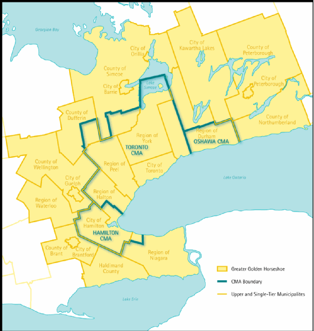

In this notebook, we find the car time from origins (centroids of work zones) to destinations (centroids of full-time employment zones) for a one-way morning commute for the golden greater horse area (yellow). 


Libraries:
```{r setup, include=FALSE}
library(disk.frame)
library(dplyr)
library(ggplot2)
library(gridExtra)
library(httr)
library(knitr)
#install.packages("kableExtra", dependencies = TRUE) #installing kableExtra and dependencies as I was recieving errors
library(kableExtra)
#install.packages("devtools")
#install.packages("Rtools")
#devtools::install_github("https://github.com/hrbrmstr/lodes.git", dependencies = TRUE) # if you need to download
library(lodes)
library(progress)
library(purrr)
library(r5r)
library(sf)
library(stplanr)
library(tidycensus)
library(tidyr)
library(tmap)
library(zoo) # for rollapplyr

# setup for disk.frame
setup_disk.frame()
options(scipen = 999)
options(java.parameters = "-Xmx6G")
options(future.globals.maxSize = Inf)
tmap_mode("view")
```

##--- Prepare Input Data
loading the destination points and origins points:
```{r}
load(file = "data-inputs/Travel-Time-Calculations/inputs/work_origins.Rdata")
load(file = "data-inputs/Travel-Time-Calculations/inputs/job_destinations.Rdata")
```


##--- Download OSM Network Data

```{r set up r5 path, include=FALSE}
# the r5r package requires Java Development Kit version 11, which can be downloaded from https://www.oracle.com/java/technologies/javase-jdk11-downloads.html
dir.create("data-inputs/Travel-Time-Calculations/r5_graph")
r5_path <- file.path("data-inputs/Travel-Time-Calculations/r5_graph")
```

```{r download data, include=FALSE, eval=FALSE}
#downloading ontario osm in the correct format
download.file(url = paste0("https://download.geofabrik.de/north-america/canada/ontario-latest.osm.pbf"),
              destfile = file.path(r5_path, "osm.pbf"),
              mode = "wb")

```

## Set Up R5 Routing

```{r build graph, include = FALSE}
r5_ONT <- setup_r5(data_path = r5_path, verbose = FALSE)
```
```{r}
# stop_r5(r5_ONT)
# rJava::.jgc(R.gc = TRUE)
```

## Calculate OD Matrices

#Car travel time - from all jobs to all work locations
```{r}
# set up batching according to how many origin rows to process at one time
chunksize = 50 
num_chunks = ceiling(nrow(work_origins)/chunksize)

# create origin-destination pairs
origins_chunks <- as.disk.frame(work_origins,
                          outdir = "data-inputs/Travel-Time-Calculations/df/Orig",
                          nchunks = num_chunks,
                          overwrite = TRUE)

start.time <- Sys.time()
pb <- txtProgressBar(0, num_chunks, style = 3)

for (i in 1:num_chunks){
  Orig_chunk <- get_chunk(origins_chunks, i)
  ttm_chunk <- travel_time_matrix(r5r_core = r5_ONT,
                          origins = Orig_chunk,
                          destinations = job_destinations,
                          mode = c("CAR"), 
                          departure_datetime = as.POSIXct(strptime("2021-10-20 07:00:00", "%Y-%m-%d %H:%M:%S", tz = "EST5EDT")),
                          max_trip_duration = 180)
  
  # export output as disk.frame
  ifelse(i == 1, output_df <- as.disk.frame(ttm_chunk,
                                            nchunks = 1,
                                            outdir = "data-inputs/Travel-Time-Calculations/df/output_ttm",
                                            compress = 50,
                                            overwrite = TRUE),
         add_chunk(output_df, ttm_chunk, chunk_id = i))
  setTxtProgressBar(pb, i)
}
end.time <- Sys.time()
print(paste0("OD matrix calculation took ", round(difftime(end.time, start.time, units = "mins"), digits = 2), " minutes..."))

output_OD_car1 <- as.data.frame(output_df)

save("output_OD_car1", file = "data-inputs/Travel-Time-Calculations/results/output_OD_car1.Rdata")
#I made the cut off 180 minutes, so if some zones do not have a travel tim.
```
