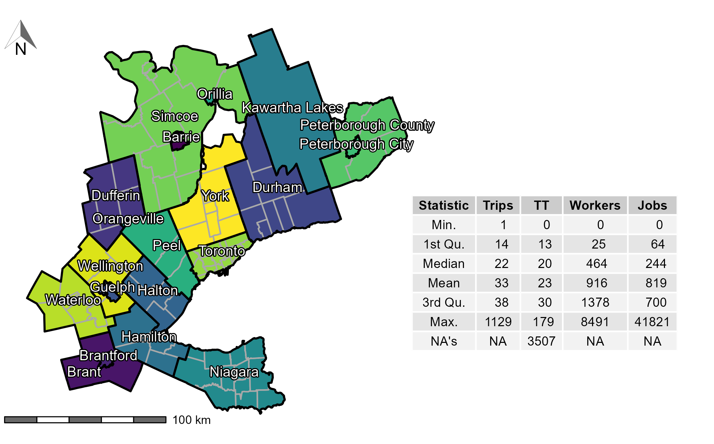
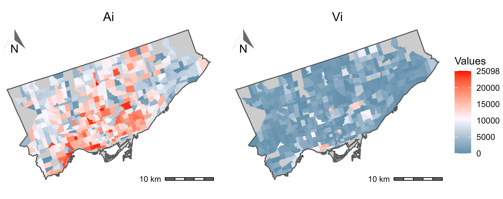
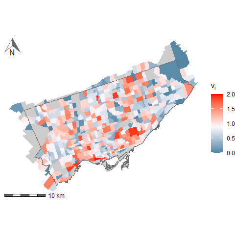
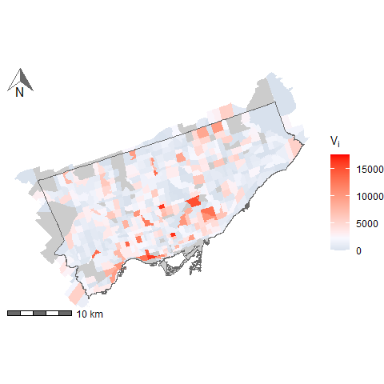
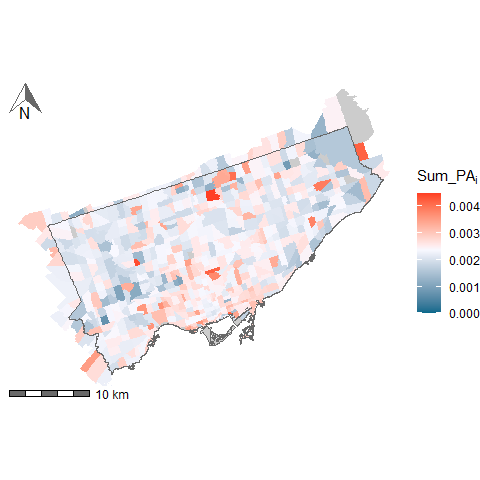

```{r xaringan-themer, include=FALSE, warning=FALSE}
#this themer package allows us to change the .css themes through this chunk. Easier than changing the .css directly.
library(xaringanthemer)
style_mono_accent(
  base_color = "#7A003C", #maroon
  link_color = "#5E6A71", #grey
  text_bold_color = "#FDBF57", #gold
  text_slide_number_color = "#FDBF57", #gold
  header_font_google = google_font("Josefin Sans"),
  text_font_google   = google_font("Montserrat", "300", "300i"),
  code_font_google   = google_font("Fira Mono")
)
```

```{r load-packages, include=FALSE, cache=FALSE}
library(AccessPack)
library(dplyr)
library(fitdistrplus)
library(ggplot2)
library(kableExtra)
library(patchwork)
library(sf)
library(scales)
library(ggpmisc)
library(ggrepel)
library(cowplot)
library(ggspatial)
library(ggtext)
options(scipen = 999)
```

```{r sp_avail-function,include=FALSE}
#defining the spatial availability function, this prints all the intermediates
sp_avail <- function(x, o_id, d_id, pop, opp, r, f, alpha = 1){
  
  o_id <- rlang::enquo(o_id)
  d_id <- rlang::enquo(d_id)
  pop <- rlang::enquo(pop)
  opp <- rlang::enquo(opp)
  r <- rlang::enquo(r)
  f <- rlang::enquo(f)
  
  sum_pop <- x %>%
    dplyr::distinct(!!o_id,
                    .keep_all = TRUE) %>%
    dplyr::mutate(sum_pop = !!r*(!!pop)^alpha) %>%
    dplyr::pull(sum_pop) %>%
    sum()
  
  f_p <- dplyr::pull(x, !!r) * dplyr::pull(x, !!pop)^alpha / sum_pop
  
  sum_impedance <- x %>%
    dplyr::group_by(!!d_id) %>%
    dplyr::summarize(sum_impedance = sum(!!f))
  
  x <- x %>%
    dplyr::left_join(sum_impedance,
                     by = rlang::as_name(d_id))
  
  f_c <- dplyr::pull(x, !!f) / x$sum_impedance
  
  x$f_c <- f_c
  x$f_p <- f_p
  
  sum_pa <- x %>%
    dplyr::group_by(!!d_id) %>%
    dplyr::summarize(sum_pa= sum(f_p * f_c))
  
  x <- x %>%
    dplyr::left_join(sum_pa,
                     by = rlang::as_name(d_id))
  f_t <- (f_p * f_c) / dplyr::pull(x, sum_pa)
  
  x %>%
    dplyr::mutate(V_ij = !!opp * !!f_t)
}
```

```{r consolidating-data, echo=FALSE, message=FALSE, warning=FALSE, eval=FALSE}
# grouping the planning boundaries/municipalities so they make up the 20 regions in the TTS 2016. Note: st_buffer is used as there are small existing gaps between some boundaries. st_buffer of 10 m is enough to widen all boundaries and complete the st_union without issue.
group_ggh_pd_poly <- TTS2016R::ggh_pd %>% st_buffer(10) %>% group_by(REGION) %>% 
  summarize(REGION_name = first(REGION_name),
            geometry = st_union((geometry)))

# creating an object of centroids for each region - this will be used to label polygons on the map
group_ggh_pd <- sf::st_centroid(group_ggh_pd_poly) 
points <- sf::st_coordinates(group_ggh_pd) %>% data.frame() 
group_ggh_pd <- cbind(group_ggh_pd, points)

## manually readjusting the X and Y coordinate of "County of Peterborough" and "Brant" as they overlap some cities
group_ggh_pd[group_ggh_pd$REGION_name=="Brant", "X"] <- 544000.0
group_ggh_pd[group_ggh_pd$REGION_name=="Brant", "Y"] <- 4767466

group_ggh_pd[group_ggh_pd$REGION_name=="Peterborough County", "Y"] <- 4921000
```

```{r data-for-impedance, echo=FALSE, message=FALSE, warning=FALSE, eval=FALSE}
# remove all NA trips from dataset and set all 0min travel times to 0.1 min
od_ft_tt  <- od_ft_tt %>% 
  filter( !is.na(travel_time)) %>% 
  mutate(travel_time = ifelse(travel_time == 0, 0.1, travel_time))
all_tt <- od_ft_tt  %>% 
  dplyr::select(trips, travel_time)

sum((od_ft_tt$trips))

all_tt <- all_tt[rep(seq_len(dim(all_tt)[1]), all_tt$trips), 2]
```

```{r fitting-impedance-function, echo=FALSE, message=FALSE, warning=FALSE,eval=FALSE}
# using fitdist function to fit a distribution using the default maximum likelihood estimation method and Nelder-Mead method for direct optimization
gamma_ <- fitdistrplus::fitdist(data=all_tt, "gamma", method="mle", optim.method="Nelder-Mead") 
```

```{r calc-for-accessibility-Toronto, echo=FALSE, message=FALSE, warning=FALSE, eval=FALSE}
#select the toronto muni boundary
toronto_muni_bound <- group_ggh_pd_poly %>% filter(REGION_name == "Toronto")

#indicate which zones are within or intersect the Toronto Municipality
TO_taz <- ggh_taz %>%
  filter(st_intersects(., toronto_muni_bound, sparse = FALSE)[,1]) %>% 
  dplyr::select(GTA06, AREA, jobs) %>%
  mutate(TAZToronto = "Yes")

# transfer calibrated impedance function values to OD matrix
od_ft_tt <- od_ft_tt %>%
  mutate(f = dgamma(travel_time, gamma_$estimate["shape"], gamma_$estimate["rate"]))

#add the number of jobs and workers to the od_ft_tt matrix
od_ft <- od_ft_tt %>% merge(ggh_taz %>% dplyr::select(GTA06, workers) %>% st_drop_geometry(),
                   by.x = "Origin", by.y="GTA06", all.x = TRUE)

od_ft <- od_ft %>% merge(ggh_taz %>% dplyr::select(GTA06, jobs) %>% st_drop_geometry(),
                   by.x = "Destination", by.y="GTA06", all.x = TRUE)

#jobs and origins at destinations IN Toronto; i.e., workers who are from Toronto but travel outside of Toronto and workers who travel to Toronto from outside are not included. They are considered edge effects.
TO_od_ft <- od_ft %>% mutate(In_dest = ifelse(Destination %in% TO_taz$GTA06, 1, 0),
                             In_org = ifelse(Origin %in% TO_taz$GTA06, 1, 0)) %>%
  filter(In_dest == 1 & In_org == 1) %>%
  dplyr::select(-c(In_dest, In_org))

#calculate accessibility for workers from any origin to jobs in Toronto 
TO_c_accessibility <- TO_od_ft %>% 
  mutate(TO_A_ij = f * jobs, na.rm = T) %>%
  group_by(Origin) %>%
  summarise(TO_A_i = sum(TO_A_ij, na.rm = T),
            trips_i = sum(trips, na.rm = T),
            workers = mean(workers, na.rm=T))

#Merge TO accessibly calculation to the To_TAZ:
TO_taz_acc <- TO_taz %>% merge(TO_c_accessibility, by.x=c("GTA06"), by.y=c("Origin"), all.x=T) 

```
```{r calc-for-shen-accessibility1, include=FALSE, warning=FALSE, message=FALSE, eval=FALSE}
#calculate shen's accessibility step 1
LOS_j <- TO_od_ft %>% 
  group_by(Destination) %>%
  summarise(D_j = sum(f * workers, na.rm=T),
            jobs = mean(jobs, na.rm=T),
            .groups = "drop") |>
  mutate(LOS_j = jobs/D_j, na.rm = T)

#aggregate shen's accessibility
TO_c_shen_accessibility <- TO_od_ft %>%
  left_join(LOS_j |> 
              dplyr::select(Destination, LOS_j, jobs, D_j),
            by = "Destination") %>%
  group_by(Origin) |>
  summarize(ShenA_i = sum(LOS_j * f, na.rm = T))
```

```{r calc-for-shen-accessibility2, include=FALSE, warning=FALSE, message=FALSE, eval=FALSE}
#Merge TO availability calculation to the TAZ sf object created for accessibility above:
TO_taz_acc <- TO_taz_acc %>% merge(TO_c_shen_accessibility, by.x=c("GTA06"), by.y=c("Origin"), all.x=T) 

```

```{r calc-for-spatial-avail1, include=FALSE, warning=FALSE, message=FALSE, eval=FALSE}
#calculate spatial availability
TO_od_ft <- TO_od_ft %>% 
  mutate(catch = 1) %>%
  sp_avail(o_id = Origin,
           d_id = Destination,
           pop = workers,
           opp = jobs,
           r = catch,
           f = f,
           alpha = 1.0) #1.54
```


```{r calc-for-spatial-avail2, include=FALSE, warning=FALSE, message=FALSE, eval=FALSE}
#verify that the sum of all jobs is consistent with the number of jobs
sum(TO_od_ft$V_ij, na.rm=T)
sum_jobs <- TO_od_ft %>% group_by(Destination) %>% summarise(jobs = mean(jobs))
sum(sum_jobs$jobs, na.rm = T)

#aggregating spatial availability by destination
TO_availability1 <- TO_od_ft %>%
  group_by(Destination) %>%
  summarize(TO_avgf_p_j = mean(f_p, na.rm = T),
            TO_sum_pa = mean(sum_pa, na.rm = T)) 

#aggregating spatial availability by origin  
TO_availability2 <- TO_od_ft %>%
  group_by(Origin) %>%
  summarize(TO_V_i = sum(V_ij, na.rm = T),
            TO_v_i = sum(V_ij, na.rm = T)/mean(workers, na.rm = T),
            TO_f_p_i = mean(f_p, na.rm = T),
            TO_avgtt_i = mean(travel_time, na.rm = T),
            TO_avg_f_i = mean(f, na.rm = T)) 

#Merge TO availability calculation to the TAZ sf object created for accessibility above:
TO_taz_acc <- TO_taz_acc %>% merge(TO_availability2, by.x=c("GTA06"), by.y=c("Origin"), all.x=T) 
TO_taz_acc <- TO_taz_acc %>% merge(TO_availability1, by.x=c("GTA06"), by.y=c("Destination"), all.x=T) 

#save
save(TO_taz_acc, toronto_muni_bound, file = "toronto_data.RData")
```

```{r empirical-toronto-product, echo=FALSE, message=FALSE}
#don't evaluate the above ^ as it results in these two products stored in 'toronto_data'
load(file = "toronto_data.RData")
```

## About the authors

.pull-left[
**Anastasia Soukhov**, B.Eng and MASc. in Civil Engineering

1st year PhD Student in Transport Geography, School of Earth, Environment and Society at McMaster University

Focus: accessibility, transportation, equity - especially GHG emissions. 

```{r, echo=FALSE, out.height="50%", out.width="50%"}

```
]

.pull-right[

**Antonio Paez**, associate professor
```{r, echo=FALSE, out.height="50%", out.width="50%"}
knitr::include_graphics("mcm-sci-sees_left-col.png")
```

**Chris D. Higgins** assistant professor
```{r, echo=FALSE, out.height="50%", out.width="50%"}

```

**Moataz Mohamed**, associate professor
```{r, echo=FALSE, out.height="50%", out.width="50%"}

```

]

---
## Overview

**1.** Introduce accessibility measures - Hansen and Shen 

**2.** Shen's methodological inconsistencies

**3.** An alternative approach: spatial availability

**4.** How spatial availability compares to Shen-style accessibility

**5.** An empirical example: Toronto TTS 2016 employment data

**6.** Extended uses for spatial availability

---
#Overview of accessibility measures

.pull-left[

###Hansen-style (gravity-based) accessibility

$$A_i = \sum_{j=1}^JO_jf(c_{ij})$$
Where:
-   $A$ is accessibility. 
-   $i$ is a set of origin locations.
-   $j$ is a set of destination locations.
-   $O_j$ is the number of opportunities at location $j$.
-   $c_{ij}$ is a measure of the cost of moving between $i$ and $j$.
-   $f(\cdot)$ is an impedance function of $c_{ij}$.

]

.pull-right[

###Shen-style (competitive) accessibility

Shen (1998) modified accessibility popularized as the **two-step floating catchment approach (2SFCA)**:

$$S_i = \sum_j \frac{O_jf(c_{ij})}{D_j}$$

with:
$$D_j = \sum_kP_kf(c_{jk})$$


- $S$ is accessibility.   
- $P_{k}$ is the number of people in location $k$ seeking opportunities $k=1,2,..., N$.

]

???
-Hansen-style accessibility suffers from interpretability issues - what is travel-cost adjusted opportunities? It also doesn't consider competition, which has been shown to reflect empirical accessibility to competitive-opportunities worse than competitive accessibility measures. 

- Shen-style accessibility considers competition - each opportunity is for only one opportunity-seeking person at any moment in time. 
---
##Toy example - Hansen-style accessibility

.pull-left[
```{r, include=FALSE}
od_tt <- data.frame(i = c("A", "A", "A", "B", "B", "B", "C", "C", "C"), # Three origins
                    j = c("1", "2", "3", "1", "2", "3", "1", "2", "3"), # Three destinations
                    tt = c(15, 30, 100, 30, 15, 100, 100, 100, 15), # Travel time
                    pop = c(50000, 50000, 50000, 150000, 150000, 150000, 10000, 10000, 10000), # Population
                    opp = c(100000, 100000, 10000, 100000, 100000, 10000, 100000, 100000, 10000)) # Jobs

od <- data.frame(id = c("A", "B", "C", "1", "2", "3"),
                 type = c("Population", "Population", "Population", "Jobs", "Jobs", "Jobs"),
                 size = c(50000, 150000, 10000, 100000, 100000, 10000),
                 x = c(2, 2, 6, 1, 1, 7),
                 y = c(8, 3, 2, 7, 2, 1))

centers <- data.frame(id = c("Urban center", "Suburb", "Satellite town"),
                 size = c(1000000, 1000000, 1000000),
                 x = c(1.5, 1.5, 6.5),
                 y = c(2.5, 7.5, 1.5))

od_lines <- data.frame(i = c("A", "A", "A","A", "A", "A", "B", "B", "B","B", "B", "B", "C", "C", "C","C", "C", "C"), # Three origins
                    j = c("1", "1", "2", "2", "3","3","1", "1", "2", "2", "3","3", "1", "1", "2", "2", "3","3"), # Three destinations
                    x = c(2, 1, 2, 1, 2, 7, 2, 1, 2, 1, 2, 7, 6, 1, 6, 1, 6, 7),
                    y = c(8, 7, 8, 2, 8, 1, 3, 7, 3, 2, 3, 1, 2 , 7, 2, 2, 2, 1),
                    group = c(1, 1, 2, 2, 3, 3, 4, 4, 5, 5, 6, 6, 7, 7, 8, 8, 9, 9))

od_table <- data.frame(Pts = c("A", "B", "C", "1", "2", "3"),
  Value = c("50,000 pop", "150,000 pop", "100,00 pop", "100,000 jobs", "100,000 jobs", "10,000 jobs"))

od_table2 <- data.frame(Path = c("A to 1", "A to 2", "A to 3", 
                                "B to 1", "B to 2", "B to 3", 
                                "C to 1", "C to 2", "C to 3"),
  Value = c("15 mins", "30 mins", "100 mins", "30 mins", "15 mins", "100 mins", "100 mins", "100 mins", "15 mins"))
```

```{r create-figure-with-toy-example2,  echo=FALSE}

toy_example_plot <- ggplot() + 
  geom_point(data = centers, aes(x = x, y = y), color = "#f5cd9f50", size=50)+
  geom_text(data = centers, aes(x,y-1.25, label=id), size=5) +
  geom_line(data = od_lines %>% filter(i == "B"), aes(x=x, y=y, group=group), color = "gold", size=1) +
  geom_line(data = od_lines %>% filter(i == "C"), aes(x=x, y=y, group=group), color = "red", size=1, linetype = "dashed") +
  geom_line(data = od_lines %>% filter(i == "A"), aes(x=x, y=y, group=group), color = "brown", size=1, linetype="dotted") +
  geom_point(data = od,
            aes(size = size,
                x = x, y = y, color = type)) + 
  geom_label(data = od, aes(x+0.3,y+0.3, label=id), size=5) +
  scale_colour_manual(values = c("orange", "light blue") ) +
  scale_size(range = c(5, 10)) + 
  theme_minimal() + 
  guides(size = "none", color = "none")
toy_example_plot
  
grid::pushViewport(grid::viewport(x=0.9, y=0.75))

gridExtra::grid.table(od_table2, rows=NULL, 
                      theme=gridExtra::ttheme_default(core=list(bg_params=list(fill=
                                                                                 c("brown","brown","brown", "gold", "gold", "gold", "red", "red", "red")))))

grid::pushViewport(grid::viewport(x=0.29, y=0.59))

gridExtra::grid.table(od_table, rows=NULL, 
                      theme=gridExtra::ttheme_default(core=list(bg_params=list(fill=
                                                                                 c("light blue","light blue","light blue", "orange", "orange", "orange")))))

```
]

.pull-right[

- Assuming $f(c_{ij}) = exp(-\beta \cdot tt)$,
- Where $\beta = 0.1$

Conventional accessibility:
$$A_i = \sum_jO_jf(c_{ij})$$
```{r, echo=FALSE}
#set b and calculate impedance
b <- 0.1
od_tt <- od_tt |>
  mutate(f = exp(-b * tt))

A <- od_tt |>
  group_by(i) |>
  summarize(A = sum(opp * f),
            .groups = "drop")

A %>% kable(format = "html",
        booktabs = TRUE,
        col.names = c("i", "A_i"),
        digits = 2)
```
]

---
## Toy example - Shen-style accessibility

.pull-left[
```{r create-figure-with-toy-example3,  echo=FALSE}
toy_example_plot 

grid::pushViewport(grid::viewport(x=0.9, y=0.75))

gridExtra::grid.table(od_table2, rows=NULL, 
                      theme=gridExtra::ttheme_default(core=list(bg_params=list(fill=
                                                                                 c("brown","brown","brown", "gold", "gold", "gold", "red", "red", "red")))))

grid::pushViewport(grid::viewport(x=0.29, y=0.59))

gridExtra::grid.table(od_table, rows=NULL, 
                      theme=gridExtra::ttheme_default(core=list(bg_params=list(fill=
                                                                                 c("light blue","light blue","light blue", "orange", "orange", "orange")))))

```
]

.pull-right[

- Assuming $f(c_{ij}) = exp(-\beta \cdot tt)$,
- Where $\beta = 0.1$

$S_i = \sum_j \frac{O_jf(c_{ij})}{D_j}$ where $D_j = \sum_kP_kf(c_{kj})$


```{r, echo=FALSE}
#set b and calculate impedance
LOS_j <- od_tt |>
  group_by(j) |>
  summarize(opp = mean(opp),
            D_j = sum(pop * f),
            .groups = "drop") |>
  mutate(LOS_j = opp/D_j)

S <- od_tt %>%
  left_join(LOS_j |> 
              dplyr::select(j, LOS_j, opp, D_j),
            by = "j") %>%
  group_by(i) |>
  summarize(A_i = sum(opp.x * f),
            S_i = sum(LOS_j * f))

D <- od_tt %>%
  left_join(LOS_j |> 
              dplyr::select(j, LOS_j, opp, D_j),
            by = "j") %>%
  group_by(j) |>
  summarize(j = first(j),
            D_j = mean(D_j))

D2_i1 <- od_tt %>%
  left_join(LOS_j |> 
              dplyr::select(j, LOS_j, opp, D_j),
            by = "j") %>%
  filter(j=="1") |>
  summarize(A_i1 = opp.x * f)

D2_i2 <- od_tt %>%
  left_join(LOS_j |> 
              dplyr::select(j, LOS_j, opp, D_j),
            by = "j") %>%
  filter(j=="2") |>
  summarize(A_i2 = opp.x * f)

D2_i3 <- od_tt %>%
  left_join(LOS_j |> 
              dplyr::select(j, LOS_j, opp, D_j),
            by = "j") %>%
  filter(j=="3") |>
  summarize(A_i3 = opp.x * f)

D1 <- data.frame(i = S$i,
                 "1" = D2_i1$A_i1,
                 "2" = D2_i2$A_i2,
                 "3" = D2_i3$A_i3)
colnames(D1) <- c("i/j", "1", "2", "3")

D3 <- data.frame(i = S$i,
                 "1" = c(D$D_j[1],D$D_j[1],D$D_j[1]),
                 "2" = c(D$D_j[2],D$D_j[2],D$D_j[2]),
                 "3" = c(D$D_j[3],D$D_j[3],D$D_j[3]))
colnames(D3) <- c("k/j", "1", "2", "3")
 
# D1[nrow(D1) + 1,] = list("D_j at A,B,C", D$D_j[1], D$D_j[2], D$D_j[3])

knitr::kable(S,
             format = "html",
             booktabs = TRUE,
             digits = 2)
```

The intermediates: $O_jf(c_{ij})$ and $D_{j}$
```{r, echo=FALSE}
knitr::kable(list(D1,D3),
             format = "html",
             booktabs = TRUE,
             digits = 2) %>%
  kable_styling(font_size = 13)
```

]

???

$\frac {A_{jobs @ 1 -> A}}{D_{workers @ A,B,C -> 1}}$ + $\frac {A_{jobs @ 2 -> A}}{D_{workers @ A,B,C -> 2}}$ + $\frac {A_{jobs @ 3 -> A}}{D_{workers @ A,B,C -> 3}}$
 
$\frac {A_{jobs @ 1 -> B}}{D_{workers @ A,B,C -> 1}}$ + $\frac {A_{jobs @ 2 -> B}}{D_{workers @ A,B,C -> 2}}$ + $\frac {A_{jobs @ 3 -> B}}{D_{workers @ A,B,C -> 3}}$
  
$\frac {A_{jobs @ 1 -> C}}{D_{workers @ A,B,C -> 1}}$ + $\frac {A_{jobs @ 2 -> C}}{D_{workers @ A,B,C -> 2}}$ + $\frac {A_{jobs @ 3 -> C}}{D_{workers @ A,B,C -> 3}}$


First, we see that Shen's accessibility can still be interpreted as as score, like Hansen-style accessibility. But it can also be interpreted as travel-cost adjusted jobs per travel-cost adjusted capita (potential supply over potential demand).

But, let's take a look at the intermediates! We can see that at the numerator, that's conventional accessibility, the opportunities from each job center are distributed to each population center A, B,C. For instance, jobs at A come from 1, 2, 3 and these potential jobs sum up to A_j=A (27,292 jobs). Next, let's look at the denominator, the _potential demand_. At each population center, the demand always sums up to ~58,000 workers.

From shen's accessibility we see that A, the suburb, has the highest accessibility when competition is considered. This is because it has a 2 times fewer workers than the urban center and same number of jobs as the Urban center. Competition.

Now we can see, that though conventional accessibility is the same at A and B, shen's accessibility is not the same. It's not the same because jobs (numerator) is weighted by the demand (denominator). You can see that there's way more jobs at A1 with a smaller demand at A1 compared to B1 jobs and demand. Also see how in B, supply of jobs is never greater than demand from workers. 

- that said... what does this _potential_ supply and _potential_ demand even mean!! We know that there are 210,000 people in this system looking for work and we know that there are 210,000 jobs. However.. we can see that when you sum up all _potential_ supply and demand they don't come close to this number!

---
## Shen's important property - with inconsistent logic

.pull-left[
```{r create-figure-with-toy-example4,  echo=FALSE}
toy_example_plot
grid::pushViewport(grid::viewport(x=0.9, y=0.75))

gridExtra::grid.table(od_table2, rows=NULL, 
                      theme=gridExtra::ttheme_default(core=list(bg_params=list(fill=
                                                                                 c("brown","brown","brown", "gold", "gold", "gold", "red", "red", "red")))))

grid::pushViewport(grid::viewport(x=0.29, y=0.59))

gridExtra::grid.table(od_table, rows=NULL, 
                      theme=gridExtra::ttheme_default(core=list(bg_params=list(fill=
                                                                                 c("light blue","light blue","light blue", "orange", "orange", "orange")))))
```
]

.pull-right[

- **An important property**: $\sum_{i} S_{i}\cdot P_{i} = \sum_{j} O_{j}$

```{r,echo=FALSE}
#Demand by _origin_
D_i <- od_tt |>
  group_by(i) |>
  summarize(D_i = sum(pop * f),
            .groups = "drop")
```

```{r, echo=FALSE}
S_i <- S |>
  pull(S_i)

# Workers traveling for jobs from each zone
nominal_jobs <- S |>
  mutate(nominal_jobs = S_i * c(50000,
                              150000,
                              10000)) |>
  pull(nominal_jobs)

D <-(D_i$D_i)

# Workers traveling for jobs from each zone
nominal_demanded_jobs <- S |>
  mutate(nominal_demanded_jobs = S_i * D_i$D_i) |>
  pull(nominal_demanded_jobs)

t1 <- data.frame(i = c("A", "B", "C"),
                 S_i = S_i %>% round(digits = 2),
                 P_i = c("50000", "150000", "10000"), #workers at each origin center
                 S_ixP_i=nominal_jobs %>% round(digits = 2)) #jobs demanded for at each origin center

t1[nrow(t1) + 1,] = list("TOTAL", "3.22", "210000","210000")

t2 <- data.frame(D_i = D %>% round(digits = 2), #compare S_i*P_i to this number, which is the _potential demand_ (i.e., workers seeking jobs) at each origin center
                 S_ixD_i = nominal_demanded_jobs %>% round(digits = 2)) #when this potential demand is multiplied by S_i, we should get jobs potentially demanded for. This potential jobs and the other potential jobs... don't line up!
t2[nrow(t2) + 1,] = list("56824.73","56826.57")

colnames(t1) <- c("i", "S_i", "P_i", "S_i P_i (jobs)")
colnames(t2) <- c("D_i", "S_i P_i (jobs)")

knitr::kable(list(t1,t2),
             format = "html",
             booktabs = TRUE,
             digits = 2)

```
- $\sum{_j} D_j$ is `r LOS_j |> pull(D_j) |> sum() %>% round(digits=2)` workers, less than the sum of population (`r od_tt |> distinct(i, .keep_all = TRUE) |> pull(pop) |> sum()` workers). So, `r od_tt |> distinct(i, .keep_all = TRUE) |> pull(pop) |> sum() - LOS_j |> pull(D_j) |> sum() %>% round(digits=2)`  people do not get jobs.

- Sames logic applies for the supply of jobs $\sum_{j}O_{j}f(c_{ij})$.  

- What's the value of this property if it sums to `r od_tt |> distinct(i, .keep_all = TRUE) |> pull(pop) |> sum()` jobs but only distributes $\sum{_j} D_j$ jobs?
]

???

- Shen's formula has an important property. That is that the weighted average value of accessibility scores (by the total population) is always equal to the ratio of the total number of opportunities in the system. Look at the table, sum of column 4 is 210,000. 

- This property - while very neat! - doesn't make sense when combined with the logic of the intermediate values. We know that the impedance function is adjusting which workers demand for jobs - this results in $D_{j}$ (demand at each job center) is ~56,824 workers ( $\sum{_j} D_j$ is `r LOS_j |> pull(D_j) |> sum() %>% round(digits=2)` workers) which is less than the sum of population (210,000 aka `r od_tt |> distinct(i, .keep_all = TRUE) |> pull(pop) |> sum()` workers). Look at column 5 sum.

-Why is demand smaller than the number of workers? Because it is adjusted by the impedance function so 153,175 workers do not get jobs (210,000 minus sum of demand). 

- At the same time, the numbers of jobs which are being supplied to workers are also being discounted by the impedance function. (this is not captured in the table but can be So in reality, both the jobs and the workers are LESS than the actual number of jobs and workers in the system but the rate at which they are discounted by the impedance function is proportional. Thus, this property holds true! (i.e., that the weighted average value of accessibility scores (by the total population) is always equal to the ratio of the total number of opportunities in the system).

- From the example, In the suburb, there is the same number of opportunities, and a smaller number of workers than the urban center so more people _seek_ work. 

- However, We know that the _demand_ for jobs is less than the total population so it doesn't actually allocate ALL the jobs... it only allocates some of the jobs based on the travel behaviour. What's the value of this property if it tells you that there are 210,000 jobs... but only ends up giving out the sum of D_j (~57,000). It's only a proof a certain constraint and it is not really useful for us. 

---
## This important property - is proportional allocation!

.pull-left[
- Doesn't appear to be used in literature for this purpose - but we arrived to the same final results as the Shen (1998) measure from the perspective of proportional allocation!

Spatial availability:

$V_{i} = \sum_{j} O_j\frac{F^p_{i} \cdot F^c_{ij}}{\sum_{i=A}^K F^p_{i} \cdot F^c_{ij}}$

Where the population allocation factor:

$F^p_{ij} = \frac{P_{i\in r}^\alpha}{\sum_{i=A}^K P_{i\in r}^\alpha}$

And the cost allocation factor:

$F^c_{ij} = \frac{f(c_{ij})}{\sum_{i=A}^K f(c_{ij})}$
]

.pull-right[

And spatial availability per capita:

$v_{i} = \sum_{j} \frac{O_j}{P_{i\in r}^\alpha}\frac{F^p_{i} \cdot F^c_{ij}}{\sum_{i=A}^K F^p_{i} \cdot F^c_{ij}}$

]

???

- Doesn't appear to be used in literature for this purpose - but we arrived to the same final results as the Shen (1998) measure from the perspective of proportional allocation!

- introduce spatial availability. We will return to alpha later.

---
## Spatial availability

.pull-left[

$V_{i} = \sum_{j} O_j\frac{F^p_{i} \cdot F^c_{ij}}{\sum_{i=A}^K F^p_{i} \cdot F^c_{ij}}$

Let's solve $V_A$,

Population allocation factor:
$F^p_{A} = \frac{P_{A}}{P_{A}+P_{B}+P_{C}} = \frac{50000}{210000} = 0.24$
$...$

Cost allocation factor:
$F^c_{A1} = \frac{f(c_{A1})}{f(c_{A1})+f(c_{B1})+f(c_{C1})} = \frac{0.22}{0.22+0.05+0.00} = 0.82$
$...$

Put it together:

$V_{A} = O_1\frac{F^p_{A} \cdot F^c_{A1}}{F^p_{A} \cdot F^c_{A1} + F^p_{B} \cdot F^c_{B1} + F^p_{C} \cdot F^c_{C1}} + O_2\frac{F^p_{A} \cdot F^c_{A2}}{F^p_{A} \cdot F^c_{A2} + F^p_{B} \cdot F^c_{B2} + F^p_{C} \cdot F^c_{C2}} + O_3\frac{F^p_{A} \cdot F^c_{A3}}{F^p_{A} \cdot F^c_{A3} + F^p_{B} \cdot F^c_{B3} + F^p_{C} \cdot F^c_{C3}}$

$V_{A} = 100000 \frac{0.24 \cdot 0.82}{0.32} + 100000 \frac{0.24 \cdot 0.18}{0.63} + 10000 \frac{0.24 \cdot 0.00}{0.05}$

$V_{A} = 59900.64 + 6922.69 + 10.13 = 66833.46$ jobs

]


```{r, echo=FALSE}
V_ij <- od_tt %>%
  mutate(r = 1) %>%
  sp_avail(o_id = i, 
           d_id = j, 
           pop = pop, 
           opp = opp, 
           r = r, 
           f = f, 
           alpha = 1.0) #1.54 

t1 <- data.frame("i" = V_ij$i,
                 "j" =  V_ij$j,
                 "tt" = V_ij$tt,
                 "P_i" = V_ij$pop,
                 "O_j" = V_ij$opp)

t2 <- data.frame("f" = V_ij$f,
                 "F^P" = V_ij$f_p,
                 "F^C" =  V_ij$f_c,
                 "Sum_PA" = V_ij$sum_pa,
                 "V_ij" = V_ij$V_ij,
                 "v_ij" = V_ij$V_ij/V_ij$pop)

knitr::kable(list(t1,t2),
             format = "html",
             booktabs = TRUE,
             digits = 2)%>%
  kable_styling(font_size = 15)
                 
```


???
- We begin with population allocation factor. You take the population at A and divide it by the sum of A, B, and C. It's population represents 24% of the total population in the system so thus A will get allocated 24% of the opportunities. Do this for all the other population centers.

- then cost allocation factor. You take the impedance function from A to 1, and divide it by A1+B1+C1. This means that 82% of the opportunities will get allocated to A based on the willingness-to-travel (impedance function). Do this for all the other trips (i to j). Something interesting. 82% of trips are between A->1, and B->2. These are interzonal trips. 100% of trips are between C->3 however, as the impedance function makes it so that no one is willing to travel INTO the town. Thus, the v_ij for C is 1, indicating perfect match between opportunities and jobs.

- next, we can put these allocation factors all together, and allocate the opportunities at O1 plus O2 plus O3 to A to get the V_A. 

---
## Proof: Spatial availability cancels out into Shen-style accessibility (skip?)

Population allocation factor:
$F^p_{ij} = \frac{P_{i\in r}^\alpha}{\sum_{i=A}^K P_{i\in r}^\alpha}$

$F^p_{A} = \frac{P_{A}^\alpha}{P_{A}^\alpha + P_{B}^\alpha + P_{C}^\alpha}$

Cost allocation factor:
$F^c_{ij} = \frac{f(c_{ij})}{\sum_{i=A}^K f(c_{ij})}$

$F^c_{A1} = \frac{f(c_{A1})}{f(c_{A1})+f(c_{B1})+f(c_{C1})}$
$F^c_{B1} = \frac{f(c_{A2})}{f(c_{A2})+f(c_{B2})+f(c_{C2})}$
$F^c_{C1} = \frac{f(c_{A3})}{f(c_{A3})+f(c_{B3})+f(c_{C3})}$

Now let's put it together with P, and see how the denominators end up cancelling out:
$v_{i} = \sum_{j}\frac{O_j}{P_{i\in r}^\alpha}\frac{\frac{P_{i\in r}^\alpha}{\sum_{i=A}^K P_{i\in r}^\alpha} \cdot \frac{f(c_{ij})}{\sum_{i=A}^K f(c_{ij})}}{\sum_{i=A}^K \frac{P_{i\in r}^\alpha}{\sum_{i=A}^K P_{i\in r}^\alpha} \cdot \frac{f(c_{ij})}{\sum_{i=A}^K f(c_{ij})}}$

---

$v_{A} = \frac{O_1}{P_{A}^\alpha}(\frac{\frac{P_{A}^\alpha}{P_{A}^\alpha+P_{B}^\alpha+P_{C}^\alpha} \cdot \frac{f(c_{A1})}{f(c_{A1})+f(c_{B1})+f(c_{C1})}}{\frac{P_{A}^\alpha}{P_{A}^\alpha+P_{B}^\alpha+P_{C}^\alpha} \cdot \frac{f(c_{A1})}{f(c_{A1})+f(c_{B1})+f(c_{C1})} + \frac{P_{A}^\alpha}{P_{A}^\alpha+P_{B}^\alpha+P_{C}^\alpha} \cdot \frac{f(c_{B1})}{f(c_{A1})+f(c_{B1})+f(c_{C1})}+ \frac{P_{A}^\alpha}{P_{A}^\alpha+P_{B}^\alpha+P_{C}^\alpha} \cdot \frac{f(c_{C1})}{f(c_{A1})+f(c_{B1})+f(c_{C1})}}) +$

$\frac{O_2}{P_{A}^\alpha}(\frac{\frac{P_{A}^\alpha}{P_{A}^\alpha+P_{B}^\alpha+P_{C}^\alpha} \cdot \frac{f(c_{A2})}{f(c_{A2})+f(c_{B2})+f(c_{C2})}}{\frac{P_{A}^\alpha}{P_{A}^\alpha+P_{B}^\alpha+P_{C}^\alpha} \cdot \frac{f(c_{A2})}{f(c_{A2})+f(c_{B2})+f(c_{C2})} + \frac{P_{A}^\alpha}{P_{A}^\alpha+P_{B}^\alpha+P_{C}^\alpha} \cdot \frac{f(c_{B2})}{f(c_{A2})+f(c_{B2})+f(c_{C2})}+\frac{P_{A}^\alpha}{P_{A}^\alpha+P_{B}^\alpha+P_{C}^\alpha} \cdot \frac{f(c_{C2})}{f(c_{A2})+f(c_{B2})+f(c_{C2})}} )+$

$\frac{O_3}{P_{A}^\alpha}(\frac{\frac{P_{A}^\alpha}{P_{A}^\alpha+P_{B}^\alpha+P_{C}^\alpha} \cdot \frac{f(c_{A3})}{f(c_{A3})+f(c_{B3})+f(c_{C3})}}{\frac{P_{A}^\alpha}{P_{A}^\alpha+P_{B}^\alpha+P_{C}^\alpha} \cdot \frac{f(c_{A3})}{f(c_{A3})+f(c_{B3})+f(c_{C3})} + \frac{P_{A}^\alpha}{P_{A}^\alpha+P_{B}^\alpha+P_{C}^\alpha} \cdot \frac{f(c_{B3})}{f(c_{A3})+f(c_{B3})+f(c_{C3})}+\frac{P_{A}^\alpha}{P_{A}^\alpha+P_{B}^\alpha+P_{C}^\alpha} \cdot \frac{f(c_{C3})}{f(c_{A3})+f(c_{B3})+f(c_{C3})}} )$

First, notice how the denominator on the denominator is the same across the summation? Let's simplify it:

$v_{A} = \frac{O_1}{P_{A}^\alpha}(\frac{\frac{P_{A}^\alpha}{P_{A}^\alpha+P_{B}^\alpha+P_{C}^\alpha} \cdot \frac{f(c_{A1})}{f(c_{A1})+f(c_{B1})+f(c_{C1})}}{\frac{P_{A}^\alpha \cdot f(c_{A1}) + P_{A}^\alpha \cdot f(c_{B1}) + P_{A}^\alpha \cdot f(c_{C1})}{(P_{A}^\alpha+P_{B}^\alpha+P_{C}^\alpha) \cdot (f(c_{A1})+f(c_{B1})+f(c_{C1}))}}) +$
$\frac{O_2}{P_{A}^\alpha}(\frac{\frac{P_{A}^\alpha}{P_{A}^\alpha+P_{B}^\alpha+P_{C}^\alpha} \cdot \frac{f(c_{A2})}{f(c_{A2})+f(c_{B2})+f(c_{C2})}}{\frac{P_{A}^\alpha \cdot f(c_{A2}) + P_{A}^\alpha \cdot f(c_{B2}) + P_{A}^\alpha \cdot f(c_{C2})}{(P_{A}^\alpha+P_{B}^\alpha+P_{C}^\alpha) \cdot (f(c_{A2})+f(c_{B2})+f(c_{C2}))}}) +$
$\frac{O_3}{P_{A}^\alpha}(\frac{\frac{P_{A}^\alpha}{P_{A}^\alpha+P_{B}^\alpha+P_{C}^\alpha} \cdot \frac{f(c_{A3})}{f(c_{A3})+f(c_{B3})+f(c_{C3})}}{\frac{P_{A}^\alpha \cdot f(c_{A3}) + P_{A}^\alpha \cdot f(c_{B3}) + P_{A}^\alpha \cdot f(c_{C3})}{(P_{A}^\alpha+P_{B}^\alpha+P_{C}^\alpha) \cdot (f(c_{A3})+f(c_{B3})+f(c_{C3}))}} )$

See how the denominator of the denominator is the same as the denominator of the numerator's denominator for each J (J=1, J=2, and J=3)? Let's cancel those out and simplify:

$v_{A} = \frac{O_1}{P_{A}^\alpha}(\frac{P_{A}^\alpha \cdot f(c_{A1})}{P_{A}^\alpha \cdot f(c_{A1}) + P_{A}^\alpha \cdot f(c_{B1}) + P_{A}^\alpha \cdot f(c_{C1})} +$
$\frac{O_2}{P_{A}^\alpha}\frac{P_{A}^\alpha \cdot f(c_{A2})}{P_{A}^\alpha \cdot f(c_{A2}) + P_{A}^\alpha \cdot f(c_{B2}) + P_{A}^\alpha \cdot f(c_{C2})} +$
$\frac{O_3}{P_{A}^\alpha}\frac{P_{A}^\alpha \cdot f(c_{A3})}{P_{A}^\alpha \cdot f(c_{A3}) + P_{A}^\alpha \cdot f(c_{B3}) + P_{A}^\alpha \cdot f(c_{C3})} )$

---

Next, see how we can cancel out the $P_{A}^\alpha$? Let's do that.

$v_{A} = O_1(\frac{f(c_{A1})}{P_{A}^\alpha \cdot f(c_{A1}) + P_{B}^\alpha \cdot f(c_{B1}) + P_{C}^\alpha \cdot f(c_{C1})} + O_2\frac{f(c_{A2})}{P_{A}^\alpha \cdot f(c_{A2}) + P_{B}^\alpha \cdot f(c_{B2}) + P_{C}^\alpha \cdot f(c_{C2})} + O_3\frac{f(c_{A3})}{P_{A}^\alpha \cdot f(c_{A3}) + P_{B}^\alpha \cdot f(c_{B3}) + P_{C}^\alpha \cdot f(c_{C3})} )$


```{r, eval=FALSE, include=FALSE}
#Let's check to see if it manually adds up to what shen's is
b<-0
r1 <- 100000*exp(-b*15)/(50000*exp(-b*15) + 150000*exp(-b*30) + 10000*exp(-b*100))
r2 <-100000*exp(-b*30)/(50000*exp(-b*30) + 150000*exp(-b*15) + 10000*exp(-b*100))
r3 <- 10000*exp(-b*100)/(50000*exp(-b*100) + 150000*exp(-b*100) + 10000*exp(-b*15))
r1+r2+r3

#this is shen's, the same!!!
j1<-(100000*exp(-0.1*15))/(50000 * exp(-b * 15) + 150000 * exp(-b * 30) + 10000 * exp(-b * 100))
j2<-(100000*exp(-0.1*30))/(50000 * exp(-b * 30) + 150000 * exp(-b * 15) + 10000 * exp(-b * 100))
j3<-(10000*exp(-0.1*100))/(50000 * exp(-b * 100) + 150000 * exp(-b * 100) + 10000 * exp(-b * 15))
j1 + j2 + j3
```
```{r, eval=FALSE, include=FALSE}
(exp(-b*15)/((50000*exp(-b*15)) + (50000*exp(-b*30)) + (50000*exp(-b*100)))+ exp(-b*30)/((50000*exp(-b*15)) + (50000*exp(-b*30)) + (50000*exp(-b*100)))+ exp(-b*100)/((50000*exp(-b*15)) + (50000*exp(-b*30)) + (50000*exp(-b*100))))*100000
```

Shen's accessibility:

$S_i = \sum_j \frac{O_jf(c_{ij})}{\sum_kP_kf(c_{jk})}$

While spatial availability and shen's accessibility end up being mathematically identical, the intermediate proportional allocation factors are a powerful communication and planning tool. Shen's accessibility, from our knowledge, does not have this. 

We also first arrive at the number of opportunities allocated and then normalize that per capita. Shen arrives at the opportunities per capita score and identifies that the score multiplies with the population to equal the total opportunities. 

---
### Empirical example: Greater Golden Horsehoe Area (GTHA) - 2016 Transportation Tomorrow Survey (TTS)

```{r, echo=FALSE, out.width="60%"}

```

- full time workers and pjobs, at the traffic analysis zone (TAZ) level
- calculated travel time using `R5R`, car-only

---
## Empirical example: GTHA - 2016 TTS

.pull-left[
```{r, echo=FALSE}
knitr::include_graphics("impedance_function.png")
```
]

.pull-right[
- trip-length distribution (TLD) is used to create the impedance function

- a gamma distribution is used. It takes the following general form where the estimated 'shape' is $\alpha = 2.019$, the estimated 'rate' is $\beta = 0.094$, and $\Gamma(\alpha)$ is defined in:

$f(x, \alpha, \beta) = \frac {x^{\alpha-1}e^{-\frac{x}{\beta}}}{ \beta^{\alpha}\Gamma(\alpha)} \quad \text{for } 0 \leq x \leq \infty\\$
$\Gamma(\alpha) =  \int_{0}^{\infty} x^{\alpha-1}e^{-x} \,dx$
]

---

##Empirical example: Toronto - 2016 TTS

.pull-left[

- Accessibility $A_{i}$:

```{r plot-access-TO, message=FALSE, echo=FALSE, eval=FALSE}
## accessibility
#creating the main plot and saving it to png
png(file="mplot_access_TO.png", res=100)
ggplot() +
  geom_sf(data = TO_taz_acc, aes(fill= TO_A_i), color = NA) + #data
  scale_fill_gradient2(low = "deepskyblue4",
                         mid = "ghostwhite",
                         high = "red", #legend scale bar
                         name = expression(A["i"]),
                         limits = c( round(min(TO_taz_acc$TO_A_i, na.rm=T)), round(max(TO_taz_acc$TO_A_i, na.rm=T)) ),
                         midpoint= mean(TO_taz_acc$TO_A_i, na.rm = TRUE), #average A_i
                       breaks = c(round(min(TO_taz_acc$TO_A_i, na.rm=T)), 5000, 10000, 15000, 20000, round(max(TO_taz_acc$TO_A_i, na.rm=T))),
                         labels = c(round(min(TO_taz_acc$TO_A_i, na.rm=T)), 5000, 10000, 15000, 20000, round(max(TO_taz_acc$TO_A_i, na.rm=T))),
                         na.value = "grey80")+
  geom_sf(data = toronto_muni_bound, # border for Toronto
          colour=alpha("dimgrey",1), 
          size = 0.5, fill=NA, 
          show.legend = "polygon") + 
  annotation_north_arrow(location = "tl", # north arrow for both the main plot and inset
                         height = unit(0.8, "cm"), 
                         width = unit(0.8, "cm"),
                         style = north_arrow_orienteering(line_width = 0.25,
                                                          line_col = "dimgrey", 
                                                          fill = c("white","dimgrey"))) +
  annotation_scale(bar_cols = c("dimgrey", "white"), # scale bar for both the main plot and inset
                   height = unit(0.15, "cm")) +
  theme_void()
dev.off()
```
```{r, echo=FALSE}

```

]

.pull-right[

- Normalized spatial availability $v_{i}$ & Shen-style accessibility $S_{i}$:

```{r, echo=FALSE, eval=FALSE}
## Normalized spatial availability + Shen's, saving as PNG and then displaying it as PNG
png(file="mplot_Shen_TO.png", res=100)
ggplot() +
  geom_sf(data = TO_taz_acc, aes(fill= ShenA_i), color = NA) + #data
    scale_fill_gradient2(low = "deepskyblue4",
                         mid = "ghostwhite",
                         high = "red", #legend scale bar
                         name = expression(v["i"]),
                         limits = c(0, round(max(TO_taz_acc$ShenA_i, na.rm=TRUE))), 
                         midpoint= mean(TO_taz_acc$ShenA_i, na.rm = TRUE), #average v_i per capita (same as Shen's)
                         na.value = "grey80") + 
  geom_sf(data = toronto_muni_bound, # border for Toronto
          colour=alpha("dimgrey",1), 
          size = 0.5, fill=NA, 
          show.legend = "polygon") + 
  annotation_north_arrow(location = "tl", # north arrow for both the main plot and inset
                         height = unit(0.8, "cm"), 
                         width = unit(0.8, "cm"),
                         style = north_arrow_orienteering(line_width = 0.25,
                                                          line_col = "dimgrey", 
                                                          fill = c("white","dimgrey"))) +
  annotation_scale(bar_cols = c("dimgrey", "white"), # scale bar for both the main plot and inset
                   height = unit(0.15, "cm")) +
  theme_void()
dev.off()
```
```{r, echo=FALSE}

```

]

???
- conventional accessibility

- shen's accessibility which is equal to normalized spatial availability. The average is 0.87 jobs per worker, and you can see that places of high accessibility are more spread out - competition.

---

## Empirical example: Toronto - 2016 TTS

.pull-left[

- Spatial availability (# number of opportunities) $V_{i}$:

```{r, echo=FALSE, eval=FALSE}
## Normalized spatial availability + Shen's, saving as PNG and then displaying it as PNG
png(file="mplot_SA_TO.png", res=100)
ggplot() +
  geom_sf(data = TO_taz_acc, aes(fill= TO_V_i), color = NA) + #data
    scale_fill_gradient2(low = "deepskyblue4",
                         mid = "ghostwhite",
                         high = "red", #legend scale bar
                         name = expression(V["i"]),
                         limits = c(0, round(max(TO_taz_acc$TO_V_i, na.rm=TRUE))), 
                         midpoint= mean(TO_taz_acc$TO_V_i, na.rm = TRUE), #average v_i per capita (same as Shen's)
                         na.value = "grey80") + 
  geom_sf(data = toronto_muni_bound, # border for Toronto
          colour=alpha("dimgrey",1), 
          size = 0.5, fill=NA, 
          show.legend = "polygon") + 
  annotation_north_arrow(location = "tl", # north arrow for both the main plot and inset
                         height = unit(0.8, "cm"), 
                         width = unit(0.8, "cm"),
                         style = north_arrow_orienteering(line_width = 0.25,
                                                          line_col = "dimgrey", 
                                                          fill = c("white","dimgrey"))) +
  annotation_scale(bar_cols = c("dimgrey", "white"), # scale bar for both the main plot and inset
                   height = unit(0.15, "cm")) +
  theme_void()
dev.off()
```
```{r, echo=FALSE}

```
]

.pull-right[

- Normalized spatial availability $v_{i}$ & Shen-style accessibility $S_{i}$:

```{r, echo=FALSE}

```
]

---

## Empirical example: Toronto - 2016 TTS

.pull-left[

- sum of both cost $F^c_{i}$ and population proportional allocation factor $F^p_{i}$ :

```{r, echo=FALSE, eval=FALSE}
## sum of proportional allocation factors, saving as PNG and then displaying it as PNG
png(file="mplot_SA_sum_PA_TO.png", res=100)
ggplot() 
  geom_sf(data = TO_taz_acc, aes(fill= TO_sum_pa), color = NA) + #data
    scale_fill_gradient2(low = "deepskyblue4",
                         mid = "ghostwhite",
                         high = "red", #legend scale bar
                         name = expression(Sum_PA["i"]),
                         limits = c(0, (max(TO_taz_acc$TO_sum_pa, na.rm=TRUE))), 
                         midpoint= mean(TO_taz_acc$TO_sum_pa, na.rm = TRUE), #average v_i per capita (same as Shen's)
                         na.value = "grey80") + 
  geom_sf(data = toronto_muni_bound, # border for Toronto
          colour=alpha("dimgrey",1), 
          size = 0.5, fill=NA, 
          show.legend = "polygon") + 
  annotation_north_arrow(location = "tl", # north arrow for both the main plot and inset
                         height = unit(0.8, "cm"), 
                         width = unit(0.8, "cm"),
                         style = north_arrow_orienteering(line_width = 0.25,
                                                          line_col = "dimgrey", 
                                                          fill = c("white","dimgrey"))) +
  annotation_scale(bar_cols = c("dimgrey", "white"), # scale bar for both the main plot and inset
                   height = unit(0.15, "cm")) +
  theme_void()
dev.off()
```

```{r, echo=FALSE}

```
]

.pull-right[

- Normalized spatial availability $v_{i}$ & Shen-style accessibility $S_{i}$:

```{r, echo=FALSE}

```
]

???

In the proportional allocation map, you can see exactly where the opportunities are being allocated too based on the travel-cost (impedance) and the population. You can see which areas are getting LESS and which areas are getting more. This could mean 1) increase opportunities at those locations and/or 2) decrease the cost of travel. 
---

## Spatial availability - future uses

- increases interpretability of Shen-style accessibility (competitive) in the context of Hansen-style accessibility

- intermediate values can be used to inform perscriptive policies

  - how should travel cost be altered to achieve population-to-employment parity
  - how should the allocation of opportunities or residential locations be altered to achieve parity

- competitive measures can serve as a cross-regional a benchmark for opportunities per capita and thus where more opportunities are needed 

???

summarize shen vs. spatial availability and how it compares to accessibility

---

class: center, middle, inverse

### Questions?

## soukhoa@mcmaster.ca

<!-- ##Extras -->

<!-- - should we still consider alpha here? not enough time I think. -->
<!-- - acknolwedgements?  -->

<!-- ### Presentation plan, slide-by-slide layou:t -->

<!-- 1. Our **research** proportionally allocates based on travel cost - it is singly constrainted accessibility. The final result coincidentally yields the same results as Shen, the 2-step FCA but our logic, and the intermediate values, remains consistent. Shen's does not. Both Spatial availability and shen's model is a accessibility witha single constraint. -->
<!-- 2. Show accessibility then show shen's inconsistency using Shen's example.  -->
<!-- 3. Show how shen's work has been used in the literature dispite this inconsistency. -->
<!-- 4. Present spatial availability (proportional allocation factors) and the intermediates using shen's example. Both V_i and v_i. -->
<!-- 5. Show how spatial availability v_i cancels out to equal shen's. Remind readers of our intermediates. -->
<!-- 6. Show empirical example of Toronto; both accessibility (not constrained) and then single constrained (spatial avail and shen is the same). -->
<!-- 7. Show empirical example of Toronto - but the intermediates of spatial avail, i.e., prop allocation factor population and cost. This tell us where people are being allocated from. -->
<!-- 8. Show how alpha can be adjusted to reach employment parity - this can be used as a planning tool to _change _ accessibility such that parity is achieved. This is the accessibility we need. -->
<!-- 9. Highlight shen's logical inconsistencies again. The logical inconsistencies are masked if you only look at the outputs. How spatial availability BEGINS with these assumptions so it makes all the assumptions clear from the start.  -->
<!-- 10. Spatial availability potential uses - -->
<!-- - like Shen's can be used for different modes -->
<!-- - different times -->
<!-- - but since it begins from proportional allocation, may inspire uses for prescriptive policy directions.  -->

<!-- ###Old notes -->

<!-- Spatial availability's objective: -->
<!-- 1) the ability to get to get the same end results but stays proportional throughout and the logic is consistent. FCA, just like spatial availability, is a single-constrained accessibility measure. -->
<!-- 2) by putting it in this format, (we allocate based on size, then based on impedance). It makes it clear that the things we can adjust give us some possibility for prescriptive analysis (what sort of travel behaviour will be needed for achieving parity. Or what distirbution of opp or population will be needed to reach partiity). Extends our analytical possibilities which are clearer.  -->
<!-- 3) it replicates FCA.. by dividing by population at center -->

<!-- for the comparision of the two measures: -->
<!-- - shen continues to call the population ' opportunity seeking population' this term is problematic bc it is not consistent with the travel behaviour. For spatial availability, the opp seeking population is ALL the population but with the proportional allocation. -->
<!-- - when spatial availability takes about the opp seeking population (it's all the population). In shen's the opp seeking population is the demand. This difference conceptually matters. -->

<!-- We propose an alt derivation (benefits put in another way) -->
<!-- - shows that FCA are really just accessibility with a single constraint -->
<!-- - it is internally consistent (shen has flaw) -->
<!-- - by making all the assumptions clear from the start ( not as a by-produce, like shen's), we can realize that there's a lot of things we can fiddle with to expand our analysis in perspective directions -->


