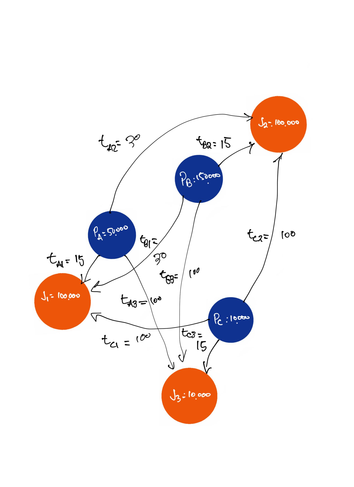

This is an [R Markdown](http://rmarkdown.rstudio.com) Notebook. When you execute code within the notebook, the results appear beneath the code. 

Try executing this chunk by clicking the *Run* button within the chunk or by placing your cursor inside it and pressing *Ctrl+Shift+Enter*. 

```{r}
library(tidyverse)
```

# Shen's Example:

This is the example from Shen (1998, p. 349):


Code data:
```{r}
od_tt <- data.frame(o_id = c("A", "A", "A", "B", "B", "B", "C", "C", "C"), # Three origins
                    d_id = c("1", "2", "3", "1", "2", "3", "1", "2", "3"), # Three destinations
                    tt = c(15, 30, 100, 30, 15, 100, 100, 100, 15), # Travel time
                    pop = c(50000, 50000, 50000, 150000, 150000, 150000, 10000, 10000, 10000), # Population
                    opp = c(100000, 100000, 10000, 100000, 100000, 10000, 100000, 100000, 10000)) # Jobs
```

Use an exponential impedance function as follows:
$$
f(c_{ij}) = exp(-b\cdot c_{ij})
$$

Set b:
```{r}
b <- 0.1
```


Calculate impedance:
```{r}
od_tt <- od_tt |>
  mutate(f = exp(-b * tt))
```

## Accessibility

Accessibility is calculated as:
$$
S_i = \sum_jO_jf(c_{ij})
$$
This is the estimate of conventional accessibility:
```{r}
S <- od_tt |>
  group_by(o_id) |>
  summarize(S = sum(opp * f),
            .groups = "drop")
S
```

## Shen's accessibility with congestion

In this case accessibility is calculated as:
$$
A_i = \sum_j \frac{O_jf(c_{ij})}{D_j}
$$

\noindent with:
$$
D_j = \sum_kP_kf(c_{jk})
$$


As an alternative we can define a new variable level of service as follows:
$$
LOS_j = \frac{O_j}{D_j}
$$

\noindent which then would give:
$$
A_i = \sum_j LOS_jf(c_{ij})
$$

First calculate the level of service (demand by destination):
```{r}
LOS_j <- od_tt |>
  group_by(d_id) |>
  summarize(opp = first(opp),
            D_j = sum(pop * f),
            .groups = "drop") |>
  mutate(LOS_j = opp/D_j)

LOS_j
```

Check the calculation of D_j:
```{r}
50000 * exp(-b * 15) + 150000 * exp(-b * 30) + 10000 * exp(-b * 100)
```

**IMPORTANT:** The demand is _less_ than the population!
```{r}
LOS_j |>
  pull(D_j) |>
  sum()
```

Compare to the actual population:
```{r}
od_tt |>
  distinct(o_id, 
           .keep_all = TRUE) |>
  pull(pop) |>
  sum()
```

Demand by _origin_:
```{r}
D_i <- od_tt |>
  group_by(o_id) |>
  summarize(D_i = sum(pop * f),
            .groups = "drop")

D_i
sum(D_i$D_i)
```


This is problematic: the impedance function says that workers are willing to travel only so far, that many of them are not actually willing to travel to take a job. In other words, the travel behavior indicates a shortage of labor of:
```{r}
od_tt |>
  distinct(o_id, 
           .keep_all = TRUE) |>
  pull(pop) |>
  sum() - LOS_j |>
  pull(D_j) |>
  sum()
```

Join demand to table:
```{r}
A <- od_tt %>%
  left_join(LOS_j |>
              dplyr::select(d_id, LOS_j),
            by = "d_id")

A
```

Calculate accessibility:
```{r}
A <- A |>
  group_by(o_id) |>
  summarize(A = sum(LOS_j * f))

A
```

Shen's property says that the weighted sum of accessibility (by total population) equals the number of opportunities:
```{r}
A |>
  mutate(nominal_jobs = A * c(50000,
                              150000,
                              10000)) |>
  pull(nominal_jobs)

A |>
  mutate(nominal_jobs = A * c(50000,
                              150000,
                              10000)) |>
  pull(nominal_jobs) |>
  sum()
```

This ignores the travel behavior of the population. We know that the _demand_ for jobs is less than the total population. Accordingly the number of jobs _according to the demand by zone_ is:
```{r}
# Workers traveling for jobs from each zone
A |>
  mutate(nominal_jobs = A * D_i$D_i) |>
  pull(nominal_jobs)

A |>
  mutate(nominal_jobs = A * D_i$D_i) |>
  pull(nominal_jobs) |>
  sum()
```

# Spatial availability

Function to calculate spatial availability:
```{r sp_avail-function,include=FALSE}
#defining the spatial availability function
sp_avail <- function(x, o_id, d_id, pop, opp, r, f, alpha = 1){
  
  o_id <- rlang::enquo(o_id)
  d_id <- rlang::enquo(d_id)
  pop <- rlang::enquo(pop)
  opp <- rlang::enquo(opp)
  r <- rlang::enquo(r)
  f <- rlang::enquo(f)
  
  sum_pop <- x %>%
    dplyr::distinct(!!o_id,
                    .keep_all = TRUE) %>%
    dplyr::mutate(sum_pop = !!r*(!!pop)^alpha) %>%
    dplyr::pull(sum_pop) %>%
    sum()
  
  f_p <- dplyr::pull(x, !!r) * dplyr::pull(x, !!pop)^alpha / sum_pop
  
  sum_impedance <- x %>%
    dplyr::group_by(!!d_id) %>%
    dplyr::summarize(sum_impedance = sum(!!f))
  
  x <- x %>%
    dplyr::left_join(sum_impedance,
                     by = rlang::as_name(d_id))
  
  f_c <- dplyr::pull(x, !!f) / x$sum_impedance
  
  x$f_c <- f_c
  x$f_p <- f_p
  
  sum_pa <- x %>%
    dplyr::group_by(!!d_id) %>%
    dplyr::summarize(sum_pa= sum(f_p * f_c))
  
  x <- x %>%
    dplyr::left_join(sum_pa,
                     by = rlang::as_name(d_id))
  f_t <- (f_p * f_c) / dplyr::pull(x, sum_pa)
  
  x %>%
    dplyr::mutate(V_ij = !!opp * !!f_t)
}
```


<!--
```{r}
od_tt$r <- 1
od_tt$alpha <- 1

sum_pop <- od_tt %>%
dplyr::distinct(o_id,
.keep_all = TRUE) %>%
dplyr::mutate(sum_pop = r*(pop)^alpha) %>%
dplyr::pull(sum_pop) %>%
sum()
sum_pop
```


```{r}
f_p <- dplyr::pull(od_tt, r) * dplyr::pull(od_tt, pop)^alpha / sum_pop
```

```{r}
sum_impedance <- od_tt %>%
dplyr::group_by(d_id) %>%
dplyr::summarize(sum_impedance = sum(f))
```


```{r}
od_tt <- od_tt %>%
dplyr::left_join(sum_impedance,
by = "d_id")
```

```{r}
f_c <- dplyr::pull(od_tt, f) / od_tt$sum_impedance

od_tt$f_c <- f_c
od_tt$f_p <- f_p
```


```{r}
sum_pa <- od_tt %>%
dplyr::group_by(d_id) %>%
dplyr::summarize(sum_pa= sum(f_p * f_c))
```


```{r}
od_tt <- od_tt %>%
dplyr::left_join(sum_pa,
by = "d_id")

od_tt$f_t <- (f_p * f_c) / dplyr::pull(od_tt, sum_pa)
od_tt$V_ij <- od_tt$opp / od_tt$f_t
```


Population attracted from each center:
```{r}
od_tt |>
group_by(o_id, d_id) |>
summarize(pop_from_origin = sum(pop * f_p * f_c)) |>
pull(pop_from_origin) |>
sum()
```

-->

```{r}
V_ij <- od_tt %>%
  mutate(r = 1) %>%
  sp_avail(o_id = o_id, 
           d_id = d_id, 
           pop = pop, 
           opp = opp, 
           r = r, 
           f = f, 
           alpha = 1.0) #1.54 

V_ij
```

```{r}
V_i <- V_ij |> 
  group_by(o_id) |>
  summarize(V_i = sum(V_ij),
            .groups = "drop")

V_i

(V_i$V_i - c(50000, 150000, 10000))/c(50000, 150000, 10000) * 100
```

```{r}
sum(V_i$V_i)
```

```{r}
V_j <- V_ij |> 
  group_by(d_id) |>
  summarize(V_j = sum(V_ij),
            .groups = "drop")

V_j
```


```{r}
sum(V_j$V_j)
```

<!-- Calculate spatial availability: -->
<!-- ```{r} -->
<!-- V_i <- od_tt %>% -->
<!--   mutate(r = 1) %>% -->
<!--   mutate(V_ij = sp_avail(., -->
<!--                          o_id = o_id,  -->
<!--                          d_id = d_id,  -->
<!--                          pop = pop,  -->
<!--                          opp = opp,  -->
<!--                          r = r,  -->
<!--                          f = f,  -->
<!--                          alpha = 1)) -->
<!-- V_i -->
<!-- ``` -->

Total number of jobs available:
```{r}
V_ij |>
  pull(V_ij) |>
  sum()
```

Jobs available per origin:
```{r}
V_ij |>
  group_by(o_id) |>
  summarize(V_i = sum(V_ij),
            .groups = "drop")
```

Jobs per capita per origin:
```{r}
V_ij |>
  group_by(o_id) |>
  summarize(V_i = sum(V_ij),
            .groups = "drop") |>
  mutate(v_i = V_i / c(50000, 150000, 10000)) |>
  pull(v_i)
```
-----

<!-- trying again, but with a shen's example...  -->
```{r, eval=FALSE}
# assume Li,n = 1 as our inital number
b<- -0.1

#balancing factor, assume A_i = 1
a1<-1/(1*100000*exp(b*15) + 1*100000*exp(b*30)+ 1*10000*exp(b*100))
b1<-1/(1*100000*exp(b*30) + 1*100000*exp(b*15)+ 1*10000*exp(b*100))
c1<-1/(1*100000*exp(b*100) + 1*100000*exp(b*100)+ 1*10000*exp(b*15))

#next calc accessibility using the balancing factors a1, b1, c1
d2<-1/(50000*exp(b*15)*a1 + 150000*exp(b*30)*b1 + 10000*exp(b*100)*c1)
e2<- 1/(50000*exp(b*30)*a1 + 150000*exp(b*15)*b1 + 10000*exp(b*100)*c1)
h2<- 1/(50000*exp(b*100)*a1 + 150000*exp(b*100)*b1 + 10000*exp(b*15)*c1)

cbind(a1, b1, c1, d2, e2, h2)
```

```{r , eval=FALSE}
a2<-1/(a1*100000*exp(b*15) + b1*100000*exp(b*30)+ c1*10000*exp(b*100))
b2<-1/(a1*100000*exp(b*30) + b1*100000*exp(b*15)+ c1*10000*exp(b*100))
c2<-1/(a1*100000*exp(b*100) + b1*100000*exp(b*100)+ c1*10000*exp(b*15))

d2<-1/(50000*exp(b*15)*a2 + 150000*exp(b*30)*b2 + 10000*exp(b*100)*c2)
e2<- 1/(50000*exp(b*30)*a2 + 150000*exp(b*15)*b2 + 10000*exp(b*100)*c2)
h2<- 1/(50000*exp(b*100)*a2 + 150000*exp(b*100)*b2 + 10000*exp(b*15)*c2)

cbind(a2, b2, c2, d2, e2, h2)
```

```{r , eval=FALSE}
a3<-1/(a2*100000*exp(b*15) + b2*100000*exp(b*30)+ c2*10000*exp(b*100))
b3<-1/(a2*100000*exp(b*30) + b2*100000*exp(b*15)+ c2*10000*exp(b*100))
c3<-1/(a2*100000*exp(b*100) + b2*100000*exp(b*100)+ c2*10000*exp(b*15))

d3<-1/(50000*exp(b*15)*a3 + 150000*exp(b*30)*b3 + 10000*exp(b*100)*c3)
e3<- 1/(50000*exp(b*30)*a3 + 150000*exp(b*15)*b3 + 10000*exp(b*100)*c3)
h3<- 1/(50000*exp(b*100)*a3 + 150000*exp(b*100)*b3 + 10000*exp(b*15)*c3)

cbind(a3, b3, c3, d3, e3, h3)
```

```{r , eval=FALSE}
a4<-1/(a3*100000*exp(b*15) + b3*100000*exp(b*30)+ c3*10000*exp(b*100))
b4<-1/(a3*100000*exp(b*30) + b3*100000*exp(b*15)+ c3*10000*exp(b*100))
c4<-1/(a3*100000*exp(b*100) + b3*100000*exp(b*100)+ c3*10000*exp(b*15))

d4<-1/(50000*exp(b*15)*a4 + 150000*exp(b*30)*b4 + 10000*exp(b*100)*c4)
e4<- 1/(50000*exp(b*30)*a4 + 150000*exp(b*15)*b4 + 10000*exp(b*100)*c4)
h4<- 1/(50000*exp(b*100)*a4 + 150000*exp(b*100)*b4 + 10000*exp(b*15)*c4)

cbind(a4, b4, c4, d4, e4, h4)
```
```{r , eval=FALSE}
a5<-1/(a4*100000*exp(b*15) + b4*100000*exp(b*30)+ c4*10000*exp(b*100))
b5<-1/(a4*100000*exp(b*30) + b4*100000*exp(b*15)+ c4*10000*exp(b*100))
c5<-1/(a4*100000*exp(b*100) + b4*100000*exp(b*100)+ c4*10000*exp(b*15))

d5<-1/(50000*exp(b*15)*a5 + 150000*exp(b*30)*b5 + 10000*exp(b*100)*c5)
e5<- 1/(50000*exp(b*30)*a5 + 150000*exp(b*15)*b5 + 10000*exp(b*100)*c5)
h5<- 1/(50000*exp(b*100)*a5 + 150000*exp(b*100)*b5 + 10000*exp(b*15)*c5)

cbind(a5, b5, c5, d5, e5, h5)
```
----------

```{r}
a2<-(f1/f1)*(100000*exp(b*15)/d2 + 100000*exp(b*30)/e2 + 10000*exp(b*100)/h2)
b2<-(f1/f1)*(100000*exp(b*30)/d2 + 100000*exp(b*15)/e2 + 10000*exp(b*100)/h2)
c2<-(f1/f1)*(100000*exp(b*100)/d2 + 100000*exp(b*100)/e2 + 10000*exp(b*15)/h2)

d2<-(60000*exp(b*15)/a2 + 160000*exp(b*30)/b2 + 10000*exp(b*100)/c2)
e2<-(60000*exp(b*30)/a2 + 160000*exp(b*15)/b2 + 10000*exp(b*100)/c2)
h2<- (60000*exp(b*100)/a2 + 160000*exp(b*100)/b2 + 10000*exp(b*15)/c2)

f2 <- (60000*(a2) + 160000*(b2) + 10000*(c2))/(60000+160000+10000)
cbind(a2, b2, c2, d2, e2, h2, f2)
```

```{r}
a3<-(f1/f2)*(100000*exp(b*15)/d2 + 100000*exp(b*30)/e2 + 10000*exp(b*100)/h2)
b3<-(f1/f2)*(100000*exp(b*30)/d2 + 100000*exp(b*15)/e2 + 10000*exp(b*100)/h2)
c3<-(f1/f2)*(100000*exp(b*100)/d2 + 100000*exp(b*100)/e2 + 10000*exp(b*15)/h2)

d3<-(60000*exp(b*15)/a3 + 160000*exp(b*30)/b3 + 10000*exp(b*100)/c3)
e3<-(60000*exp(b*30)/a3 + 160000*exp(b*15)/b3 + 10000*exp(b*100)/c3)
h3<- (60000*exp(b*100)/a3 + 160000*exp(b*100)/b3 + 10000*exp(b*15)/c3)

f3 <- (60000*(a3) + 160000*(b3) + 10000*(c3))/(60000+160000+10000)
cbind(a3, b3, c3, d3, e3, h3, f3)
```


-----
<!-- this is from Spatial-Availability-Refreshed, I tried to edit alpha to experiment but realized it's not needed-->
<!-- remove this!, the alpha calculation which is only half finished

```{r fitting-population-alpha-param1,  echo=FALSE, warning=FALSE, message=FALSE, include=FALSE}
#calculating an alpha parameter; modulates the attractiveness of larger population centers
#first workers at origin
workers_deciles <- quantile(od_ft_pop$workers,
                        seq(0, 1, 0.1)) 

jobs_deciles <- quantile(od_ft_pop$jobs,
                        seq(0, 1, 0.1))

od_ft_pop <- od_ft_pop %>% 
  mutate(origin_mass_class = cut(workers,
                                 breaks = as.numeric(workers_deciles), 
                                 include.lowest = TRUE),
         destination_mass_class = cut(jobs, 
                                      breaks = as.numeric(jobs_deciles), 
                                      include.lowest = TRUE)) 

trips_work_by_origin_mass <- od_ft_pop %>% 
  filter(trips > 0) %>%
  group_by(origin_mass_class)

tomd_work <- trips_work_by_origin_mass %>% 
  summarize(Trips = sum(trips),
            population = sum(workers),
            .groups = "drop") %>% 
  mutate(frequency_trips = Trips/sum(Trips),
         frequency_population = population/sum(population))

tomd_work %>% # Pass object `tomd_work` to the next function
  pivot_longer(cols = starts_with("frequency_"), 
               names_to = "Variable",
               values_to = "frequency") %>%
  ggplot() + # Create a blank ggplot object
  geom_col(aes(x = origin_mass_class, # Use `geom_col()` to create a plot with bars; the x-axis is the mass classes 
               y = frequency, # The height of the bars is the frequency of trips produced by zones in the mass class
               fill = Variable), # The fill color of the columns will be different for frequency of trips and frequency of population
           position = "dodge") +
  xlab("population at the origin") +
  theme(axis.text.x = element_text(angle = 90))
```

```{r fitting-population-alpha-param2, echo=FALSE, warning=FALSE, message=FALSE, include=FALSE}
#calculating an alpha parameter; modulates the attractiveness of larger population centers
#next jobs at origin
trips_work_by_destination_mass <- od_ft_pop %>% 
  filter(trips > 0) %>%
  group_by(destination_mass_class)

tomd_work <- trips_work_by_destination_mass %>% 
  summarize(Trips = sum(trips),
            population = sum(jobs),
            .groups = "drop") %>% 
  mutate(frequency_trips = Trips/sum(Trips),
         frequency_population = population/sum(population))

tomd_work %>% # Pass object `tomd_work` to the next function
  pivot_longer(cols = starts_with("frequency_"), 
               names_to = "Variable",
               values_to = "frequency") %>%
  ggplot() + # Create a blank ggplot object
  geom_col(aes(x = destination_mass_class, # Use `geom_col()` to create a plot with bars; the x-axis is the mass classes 
               y = frequency, # The height of the bars is the frequency of trips produced by zones in the mass class
               fill = Variable), # The fill color of the columns will be different for frequency of trips and frequency of population
           position = "dodge") +
  xlab("employment at the origin") +
  theme(axis.text.x = element_text(angle = 90))
```


```{r, echo=FALSE, warning=FALSE, message=FALSE}
#we'll use the employment at the origin, and calculate alpha (i.e., the parameter which will scale population centers with more employment more than population centers with smaller employment)

all_empATorig <- od_ft_pop  %>% 
  dplyr::select(trips, jobs)

all_empATorig <- all_empATorig[rep(seq_len(dim(all_empATorig)[1]), all_empATorig$trips), 2]

#fit cullen frey graph -> the results indicate a gamma or beta is the best fit.
#fitdistrplus::descdist(data = all_empATorig)
```

```{r, echo=FALSE, warning=FALSE, message=FALSE, include=FALSE}
#let's try both gamma and beta. Beta seems to fit better
gamma2_ <- fitdistrplus::fitdist(data=all_empATorig, "gamma", method="mme", optim.method="Nelder-Mead") 
exp2_ <- fitdistrplus::fitdist(data=all_empATorig, "exp", method="mme", optim.method="Nelder-Mead") 
#transform values to a scale of 0 to 1 to fit beta distribution
# all_empATorig_norm <- data.frame(normalized = ((all_empATorig) - min(all_empATorig)) / (max(all_empATorig) - min(all_empATorig))) %>% unlist()
# beta2_ <- fitdistrplus::fitdist(data=all_empATorig_norm, "beta", method="mme", optim.method="Nelder-Mead")
# plot(gamma2_)
# plot(beta2_)
plot(exp2_)
```

```{r save-alpha-param-plot, include=FALSE}
# For some reason plot(gamma_) does not play well with knitr, so instead we save the figure and then include it as a graphic in the following chunk
png("images/alpha-param_function.png")
plot(gamma2_)
dev.off()
```

```{r alpha-param-plot, fig.cap="\\label{fig:alpha-param-plot}Employment at origin distribution and calibrated gamma distribution (red line) with associated Q-Q and P-P plots. Based on TTS 2016.", fig.show='hold', fig.align='center', out.width="80%"}
knitr::include_graphics("images/alpha-param_function.png")
```

```{r estimate-alpha-param, echo=FALSE, warning=FALSE, message=FALSE}
#adding f to our data set.
#dgamma is the density plot for gamma function; adding values as "f" our impedance function
od_ft_pop <- od_ft_pop %>%
  mutate(f = dgamma(jobs, gamma2_$estimate["shape"], gamma2_$estimate["rate"]))
```
-->
