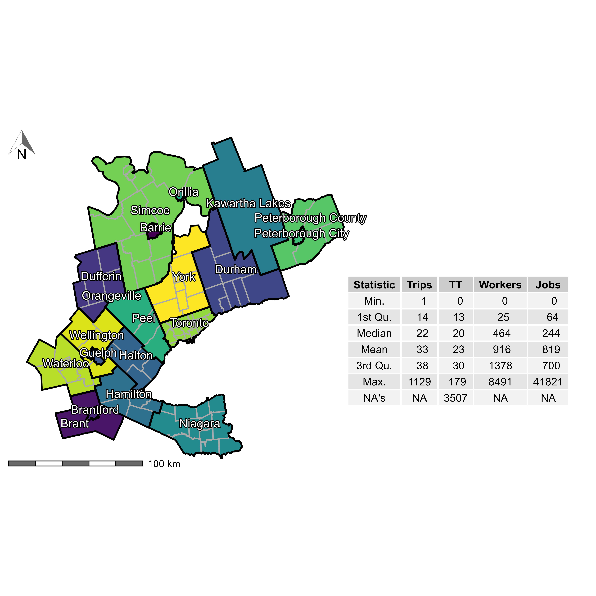
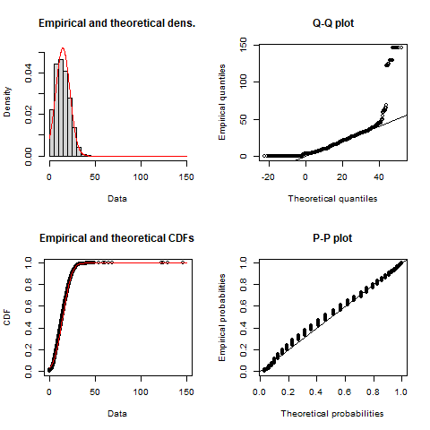

```{r knitr-setup, include=FALSE}
knitr::opts_chunk$set(
  echo = FALSE,
  cache = TRUE,
  warning = FALSE,
  message = FALSE,
  comment = '', 
  out.width = "1\\linewidth")
```

```{r install-data-package, eval = FALSE, include=FALSE}
if (!require("TTS2016R", character.only = TRUE)) {
      remotes::install_github("soukhova/TTS2016R",
                        build_vignettes = TRUE)
  }
```

```{r load-packages, include=FALSE, cache=FALSE}
library(TTS2016R)
library(dplyr)
library(fitdistrplus)
library(ggplot2)
library(kableExtra)
library(patchwork)
library(sf)
library(scales)
library(ggpmisc)
library(ggrepel)
library(cowplot)
library(ggspatial)
library(spdep)
library(RColorBrewer)
library(tmap)
library(shadowtext)
library(grid)
# library(extrafont)
# font_import()
# loadfonts(device = "win")

options(scipen = 999)
```

```{r sp_avail-function,include=FALSE}
#defining the spatial availability function
sp_avail <- function(x, o_id, d_id, pop, opp, r, f, alpha = 1){

  o_id <- rlang::enquo(o_id)
  d_id <- rlang::enquo(d_id)
  pop <- rlang::enquo(pop)
  opp <- rlang::enquo(opp)
  r <- rlang::enquo(r)
  f <- rlang::enquo(f)

  sum_pop <- x %>%
    dplyr::distinct(!!o_id,
                    .keep_all = TRUE) %>%
    dplyr::mutate(sum_pop = !!r*(!!pop)^alpha) %>%
    dplyr::pull(sum_pop) %>%
    sum()

  f_p <- dplyr::pull(x, !!r) * dplyr::pull(x, !!pop)^alpha / sum_pop

  sum_impedance <- x %>%
    dplyr::group_by(!!d_id) %>%
    dplyr::summarize(sum_impedance = sum(!!f))

  x <- x %>%
    dplyr::left_join(sum_impedance,
                     by = rlang::as_name(d_id))

  f_c <- dplyr::pull(x, !!f) / x$sum_impedance

  x$f_c <- f_c
  x$f_p <- f_p

  sum_pa <- x %>%
    dplyr::group_by(!!d_id) %>%
    dplyr::summarize(sum_pa= sum(f_p * f_c))

  x <- x %>%
    dplyr::left_join(sum_pa,
                     by = rlang::as_name(d_id))
  f_t <- (f_p * f_c) / dplyr::pull(x, sum_pa)

  dplyr::pull(x, !!opp) * f_t
}
```

\newpage

# Introduction

Accessibility analysis is employed in transportation, geography, public health, and many other areas, particularly as mobility-based planning is de-emphasized in favor of access-oriented planning [@deboosere2018; @handy2020; @proffitt2017; @yan2021]. The concept of accessibility derives its appeal from combining the spatial distribution of opportunities and the cost of reaching them [@hansen1959; @handy_measuring_1997]. 

Numerous methods for calculating accessibility have been proposed that can be broadly organized into infrastructure-, place-, person-, and utility-based measures [@geurs2004]. Of these, the place-based family of measures is arguably the most common, capturing the number of opportunities reachable from an origin using the transportation network. A common type of accessibility measure is based on the gravity model of spatial interaction; since it was first developed by @hansen1959 it has been widely adopted in many forms [e.g., @cervero_transportation_2002; @paez2004network; @geurs2004; @handy_measuring_1997; @levinson_accessibility_1998; @Arranz2019measuring]. Accessibility analysis offers a powerful tool to study the intersection between urban structure and transportation infrastructure - however, the interpretability of accessibility measures can be challenging [@geurs2004; @miller2018]. A key issue is that accessibility measures are sensitive to the number of opportunities in a region (e.g., a large city has more jobs than a smaller city), and therefore raw values are not easily compared across study areas [@allen2019].

<!-- new -->
Gravity-based accessibility indicators are in essence spatially smoothed estimates of the total number of opportunities in a region, but the meaning of their absolute magnitudes is unclear as they measure the _potential_ for interaction [as originally defined by @wilson1971]. <!-- Maybe replace the Sao Paulo Examole and use for Jobs and Single Parent in Toronto --> For instance, in the study by @boisjoly2017informality, high-income areas in Metropolitan Saul Paulo have high accessibility to employment (e.g., X jobs per all jobs available) and low-income areas have low accessibility to employment (e.g., Y jobs per all jobs available). Though X or Y reflect the urban structure, and correlates identify the relationship with employment, X and Y values can only be used within the context of employment accessibility in Saul Paulo. For example, in study XX which used the same employment accessibility method but for ZZ region, the X and Y accessibility values from Saul Paul cannot be immediately compared, but the X and Y low and high accessibility values in ZZ reflect the region's urban structure. That being said, decision-makers and planners find it difficult to operationalize accessibility since it reflects urban structure and is harder to interpret as an opportunity _provision_ measure. For instance, if a small city creates 1,000 more housing units in an employment rich neighborhood (ex., 15% of all employment opportunities are located within the neighbourhood (X)), could the city achieve a provider-provision-ratio of 1.5 jobs per person? Conventional accessibility does not reflect this ratio as a result of _inconsistent_ opportunity-side and population-side counting: opportunities are multiply counted for every population unit that can reach them. 

<!-- new -->
The inconsistent counting embedded in traditional accessibility methods has been flagged in the context of accessibility by @merlin2017competition, @allen2019, and @kelobonye2020measuring, and in Floating Catchment Area methods by @delamater2013spatial and @paez2019. A consequence is the lack of clarity on the interpretation of the resulting values, since they tend to be inflated or deflated. Returning to XX, the maximum job accessibility in Saul Paulo is XYZ, and the maximum job accessibility is XY in region ZZ. This the highest count of opportunities, weighted by associated travel costs, which a certain population can access in the region. This maximum value, outside of reflecting urban structure, is difficult to interpret from a decision-maker's perspective who is deliberating planning interventions. We believe the issue in interpretation arises since opportunities are adjusted based on population-side travel and usage behaviour (i.e., travel costs, catchments, time-windows). Accessibility is not constrained to match the number of opportunities available. 

Put another way, traditional measures of accessibility do not capture the _competition_ for opportunities but instead quantify access as if every person can take every opportunity given their mobility [@paez2019; @kelobonye2020measuring]. This _inconsistency_ is not necessarily problematic if the opportunity of interest is inexaustible, that is, if use by one unit of population does not preclude use by another. For instance, green spaces are seldom used to full capacity, so the presence of some population in a park does not exclude use by others. However, inconsistent opportunity-adjustments can be more acute when opportunities are _non-divisible_ or _exahustible_ in the sense that, once taken, they are no longer available to other members of the population [also discussed by @geurs2004]. Examples of these types of opportunities include jobs (e.g., when a person takes up a job, the same job cannot be taken by anyone else) and placements at schools (e.g., once a student takes a seat at a school, that opportunity is no longer available for another student). Though these non-divisible opportunities can still be modelled by conventional accessibility (e.g., <!-- Revise after new example: Sao Paulo and Z region--> ), the measure does not reflect the _spatial availability_ of the opportunity.

To increase the interpretability of accessibility, researchers have proposed several different approaches that consider congestion. These include several approaches that first normalize the number of opportunities available at a destination by the demand from the origin zones and, second, sum the demand-corrected opportunities which can be reached from the origins [e.g. @joseph1984; @shen1998]. These advances were popularized in the family of two-step floating catchment area (FCA) methods [@luo2003] that have found widespread adoption for calculating accessibility with congestion to a variety of opportunities such as healthcare, education, and food access [@yang_comparing_2006; @chen_spatial_2020; @ye_spatial_2018; @chen_enhancing_2019; @chen_evaluating_2020]. Floating Catchments Area methods introduce congestion, but in practice several researchers [e.g., @delamater2013spatial; @wan2012three] have found that they tend to misdiagnose accessibility values because they do not truly capture competition. The underlying issue in FCAs, as demonstrated by @paez2019, is that the same population can be claimed by multiple service centers, and the same level of service cab be offered back to multiple populations. In effect, this treats both the population and level of service as if they were inexhaustible. Failure to account for competition of an exhaustible resource leads to biased estimates of accessibility if not corrected [@paez2019].

Another approach which research have used to consider competition in accessibility has been the imposition of constraints on the gravity model to ensure potential interaction equals observed totals. Based on Wilson's [-@wilson1971] entropy-derived gravity model, researchers can incorporate constraints to ensure that the modeled flows match some known quantities in the data inputs. In this way, models can be singly-constrained to match the row- or column-marginals (i.e., the trips produced or attracted, respectively), whereas a doubly-constrained model is designed to match both marginals. Kelobonye et al. [-@kelobonye2020measuring] recently introduced a singly constrained measure but only in the context of cumulative opportunities. Allen and Farber [-@allen2019], on the other hand, developed a version of the doubly-constrained gravity model within the FCA approach. 

The contribution of this paper is to present a singly-constrained measure of accessibility that we call **spatial availability**. This measure aims to capture the number of opportunities that are not only *accessible* but also *available* to the opportunity-seeking population, in the sense that they have not been claimed by a competing seeker of the opportunity. As we will show, spatial availability hinges on the proportional allocation of opportunities. By allocating opportunities in a proportional way based on demand and distance in a single step, this method avoids the issues that result from multiple allocation of the same opportunities in conventional accessibility analysis. This method returns a measure of the rate of available opportunities per opportunity-seeking population. Moreover, the method also returns a benchmark value for the study region against which results for individual origins can be compared both inter- and intra-regionally and used in the context of opportunity provision assessment. This novel approach comes at a time when the quantity and resolution of data is exponentially increasing and the need to operationalize accessibility methods in city-planning objectives is urgent. 

This paper is split into three main parts. The first part uses a synthetic example to illustrate how congestion and/or competition are treated in existing measures of accessibility (XXX). The second part introduces our proposed measure of spatial availability and uses the same synthetic example to compare it to the measures discussed. In the third part, we calculate, compare, and contrast the spatial availability, conventional accessibility, and Shen's competitive accessibility (XX) values for 2016 employment data in the city of Toronto, Canada (Transportation Tomorrow Survey (TTS)). The motivation of this part is to demonstrate how accessibility and a popular competitive accessibility measure, both are afflicted by limited interpretability. Finally, we conclude by remarking on the conceptual limits of conventional accessibility analysis, and outlining the advantages of the spatial availability measure and the breadth of potential uses from the perspective of opportunity-provision planning.

In the spirit of openness of research in the spatial sciences [@brunsdon2021opening; @paez2021open] this paper has a companion open data product [@arribas2021Open], and all code will be available for replicability and reproducibility purposes.

# Accesssibility measures on an synthetic example {#background}

<!-- NOTE: discuss the presentation of these measures, i.e., visualizing plots, formula formulation, discussion, etc. -->
We continue our presentation by introducing a synthetic example, which we use to demonstrate the interpretation issues associated with conventional accessibility analysis. We then present the proposed *spatial availability* measure, calculate the spatial availability values for the synthetic example and discuss how the interpretation of the resulting values from the perspective of opportunity-provision. Spatial availability values are then compared and contrasted with other competitive accessibility measures [@shen1998; @luo2003; @horner_exploring_2004; @allen2019] and the interpretability of spatial availability is further elaborated.

## Conventional accessibility

Accessibility analysis stems from the foundational works of [-@harris_market_1954] and [-@hansen1959]. From their seminal efforts, many accessibility measures (excluding utility-based measures) have been derived, particularly after the influential work of -@wilson1971 on the gravity model. This model follows the formulation shown in Equation (\ref{eq:conventional-accessibility}). 
```{=tex}
\begin{equation}
\label{eq:conventional-accessibility}
A_i = \sum_{j=1}^JO_j \cdot f(c_{ij})
\end{equation}
```
\noindent where:

-   $A$ is accessibility.
-   $i$ is a set of origin locations.
-   $j$ is a set of destination locations.
-   $O_j$ is the number of opportunities at location $j$; $\sum_j O_j$ is the total supply of opportunities in the study region.
-   $c_{ij}$ is a measure of the cost of moving between $i$ and $j$.
-   $f(\cdot)$ is an impedance function of $c_{ij}$; it can take the form of any monotonically decreasing function chosen based on positive or normative criteria [@paez2012measuring].

As formally defined, accessibility $A_i$ is the weighted sum of opportunities that can be reached from location $i$, given the cost of travel $c_{ij}$. Summing the opportunities in the neighborhood of $i$, as determined by the impedance function $f(\cdot)$, provides estimates of the number of opportunities that can be reached from $i$ at a certain cost. The type of accessibility can be modified depending on the impedance function; for example, the measure could be cumulative opportunities [if $f(\cdot)$ is a binary or indicator function e.g., @elgeneidy_cost_2016; @rosik_forecast_2021; @geurs2004; @qi_decadelong_2018] or a gravity measure using an impedance function modeled after any monotonically decreasing function [e.g., Gaussian, inverse power, negative exponential, or log-normal, among others, see, *inter alia*, @kwan_spacetime_1998; @vale_influence_2017; @reggiani_accessibility_2011; @li_approach_2020]. In practice, the accessibility measures derived from many cumulative and gravity formulations tend to be highly correlated with one another [@higgins2019; @santanapalacios2022; @kwan_spacetime_1998].

The setup for our synthetic example is a system with two employment centers and three population centers. Accessibility to jobs at each population center is calculated using the accessibility measure $A_i$ in Equation (\ref{eq:conventional-accessibility}). In this synthetic example, we use the straight line distance between the population and jobs for $c_{ij}$ and a negative exponential function with $\beta = 0.0015$. As noted, $A_i$ represents the number of jobs (i.e., opportunities) that can be reached from each population center given the estimated cost as depicted in Figure \ref{fig:toy-example-accessibility}.
```{r creating-toy-example}
toy_sim_zones_3_2 <- toy_sim_zones %>% 
  filter(id_short == "E1" | id_short == "E2" | id_short == "P1" | id_short == "P2" | id_short == "P4") %>%
  mutate(number = ifelse(id_short == "E2", 220, number))
```

```{r create-figure-with-toy-example, fig.height=2, include=FALSE}
ggplot() + 
  geom_sf(data = toy_sim_zones_3_2 %>% filter(type=="jobs"),
            aes(size = number),
          shape = 16,
          color = "grey") +
    geom_sf(data = toy_sim_zones_3_2 %>% filter(type=="population"),
            aes(size = number),
          shape = 17,
          color = "dimgrey") +
  geom_sf_text(data = toy_sim_zones_3_2,
               aes(label = id_short),
               size = 3,
               nudge_y = -300) +
  scale_size(range = c(2, 5))  + 
  theme(legend.position = "none",
        axis.text = element_blank(), axis.title = element_blank(),
        panel.grid = element_blank(),
        panel.background = element_rect(size = 1, 
                                        color = "black", 
                                        fill = NA))
ggsave("images/figure-1.png",
       width = 3,
       height = 2)
```

```{r creating-toy-example-table}
toy_od_table_3_2_P1 <- toy_od_table %>% filter(Origin == "Population 1" & 
                                                (Destination == "Employment Center 1" | Destination == "Employment Center 2")) %>%
  mutate(Jobs = ifelse(Destination == "Employment Center 2", 220, Jobs))
toy_od_table_3_2_P2 <- toy_od_table %>% filter(Origin == "Population 2" & 
                                                (Destination == "Employment Center 1" | Destination == "Employment Center 2")) %>%
  mutate(Jobs = ifelse(Destination == "Employment Center 2", 220, Jobs))
toy_od_table_3_2_P4 <- toy_od_table %>% filter(Origin == "Population 4" & 
                                                (Destination == "Employment Center 1" | Destination == "Employment Center 2"))%>%
  mutate(Jobs = ifelse(Destination == "Employment Center 2", 220, Jobs))

toy_od_table_3_2 <- rbind(toy_od_table_3_2_P1,toy_od_table_3_2_P2,toy_od_table_3_2_P4)
```

```{r toy-example-accessibility}
# Calculate impedance function
beta <- 0.0015
toy_od_table_3_2 <- toy_od_table_3_2 %>%
  mutate(f = exp(-beta * distance))

# using the origin-destination table (OD) of all origin to destination trips; filter in only jobs which are mean distance or less away from a population center and sum number of jobs available in each origin (population center)
c_accessibility <- toy_od_table_3_2 %>% 
  mutate(A_ij = f * Jobs) %>%
  group_by(Origin) %>%
  summarise(A_i = sum(A_ij))

#pass conventional accessibility calculation into the spatial object (toy_sim_zones)
toy_sim_zones_access_3_2  <- toy_sim_zones_3_2 %>% 
  left_join(c_accessibility, 
            by = c("id" = "Origin")) 
```

```{r toy-example-accessibility-plot, fig.cap="\\label{fig:toy-example-accessibility}Accessibility to jobs (red text) from population centers (P) to employment centers (E) for the synthetic example. Values of population and employment are shown in white text.", fig.height=3}
# Plot the accessibility to employment in the example;
ggplot() +
  geom_sf(data = toy_sim_zones_access_3_2 %>% 
            filter(type == "population"),
          aes(fill = A_i, size = A_i, shape = type)) +
  geom_sf(data = toy_sim_zones_access_3_2 %>%
            filter(type == "jobs"),
          aes(shape = type,
              size = number),
          fill = "black") +
  geom_sf_text(data = toy_sim_zones_access_3_2 , aes(label = id_short), colour = "dark grey",
               size = 3, nudge_y = -350) +
  geom_sf_text(data = toy_sim_zones_access_3_2 , aes(label = A_i %>% round(digits = 1)), colour = "red",
               size = 3.5, nudge_y = 350) +
  geom_sf_text(data = toy_sim_zones_access_3_2 , aes(label = number), colour = "dark grey",
               size = 3, nudge_x = 450) +
  scale_shape_manual(values = c('population' = 24, 'jobs' = 21), 
                     name = "Location Type", 
                     labels=c("Population", "Jobs"),
                     guide = guide_legend(order = 2)) +
  guides(shape =guide_legend(override.aes=list(size=5))) +
  scale_size_continuous(range = c(4,7), name = expression(A["i"]), guide = "none") +
  scale_fill_distiller(palette = "OrRd", direction = 1, name = expression(A["i"]),
                       limits = c(0, max(toy_sim_zones_access_3_2$A_i, na.rm = T)),
                       guide = guide_colorbar(order = 1)) +
  theme(legend.position = "none", 
        axis.title = element_blank(),
        panel.grid = element_blank(),
        panel.background = element_rect(size = 1.5, 
                                        color = "grey", 
                                        fill = "white"))+ 
  scale_x_continuous(breaks = seq(-80.06, -79.96, by = 0.02))
```

<!-- maybe make a ttmap for this..? -->

Gavity-based accessibility has been shown to be an excellent indicator of the intersection between urban structure and transportation infrastructure [@shi_literature_2020; @reggiani_accessibility_2011; @kwan_spacetime_1998]. However, beyond enabling comparisons of relative values they are not highly interpretable on their own [@miller2018]. For instance, from Figure \ref{fig:toy-example-accessibility}, `r toy_sim_zones_access_3_2 %>% slice_min(A_i, n=1) %>% pull(id_short)` has lower accessibility than `r toy_sim_zones_access_3_2 %>% slice_max(A_i, n=1) %>% pull(id_short)` but despite the accessibility value for `r toy_sim_zones_access_3_2 %>% slice_min(A_i, n=1) %>% pull(id_short)` being relatively low it is still better than *zero*. On the other hand, `r toy_sim_zones_access_3_2 %>% slice_max(A_i, n=1) %>% pull(id_short)` has high accessibility, but is this accessibility excellent, good, or only fair? What does it _mean_ for a location to have accessibility to so many jobs? 

To address this interpretability issue, previous research has aimed to index and normalize values on a per demand-population basis [e.g., @barboza_balancing_2021; @pereira_distributional_2019; @wang_access_2021]. However, as recent research on accessibility discusses [@merlin2017competition; @allen2019; @paez2019; @kelobonye2020measuring], these steps do not truly address competition. In effect, when calculating $A_i$, every opportunity enters the weighted sum once for every origin $i$ that can reach it. Put another way, if a densely populated population center pops up next to `r toy_sim_zones_access_3_2 %>% slice_max(A_i, n=1) %>% pull(id_short)` this center too will have a high accessibility score. There is a lurking assumption in this process that all opportunities are *available* to anyone from any origin $i=1,\cdots,n$ who can reach them: in other words, opportunities are assumed to be infinitely divisible and thus inexhaustible. This multiplication of the opportunities means that competition is not really present, and $A_i$ does not consider that neighbouring population centers are seeking the same exhaustible opportunities. Neglecting to constrain opportunity counts (i.e., single-constraint) in addition to obscuring the interpretability of accessibility can also bias the estimated landscape of opportunity, as we will discuss later on in the paper.

## Measures with congestion and/or competition

Past research has considered both congestion and/or competition in accessibility analysis. The highly cited work of [-@shen1998] for example, divides conventional accessibility by the travel-cost adjusted population seeking the opportunities in a given region: this was perhaps the first measure of accessibility to introduce congestion. This work was popularized by the 2-step floating catchment approach (2SFCA) introduced by [-@luo2003] and widely used today. 

A synthetic example of a three population center and two employment centre is solved using this popular competitive measure and shown in Figure XX- left. The formulation of the 2SFCA approach is shown in step 1 (Equation (\ref{eq:2SFCA-step1})) where the PPR $R_j$ is calculated for each opportunity and then allocated to populations based on travel cost $f(\cdot)$ in step 2 (Equation (\ref{eq:2SFCA-step2})). The synthetic example is solved in detail for the 2SFCA and all other accessibility measures in the Appendix (XX). 

```{=tex}
\begin{equation}
\label{eq:2SFCA-step1}
R_{j} = \frac{O_{j}}{\sum_i P_{i} \cdot f(c_{ij})}\\
\end{equation}
```

```{=tex}
\begin{equation}
\label{eq:2SFCA-step2}
A_{i} = {\sum_j R_{j} \cdot f(c_{ij})}\\
\end{equation}
```

\noindent where:

-   $A$ is accessibility.
-   $i$ is a set of origin locations.
-   $j$ is a set of destination locations.
-   $O_j$ is the number of opportunities at location $j$;
-   $P_i$ is the population at location $i$; $\sum_j R_j$ is the total supply of opportunities in the study region.
-   $R_j$ is the provider-to-population (PPR) ratio at location $j$;
-   $c_{ij}$ is a measure of the cost of moving between $i$ and $j$;
-   $f(\cdot)$ is an impedance function of $c_{ij}$.

As shown by @paez2019, congestion does not necessarily mean competition, as the same population is claimed by multiple service centers and the same level of service is given to multiple populations.

Other measures have been proposed that include inverse balancing factors as in [@horner_exploring_2004] and [@allen2019]. These methods involves computing the inverse balancing factor for each origin through an iterative procedure until convergence. The iterations seek to match the travel-cost weighted opportunities to the travel-cost weighted population in the region. It requires that the total population and opportunities are equal in the region but the mean accessibilities from previous iterations can be included to standardize the imbalance The solved synthetic example is in Figure XX - middle, and the formulation of this method is as follows in Equation (\ref{eq:Inverse-balancing-1}) and (\ref{eq:Inverse-balancing-2}). <!-- IS THIS CORRECT? A limitation of this approach is that the estimates of accessibility do not necessarily add up to a known constant-->

```{=tex}
\begin{equation}
\label{eq:Inverse-balancing-1}
A_{i} = \frac{\bar A^{o}}{\bar A^{c}}{\sum_{j=1}^{J} \frac{O_{j}f(c_{ij})}{B_{j}}}\\
\end{equation}
```

```{=tex}
\begin{equation}
\label{eq:Inverse-balancing-2}
B_{i} = {\sum_{i=1}^{I} \frac{P_{i}f(c_{ij})}{A_{i}}}\\
\end{equation}
```

\noindent where:
-   $B_{i}$ is the balancing factor; other variables defined in the gravity model. 

Incorporating the concept of balance between the population and opportunities, a recent advancement to the 2SFCA is the balanced 2-step floating catchment approach (B2SFCA) of [@paez2019]. In both steps, the number of opportunities from the PPR to each origin, this results in a consistent number of opportunities being assigned. 

In the B2SFCA, the PPR $R_{j}$ for each employment center can be interpreted as the total number of jobs accessible to the total population after being _proportionally_ adjusted to the travel cost. The PPR $R_{j}$ is then allocated, proportionally based on travel cost, to each employment center. For this reason, the sum of all $A_{i}$ adds up to the same value as the sum of all $R_{j}$. Since PPR and the subsequent $A_{i}$ are proportionally allocated based travel costs, it should be noted that $A_{i}$ no longer considers _potential_ interaction in the how it was defined in the gravity model [@hansen1959] and instead represent the allocation of PPR, based on travel time, to each population. This measure introduces some consistency in how the PPR is calculated (compared to the 2SFCA), but is still lacking interpretability in the resulting values. 

The solved synthetic example is in Figure XX - right, and the formulation of this method is as follows in Equation (\ref{eq:B2SFCA-1}) and (\ref{eq:B2SFCA-2}). 

```{=tex}
\begin{equation}
\label{eq:B2SFCA-1}
R_{j} = \frac{O_{j}}{\sum_i P_{i} \frac{f(c_{ij})}{\sum_j f(c_{ij})}}\\
\end{equation}
```

```{=tex}
\begin{equation}
\label{eq:B2SFCA-2}
A_{i} = {\sum_j R_{j}\frac{f(c_{ij})}{\sum_j f(c_{ij})}}\\
\end{equation}
```


<!-- NOTE: potentially a figure here, I'm thinking to put all 3 competitive measures side by side in a 1*3 panel. Maybe consolidate that gravity model and create a 2*2 grid? Or maybe no figures at all? thoughts-->

# Introducing spatial availability

<!-- NOTE: maybe we should remove the separate calculations of the population and travel cost factors? Sort of complicated for no reason.-->

Here we introduce the spatial availability model formulation and demonstrate how it compares to other measures of accessibility with congestion and/or competition.

We define spatial availability $V_{i}$ as the number of opportunities $O$ that are proportionally allocated based on population and cost of travel, for all origins $i$ to all destinations $j$.


This idea is reflected in Equation (\ref{eq:spatial-availability}), where $F^p_{i}$ is a population-based allocation factor that grants a larger share of the existing opportunities to larger centers, and $F^c_{ij}$ is a transportation cost-based allocation factor that grants a larger share of the existing opportunities to closer centers. This is in line with the tradition of gravity modeling, and proposed framework distinguishes between opportunities at a destination and demand for opportunities at the origin.
```{=tex}
\begin{equation}
\label{eq:spatial-availability}
V_{i} = O_j\frac{F^p_{i} \cdot F^c_{ij}}{\sum_{i=1}^K F^p_{i} \cdot F^c_{ij}}
\end{equation}
```

The terms in Equation \ref{eq:spatial-availability} are as follows:

-   $V_{i}$ is the spatial availability of opportunities in $j$ to origin $i$.
-   $i$ is a set of origin locations in the region $K$.
-   $j$ is a set of destination locations in the region $K$.
-   $O_j$ is the number of opportunities at location $j$ in the region $K$.
-   $F^p_{i}$ is a proportional allocation factor of the population in $i$.
-   $F^c_{ij}$ is a proportional allocation factor of travel cost for $i$; it is a product of a monotonically decreasing (i.e., impedance) function associated with the cost of travel between $i$ and $j$.

Notice that, unlike $A_i$ in Equation (\ref{eq:conventional-accessibility}), the population in the region enters the calculation of $V_{i}$. It is important to detail the role of the two proportional allocations factors in the formulation of spatial availability. We begin by considering the population allocation factor $F^p_{i}$ followed by the role of the travel cost allocation factor $F^c_{ij}$; then we show how both allocation factors combine in the final general form of spatial availability $V_{i}$. The calculation of spatial availability is introduced with a step-by-step example for synthetic three population centers ($P_1$, $P_2$, $P_4$) in the role of demand (i.e., the number of individuals in the labor market who 'demand' employment) and two employment centers ($O_1$, $O_2$) in the role of opportunities.

## Population and travel cost allocation factors

<!-- remove r--> 
We begin with allocation based on demand by population; consider an employment center $j$ with <!-- In the following REMOVE r, which was for catchment areas? --> $O_j^r$ jobs of type $r$. In the general case where there are $K$ population centers in the region, we define the following factor:

```{=tex}
\begin{equation}
\label{eq:pop-alloc-factor}
F^p_{i} = \frac{P_{i\in r}^\alpha}{\sum_{i=1}^K P_{i\in r}^\alpha}
\end{equation}
```

The population allocation factor $F^p_{i}$ corresponds to the proportion of the population in origin $i$ relative to the population in the region. On the right hand side of the equation, the numerator $P_{i\in r}$ is the population at origin $i$ that is eligible for and 'demands' jobs of type $r$ (e.g., those with a certain level of training or in a designated age group). The summation in the denominator is over $i=1,\cdots,K$, the population at origins $i$ in the region. To modulate the effect of demand by population in this factor we include an empirical parameter $\alpha$ (i.e., $\alpha <1$ places greater weight on smaller centers relative to larger ones while $\alpha>1$ achieves the opposite effect). This population allocation factor $F^p_{i}$ can now be used to proportionally allocate a share of the jobs at $j$ to origins.

More broadly, since the factor $F^p_{i}$ is a proportion, when it is summed over $i=1,\cdots,K$ it always equals to 1 (i.e., $\sum_i^{K} F^p_{i} = 1$). This is notable since the share of jobs at each destination $j$ allocated to (i.e., available to) each origin, based on population, is equal to $V^p_{i} = O_j \cdot F^p_{i}$. Since the sum of $F^p_{i}$ is equal to 1, it follows that $\sum_{i=1}^I V_{i} = O_j$. In other words, the number of jobs across the region is preserved. The result is a proportional allocation of jobs (opportunities) to origins based on the size of their populations.

For simplicity, assume <!--NOTE: REMOVE discussion of different types of jobs, since this relates to catchment areas? that all the population in the region is eligible for these jobs, that is, that the entirety of the population is included in the set $r$. Also assume--> that $\alpha=1$. The population allocation factors $F^p_{i}$ is as follows in Equation (\ref{eq:pop-alloc-factor-2populations}).

```{=tex}
\begin{equation}
\label{eq:pop-alloc-factor-2populations}
\begin{array}{l}
F^p_{1} = \frac{P_1 ^\alpha}{P_1^\alpha + P_2^\alpha + P_3^\alpha} = \frac{260}{260 + 255 + 495} = 0.257\\
F^p_{2} = \frac{P_2^\alpha}{P_1^\alpha + P_2^\alpha + P_3^\alpha}  = \frac{255}{260 + 255 + 495} = 0.252\\
F^p_{3} = \frac{P_3^\alpha}{P_1^\alpha + P_2^\alpha + P_3^\alpha}  = \frac{495}{260 + 255 + 495} = 0.490\\
\end{array}
\end{equation}
```

```{r SA-1, eval=FALSE}
{260}/{260 + 255 + 495}
{255}/{260 + 255 + 495}
{495}/{260 + 255 + 495}
```

These $F^p_{i}$ values can be used to find a *partial* spatial availability in which jobs are allocated proportionally to population; this partial spatial availability $V^p_{i}$ for each population center is calculated as follows in Equation (\ref{eq:pop-alloc-factor-SA-2populations}).

```{=tex}
\begin{equation}
\label{eq:pop-alloc-factor-SA-2populations}
\begin{array}{l}
V^p_{1} = O_1 \cdot F^p_{1} + O_2 \cdot F^p_{1} = 750 \cdot 0.257 + 220 \cdot 0.257 = 249.29 \\
V^p_{2} = O_1 \cdot F^p_{2} + O_2 \cdot F^p_{2} = 750 \cdot 0.252 + 220 \cdot 0.252 = 244.44 \\
V^p_{3} = O_1 \cdot F^p_{3} + O_2 \cdot F^p_{3}= 750 \cdot 0.490 + 220 \cdot 0.490 = 475.30 \\
\end{array}
\end{equation}
```

```{r SA-2, eval=FALSE}
750*0.257 + 220*0.257 
750*0.252 + 220*0.252
750*0.490 + 220*0.490
```

When using only the proportional allocation factor $F^p_{i}$ to calculate spatial availability (differentiated here by being defined as $V^p_{i}$ instead of $V_{i}$), proportionally more jobs are allocated to the bigger population center (i.e., 2 times more jobs as it is 2 times larger in population). We can also see that the sum of spatial availability for all population centers is equal to the sum of jobs; put another way, the total opportunities are preserved. 

Clearly, using only the proportional allocation factor $F^p_{i}$ to calculate spatial availability does not account for how far population centers are from employment centers. It is the task of the second allocation factor $F^c_{ij}$ to account for the friction of distance, as seen in Equation (\ref{eq:tcost-alloc-factor}).
```{=tex}
\begin{equation}
\label{eq:tcost-alloc-factor}
F^c_{ij} = \frac{f(c_{ij})}{\sum_{i=1}^K f(c_{ij})}\\
\end{equation}
```

Travel cost allocation factor $F^c_{ij}$ serves to proportionally allocate more jobs to closer locations through an impedance function. $c_{ij}$ is the cost (e.g., the distance, travel time, etc.) to reach employment center $j$ from $i$ and $f(\cdot)$ is an impedance function that depends on cost ($c_{ij}$). 

To continue with the example, assume that the impedance function is a exponential function with $\beta=-0.00015$ and the distance from population centers to employment centers is as shown in TABLE XX. $\beta$ modulates the steepness of the impedance effect and is empirically determined in the case of positive accessibility, or set by the analyst to meet a preset condition in the case of normative accessibility [@paez2012measuring]. The proportional allocation factor $F^p_{i}$ for all population centers is defined in Equation (\ref{eq:tcost-allocation-factor-2populations}).

```{=tex}
\begin{equation}
\label{eq:tcost-allocation-factor-2populations}
\begin{array}{l}
F^c_{1,1} = \frac{\exp(\beta*2548.1)}{\exp(\beta *2548.1) + \exp(\beta *1314.1) + \exp(\beta *2170.2)} = 0.109\\
F^c_{2,1} = \frac{\exp(\beta *1314.1)}{\exp(\beta *2548.1) + \exp(\beta *1314.1) + \exp(\beta *2170.2)} = 0.697\\
F^c_{3,1} = \frac{\exp(\beta *2170.2)}{\exp(\beta *2548.1) + \exp(\beta *1314.1) + \exp(\beta *2170.2)} = 0.193\\
F^c_{1,2} = \frac{\exp(\beta*5419.1)}{\exp(\beta *5419.1) + \exp(\beta *2170.2) + \exp(\beta *1790.1)} = 0.004\\
F^c_{2,2} = \frac{\exp(\beta *4762.6)}{\exp(\beta *5419.1) + \exp(\beta *2170.2) + \exp(\beta *1790.1)} = 0.011\\
F^c_{3,2} = \frac{\exp(\beta *1790.1)}{\exp(\beta *5419.1) + \exp(\beta *2170.2) + \exp(\beta *1790.1)} = 0.984\\
\end{array}
\end{equation}
```

```{r SA-3, eval=FALSE}
((exp(-0.0015 *2548.1))/(exp(-0.0015 *2548.1) + exp(-0.0015 *1314.1)+ exp(-0.0015 *2170.2)))
((exp(-0.0015 *1314.1))/(exp(-0.0015 *2548.1) + exp(-0.0015 *1314.1)+ exp(-0.0015 *2170.2)))
((exp(-0.0015 *2170.2))/(exp(-0.0015 *2548.1) + exp(-0.0015 *1314.1)+ exp(-0.0015 *2170.2)))
((exp(-0.0015 *5419.1))/(exp(-0.0015 *5419.1) + exp(-0.0015 *4762.6) + exp(-0.0015 *1790.1)))
((exp(-0.0015 *4762.6))/(exp(-0.0015 *5419.1) + exp(-0.0015 *4762.6) + exp(-0.0015 *1790.1)))
((exp(-0.0015 *1790.1))/(exp(-0.0015 *5419.1) + exp(-0.0015 *4762.6) + exp(-0.0015 *1790.1)))
```

We can see, for instance, that the proportional allocation factor for $P_2$ is largest for $E_1$ since the cost (i.e., distance) to $E_1$ is lowest. For $E_2$, $P_3$ has the largest proportional allocation factor similarly because it is in the closest proximity. Using the travel cost proportional allocation factors $F^c_{ij}$ as defined in Equation (\ref{eq:tcost-allocation-factor-2populations}), we can calculate the spatial availability of jobs for each population center based only on $F^c_{ij}$ and the jobs available at each employment center, as shown in Equation (\ref{eq:tcost-allocation-factor-SA-2populations}).

```{=tex}
\begin{equation}
\label{eq:tcost-allocation-factor-SA-2populations}
\begin{array}{l}
V^c_{1,1} = E_1 \cdot F^c_{1,1} = 750 \times 0.109 = 81.75\\
V^c_{2,1} = E_1 \cdot F^c_{2,1} = 750 \times  0.697 = 522.75\\
V^c_{3,1} = E_1 \cdot F^c_{3,1} = 750 \times  0.193 = 144.75\\
V^c_{1,2} = E_2 \cdot F^c_{1,2} = 220 \times 0.004 = 0.88\\
V^c_{2,2} = E_2 \cdot F^c_{2,2} = 220 \times  0.011 = 2.42\\
V^c_{3,2} = E_2 \cdot F^c_{3,2} = 220 \times  0.984 = 216.48\\
\end{array}
\end{equation}
```

```{r SA-4, eval=TRUE, include=FALSE}
750*0.109
750*0.697 
750*0.193
220*0.004 
220*0.011
220*0.984
```

For instance, spatial availability defined by $F^c_{ij}$ only (i.e., $V^c_{i}$) allocates a largest share of jobs from $E_1$ to $P_2$ since it is the closest. However, as previously discussed, $P_2$ has a relatively small population, so $V^p_{2,1}$ is actually the smallest value of any population center for $E_1$. It is necessary to combine both population and travel cost factors to better reflect demand; these two components are in line with how demand is conventionally modelled in accessibility calculations which are re-scaled on a per demand-population basis or also consider competition [e.g., @allen2019; @barboza_balancing_2021; @yang_comparing_2006]. Fortunately, since both $F^c_{ij}$ and $F^p_{i}$ preserve the total number of opportunities as they independently sum to 1, they can be combined multiplicatively to calculate the proposed spatial availability $V_{i}$ which considers demand to be based on both population and travel cost.

## Putting spatial availability together

We can combine the proportional allocation factors by population $F^p_{i}$ and travel cost $F^c_{ij}$ and calculate spatial availability $V_{i}$ as introduced in Equation (\ref{eq:spatial-availability}) and repeated below:

$$
V_{i} = O_j\frac{F^p_{i} \cdot F^c_{ij}}{\sum_{i=1}^K F^p_{i} \cdot F^c_{ij}}
$$

The resulting spatial availability $V_{i}$ is calculated for all population centers is calculated in Equation (\ref{eq:SA-2populations}).
```{r SA-5, eval=TRUE, include=FALSE}
750*{0.257*0.109}/{0.257*0.109 + 0.252*0.697 + 0.49*0.193}
750*{0.252*0.697}/{0.257*0.109 + 0.252*0.697 + 0.49*0.193}
750*{0.49*0.193}/{0.257*0.109 + 0.252*0.697 + 0.49*0.193}

220*{0.257*0.004}/{0.257*0.004 + 0.252*0.011 + 0.49*0.984}
220*{0.252*0.011}/{0.257*0.004 + 0.252*0.011 + 0.49*0.984}
220*{0.49*0.984}/{0.257*0.004 + 0.252*0.011 + 0.49*0.984}

70.45 + 0.46
441.72 + 1.26
237.83 + 218.28
```

```{=tex}
\begin{equation}
\label{eq:SA-2populations}
\begin{array}{l}

V_{1,1} = O_1\cdot \frac{F^p_{1,1} \cdot F^c_{1,1}}{F^p_{1,1} \cdot F^c_{1,1} + F^p_{2,1} \cdot F^c_{2,1} + F^p_{3,1} \cdot F^c_{3,1}} = 
750 \cdot \frac{0.26 \cdot 0.109}{0.26 \cdot 0.109 + 0.25 \cdot 0.697 + 0.49 \cdot 0.193} = 70.45\\
V_{2,1} = O_1\cdot \frac{F^p_{2,1} \cdot F^c_{2,1}}{F^p_{1,1} \cdot F^c_{1,1} + F^p_{2,1} \cdot F^c_{2,1} + F^p_{3,1} \cdot F^c_{3,1}} = 
750 \cdot \frac{0.25 \cdot 0.697}{0.26 \cdot 0.109 + 0.25 \cdot 0.697 + 0.49 \cdot 0.193} = 441.72\\
V_{3,1} = O_1\cdot \frac{F^p_{3,1} \cdot F^c_{3,1}}{F^p_{1,1} \cdot F^c_{1,1} + F^p_{2,1} \cdot F^c_{2,1} + F^p_{3,1} \cdot F^c_{3,1}} = 
750 \cdot \frac{0.49 \cdot 0.193}{0.26 \cdot 0.109 + 0.25 \cdot 0.697 + 0.49 \cdot 0.193} = 237.83\\

V_{1,2} = O_2\cdot \frac{F^p_{1,2} \cdot F^c_{1,2}}{F^p_{1,2} \cdot F^c_{1,2} + F^p_{2,2} \cdot F^c_{2,2} + F^p_{3,2} \cdot F^c_{3,2}} = 
220 \cdot \frac{0.26 \cdot 0.004}{0.26 \cdot 0.004 + 0.25 \cdot 0.011 + 0.49 \cdot 0.984} = 0.46\\
V_{2,2} = O_2\cdot \frac{F^p_{2,2} \cdot F^c_{2,2}}{F^p_{1,2} \cdot F^c_{1,2} + F^p_{2,2} \cdot F^c_{2,2} + F^p_{3,2} \cdot F^c_{3,2}} = 
220 \cdot \frac{0.25 \cdot 0.011}{0.26 \cdot 0.004 + 0.25 \cdot 0.011 + 0.49 \cdot 0.984} = 1.26\\
V_{3,2} = O_2\cdot \frac{F^p_{1,2} \cdot F^c_{1,2}}{F^p_{1,2} \cdot F^c_{1,2} + F^p_{2,2} \cdot F^c_{2,2} + F^p_{3,2} \cdot F^c_{3,2}} = 
220 \cdot \frac{0.49 \cdot 0.984}{0.26 \cdot 0.004 + 0.25 \cdot 0.011 + 0.49 \cdot 0.984} = 218.28\\
\end{array}
\end{equation}
```

Aggregating by population center gives the following values:
```{=tex}
\begin{equation}
\label{eq:SA-2populations-2}
\begin{array}{l}
V_{1} = 70.45 + 0.46 = 70.91\\
V_{2} = 441.72 + 1.26 = 442.98\\
V_{3} = 237.83 + 218.28 = 456.11\\
\end{array}
\end{equation}
```

Considering both population and cost allocation factors in $V_{i}$, the jobs at $E1$ that are allocated to all population centers are still preserved (i.e., $V_{1,1} + V_{2,1} + V_{3,1} = O_1$). Additionally, the sum of jobs at $E2$ are also all preserved (i.e., $V_{1,2} + V_{2,2} + V_{3,2} = O_2$). Thus the sum of $V_{i}$ equals the sum of opportunities (i.e., )  Notice that $V_{i}$, allocates a number of jobs to $P_1$, $P_2$, and $P_3$ is between the values allocated in $V^p_{i}$ and $V^c_{i}$. 

When comparing $V_i$ to the singly-constrained gravity model (see Wilson [-@wilson1971]), $V_i$ is the result of constraining $A_i$ to match one of the marginals in the origin-destination table, the known total of opportunities. Since the sum of opportunities is preserved in the procedures above, it is possible to calculate an interpretable measure of spatial availability per capita (lower-case $v_i$) as shown in Equation (\ref{eq:SA-per-capita}).

```{=tex}
\begin{equation}
\label{eq:SA-per-capita}
v_i = \frac{V_i}{P_i}
\end{equation}
```

To complete the illustrative example, the per capita spatial availability of jobs is calculated in Equation (\ref{eq:SA-per-capita-2populations}).
```{r SA-6, eval=TRUE, include=FALSE}
{70.45 }/{260} + {0.46}/{260}
{441.72 }/{255} + {1.26}/{255}
{237.83 }/{495} + {218.28}/{495}
```

```{=tex}
\begin{equation}
\label{eq:SA-per-capita-2populations}
\begin{array}{l}
v_{1} = \frac{V_{1,1} + V_{1,2}}{P_1} =  \frac{70.91}{260} = 0.272\\
v_{2} =  \frac{V_{2,1} + V_{2,2}}{P_2} =  \frac{442.98}{255} = 1.737\\
v_{3} =  \frac{V_{3,1} + V_{3,2}}{P_3} =  \frac{456.11}{495} = 0.921\\
\end{array}
\end{equation}
```

We can see that since $P_2$ is closest to $E1$, is similarly spaced out from $P1$ and $P2$, and is a smaller population center thus having less competition, $P_2$ benefits with a higher spatial availability of jobs per job-seeking population. We can also compare these values to the overall ratio of jobs-to-population in this region of two job center and three population centers is $\frac{750+220}{260+255+495}=$ `r round({750+220}/{260+255+495}, 2)` jobs per person.

<!-- SUGGESTION: Compare to the other accessibility measures calculated using the same synthetic example, and how they lack the ease of interpretation of spatial availability -->

# Empirical example of Toronto

<!-- NOTE: maybe consider adding another competitive measure here?-->
In this section we use population and employment data from the Golden Horseshoe Area (GGH). This is the largest metropolitan region in Canada and includes the cities of Toronto and Hamilton. We calculate gravity accessibility, XXX, and the proposed spatial availability for Toronto after introducing the data used and calibrating an impedance function. 

## Data
Population and employment data are drawn from the 2016 Transportation Tomorrow Survey (TTS). This survey collects representative urban travel information from 20 municipalities contained within the GGH area in the southern part of Ontario, Canada (see Figure \ref{fig:TTS-16-survey-area}) [@data_management_group_tts_2018]. The data set includes Traffic Analysis Zones (TAZ) (n=`r round(length(TTS2016R::ggh_taz$GTA06), 3) %>% prettyNum(big.mark = ",")`), the number of jobs (n=`r round(sum(TTS2016R::ggh_taz$jobs), 3) %>% prettyNum(big.mark = ",")`) and workers (n=`r round(sum(TTS2016R::ggh_taz$workers), 3) %>% prettyNum(big.mark = ",")`) at each origin and destination. The TTS data is based on a representative sample of between 3% to 5% of households in the GGH and is weighted to reflect the population covering the study area has a whole [@data_management_group_tts_2018]. 

To generate the travel cost for these trips, travel times between origins and destinations are calculated for car travel using the R package {r5r} [@r5r_2021] with a street network retrieved from OpenStreetMap for the GGH area. A the 3 hr travel time threshold was selected as it captures 99% of population-employment pairs (see the travel times summarized in Figure \ref{fig:TTS-16-survey-area}). This method does not account for traffic congestion or modal split, which can be estimated through other means [e.g., @allen_suburbanization_2021; @higgins2021changes]. For simplicity, we carry on with the assumption that all trips are taken by car in uncongested travel conditions.

All data and data preparation steps are documented and can be freely explored in the companion open data product [{TTS2016R}](https://github.com/soukhova/TTS2016R).

```{r, echo=FALSE, message=FALSE, warning=FALSE}
# grouping the planning boundaries/municipalities so they make up the 20 regions in the TTS 2016. Note: st_buffer is used as there are small existing gaps between some boundaries. st_buffer of 10 m is enough to widen all boundaries and complete the st_union without issue.
group_ggh_pd_poly <- TTS2016R::ggh_pd %>% st_buffer(10) %>% group_by(REGION) %>% 
  summarize(REGION_name = first(REGION_name),
            geometry = st_union((geometry)))

# creating an object of centroids for each region - this will be used to label polygons on the map
group_ggh_pd <- sf::st_centroid(group_ggh_pd_poly) 
points <- sf::st_coordinates(group_ggh_pd) %>% data.frame() 
group_ggh_pd <- cbind(group_ggh_pd, points)

## manually readjusting the X and Y coordinate of "County of Peterborough" and "Brant" as they overlap some cities
group_ggh_pd[group_ggh_pd$REGION_name=="Brant", "X"] <- 544000.0
group_ggh_pd[group_ggh_pd$REGION_name=="Brant", "Y"] <- 4767466

group_ggh_pd[group_ggh_pd$REGION_name=="Peterborough County", "Y"] <- 4921000
```
```{r, echo=FALSE, message=FALSE, warning=FALSE, include = FALSE}
#plot 
TTS_area_plot <- ggplot() +
  geom_sf(data = TTS2016R::ggh_pd, color = "darkgray",
          aes(fill = REGION_name)) +
  scale_fill_manual(values = viridis::viridis(20)) +
  geom_sf(data = group_ggh_pd_poly, 
          color = "black", fill = NA, size = 0.7) +
  annotation_north_arrow(location = "tl", # north arrow for both the main plot
                         height = unit(0.8, "cm"), 
                         width = unit(0.8, "cm"),
                         style = north_arrow_orienteering(line_width = 0.25,
                                                          line_col = "dimgrey", 
                                                          fill = c("white","dimgrey"))) +
  annotation_scale(bar_cols = c("dimgrey", "white"), # scale bar for both the main plot
                   height = unit(0.15, "cm")) + 
  geom_shadowtext(data = group_ggh_pd,
                  aes(x = X, y = Y, label = REGION_name),
                  size = 3.5,
                  nudge_y = 3000,
                  nudge_x = 2000) +
  theme_void() +
  theme(legend.position = "none",
        axis.title = element_blank()) 

# ggsave("images/TTS16-survey-area.png")
```
```{r creating-desc-stats-table}
#forming a complete descriptive statistic table

Statistics <- data.frame("Statistic" = c("Min.", "1st Qu.", "Median", "Mean", "3rd Qu.", "Max.", "NA's"))

Trips <- data.frame("Trips" = c(summary(od_ft_tt$trips)[[1]] %>% round(), 
                                   summary(od_ft_tt$trips)[[2]] %>% round(),  
                                   summary(od_ft_tt$trips)[[3]] %>% round(), 
                                   summary(od_ft_tt$trips)[[4]] %>% round(), 
                                   summary(od_ft_tt$trips)[[5]] %>% round(),
                                   summary(od_ft_tt$trips)[[6]]%>% round(),
                                   NA))

Travel_time <- data.frame("TT" = c(summary(od_ft_tt$travel_time)[[1]] %>% round(), 
                                               summary(od_ft_tt$travel_time)[[2]] %>% round(),  
                                               summary(od_ft_tt$travel_time)[[3]] %>% round(), 
                                               summary(od_ft_tt$travel_time)[[4]] %>% round(), 
                                               summary(od_ft_tt$travel_time)[[5]] %>% round(), 
                                               summary(od_ft_tt$travel_time)[[6]] %>% round(),  
                                               3507)) 

# TAZ_Area <- data.frame("TAZ_Area" = c(summary(ggh_taz$AREA)[[1]] %>% round(1), 
#                                       summary(ggh_taz$AREA)[[2]] %>% round(1), 
#                                       summary(ggh_taz$AREA)[[3]] %>% round(1), 
#                                       summary(ggh_taz$AREA)[[4]] %>% round(1), 
#                                       summary(ggh_taz$AREA)[[5]] %>% round(1), 
#                                       summary(ggh_taz$AREA)[[6]] %>% round(1), 
#                                       NA))

Workers <- data.frame("Workers" = c(summary(ggh_taz$workers)[[1]] %>% round(), 
                                    summary(ggh_taz$workers)[[2]] %>% round(), 
                                    summary(ggh_taz$workers)[[3]] %>% round(), 
                                    summary(ggh_taz$workers)[[4]] %>% round(), 
                                    summary(ggh_taz$workers)[[5]] %>% round(), 
                                    summary(ggh_taz$workers)[[6]] %>% round(), 
                                    NA))

Jobs <- data.frame("Jobs" = c(summary(ggh_taz$jobs)[[1]] %>% round(), 
                              summary(ggh_taz$jobs)[[2]] %>% round(), 
                              summary(ggh_taz$jobs)[[3]] %>% round(), 
                              summary(ggh_taz$jobs)[[4]] %>% round(), 
                              summary(ggh_taz$jobs)[[5]] %>% round(), 
                              summary(ggh_taz$jobs)[[6]] %>% round(), 
                              NA)) 

desc_stats <- cbind(Statistics, Trips, Travel_time, Workers, Jobs)

# #kable tabling 
# desc_stats %>%
#   kable(format = "latex",
#         align="lrrrrrr",
#         booktabs = T,
#         col.names = c(" ", "(#)", "(min)", "(km^2)", "(#)", "(#)"),
#         caption = "\\label{tab:TTS-16-desc-stats}Descriptive statistics of the trips, calculated origin-destination car travel time, TAZ area, workers per TAZ, and jobs per TAZ.") %>%
#   add_header_above(c(" ", "Trips", "Travel Time", "Area", "Workers", "Jobs"), align = "r")%>%
#   kable_styling(full_width = "T", 
#                 latex_options = c("scale_down"),
#                 position = "center")
```

```{r, TTS-16-survey-area, echo=FALSE, fig.cap="\\label{fig:TTS-16-survey-area}TTS 2016 study area (GGH, Ontario, Canada) along with the descriptive statistics of the trips, calculated origin-destination car travel time (TT), workers per TAZ, and jobs per TAZ. Contains 20 regions (black boundaries) and sub-regions (dark gray boundaries).", out.width="80%", fig.show='hold', fig.align='center'}
TTS_area_plot <- TTS_area_plot + annotate(geom = "table",
            x = 915000, y = 4880000, 
           label = list(desc_stats))
ggsave("images/TTS16-survey-area.png")

```

## Calibration of an impedance function

In the synthetic example introduced in a preceding section, a negative exponential function with an arbitrary parameter was used. For the empirical example, we calibrate an impedance function on the trip length distribution (TLD) of commute trips. Briefly, a TLD represents the proportion of trips that are taken at a specific travel cost (e.g., travel time); this distribution is commonly used to derive impedance functions in accessibility research [@horbachov_theoretical_2018; @batista_estimation_2019].

The empirical and theoretical TLD for this data set are represented in the top-left panel of Figure \ref{fig:TLD-Gamma-plot}. Maximum likelihood estimation and the Nelder-Mead method for direct optimization available within the {fitdistrplus} package [@fitdistrplus_2015] were used. Based on goodness-of-fit criteria and diagnostics seen in Figure \ref{fig:TLD-Gamma-plot}, the gamma distribution was selected (also see Figure \ref{fig:plot-cullen-frey} in Appendix XX).

<!--NOTE: maybe fit the impedance function for only toronto trips? not full GGH -->

```{r data-for-impedance}
# remove all NA trips from dataset and set all 0min travel times to 0.1 min
od_ft_tt  <- od_ft_tt %>% 
  filter( !is.na(travel_time)) %>% 
  mutate(travel_time = ifelse(travel_time == 0, 0.1, travel_time))
all_tt <- od_ft_tt  %>% 
  dplyr::select(trips, travel_time)

sum((od_ft_tt$trips))

all_tt <- all_tt[rep(seq_len(dim(all_tt)[1]), all_tt$trips), 2]
```

```{r fitting-impedance-function}
# using fitdist function to fit a distribution using the default maximum likelihood estimation method and Nelder-Mead method for direct optimization


gamma_ <- fitdistrplus::fitdist(data=all_tt, "gamma", method="mle", optim.method="Nelder-Mead") 


#lnorm_ <- fitdistrplus::fitdist(data=all_tt, "lnorm", method="mle", optim.method="Nelder-Mead")
#norm_ <-fitdistrplus::fitdist(data=all_tt, "norm", method="mle", optim.method="Nelder-Mead")
# #exp_ <- fitdistrplus::fitdist(data=all_tt, "exp", method="mle", optim.method="Nelder-Mead")
# pois_ <- fitdistrplus::fitdist(data=all_tt, "pois", method="mle", optim.method="Nelder-Mead") 
# nbinom_ <- fitdistrplus::fitdist(data=all_tt, "nbinom", method="mle", optim.method="Nelder-Mead")
# geom_ <- fitdistrplus::fitdist(data=all_tt, "geom", method="mle", optim.method="Nelder-Mead")
# beta_ <- fitdistrplus::fitdist(data=all_tt, "beta", method="mle", optim.method="Nelder-Mead")
# logis_ <- fitdistrplus::fitdist(data=all_tt, "logis", method="mle", optim.method="Nelder-Mead")
# plot(gamma_)
# plot(pois_)
# plot(nbinom_)
# plot(geom_)
# plot(beta_)
# plot(logis_)
```

```{r save-impedance-plot, include=FALSE}
# For some reason plot(gamma_) does not play well with knitr, so instead we save the figure and then include it as a graphic in the following chunk
png("images/impedance_function.png")
plot(gamma_)
dev.off()
```

```{r TLD-Gamma-plot, fig.cap="\\label{fig:TLD-Gamma-plot}Car trip length distribution and calibrated gamma distribution impedance function (red line) with associated Q-Q and P-P plots. Based on TTS 2016.", fig.show='hold', fig.align='center', out.width="80%"}

```

```{r, echo=FALSE, warning=FALSE, message=FALSE}
#dgamma is the density plot for gamma function; adding values as "f" our impedance function
od_ft_tt <- od_ft_tt %>%
  mutate(f = dgamma(travel_time, gamma_$estimate["shape"], gamma_$estimate["rate"]))
```

The gamma distribution takes the following general form where the estimated 'shape' is $\alpha=$ `r round(gamma_$estimate[1], 3)`, the estimated 'rate' is $\beta =$ `r round(gamma_$estimate[2], 3)`, and $\Gamma(\alpha)$ is defined in Equation (\ref{gamma-dist}).

```{=tex}
\begin{equation}
\label{gamma-dist}
\begin{array}{l} 
f(x, \alpha, \beta) = \frac {x^{\alpha-1}e^{-\frac{x}{\beta}}}{ \beta^{\alpha}\Gamma(\alpha)} \quad \text{for } 0 \leq x \leq \infty\\

\Gamma(\alpha) =  \int_{0}^{\infty} x^{\alpha-1}e^{-x} \,dx\\
\end{array}
\end{equation}
```

```{r calc-for-accessibility-Toronto}
#select the toronto muni boundary
toronto_muni_bound <- group_ggh_pd_poly %>% filter(REGION_name == "Toronto")

#indicate which zones are within or intersect the Toronto Municipality
TO_taz <- ggh_taz %>%
  filter(st_intersects(., toronto_muni_bound, sparse = FALSE)[,1]) %>% 
  dplyr::select(GTA06, AREA, jobs) %>%
  mutate(TAZToronto = "Yes")

# transfer calibrated impedance function values to OD matrix
od_ft_tt <- od_ft_tt %>%
  mutate(f = dgamma(travel_time, gamma_$estimate["shape"], gamma_$estimate["rate"]))

#add the number of jobs and workers to the od_ft_tt matrix
od_ft <- od_ft_tt %>% merge(ggh_taz %>% dplyr::select(GTA06, workers) %>% st_drop_geometry(),
                   by.x = "Origin", by.y="GTA06", all.x = TRUE)

od_ft <- od_ft %>% merge(ggh_taz %>% dplyr::select(GTA06, jobs) %>% st_drop_geometry(),
                   by.x = "Destination", by.y="GTA06", all.x = TRUE)

#jobs and origins at destinations IN Toronto; i.e., workers who are from Toronto but travel outside of Toronto and workers who travel to Toronto from outside are not included. They are considered edge effects.
TO_od_ft <- od_ft %>% mutate(In_dest = ifelse(Destination %in% TO_taz$GTA06, 1, 0),
                             In_org = ifelse(Origin %in% TO_taz$GTA06, 1, 0)) %>%
  filter(In_dest == 1 & In_org == 1) %>%
  dplyr::select(-c(In_dest, In_org))

#calculate accessibility for workers from any origin to jobs in Toronto 
TO_c_accessibility <- TO_od_ft %>% 
  mutate(TO_A_ij = f * jobs) %>%
  group_by(Origin) %>%
  summarise(TO_A_i = sum(TO_A_ij, na.rm = T),
            trips_i = sum(trips, na.rm = T),
            workers = mean(workers, na.rm=T))

#Merge TO accessibly calculation to the To_TAZ:
TO_taz_acc <- TO_taz %>% merge(TO_c_accessibility, by.x=c("GTA06"), by.y=c("Origin"), all.x=T) 

```

```{r calc-for-avail, include=FALSE, warning=FALSE, message=FALSE}
#calculate spatial availability
TO_od_ft <- TO_od_ft %>%
  mutate(catch = 1) %>%
  mutate(TO_V_ij = sp_avail(., 
                         o_id = Origin,
                         d_id = Destination,
                         pop = workers,
                         opp = jobs,
                         r = catch,
                         f = f))

#verify that the sum of all jobs is consistent with the number of jobs
sum(TO_od_ft$TO_V_ij, na.rm=T)
sum_jobs <- TO_od_ft %>% group_by(Destination) %>% summarise(jobs = mean(jobs))
sum(sum_jobs$jobs, na.rm = T)

#aggregating spatial availability  
TO_availability <- TO_od_ft %>%
  group_by(Origin) %>%
  summarize(TO_V_i = sum(TO_V_ij),
            TO_avgtt_i = mean(travel_time),
            TO_avg_f_i = mean(f)) 

#Merge TO availability calculation to the TAZ sf object created for accessibility above:
TO_taz_acc <- TO_taz_acc %>% merge(TO_availability, by.x=c("GTA06"), by.y=c("Origin"), all.x=T) 
```

## Measuring access to jobs in Toronto

Toronto is the largest city in the GGH and represents a significant subset of workers and jobs in the GGH; `r percent(sum(TO_od_ft$workers)/sum(od_ft$workers))` of workers in the GGH travel to jobs in Toronto and `r percent(sum(TO_od_ft$jobs)/sum(od_ft$jobs))` of jobs are located within Toronto. 

<!-- Update this text --> 
<!-- As will be discussed, when accessibility and spatial availability values are compared, this significant subset of jobs in Toronto illustrates both issues associated with the competition effect. Specifically, since accessibility does not include the single-opportunity constraint like spatial availability does, it *overestimates* the jobs available for most TAZ in proximity to Toronto (i.e., GTA) and *underestimates* the jobs available for TAZ in the periphery of the GGH.

Figure \ref{fig:plot-access-SA-TO} presents the accessibility and spatial availability for the full TTS data set. Conventionally, higher accessibility is interpreted as the ability to reach more opportunities. Within the accessibility plot, job access values follow a radial trend where a few TAZ with a high values are strictly located within the boundaries of Toronto and values radially decrease further from the boundaries of Toronto. This general trend is echoed in qualitative studies which find the further from Toronto the longer the employment commute [@axisa_factors_2012] and the closer to core of Toronto the more opportunities are accessible [for some to certain types of jobs, see @paez_jobs_2013].

Next, the spatial availability measure is presented alongside the accessibility plot in Figure \ref{fig:plot-access-SA-GGH-TTS}. Similar to the accessibility plot, the higher the value, the more access that TAZ has to jobs in the GGH. Since spatial availability constrains its total to match the total number of opportunities, high values of spatial availability can be seen as higher access to *available* jobs (i.e., competitive job access) and we can observe which TAZ have spatial availability values that are above or below the regional average of `r round(mean(TO_taz_acc$TO_V_i, na.rm=T), 0)`. It is worth noting that the spatial availability and accessibility plots do not follow the same spatial distribution. Within the spatial availability plot, job access appears more evenly assigned throughout the GGH. Particularly, job access values, as measured by spatial availability, are higher around the north east and south west periphery TAZ and more moderate in and around Toronto than compared to accessibility.

Note that in Figure \ref{fig:plot-access-SA-GGH-TTS} it can be observed that a few TAZ are greyed out; this corresponds to a null accessibility and spatial availability. Overall, `r percent(length(cumsum((TO_taz_acc %>% filter(is.na(TO_A_i)) %>% st_drop_geometry)$TO_A_i))/length(cumsum((TO_taz_acc %>% st_drop_geometry)$TO_A_i)))` of TAZ contain zero home-to-work GGH trips and as such are allocated a null accessibility and spatial availability. The majority of these TAZ contain no worker population, specifically, `r round(TO_taz_acc %>% filter(is.na(TO_A_i) & workers == "0") %>% dplyr::select(workers) %>% st_drop_geometry %>% count()/TO_taz_acc %>% filter(is.na(TO_A_i)) %>% dplyr::select(workers) %>% st_drop_geometry %>% count(),2)*100`% have zero workers while only `r round(TO_taz_acc %>% filter(is.na(TO_A_i) & jobs == "0") %>% dplyr::select(jobs) %>% st_drop_geometry %>% count()/TO_taz_acc %>% filter(is.na(TO_A_i)) %>% dplyr::select(jobs) %>% st_drop_geometry %>% count(),2)*100`% of these TAZ have zero jobs (`r round(TO_taz_acc %>% filter(is.na(TO_A_i) & jobs == "0" & workers=="0") %>% dplyr::select(jobs) %>% st_drop_geometry %>% count()/TO_taz_acc %>% filter(is.na(TO_A_i)) %>% dplyr::select(TO_A_i) %>% st_drop_geometry %>% count(),2)*100`% have both zero workers and jobs). -->

```{r plot-access-SA-TO, fig.cap="\\label{fig:plot-access-SA-TO}Calculated accessibility (top) and spatial availability (bottom) of employment from origins in destinations and origins in Toronto. Greyed out TAZ represent null accessibility and spatial availability values.", fig.width=7, fig.height=9, message=FALSE}

## accessibility

#creating the main plot
mplot_access_TO <- ggplot() +
  geom_sf(data = TO_taz_acc, aes(fill= TO_A_i), color = NA) + #data
    scale_fill_distiller(palette = "BuPu", #legend scale bar
                         name = expression(A["i"]),
                         na.value = "grey90",
                         limits = c( round(min(TO_taz_acc$TO_A_i, na.rm=T)), round(max(TO_taz_acc$TO_A_i, na.rm=T)) ),
                         breaks = c(round(min(TO_taz_acc$TO_A_i, na.rm=T)), 5000, 10000, 15000, 20000, round(max(TO_taz_acc$TO_A_i, na.rm=T))),
                         labels = c(round(min(TO_taz_acc$TO_A_i, na.rm=T)), 5000, 10000, 15000, 20000, round(max(TO_taz_acc$TO_A_i, na.rm=T)))) +
  geom_sf(data = toronto_muni_bound, # border for Toronto
          colour=alpha("dimgrey",1), 
          size = 0.5, fill=NA, 
          show.legend = "polygon") + 
  annotation_north_arrow(location = "tl", # north arrow for both the main plot and inset
                         height = unit(0.8, "cm"), 
                         width = unit(0.8, "cm"),
                         style = north_arrow_orienteering(line_width = 0.25,
                                                          line_col = "dimgrey", 
                                                          fill = c("white","dimgrey"))) +
  annotation_scale(bar_cols = c("dimgrey", "white"), # scale bar for both the main plot and inset
                   height = unit(0.15, "cm")) +
  theme_void() +
  theme(legend.position = c(1.15, 0.75), 
        plot.margin = margin(t = 0, r = 0, b = 0, l = -80)) # positing legend and clipping out white space

## spatial availability 

mplot_SA_TO <- ggplot() +
  geom_sf(data = TO_taz_acc, aes(fill= TO_V_i), color = NA) + #data
    scale_fill_distiller(palette = "YlGn", #legend scale bar
                         name =  expression(V["i"]),
                         na.value = "grey90",
                         limits = c( round(min(TO_taz_acc$TO_V_i, na.rm=T)), round(max(TO_taz_acc$TO_V_i, na.rm=T)) ),
                         breaks = c(round(min(TO_taz_acc$TO_V_i, na.rm=T)), 5000, 10000, 15000, round(max(TO_taz_acc$TO_V_i, na.rm=T))),
                         labels = c(round(min(TO_taz_acc$TO_V_i, na.rm=T)), 5000, 10000, 15000, round(max(TO_taz_acc$TO_V_i, na.rm=T)))) +
  geom_sf(data = toronto_muni_bound, # border for Toronto
          colour=alpha("dimgrey",1), 
          size = 0.5, fill=NA, 
          show.legend = "polygon") + 
  annotation_north_arrow(location = "tl", # north arrow for both the main plot and inset
                         height = unit(0.8, "cm"), 
                         width = unit(0.8, "cm"),
                         style = north_arrow_orienteering(line_width = 0.25,
                                                          line_col = "dimgrey", 
                                                          fill = c("white","dimgrey"))) +
  annotation_scale(bar_cols = c("dimgrey", "white"), # scale bar for both the main plot and inset
                   height = unit(0.15, "cm")) +
  theme_void() +
  theme(legend.position = c(1.15, 0.75), 
        plot.margin = margin(t = 0, r = 0, b = 0, l = -80)) # positing legend and clipping out white space

mplot_access_TO / mplot_SA_TO
```

```{r TO-benchmark, include=FALSE}
benchmark_TO_V_i_workers <- TO_taz_acc %>% st_drop_geometry() %>% 
  summarise(avg_VO = sum(TO_V_i, na.rm = TRUE)/sum(workers, na.rm = TRUE)) %>% 
  as.numeric()
```

To enhance the interpretability, spatial availability can be normalized to provide more meaningful insight into how many jobs are *available* on average for each TAZ. This normalization, shown in Figure \ref{fig:plot-avail-GGH-TTS-per-worker}, demonstrates which TAZ have above (reds) and below (blue) the average available jobs per worker in the GGH (`r round(benchmark_TO_V_i_workers, 2)`). Similar to the spatial availability plot of the GGH jobs in Figure \ref{fig:plot-access-SA-GGH-TTS}, we can see that many average or above average jobs per worker TAZ (whites and reds) are present in southern Peel and Halton (south-west of Toronto), Waterloo and Brantford (even more south-west of Toronto), and Hamilton and Niagara (south of Toronto), however, the distribution is uneven and many TAZ within these areas do have below average values (blues). 

Interestingly, when considering *competitive* job access, many areas outside of Toronto have similar jobs per worker values as TAZ in Toronto. This is contrary to the notion that since Toronto has high job access it has a significant density of employment opportunities in the GGH. Not all jobs in Toronto are *available* since Toronto has a high density of _competition_ in addition to density of jobs opportunities. For instance, urban centers outside of Toronto such as those found in Brantford, Guelph, southern Peel, Halton, and Niagara have TAZ which are far above the the TTS average jobs per worker and higher than TAZ within Toronto. High job access is not seen in the accessibility plot which suggests that these less densely populated urban centers may have sufficient employment opportunities for their populations; this finding is obscured when only considering the accessibility measure for job access as will be later discussed.

It is also worth noting that there is almost two times more jobs per worker in the GGH jobs spatial availability results than the GGH Toronto spatial availability results. This suggests that all GGH people who work in the city of Toronto, on average, face more competition for jobs than all GGH people who work anywhere in the GGH <!---The causes for this trend are numerous and can include .... as mentioned by study  cite ? Or no-->.

```{r plot-avail-TO-per-worker, fig.cap="\\label{fig:plot-avail-TO-per-worker}Spatial availability per worker, from origins to job opportunities in Toronto.", fig.width=7, message = FALSE}

mplot_SApW_TO <- ggplot() +
  geom_sf(data = TO_taz_acc, aes(fill= TO_V_i/workers), color = NA) + #data
    scale_fill_gradient2(low = "deepskyblue4",
                         mid = "ghostwhite",
                         high = "red", #legend scale bar
                         name = expression(v["i"]),
                         limits = c(0, round(max(TO_taz_acc$TO_V_i/TO_taz_acc$workers, na.rm=TRUE))), 
                         midpoint= benchmark_TO_V_i_workers, #average V_i per capita
                         na.value = "grey90") + 
  geom_sf(data = toronto_muni_bound, # border for Toronto
          colour=alpha("dimgrey",1), 
          size = 0.5, fill=NA, 
          show.legend = "polygon") + 
  annotation_north_arrow(location = "tl", # north arrow for both the main plot and inset
                         height = unit(0.8, "cm"), 
                         width = unit(0.8, "cm"),
                         style = north_arrow_orienteering(line_width = 0.25,
                                                          line_col = "dimgrey", 
                                                          fill = c("white","dimgrey"))) +
  annotation_scale(bar_cols = c("dimgrey", "white"), # scale bar for both the main plot and inset
                   height = unit(0.15, "cm")) +
  theme_void() +
  theme(legend.position = c(1.15, 0.75), 
        plot.margin = margin(t = 0, r = 0, b = 0, l = -80))# positing legend and clipping out white space

mplot_SApW_TO
```
<!-- NOTE: what do we add next??-->

\newpage

# Discussion and Conclusions

<!--
**NOTE: Reserve this critique for the discussion -- In reference to Allen and Farber's method** 

But while such a model can account for competition, the mutual dependence of the balancing factors in a doubly-constrained model means they must be iteratively calculated which makes them more computationally-intensive. Furthermore, the double constraint means that the sum of opportunity-seekers and the sum of opportunities must match, which is not necessarily true in every potential use case (e.g., there might be more people searching for work than jobs exist in a region).
-->


<!-- 
**NOTE: O
develop this
It should be noted that this is a novel approach which has yet to be sufficiently refined for estimating purposes, however, there is room for an additional competitive measure as prevailing measure do _not_ always reflect trends seen in empirical case studies. XXX. Similarly, conventional accessibility (i.e., potential interaction), fail to reflect empirical observations in certain contexts as well. XXX. Measures are highly depending on specific contexts and environments, thus there's conceptually room for an additional measure. 
--> 


# Appendix A: Step-by-step accessibility calculations for synthetic example

Details for the synthetic example:
<!-- \renewcommand{\arraystretch}{2.5} #this adds line space in each row of the table-->
```{r toy-example-table-appendix}
toy_od_table_3_2 %>%
  dplyr::select(-c(catchments, trips, f)) %>%
  mutate(fig = "",
         distance = distance %>% round(digits = 1)) %>%
  kable(format = "latex",
        booktabs = TRUE,
        col.names = c("Origin", "Destination", "Population", "Jobs", "Distance", " "),
        caption = "\\label{tab:toy-example}Summary description of synthetic example") %>%
  column_spec(6, 
              image = "images/figure-1.png") %>%
  collapse_rows(columns = 6, 
                latex_hline = "major", 
                valign = "middle")
```

\noindent and: 
$$
\beta = 0.0015 \space in \space f(c_{ij}) = exp(\beta *distance_{ij})
$$

## Conventional gravity accessibiliy

$$
A_i = \sum_{j=1}^JO_j \cdot f(c_{ij})
$$

Solved in one step:
$$
\sum_{j=1}^JO_j = E1 + E2 =  750 + 220 = 970 \space jobs
$$

$$
A_{P1} = 750 \cdot \exp(-0.0015 *2548.1) + 220 \cdot \exp(-0.0015 *5419.1) = 16.5 \\
A_{P2} = 750 \cdot \exp(-0.0015 *1314.1) + 220 \cdot \exp(-0.0015 *4762.6) = 104.7 \\
A_{P4} = 750 \cdot \exp(-0.0015 *2170.2) + 220 \cdot \exp(-0.0015 *1790.1) = 43.9
$$

$A_{P1}$, $A_{P2}$, and $A_{P3}$ values represent the number of travel-cost adjusted opportunities accessible to each population. Specifically, only a proportion of opportunities are allocated to population centers based on their travel cost value (higher the travel cost lower the number of opportunities). The population is not considered in this measure and the allocation of opportunities is not constrained, it is only adjusted based on the weight of the travel cost. With our negative exponential distance decay, accessibility can be as high as 970 (the total number of opportunities in the region) and as low as essentially 0. 

However, in many instances being close to opportunities doesn't necessarily mean much practically to an individual nor can this scale of 0 to the maximum number of total opportunities in the region be operationalized by decision-makers. However, correlates have been found (XX) so it is a strong indicator of urban structure, but practically what does it mean for an individual to live in a population center of $A_{P4} =$ 43.9 jobs? On a scale of 0 to 970 ($f(c_{ij})=0$ to $f(c_{ij})=1$), this value is low but of the three population centers it is around average. However, $A_{P4}$ also has the largest population of all population centers. It has a population that is less than two times the population center of $A_{P1}$ but an accessibility value that is greater than two times $A_{P1}$'s accessibility value. Does this mean that accessibility, after adjusting for population, is greater than in $P4$? It is hard to say since the populations have different travel costs to the opportunities. From this perspective, competitive measures such as the FCA were introduced with the most recently popularized 2SFCA (XX) discussed as follows.

## 2 step floating catchment approach (2SFCA)

Step one:
```{=tex}
\begin{equation}
\begin{array}{l}
R_{j} = \frac{O_{j}}{\sum_i P_{i} \cdot f(c_{ij})}\\

R_{E1} = \frac{750}{260 \cdot \exp(-0.0015 *2548.1) + 255 \cdot \exp(-0.0015 *1314.1) + 495 \cdot \exp(-0.0015 *2170.2)}\\
R_{E1} = 12.4 \space jobs \space per \space travel \space cost \space adjust. \space pop\\
R_{E2} = \frac{220}{260 \cdot \exp(-0.0015 *5419.1) + 255 \cdot \exp(-0.0015 *4762.6) + 495 \cdot \exp(-0.0015 *1790.1)}\\
R_{E2} = 6.5 \space jobs \space per \space travel \space cost \space adjust. \space pop\\
\end{array}
\end{equation}
```

Step two:
```{=tex}
\begin{equation}
\begin{array}{l}
A_{i} = {\sum_j R_{j} \cdot f(c_{ij})}\\
A_{P1} = 12.4 \cdot \exp(-0.0015 *2548.1) + 6.46 \cdot \exp(-0.0015 *5419.1) = 0.27 \\
A_{P2} = 12.4 \cdot \exp(-0.0015 *1314.1) + 6.46 \cdot \exp(-0.0015 *4762.6) = 1.73 \\
A_{P4} = 12.4 \cdot \exp(-0.0015 *2170.2) + 6.46 \cdot \exp(-0.0015 *1790.1) = 0.92
\end{array}
\end{equation}
```

```{r steps-calc-2sfca, eval=FALSE}
#step 1
a <- (750)/((260*exp(-0.0015 *2548.1))+(255*exp(-0.0015 *1314.1)) + (495*exp(-0.0015 *2170.2)))
b <- (220)/((260*exp(-0.0015 *5419.1))+(255*exp(-0.0015 *4762.6)) + (495*exp(-0.0015 *1790.1)))
a
b
#step 2
(a*exp(-0.0015 *2548.1)) + (b*exp(-0.0015 *5419.1))
(a*exp(-0.0015 *1314.1)) + (b*exp(-0.0015 *4762.6))
(a*exp(-0.0015 *2170.2)) + (b*exp(-0.0015 *1790.1))
```

We see that the PPR $R_{j}$ for each employment center can be interpreted as the total number of jobs accessible to the total travel-cost adjusted population. This step recognizes that not all opportunities can be distributed to the entire population evenly since not _all_ opportunities can be reached by _all_ population centers. It is assumed that all population and employment centers are in the same catchment. In step two, $A_{i}$ values represent the travel-cost adjusted PPR for each population center. Put another way, here $A_{P1}$, $A_{P2}$, and $A_{P3}$ values represent the number of jobs accessible to each population center after being travel-cost adjusted from both the opportunities-perspective and population-perspective. The value could theoretically be on a scale of 0 to the maximum total number of PPR in the catchment (i.e., $f(c_{ij})=0$ to $f(c_{ij})=1$); in this case that value is 18.9. 

The method assumes unconstrained allocation based on travel cost thus results can be interpreted in a similar way as the conventional gravity based accessibility but from the perspective of PPR instead of opportunities. This means that PPR is allocated based on the _potential_ for interaction.

Looking at $P4$, the largest and most central (to both employment centers) population center, it has a 3.4 times greater 2SFCA value compared to $P1$ (conventional accessibility is only 2.6 times greater). $P4$ also has an 2SFCA value which is closer in the value to $P2$, it is only 0.53 times smaller than $P2$ (conventional accessibility is 0.42 times smaller). Since the 2SFCA adjusts accessibility from both population-side and opportunity-side travel-costs, small populations which are close to big employment centers ($P2$ close to $E1$) but also are in competition with relatively close and large population centers ($P4$) have less relative accessibility ($P2$ vs. $P4$) than conventional accessibility. However, as discussed by @paez2019, the PPR calculation in the first step and allocation of PPR to origins in the second step is not _proportional_ to the total population seeking opportunities. Though the 'potential' for interaction is being consistently allocated in these two steps, when looking to interpret the measure from the perspective of allocation, the resulting values are difficult to interpret. This issue of interpretability has been attempted to be remedied by adjusting the population and opportunities in both steps by a _proportional_ travel cost in the B2SFCA as follows.

## balanced 2 step floating catchment approach (B2SFCA)
Step one:
```{=tex}
\begin{equation}
\begin{array}{l}

R_{j} = \frac{O_{j}}{\sum_i P_{i} \frac{f(c_{ij})}{\sum_j f(c_{ij})}}\\

R_{E1} = \frac{750}{260 \frac{\exp(\beta *2548.1)}{\exp(\beta *2548.1) + \exp(\beta *5419.1)} + 255 \frac{\exp(\beta *1314.1)}{\exp(\beta *1314.1) + \exp(\beta *4762.6)} + 495 \frac{\exp(\beta *2170.2)}{\exp(\beta *2170.2) + \exp(\beta *1790.1)}}\\
R_{E2} = \frac{220}{260 \frac{\exp(\beta*5419.1)}{\exp(\beta *2548.1) + \exp(\beta *5419.1)} + 255 \frac{\exp(\beta*4762.6)}{\exp(\beta*1314.1) + \exp(\beta *4762.6)} + 495\frac{\exp(\beta*1790.1)}{\exp(\beta *2170.2) + \exp(\beta *1790.1)}}\\

R_{E1} = 1.09 \space jobs \space per \space proportional \space travel \space cost \space adjust. \space pop\\
R_{E2} = 0.68 \space jobs \space per \space proportional \space travel \space cost \space adjust. \space pop\\
\end{array}
\end{equation}
```

Step two:
```{=tex}
\begin{equation}
\begin{array}{l}
A_{i} = {\sum_j R_{j}\frac{f(c_{ij})}{\sum_j f(c_{ij})}}\\A_{P1} = 1.09\frac{\exp(\beta*2548.1)}{\exp(\beta *2548.1) + \exp(\beta *1314.1) + \exp(\beta *2170.2)} + 0.68 \frac{\exp(\beta*5419.1)}{\exp(\beta *5419.1) + \exp(\beta *2170.2) + \exp(\beta *1790.1)} \\
A_{P2} = 1.09\frac{\exp(\beta *1314.1)}{\exp(\beta *2548.1) + \exp(\beta *1314.1) + \exp(\beta *2170.2)} + 0.68 \frac{\exp(\beta *4762.6)}{\exp(\beta *5419.1) + \exp(\beta *2170.2) + \exp(\beta *1790.1)} \\
A_{P4} = 1.09 \frac{\exp(\beta *2170.2)}{\exp(\beta *2548.1) + \exp(\beta *1314.1) + \exp(\beta *2170.2)} + 0.68 \frac{\exp(\beta *1790.1)}{\exp(\beta *5419.1) + \exp(\beta *2170.2) + \exp(\beta *1790.1)} \\
A_{P1} = 0.12 \\
A_{P2} = 0.77 \\
A_{P4} = 0.88 \\
\end{array}
\end{equation}
```

```{r step1-calc-b2sfca, eval=FALSE}
a_11 <- 260*(exp(-0.0015 *2548.1))/(exp(-0.0015 *2548.1) + exp(-0.0015 *5419.1))
b_21 <- 255*(exp(-0.0015 *1314.1))/(exp(-0.0015 *1314.1) + exp(-0.0015 *4762.6))
c_41 <- 495*(exp(-0.0015 *2170.2))/(exp(-0.0015 *2170.2) + exp(-0.0015 *1790.1))
RE1 <- 750 / (a_11+b_21+c_41)
RE1

d_11 <- 260*(exp(-0.0015 *5419.1))/(exp(-0.0015 *2548.1) + exp(-0.0015 *5419.1))
e_21 <- 255*(exp(-0.0015 *4762.6))/(exp(-0.0015 *1314.1) + exp(-0.0015 *4762.6))
f_41 <- 495*(exp(-0.0015 *1790.1))/(exp(-0.0015 *2170.2) + exp(-0.0015 *1790.1))
RE2 <- 220 / (d_11+e_21+f_41)
RE2

```

```{r step2-calc-b2sfca, eval=FALSE}
A1 <- RE1*((exp(-0.0015 *2548.1))/(exp(-0.0015 *2548.1) + exp(-0.0015 *1314.1)+ exp(-0.0015 *2170.2)))+ 
  RE2*((exp(-0.0015 *5419.1))/(exp(-0.0015 *5419.1) + exp(-0.0015 *4762.6) + exp(-0.0015 *1790.1)))

A2 <- RE1*((exp(-0.0015 *1314.1))/(exp(-0.0015 *2548.1) + exp(-0.0015 *1314.1)+ exp(-0.0015 *2170.2)))+ 
  RE2*((exp(-0.0015 *4762.6))/(exp(-0.0015 *5419.1) + exp(-0.0015 *4762.6) + exp(-0.0015 *1790.1)))

A4 <- RE1*((exp(-0.0015 *2170.2))/(exp(-0.0015 *2548.1) + exp(-0.0015 *1314.1)+ exp(-0.0015 *2170.2)))+ 
  RE2*((exp(-0.0015 *1790.1))/(exp(-0.0015 *5419.1) + exp(-0.0015 *4762.6) + exp(-0.0015 *1790.1)))

A1
A2
A4
```

In the B2SFCA, the PPR $R_{j}$ for each employment center can be interpreted as the total number of jobs accessible to the total population after being _proportionally_ adjusted to the travel cost. The PPR $R_{j}$ is then allocated, proportionally based on travel cost, to each employment center. For this reason, the sum of all $A_{i}$ adds up to 1.77, the same value as the sum of all $R_{j}$. 

It should be also noted that when using the _proportional_ travel costs to adjust opportunities and population, instead of using the raw travel costs as in the 2SFCA, the resulting $A_{i}$ values are different. For instance, $A_{P2}$ is the highest value (1.88 times her than P4) in the 2SFCA but in the B2SFCA $A_{P4}$ has the highest value. In both 2SFCA and conventional accessibility, $A_{P2}$ is the highest value since P2 is the most populous population center and has the closest proximity (low travel cost) to the most populous E1. Though population size is considered in the first step of 2SFCA, the low population size of P2 is not significant enough to result in a large enough decrease in $A_{P2}$ relative to $A_{P4}$ (compared to conventional accessibility in which the acccesibility values between P2 and P4 are relatively greater). However, in B2SFCA, the smaller population size of P2 has a dramatic impact on the $A_{P2}$ value. This is because the travel-cost adjustment is proportional so the proportionally large population size of P4 results in a smaller PPR for both employment centers and thus a smaller amount of PPR from E1 is allocated to P2 in step 2. Since PPR and the subsequent $A_{i}$ are proportionally allocated based travel costs, values no longer consider _potential_ interaction and instead represent the allocation of employment center PPR, based on travel time, to each population center.  

This measure introduces some consistency in how the PPR is calculated and is allocated to P1, P2, and P4, but is still lacking interpretability in the resulting values. 


## Inverse Balancing accessibility, doubly-constrained

**I don't get how to calculate this!!!** 

This measure results in a opportunities per person metric, however, it constraints opportunities and population from both sides, estimating accessibility iteratively. The formulation requires the number of opportunities equals the population so they propose the iterative estimates are standardized such that opportunities equals population and the disbalanced is caried through as a factor. The formulation for the synthetic example would take the following form:
```{=tex}
\begin{equation}
\begin{array}{l}
A_{i} = \frac{\bar A^{o}}{\bar A^{c}}{\sum_{j=1}^{J} \frac{O_{j}f(c_{ij})}{L_{j}}}\\
L_{i} = {\sum_{i=1}^{I} \frac{P_{i}f(c_{ij})}{A_{i}}}\\
\end{array}
\end{equation}
```

Iteration 1:
```{=tex}
\begin{equation}
\begin{array}{l}
A_{P1} = (1)*\frac{750\exp(\beta*2548.1) + 220*\exp(\beta *5419.1)}{1} = 16.47\\
A_{P2} = (1)*\frac{750\exp(\beta*1314.1) + 220*\exp(\beta *4762.6)}{1} = 104.65\\
A_{P4} = (1)*\frac{750\exp(\beta*2170.2) + 220*\exp(\beta *1790.1)}{1} = 43.93\\
L_{E1} = \frac{260\exp(\beta*2548.1)}{16.47} + \frac{255*\exp(\beta *1314.1)}{104.65} + \frac{495*\exp(\beta *2170.2)}{43.93} = 1.12\\
L_{E2} = \frac{260\exp(\beta*5419.1)}{16.47} + \frac{255*\exp(\beta *4762.6)}{104.65} + \frac{495*\exp(\beta *1790.1)}{43.93} = 0.78\\
\end{array}
\end{equation}
```

We can complete ~6 more iterations until we reach close to convergence. I skip writing them out but the final $A_{i}$ values appear like:
```{=tex}
\begin{equation}
\begin{array}{l}
A_{P1} = 14.6\\
A_{P2} = 92.4\\
A_{P4} = 47.0\\
\end{array}
\end{equation}
```

<!--

```{r allen-measure-1, eval=FALSE}
# assume Li,n = 1
a1<-(1)*(750*exp(-0.0015*2548.1) + 220*exp(-0.0015*5419.1))/1
b1<-(1)*(750*exp(-0.0015*1314.1) + 220*exp(-0.0015*4762.6))/1
c1<-(1)*(750*exp(-0.0015*2170.2) + 220*exp(-0.0015*1790.1))/1
a1
b1
c1
d1<-(260*exp(-0.0015*2548.1)/a1 + 255*exp(-0.0015*1314.1)/b1 + 495*exp(-0.0015*2170.2)/c1)
e1<-(260*exp(-0.0015*5419.1)/a1 + 255*exp(-0.0015*4762.6)/b1 + 495*exp(-0.0015*1790.1)/c1)
d1
e1
f1 <- (260*(a1) + 255*(b1) + 495*(c1))/(260+255+495)
```

```{r , eval=FALSE}
a2<-(f1/f1)*(750*exp(-0.0015*2548.1)/d1 + 220*exp(-0.0015*5419.1)/e1)
b2<-(f1/f1)*(750*exp(-0.0015*1314.1)/d1 + 220*exp(-0.0015*4762.6)/e1)
c2<-(f1/f1)*(750*exp(-0.0015*2170.2)/d1 + 220*exp(-0.0015*1790.1)/e1)
a2
b2
c2
d2<-(260*exp(-0.0015*2548.1)/a2 + 255*exp(-0.0015*1314.1)/b2 + 495*exp(-0.0015*2170.2)/c2)
e2<-(260*exp(-0.0015*5419.1)/a2 + 255*exp(-0.0015*4762.6)/b2 + 495*exp(-0.0015*1790.1)/c2)
f2 <- (260*(a2) + 255*(b2) + 495*(c2))/(260+255+495)
```

```{r, eval=FALSE}
a3<-(f1/f2)*(750*exp(-0.0015*2548.1)/d2 + 220*exp(-0.0015*5419.1)/e2)
b3<-(f1/f2)*(750*exp(-0.0015*1314.1)/d2 + 220*exp(-0.0015*4762.6)/e2)
c3<-(f1/f2)*(750*exp(-0.0015*2170.2)/d2 + 220*exp(-0.0015*1790.1)/e2)
a3
b3
c3
d3<-(260*exp(-0.0015*2548.1)/a3 + 255*exp(-0.0015*1314.1)/b3 + 495*exp(-0.0015*2170.2)/c3)
e3<-(260*exp(-0.0015*5419.1)/a3 + 255*exp(-0.0015*4762.6)/b3 + 495*exp(-0.0015*1790.1)/c3)
f3 <- (260*(a3) + 255*(b3) + 495*(c3))/(260+255+495)
```

```{r, eval=FALSE}
a4<-(f1/f3)*(750*exp(-0.0015*2548.1)/d3 + 220*exp(-0.0015*5419.1)/e3)
b4<-(f1/f3)*(750*exp(-0.0015*1314.1)/d3 + 220*exp(-0.0015*4762.6)/e3)
c4<-(f1/f3)*(750*exp(-0.0015*2170.2)/d3 + 220*exp(-0.0015*1790.1)/e3)
a4
b4
c4
d4<-(260*exp(-0.0015*2548.1)/a4 + 255*exp(-0.0015*1314.1)/b4 + 495*exp(-0.0015*2170.2)/c4)
e4<-(260*exp(-0.0015*5419.1)/a4 + 255*exp(-0.0015*4762.6)/b4 + 495*exp(-0.0015*1790.1)/c4)
f4 <- (260*(a4) + 255*(b4) + 495*(c4))/(260+255+495)
```

```{r, eval=FALSE}
a5<-(f1/f4)*(750*exp(-0.0015*2548.1)/d4 + 220*exp(-0.0015*5419.1)/e4)
b5<-(f1/f4)*(750*exp(-0.0015*1314.1)/d4 + 220*exp(-0.0015*4762.6)/e4)
c5<-(f1/f4)*(750*exp(-0.0015*2170.2)/d4 + 220*exp(-0.0015*1790.1)/e4)
a5
b5
c5
d5<-(260*exp(-0.0015*2548.1)/a5 + 255*exp(-0.0015*1314.1)/b5 + 495*exp(-0.0015*2170.2)/c5)
e5<-(260*exp(-0.0015*5419.1)/a5 + 255*exp(-0.0015*4762.6)/b5 + 495*exp(-0.0015*1790.1)/c5)
f5 <- (260*(a5) + 255*(b5) + 495*(c5))/(260+255+495)
```

```{r, eval=FALSE}
a6<-(f1/f5)*(750*exp(-0.0015*2548.1)/d5 + 220*exp(-0.0015*5419.1)/e5)
b6<-(f1/f5)*(750*exp(-0.0015*1314.1)/d5 + 220*exp(-0.0015*4762.6)/e5)
c6<-(f1/f5)*(750*exp(-0.0015*2170.2)/d5 + 220*exp(-0.0015*1790.1)/e5)
a6
b6
c6
d6<-(260*exp(-0.0015*2548.1)/a6 + 255*exp(-0.0015*1314.1)/b6 + 495*exp(-0.0015*2170.2)/c6)
e6<-(260*exp(-0.0015*5419.1)/a6 + 255*exp(-0.0015*4762.6)/b6 + 495*exp(-0.0015*1790.1)/c6)
f6 <- (260*(a6) + 255*(b6) + 495*(c6))/(260+255+495)
f6
```

--->

<!-- change the following-->

Here we see that $A_{P1}$, $A_{P2}$, and $A_{P3}$ values represent the number of opportunities, after being adjusted based on opportunity-side and population-side travel costs, which are accessible to each population. Compared to conventional accessibility, the population is enche population is not considered in this measure and the allocation of opportunities is not constrained, it is only adjusted based on the weight of the travel cost. With our negative exponential distance decay, accessibility can be as high as 970 (the total number of opportunities in the region) and as low as essentially 0. 

However, in many instances being close to opportunities doesn't necessarily mean much practically to an individual nor can this scale of 0 to the maximum number of total opportunities in the region be operationalized by decision-makers. However, correlates have been found (XX) so it is a strong indicator of urban structure, but practically what does it mean for an individual to live in a population center of $A_{P4} =$ 43.9 jobs? On a scale of 0 to 970 ($f(c_{ij})=0$ to $f(c_{ij})=1$), this value is low but of the three population centers it is around average. However, $A_{P4}$ also has the largest population of all population centers. It has a population that is less than two times the population center of $A_{P1}$ but an accessibility value that is greater than two times $A_{P1}$'s accessibility value. Does this mean that accessibility, after adjusting for population, is greater than in $P4$? It is hard to say since the populations have different travel costs to the opportunities. From this perspective, the FCA were introduced with the most recently popularized 2SFCA (XX) discussed as follows.

\newpage

# References {#references .unnumbered}
