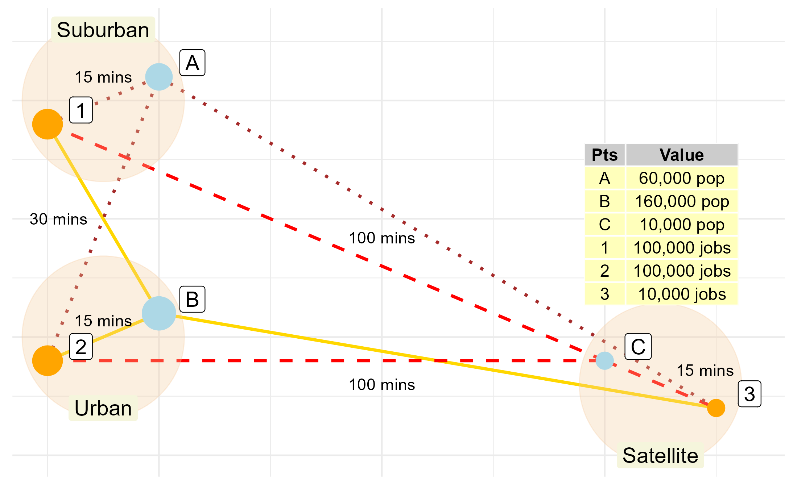

```{r knitr-setup, include=FALSE}
knitr::opts_chunk$set(
  echo = FALSE,
  cache = TRUE,
  warning = FALSE,
  message = FALSE,
  comment = '', 
  out.width = "1\\linewidth")
```

```{r install-data-package, eval = FALSE, include=FALSE}
if (!require("TTS2016R", character.only = TRUE)) {
      remotes::install_github("soukhova/TTS2016R",
                        build_vignettes = TRUE)
  }
```

```{r load-packages, include=FALSE, cache=FALSE}
library(TTS2016R)
library(dplyr)
library(fitdistrplus)
library(ggplot2)
library(kableExtra)
library(patchwork)
library(sf)
library(scales)
library(ggpmisc)
library(ggrepel)
library(cowplot)
library(ggspatial)
library(spdep)
library(RColorBrewer)
library(tmap)
library(shadowtext)
library(grid)
library(huxtable)
options(scipen = 999)
```

```{r sp_avail-function,include=FALSE}
#defining the spatial availability function
sp_avail <- function(x, o_id, d_id, pop, opp, r, f, alpha = 1){

  o_id <- rlang::enquo(o_id)
  d_id <- rlang::enquo(d_id)
  pop <- rlang::enquo(pop)
  opp <- rlang::enquo(opp)
  r <- rlang::enquo(r)
  f <- rlang::enquo(f)

  sum_pop <- x %>%
    dplyr::distinct(!!o_id,
                    .keep_all = TRUE) %>%
    dplyr::mutate(sum_pop = !!r*(!!pop)^alpha) %>%
    dplyr::pull(sum_pop) %>%
    sum()

  f_p <- dplyr::pull(x, !!r) * dplyr::pull(x, !!pop)^alpha / sum_pop

  sum_impedance <- x %>%
    dplyr::group_by(!!d_id) %>%
    dplyr::summarize(sum_impedance = sum(!!f))

  x <- x %>%
    dplyr::left_join(sum_impedance,
                     by = rlang::as_name(d_id))

  f_c <- dplyr::pull(x, !!f) / x$sum_impedance

  x$f_c <- f_c
  x$f_p <- f_p

  sum_pa <- x %>%
    dplyr::group_by(!!d_id) %>%
    dplyr::summarize(sum_pa= sum(f_p * f_c))

  x <- x %>%
    dplyr::left_join(sum_pa,
                     by = rlang::as_name(d_id))
  f_t <- (f_p * f_c) / dplyr::pull(x, sum_pa)

  dplyr::pull(x, !!opp) * f_t
}

#detailed
sp_avail_detailed <- function(x, o_id, d_id, pop, opp, r, f, alpha = 1){
  
  o_id <- rlang::enquo(o_id)
  d_id <- rlang::enquo(d_id)
  pop <- rlang::enquo(pop)
  opp <- rlang::enquo(opp)
  r <- rlang::enquo(r)
  f <- rlang::enquo(f)
  
  sum_pop <- x %>%
    dplyr::distinct(!!o_id,
                    .keep_all = TRUE) %>%
    dplyr::mutate(sum_pop = !!r*(!!pop)^alpha) %>%
    dplyr::pull(sum_pop) %>%
    sum()
  
  f_p <- dplyr::pull(x, !!r) * dplyr::pull(x, !!pop)^alpha / sum_pop
  
  sum_impedance <- x %>%
    dplyr::group_by(!!d_id) %>%
    dplyr::summarize(sum_impedance = sum(!!f))
  
  x <- x %>%
    dplyr::left_join(sum_impedance,
                     by = rlang::as_name(d_id))
  
  f_c <- dplyr::pull(x, !!f) / x$sum_impedance
  
  x$f_c <- f_c
  x$f_p <- f_p
  
  sum_pa <- x %>%
    dplyr::group_by(!!d_id) %>%
    dplyr::summarize(sum_pa= sum(f_p * f_c))
  
  x <- x %>%
    dplyr::left_join(sum_pa,
                     by = rlang::as_name(d_id))
  x$f_t <- (f_p * f_c) / dplyr::pull(x, sum_pa)
  
  x %>%
    dplyr::mutate(V_ij = !!opp * f_t)
}
```

```{r synthetic-data, include=FALSE}
od_tt <- data.frame(i = c("A", "A", "A", "B", "B", "B", "C", "C", "C"), # Three origins
                    j = c("1", "2", "3", "1", "2", "3", "1", "2", "3"), # Three destinations
                    tt = c(15, 30, 100, 30, 15, 100, 100, 100, 15), # Travel time
                    pop = c(50000, 50000, 50000, 150000, 150000, 150000, 10000, 10000, 10000), # Population
                    opp = c(100000, 100000, 10000, 100000, 100000, 10000, 100000, 100000, 10000)) # Jobs

b <- 0.1
```

```{r create-figure-with-toy-example1, include=FALSE}
od <- data.frame(id = c("A", "B", "C", "1", "2", "3"),
                 type = c("Population", "Population", "Population", "Jobs", "Jobs", "Jobs"),
                 size = c(50000, 150000, 10000, 100000, 100000, 10000),
                 x = c(2, 2, 6, 1, 1, 7),
                 y = c(8, 3, 2, 7, 2, 1))

centers <- data.frame(id = c("Urban center", "Suburb", "Satellite town"),
                 size = c(1000000, 1000000, 1000000),
                 x = c(1.5, 1.5, 6.5),
                 y = c(2.5, 7.5, 1.5))

od_lines <- data.frame(i = c("A", "A", "A","A", "A", "A", "B", "B", "B","B", "B", "B", "C", "C", "C","C", "C", "C"), # Three origins
                    j = c("1", "1", "2", "2", "3","3","1", "1", "2", "2", "3","3", "1", "1", "2", "2", "3","3"), # Three destinations
                    x = c(2, 1, 2, 1, 2, 7, 2, 1, 2, 1, 2, 7, 6, 1, 6, 1, 6, 7),
                    y = c(8, 7, 8, 2, 8, 1, 3, 7, 3, 2, 3, 1, 2 , 7, 2, 2, 2, 1),
                    group = c(1, 1, 2, 2, 3, 3, 4, 4, 5, 5, 6, 6, 7, 7, 8, 8, 9, 9))

od_table <- data.frame(Pts = c("A", "B", "C", "1", "2", "3"),
  Value = c("60,000 pop", "160,000 pop", "10,000 pop", "100,000 jobs", "100,000 jobs", "10,000 jobs"))

od_table2 <- data.frame(Path = c("A to 1", "A to 2", "A to 3", 
                                "B to 1", "B to 2", "B to 3", 
                                "C to 1", "C to 2", "C to 3"),
  Value = c("15 mins", "30 mins", "100 mins", "30 mins", "15 mins", "100 mins", "100 mins", "100 mins", "15 mins"))
```

```{r create-figure-with-toy-example2, message=FALSE, include=FALSE, eval=FALSE} 
toy_example_plot <- ggplot() + 
  geom_line(data = od_lines %>% filter(i == "B"), aes(x=x, y=y, group=group), color = "gold", size=1) +
  geom_line(data = od_lines %>% filter(i == "C"), aes(x=x, y=y, group=group), color = "red", size=1, linetype = "dashed") +
  geom_line(data = od_lines %>% filter(i == "A"), aes(x=x, y=y, group=group), color = "brown", size=1, linetype="dotted") +
  geom_point(data = centers, aes(x = x, y = y), color = "#f5cd9f50", size=50)+
  geom_point(data = od,
            aes(size = size,
                x = x, y = y, color = type)) + 
  geom_label(data = od, aes(x+0.3,y+0.3, label=id), size=5) +
  scale_colour_manual(values = c("orange", "light blue") ) +
  scale_size(range = c(5, 10)) + 
  theme_minimal() + 
  guides(size = "none", color = "none") +
   theme(axis.text.x=element_blank(),
         axis.title.x=element_blank(),
         axis.text.y=element_blank(),
         axis.title.y=element_blank())

#adding tables to ggplot
toy_example_plot + 
  annotate(geom = "table",
            x = 7.2, y = 6.6, 
           label = list(od_table),
           fill = c("#FFFFBB"),
           size=4) +
  annotate(geom="text", x=c(1.5, 1.1,4, 1.5,4,6.9), y=c(8,5,4.6, 2.85,1.5,1.8), label = c("15 mins", "30 mins", "100 mins", "15 mins", "100 mins", "15 mins")) + 
  annotate(geom = "label", x=c(1.5,1.5,6.5), y=c(9, 1, 0), label = c("Suburban", "Urban", "Satellite"), size=5, fill="beige", label.size=NA)

ggsave("images/plot-toy-example.png")
```

\newpage

# Introduction

<!-- explain accessibility and how it's used -->

The concept of accessibility in transportation studies derives its appeal from the combination of the spatial distribution of opportunities and the cost of reaching them [@hansen1959; @handy_measuring_1997]. Accessibility analysis is employed in transportation, geography, public health, and many other areas, with the number of applications growing [@shi_literature_2020], especially as mobility-based planning is de-emphasized in favor of access-oriented planning [@deboosere2018; @handy2020; @proffitt2017; @yan2021]. 

<!-- Quickly review the backgroud for the research and identify problem -->

Numerous methods for calculating accessibility have been proposed in the literature [@geurs2004]. Of these, gravity-type accessibility is arguably the most common; since its introduction in the literature by @hansen1959, it has been widely adopted in numerous forms [@cervero_transportation_2002; @paez2004network; @geurs2004; @levinson_accessibility_1998; @Arranz2019measuring]. Gravity-based accessibility indicators are essentially weighted sums of opportunities, with the weights given by an impedance function that depends on the cost of movement, and thus measure the _intensity of the possibility of interaction_ [@hansen1959]. This type of accessibility analysis offers a powerful tool to study the intersection between urban structure and transportation infrastructure [@handy_measuring_1997]. 

<!-- Identify a problem -->

Despite their utility, the interpretability of gravity-type accessibility measures can be challenging [@geurs2004; @miller2018]. Since they aggregate opportunities, the results are sensitive to the size of the region of interest (e.g., a large city has more jobs than a smaller city). As a consequence, raw outputs are not necessarily comparable across study areas [@allen2019]. This limitation becomes evident when surveying studies that implement this type of analysis. For example, @paez_healthcare_2010 (in Montreal) and @campbell_2019_accessibility (in Nairobi) report accessibility as the number of health care facilities that can potentially be reached from origins. But what does it mean for a zone to have accessibility to less than 100 facilities in each of these two cities, with their different populations and number of facilities? For that matter, what does it mean for a zone to have accessibility to more than 700 facilities in Montreal, besides being "accessibility rich"? As another example, @bocarejo_s_transport_2012 (in Bogota), @elgeneidy_cost_2016 (in Montreal), and @jiang_2016_accessibility (in Beijing) report accessibility as the number of jobs by origin, with accessibility values often in the hundreds of thousands, and even exceeding one million jobs for some zones in Beijing and Montreal. As indicators of urban structure, these measures are informative, but the meaning of one million accessible jobs is harder to pin down: how many jobs must any single person have access to? Clearly, the answer to this question depends on how many people demand jobs.

The interpretability of gravity-type accessibility has been discussed in numerous studies, including recently by @hu_2019_measuring, @kelobonye2020measuring, and in greater depth by @merlin2017competition. As hinted above, the limitations in interpretability are caused by ignoring competition - without competition, each opportunity is assumed to be equally available to every single opportunity-seeking individual that can reach it [@shen1998; @paez2019; @kelobonye2020measuring]. This assumption is appropriate when the opportunity of interest is non-exclusive, that is, if use by one unit of population does not preclude use by another. For instance, national parks with abundant space are seldom used to full capacity, so the presence of some population does not exclude use by others. When it comes to exclusive opportunities, or when operations may be affected by congestion, the solution has been to account for competition. Several efforts exist that do so. In our reckoning, the first such approach was proposed by @weibull_axiomatic_1976, whereby the distance decay of the supply of employment and the demand for employment (by workers) were formulated under so-called axiomatic assumptions. This approach was then applied by @joseph1984 in the context of healthcare, to quantify the availability of general practitioners in Canada. Later, @shen1998 independently re-discovered @weibull_axiomatic_1976 formula [see footnote (7) in @shen1998] and deconstructed it to consider accessibility for different modes. These advances were subsequently popularized as the family of two-step floating catchment area (2SFCA) methods [@luo2003] that have found widespread adoption in healthcare, education, and food systems [@yang_comparing_2006; @chen_spatial_2020; @ye_spatial_2018; @chen_enhancing_2019; @chen_evaluating_2020]. 

An important development due to Shen was to show that the population-weighted sum of the accessibility measure with competition equates the number of opportunities available [footnote (7) and Appendix A in @shen1998]. This demonstration gave the impression of a method that allocates all opportunities _exactly_. In this paper we intend to revisit accessibility with competition. We argue that Shen's proof confuses the opportunity-seeking population with total zonal population, an equivocation that results in misleading allocations of opportunities to population that are masked by the presentation of results as rates (i.e., opportunities per capita). We then propose an alternative formulation of accessibility that incorporates competition by adopting a proportional allocation mechanism. The use of balancing factors for proportional allocation is akin to imposing a single constraint on the accessibility indicator, in the spirit of Wilson's [-@wilson1971] spatial interaction model.

In this way, the aim of the paper is three-fold:

- First, we aim to demonstrate that Shen-type (and thus @weibull_axiomatic_1976 accessibility and the popular 2SFCA methods) produce misleading estimates of the opportunities allocated;

- Second, we introduce a new measure, _spatial availability_, which we submit is a more interpretable alternative to Shen-style accessibility, since opportunities in the system are preserved and proportionally allocated to each origin; and

- Third, we show how Shen-type accessibility (and 2SFCA methods) can be seen as measures of singly-constrained accessibility. 

Discussion is supported by the use of a small synthetic example drawn from @shen1998 and empirical data drawn from the 2016 Transportation Tomorrow Survey of the Greater Toronto and Hamilton Area in Ontario, Canada. In the spirit of openness of research in the spatial sciences [@brunsdon2021opening; @paez2021open] this paper has a companion open data product [@arribas2021Open], and all code will be available for replicability and reproducibility purposes.

# Accesssibility measures revisited {#background}

```{r access-calcs-table, include=FALSE}
#table with all the accessibility calculations
od_tt <- od_tt |> mutate(f = exp(-b * tt))

LOS_j <- od_tt |>
  group_by(j) |>
  summarize(opp = mean(opp),
            D_j = sum(pop * f),
            .groups = "drop") |>
  mutate(LOS_j = opp/D_j)

S <- od_tt %>%
  left_join(LOS_j |> 
              dplyr::select(j, LOS_j, opp, D_j),
            by = "j") %>%
  group_by(i) |>
  summarize(S_i = sum(opp.x * f), #first, hansen-type accessibility (unconstrained)
            A_i = sum(LOS_j * f)) #second, shen/2SFCA (singly constrained),

V_ij <- od_tt %>% # then Spatial Availability (singly constrained)
  mutate(r = 1) %>%
  sp_avail_detailed(o_id = i, d_id = j, pop = pop, opp = opp, r = r, f = f, alpha = 1.0) %>% #alpha 1.54 
  group_by(i) %>%
  summarise(V_i = sum(V_ij)) # v_i = V_i/mean(pop) is same as Shen's

# doubly-constrained balancing factor goes here... can't figure it out!
# B_i 

# B2SFCA
# BF_i
```

## Hansen-type accessibility

Accessibility analysis stems from the foundational works of @harris_market_1954 and @hansen1959. From these seminal efforts, many accessibility measures (excluding utility-based measures) have been derived, particularly after the influential work of @wilson1971 on spatial interaction. The model follows the formulation shown in Equation (\ref{eq:conventional-accessibility}):
```{=tex}
\begin{equation}
\label{eq:conventional-accessibility}
S_i = \sum_{j=1}^JO_j \cdot f(c_{ij})
\end{equation}
```
\noindent where:

-   $S$ is Hansen-type accessibility.
-   $i$ is a set of origin locations.
-   $j$ is a set of destination locations.
-   $O_j$ is the number of opportunities at location $j$; $\sum_j O_j$ is the total supply of opportunities in the study region.
-   $c_{ij}$ is a measure of the cost of moving between $i$ and $j$.
-   $f(\cdot)$ is an impedance function of $c_{ij}$; it can take the form of any monotonically decreasing function chosen based on positive or normative criteria [@paez2012measuring].

As formally defined, accessibility $S_i$ is the sum of opportunities that can be reached from location $i$, weighted down by an impedance function of the cost of travel $c_{ij}$. Summing the opportunities in the neighborhood of $i$ provides estimates of the number of opportunities that can _potentially_ be reached from $i$. Several variants of this method result from using a variety of impedance functions; for example, cumulative opportunities measures are obtained when  $f(\cdot)$ is a binary or indicator function [e.g., @elgeneidy_cost_2016; @rosik_forecast_2021; @geurs2004; @qi_decadelong_2018]. Other measures use impedance functions modeled after any monotonically decreasing function [e.g., Gaussian, inverse power, negative exponential, or log-normal, among others, see, *inter alia*, @kwan_spacetime_1998; @vale_influence_2017; @reggiani_accessibility_2011; @li_approach_2020]. In practice, accessibility measures with different impedance functions tend to be highly correlated [@higgins2019; @santanapalacios2022; @kwan_spacetime_1998].

Gravity-based accessibility has been shown to be an excellent indicator of the intersection between urban structure and transportation infrastructure [@shi_literature_2020; @reggiani_accessibility_2011; @kwan_spacetime_1998]. However, beyond enabling comparisons of relative values they are not highly interpretable on their own [@miller2018]. To address the issue or interpretability, previous research has aimed to index and normalize values on a per demand-population basis [e.g., @barboza_balancing_2021; @pereira_distributional_2019; @wang_access_2021]. However, as recent research on accessibility discusses [@merlin2017competition; @allen2019; @paez2019; @kelobonye2020measuring], these steps do not truly adequately consider competition. In effect, when calculating $S_i$, every opportunity enters the weighted sum once for every origin $i$ that can reach it. This makes interpretability opaque, and to complicate matters, can also bias the estimated landscape of opportunity.

## Shen-type competitive accessibility

To account for competition, the influential works of @shen1998 and @weibull_axiomatic_1976, as well as the widely used 2SFCA approach of @luo2003, adjust Hansen-type accessibility with the population in the region of interest. The mechanics of this approach consist of calculating, for every destination $j$, the population that can reach it given the impedance function $f(\cdot)$, i.e., $R_j$ in Equation (\ref{eq:2SFCA-step1}). @shen1998 calls this "the opportunity-seeking population". The opportunities at $j$ are then divided by their corresponding opportunity-seeking population to obtain a measure of opportunities per capita. These values are then allocated back to the population at $i$, again subject to the friction represented by the impedance function. Equation (\ref{eq:2SFCA-step1}) corresponds to the first step of this procedure, and Equation (\ref{eq:2SFCA-step2}) to the second.

```{=tex}
\begin{equation}
\label{eq:2SFCA-step1}
R_{j} = \frac{O_{j}}{\sum_i P_{i} \cdot f(c_{ij})}\\
\end{equation}
```

```{=tex}
\begin{equation}
\label{eq:2SFCA-step2}
A_{i} = {\sum_j R_{j} \cdot f(c_{ij})}\\
\end{equation}
```

\noindent where:

-   $A$ is Shen-type accessibility.
-   $i$ is a set of origin locations.
-   $j$ is a set of destination locations.
-   $O_j$ is the number of opportunities at location $j$;
-   $P_i$ is the population at location $i$; $\sum_j R_j$ is the total supply of opportunities in the study region.
-   $R_j$ is the provider-to-population (PPR) ratio at location $j$;
-   $c_{ij}$ is a measure of the cost of moving between $i$ and $j$;
-   $f(\cdot)$ is an impedance function of $c_{ij}$.

As noted above, @shen1998 furnished a demonstration that the resulting values $A_i$, when multiplied by the population at that origin and summed for the full study region, equates the total number of opportunities in the full study region. But is this really the case?

## Example 

To motivate the discussion, we begin with the example in @shen1998 (Figure \ref{fig:plot-toy-example}).

```{r, create-figure-with-toy-example3, fig.cap="\\label{fig:plot-toy-example} Shen (1998) synthetic example with locations of employment centers (in orange), population centers (in blue), number of jobs and population, and travel times.", fig.show='hold', fig.align='center'}

```

```{r toy-example-table-creation, include=FALSE}
od_tt1 <- merge(od_tt, S, by="i", all.x=TRUE) %>%
  transmute(i, 
         pop, 
         j, 
         opp, 
         tt, 
         f, 
         pop_f = pop * f, 
         jobs_f = opp * f,
         S_i, 
         A_i)
#  dplyr::select(-c(f))%>% 
#  mutate(S_i = round(S_i, digits =2),
#         A_i = round(A_i, digits = 2)#,
         #manually adding B2SFCA as I manually calculated it.. it's the same as S_I though!!
         #BFCA = c(1.173,1.173,1.173, 0.810,0.810,0.810,0.996,0.996,0.996)
#         )
colnames(od_tt1) = c("Origin", "Pop.", "Dest.", "Jobs", "TT", "f(TT)", "Pop * f(TT)", "Jobs * f(TT)", "S_i", "A_i") #, "BFCA_i")

od_tt1 <- od_tt1 %>% as_hux(scientific=FALSE)
```

```{r toy-example-table}
table_toy  <- od_tt1 %>%
  set_bold(1, everywhere) %>%
  set_bottom_border(c(1,4,7), everywhere) %>%
  set_align(everywhere, c(1, 3), 'right') %>%
  set_align(everywhere, c(2, 4:10), 'center') %>%
  set_number_format(everywhere, 2, fmt_pretty()) %>%
  set_number_format(everywhere, 4, fmt_pretty()) %>%
  set_number_format(everywhere, 6, 6) %>%
  set_number_format(everywhere, 7:10, fmt_pretty(digits = 3, format = "f")) %>%
  merge_cells(2:4, 1) %>% merge_cells(5:7, 1) %>% merge_cells(8:10, 1) %>%
  merge_cells(2:4, 2) %>% merge_cells(5:7, 2) %>% merge_cells(8:10, 2) %>%
  merge_cells(2:4, 9) %>% merge_cells(5:7, 9) %>% merge_cells(8:10, 9) %>% 
  merge_cells(2:4, 10) %>% merge_cells(5:7, 10) %>% merge_cells(8:10, 10) %>% 
  set_width(1.2) %>%
  set_height(4) %>%
  set_right_border(everywhere, 1:9, brdr(1, "solid", "grey")) %>%
  set_caption("Summary description of synthetic example: Hansen-type accessibility and Shen-type accessibility with competition") %>%
  set_label("tab:synthetic-example")

font_size(table_toy) <- 7

table_toy[1:10,]
```

Table \ref{tab:synthetic-example} contains the information needed to calculate $S_i$ and $A_i$ in the example. In the table we see that population centers $A$ and $B$ have equal Hansen-type accessibility ($S_A = S_B=$ 27,292 jobs), despite $A$ having a much smaller population. On the other hand, the isolated satellite town of $C$ has low accessibility ($S_C=$ 2,240 jobs). This value is not very sensible: given its isolated position in the system and balanced jobs-population ratio, we would expect it to have better accessibility than $B$, with its large population and distance to jobs. It is difficult from these outputs to determine whether the accessibility at $B$ is better or worse than that at $A$ or $C$.

The results are much easier to interpret when we consider Shen-type accessibility. The results indicate that $A_A \approx$ 1.337 jobs per capita, $A_B \approx$ 0.888, and $A_C\approx$ 0.996. The latter value is sensible given the job-population balance of $C$. Center $A$ is relatively close to a large number of jobs (more jobs than the population of $A$). The opposite is true of $B$. According to @shen1998, the sum of the population-weighted accessibility $A_i$ is exactly equal to the number of jobs in the region:
$$
\begin{array}{l}
50,000\times 1.3366693 \\
+ 150,000 \times 0.8880224 \\
+ 10,000 \times 0.9963171 = 210,000
\end{array}
$$

As mentioned in the Introduction, this property gives the impression that jobs are allocated in their totality. However, for this property to work, the accessibility needs to be multiplied by the total population of the corresponding center. Alas, there is a logical inconsistency in this calculation, since the travel behavior, encoded in the form of the impedance function, means that the opportunity-seeking population is _not_ equal to the total population. In other words, the total population is confounded with the _opportunity-seeking population_. As seen in column __Pop * f(TT)__ in Table \ref{tab:synthetic-example}, the number of individuals from Center $A$ that are _willing to reach_ employment centers 1, 2, and 3 are 11,156, 2,489, and 2.27 respectively. Therefore, the total number of opportunity-seeking individuals is 13,647.27, which is considerably lower than the total population of $A$.

To ensure that the calculations are consistent with the travel behavior given by the impedance function, the number of accessible jobs per capita should be multiplied by the population who are willing to travel to the employment center; hence, instead of the nominal number of jobs in the region, the number of jobs the method actually allocates is:
$$
\begin{array}{l}
(11,156.51 + 2,489.35 + 2.26)\times 1.3366693 \\
+ (7,468.06 + 33,469.52 + 6.81)\times 0.8880224\\
+ (4.54 + 4.54 + 2,231.20)\times 0.9963171 \approx 56,834.59
\end{array}
$$

\noindent which is just a proportion of the total number of jobs in the region. Use of the total population of zones when calculating the population-weighted sum of $A_i$ gives the impression that all jobs are allocated - however the result is inconsistent with the travel behavior embedded in the model. When the correct opportunity-seeking population is used (that is, the population weighted by the impedance), it becomes apparent that the number of jobs allocated is not equal to the total number of jobs in the region. This feature of the method is masked because the results are given in terms of opportunities per capita. In effect the method says that the jobs per capita at $A$ are approximately 1.34 for each of 13,647.27 opportunity-seeking individuals, but zero for 36,352.73 individuals that do not reach any employment center.

These results are somewhat suspicious, because they indicate seldom-seen levels of unemployment and job vacancies, despite the seemingly-reasonable values of $A_i$. In the next section we propose an alternative derivation of competitive accessibility that resolves the apparent inconsistency described in this section.

# Introducing spatial availability: a singly-constrained accessibility measure

In brief, we define the _spatial availability_ at $i$ ($V_{i}$) as the proportion of all opportunities $O$ that are allocated to $i$ from all destinations $j$. The fundamental difference with Hansen- and Shen-type accessibility is that opportunities are allocated proportionally. We begin by explaining the intuition behind the method before defining it more formally.

## Proportional allocation by population

According to the gravity modelling framework, the potential for interaction depends on the mass (i.e., the population) and the friction of distance (i.e., the impedance function). We begin describing the proposed proportional allocation mechanism based on demand by population. The total population in the example is 210,000. The proportion of the population by population center is:
$$
\begin{array}{l}
F^p_A = \frac{50,000}{210,000}\\
F^p_B = \frac{150,000}{210,000}\\
F^p_C = \frac{10,000}{210,000}\\
\end{array}
$$
Jobs are allocated proportionally from each employment center to each population center depending on their population sizes as per the balancing factors $F^p_i$). In this way, employment center 1 allocates $100,000\cdot \frac{50,000}{210,000}= 23,809.52$ jobs to $A$; $100,000\cdot \frac{150,000}{210,000}= 71,428.57$ jobs to $B$; and $100,000\cdot \frac{10,000}{210,000}= 7,142.857$ jobs to $C$. Notice how this mechanism ensures that the total number of jobs at employment center 1 is preserved at 100,000.

We can verify that the number of jobs allocated is consistent with the total number of jobs in the region:
$$
\begin{array}{l}
\text{Employment center 1: }\\
100,000 \cdot \frac{50,000}{210,000} + 100,000 \cdot \frac{150,000}{210,000} + 100,000 \cdot \frac{10,000}{210,000} = 100,000\\
\text{Employment center 2: }\\
100,000 \cdot \frac{50,000}{210,000} + 100,000 \cdot \frac{150,000}{210,000} + 100,000 \cdot \frac{10,000}{210,000} = 100,000\\
\text{Employment center 3: }\\
10,000 \cdot \frac{50,000}{210,000} + 10,000 \cdot \frac{150,000}{210,000} + 10,000 \cdot \frac{10,000}{210,000} = 10,000\\
\end{array}
$$

In the general case where there are $N$ population centers and $J$ employment centers in the region, we define the following population-based balancing factors:
```{=tex}
\begin{equation}
\label{eq:pop-alloc-factor}
F^p_{i} = \frac{P_{i}^\alpha}{\sum_{i=1}^N P_{i}^\alpha}
\end{equation}
```

Balancing factor $F^p_{i}$ corresponds to the proportion of the population in origin $i$ relative to the population in the region. On the right hand side of the equation, the numerator $P_{i}^\alpha$ is the population at origin $i$. The summation in the denominator is over $i=1,\cdots,N$, and adds up to the total population of the region. Notice that we incorporate an empirical parameter $\alpha$. The role of $\alpha$ is to modulate the effect of demand by population. When $\alpha <1$, opportunities are allocated more rapidly to smaller centers relative to larger ones; in contrast, $\alpha>1$ achieves the opposite effect.

Balancing factor $F^p_{i}$ can now be used to proportionally allocate a share of available jobs at $j$ to origin $i$. The number of jobs available to $i$ from $j$ _according to population shares_ is defined as follows:
$$
V^p_{ij} = O_j\frac{F^p_{i}}{\sum_{i=1}^K F^p_{i}}
$$

The total number of jobs available from all destinations is simply the sum of $V^p_{ij}$ over $j=1,\cdots, J$:
$$
V^p_{i} = \sum_{j=1}^J O_j\frac{F^p_{i}}{\sum_{i=1}^K F^p_{i}}
$$

Since factor $F^p_{i}$ summed over $i=1,\cdots,N$ always equals to 1 (i.e., $\sum_{i=1}^{N} F^p_{i} = 1$), the sum of all spatially available jobs equals $O$, the total number of opportunities in the region:
$$
\begin{array}{l}
\sum_{i=1}^N V^p_i =\sum_{i=1}^N\sum_{j=1}^JO_j\frac{F^p_{i}}{\sum_{i=1}^N F^p_{i}}\\
=\sum_{i=1}^N \frac{F^p_{i}}{\sum_{i=1}^N F^p_{i}}\cdot\sum_{j=1}^JO_j\\
=\sum_{j=1}^J O_j = O
\end{array}
$$
Factors $F^p_{i}$ act here as the balancing factors of the gravity model when a single constraint is imposed [i.e., to ensure the sums of columns are equal to the number of opportunities per destination, see @ortuzar_2011_modelling, pp. 179-180 and 183-184]. As a result, the sum of spatial availability for all population centers equals the total number of opportunities.

The above concerns the mass (i.e., population size) of the gravity model. In addition, the potential for interaction is thought to decrease with increasing cost, so next we define similar balancing factors but based on the impedance.

## Proportional allocation by cost

Clearly, using only balancing factors $F^p_{i}$ to calculate spatial availability $V^p_i$ does not account for the cost of reaching employment centers. Consider instead a set of balancing factors $F^c_{ij}$ that account for the friction of distance:
$$
\begin{array}{l}
F^c_{A1} = \frac{0.223130}{0.223130 + 0.049787 + 0.000045} = 0.8174398\\
F^c_{B1} = \frac{0.049787}{0.223130 + 0.049787 + 0.000045} = 0.1823954\\
F^c_{C1} = \frac{0.000045}{0.223130 + 0.049787 + 0.000045} = 0.0001648581\\
\end{array}
$$

Balancing factors $F^c_{ij}$ use the impedance function to proportionally allocate more jobs to closer population centers, that is, those with populations _more willing to reach the jobs_. Indeed, the factors $F^c_{ij}$ can be thought of as the proportion of the population at $i$ willing to travel to destination $j$ conditional on the travel behavior embodied by the impedance function.

In our example, the number of jobs allocated from employment center 1 to population center $A$ is $100,000\times 0.8174398 = 81743.98$; to population center $B$ is $100,000\times 0.1823954 = 18,239.54$; and to population center $C$ is $100,000\times 0.0001648581 = 16.48581$. We can see once more that the total number of jobs at the employment center is preserved at 100,000. In this example, the proportional allocation mechanism assigns the largest share of jobs to population center $A$, which is the closest to employment center 1, and the smallest to the more distant population center $C$.

In the general case when there are $N$ population centers and $J$ employment centers in the region, we define the following cost-based balancing factors:
```{=tex}
\begin{equation}
\label{eq:tcost-alloc-factor}
F^c_{ij} = \frac{f(c_{ij})}{\sum_{i=1}^N f(c_{ij})}\\
\end{equation}
```

The total number of jobs available to $i$ from $j$ according to cost is defined as follows:
$$
V^c_{ij} = O_j\frac{F^c_{i}}{\sum_{i=1}^N F^c_{i}}
$$

The total number of jobs available to $i$ from all destinations is:
$$
V^c_{i} = \sum_{j=1}^J O_j\frac{F^c_{i}}{\sum_{i=1}^N F^c_{i}}
$$

Like the population-based allocation factors, $F^c_{i}$ summed over $i=1,\cdots,N$ always equals to 1 (i.e., $\sum_{i=1}^{N} F^c_{i} = 1$). As before, the sum of all spatially available jobs equals $O$, the total number of opportunities in the region:
$$
\begin{array}{l}
\sum_{i=1}^N V^c_i =\sum_{i=1}^N\sum_{j=1}^JO_j\frac{F^c_{i}}{\sum_{i=1}^N F^c_{i}}\\
=\sum_{i=1}^N \frac{F^c_{i}}{\sum_{i=1}^N F^c_{i}}\cdot\sum_{j=1}^JO_j\\
=\sum_{j=1}^J O_j = O
\end{array}
$$

We are now ready to more formally define spatial availability with due consideration to both mass and cost effects.

## Putting spatial availability together

Population and the cost of travel are both part of the gravity modelling framework. Since the balancing factors defined in the preceding sections are proportions (alternatively probabilities), they can be combined multiplicatively to obtain their joint effect (alternatively, the joint probability of allocating opportunities):
opportunities at a destination and demand for opportunities at the origin.
```{=tex}
\begin{equation}
\label{eq:balancing-factors}
F^t_i = \frac{F^p_{i} \cdot F^c_{ij}}{\sum_{i=1}^N F^p_{i} \cdot F^c_{ij}}
\end{equation}
```

This idea is represented in Equation (\ref{eq:spatial-availability}), where $F^p_{i}$ is a population-based allocation factor that grants a larger share of the existing opportunities to larger centers, and $F^c_{ij}$ is a transportation cost-based allocation factor that grants a larger share of the existing opportunities to closer centers. This is in line with the tradition of gravity modeling, and proposed framework distinguishes between opportunities at a destination and demand for opportunities at the origin.
```{=tex}
\begin{equation}
\label{eq:spatial-availability}
V_{i} = \sum_{j=1}^J O_j\frac{F^t_{i}}{\sum_{i=1}^N F^t_{i}}
\end{equation}
```

The terms in Equation \ref{eq:spatial-availability} are as follows:

-   $V_{i}$ is the spatial availability at $i$.
-   $i$ is a set of origin locations in the region $i = 1,\cdots, N$.
-   $j$ is a set of destination locations in the region $j = 1,\cdots,J$.
-   $O_j$ is the number of opportunities at location $j$.
-   $F^t_{i}$ is a balancing factor as defined in Equation (\ref{eq:balancing-factors}).

Notice that, unlike $S_i$ in Equation (\ref{eq:conventional-accessibility}), the population enters the calculation of $V_{i}$. Returning to the example in Figure \ref{fig:plot-toy-example}, Table \ref{tab:synthetic-example-part-two} contains the information needed to calculate $V_i$.
```{r toy-example-part-two-table-creation, include=FALSE}
od_tt2 <- od_tt %>%
  mutate(catch = 1) %>%
  sp_avail_detailed(o_id = i,
                    d_id = j, 
                    pop = pop,
                    opp = opp,
                    r = catch,
                    f = f, 
                    alpha = 1) %>%
  transmute(i, 
         pop, 
         j, 
         opp, 
         tt, 
         f, 
         F_p = f_p, 
         F_c = f_c, 
         F_t = f_t,
         V_ij)

V_i <- od_tt2 %>%
  group_by(i) %>%
  summarize(V_i = sum(V_ij))

od_tt2 <- od_tt2 %>%
  left_join(V_i,
            by = "i")

colnames(od_tt2) = c("Origin", "Pop.", "Dest.", "Jobs", "TT", "f(TT)", "F^p", "F^c", "F", "V_ij", "V_i")

od_tt2 <- od_tt2 %>% 
  as_hux(scientific=FALSE)
```

```{r toy-example-part-two-table}
table_toy_2  <- od_tt2 %>%
  set_bold(1, everywhere) %>%
  set_bottom_border(c(1,4,7), everywhere) %>%
  set_align(everywhere, c(1, 3), 'right') %>%
  set_align(everywhere, c(2, 4:10), 'center') %>%
  set_number_format(everywhere, 2, fmt_pretty()) %>%
  set_number_format(everywhere, 4, fmt_pretty()) %>%
  set_number_format(everywhere, 6:9, 6) %>%
  set_number_format(everywhere, 10:11, fmt_pretty(digits = 2, format = "f")) %>%
  merge_cells(2:4, 1) %>% merge_cells(5:7, 1) %>% merge_cells(8:10, 1) %>%
  merge_cells(2:4, 2) %>% merge_cells(5:7, 2) %>% merge_cells(8:10, 2) %>%
  merge_cells(2:4, 11) %>% merge_cells(5:7, 11) %>% merge_cells(8:10, 11) %>% 
  set_width(1.2) %>%
  set_height(4) %>%
  set_right_border(everywhere, 1:10, brdr(1, "solid", "grey")) %>%
  set_caption("Summary description of synthetic example: spatial availability") %>%
  set_label("tab:synthetic-example-part-two")

font_size(table_toy_2) <- 7

table_toy_2[1:10,]
```

In the table, column __V_ij__ are the jobs available to each origin from each employment center. In this column $V_{A1}=$ 59,901 is the number of jobs available at $A$ from employment center 1. Column V_i (i.e., $\sum_{j=1}^JV_ij$) is the total number of jobs available to origin $i$. We can verify that the total number of jobs available is consistent with the total number of jobs in the region (with some small rounding error):
$$
\sum_{i=1}^N V_i = 66,833 + 133,203 + 9,963 \approx 210,000 
$$

Compare the calculated values of $V_i$ to column __S_i__ (Hansen-type accessibility) in Table \ref{tab:synthetic-example}. The spatial availability values are more intuitive. Recall that population centers $A$ and $B$ had equal accessibility to employment opportunities. According to $V_i$, population center $A$ has greater job availability due to its close proximity to employment center 1 combined with less steep competition (i.e., a majority of the population have to travel longer distances to reach employment center 1). Job availability is lower for population center $B$ due to much higher competition (150,000 people can reach 100,000 jobs at equal cost). And center $C$ has almost as many jobs available as its population. 

As discussed above, Hansen-type accessibility is not designed to preserve the number of jobs in the region. Shen-type accessibility is internally inconsistent: the only way it preserves the number of jobs is if the effect of the impedance function is ignored when expanding the values of jobs per capita to obtain the total number of opportunities. The proportional allocation procedure described above, in contrast, consistently returns a number of jobs available that matches the total number of jobs in the region. 

Now we proceed to define a measure of spatial availability per capita:
```{=tex}
\begin{equation}
\label{eq:SA-per-capita}
v_i = \frac{V_i}{P_i}
\end{equation}
```

To complete the illustrative example, the spatial availability of jobs per capita is calculated in Equation (\ref{eq:SA-per-capita-2populations}).
```{r SA-6, eval=TRUE, include=FALSE}
V_i$V_i[1]/50000
V_i$V_i[2]/150000
V_i$V_i[3]/10000
```

```{=tex}
\begin{equation}
\label{eq:SA-per-capita-2populations}
\begin{array}{l}
v_{1} = \frac{V_1}{P_1} =  \frac{66,833.47}{50,000} = 1.337\\
v_{2} =  \frac{V_{2}}{P_2} =  \frac{133,203.4}{150,000} = 0.888\\
v_{3} =  \frac{V_{3}}{P_3} =  \frac{9,963.171}{10,000} = 0.996\\
\end{array}
\end{equation}
```

Remarkably, the spatial availability per capita matches the values of $A_i$ in Table \ref{tab:synthetic-example}. Appendix A has a proof of the mathematical equivalence between the two measures. It is interesting to note that @weibull_axiomatic_1976, @shen1998, and this paper reach to identical expressions starting from different starting points, an effect known as _equifinality_ [see @ortuzar_2011_modelling, p. 333; @williams_hall_1981], In effect, Shen-type accessibility and 2SFCA can be conceptualized as singly-constrained accessibility measures.

## Why does proportional allocation matter?

Having shown that Shen-type and spatial availability produce equifinal results, it is reasonable to wonder whether the distinction is of any import.

Conceptually, we would argue that the internal inconsistency in the calculation of total opportunities in @shen1998 points at a more serious problem that is only evident when we consider the internal values of the method. To illustrate, Table \ref{tab:synthetic-example} shows results of $A_i$ that are reasonable (in fact, they match the spatial availability per capita). But when we dig deeper, these results mask potentially misleading values of jobs allocated and taken. In addition, the internal values also lead to estimates of the impact of accessibility that are deceptive. For example, the estimated system-wide cost of travel considering the jobs allocated by $A_i$ in Table \ref{tab:synthetic-example} is as follows:
$$
\begin{array}{l}
11,157\times 15 \text{ min} + 2,489\times 30 \text{ min} + 2.27\times 100 \text{ min}\\
7,468\times 30 \text{ min} + 33,470\times 15 \text{ min} + 6.81\times 100 \text{ min}\\
0.454\times 100 \text{ min} + 0.454\times 100 \text{ min} + 2,231\times 15 \text{ min} = 1,002,581\text{ min}
\end{array}
$$

In contrast, the estimated system-wide cost of travel according to $V_i$ in Table \ref{tab:synthetic-example-part-two} is as follows:
$$
\begin{array}{l}
59,901\times 15 \text{ min} + 6,923\times 30 \text{ min} + 10\times 100 \text{ min}\\
40,097\times 30 \text{ min} + 93,076\times 15 \text{ min} + 30\times 100 \text{ min}\\
2.4\times 100 \text{ min} + 1.3\times 100 \text{ min} + 9,959\times 15 \text{ min} = 3,859,054\text{ min}
\end{array}
$$

Therefore, not only does the Shen-type measure effectively allocate fewer than 56,835 out of a total of 210,000 jobs in the region, it also grossly underestimates the potential cost of travel in the system by obscuring the number of jobs not allocated.

# Empirical example of Toronto

In this section we use population and employment data from the Golden Horseshoe Area (GGH) in Ontario, Canada. This is the largest metropolitan region in Canada and includes the cities of Toronto and Hamilton. We calculate gravity accessibility, XXX, and the proposed spatial availability for Toronto after introducing the data used and calibrating an impedance function. 

## Data

Population and employment data are drawn from the 2016 Transportation Tomorrow Survey (TTS). This survey collects representative urban travel information from 20 municipalities contained within the GGH area in the southern part of Ontario, Canada (see Figure \ref{fig:TTS-16-survey-area}) [@data_management_group_tts_2018]. The data set includes Traffic Analysis Zones (TAZ) (n=`r round(length(TTS2016R::ggh_taz$GTA06), 3) %>% prettyNum(big.mark = ",")`), the number of jobs (n=`r round(sum(TTS2016R::ggh_taz$jobs), 3) %>% prettyNum(big.mark = ",")`) and workers (n=`r round(sum(TTS2016R::ggh_taz$workers), 3) %>% prettyNum(big.mark = ",")`) at each origin and destination. The TTS data is based on a representative sample of between 3% to 5% of households in the GGH and is weighted to reflect the population covering the study area has a whole [@data_management_group_tts_2018]. 

To generate the travel cost for these trips, travel times between origins and destinations are calculated for car travel using the R package {r5r} [@r5r_2021] with a street network retrieved from OpenStreetMap for the GGH area. A the 3 hr travel time threshold was selected as it captures 99% of population-employment pairs (see the travel times summarized in Figure \ref{fig:TTS-16-survey-area}). This method does not account for traffic congestion or modal split, which can be estimated through other means [e.g., @allen_suburbanization_2021; @higgins2021changes]. For simplicity, we carry on with the assumption that all trips are taken by car in uncongested travel conditions.

All data and data preparation steps are documented and can be freely explored in the companion open data product [{TTS2016R}](https://soukhova.github.io/TTS2016R/).

```{r, echo=FALSE, message=FALSE, warning=FALSE}
# grouping the planning boundaries/municipalities so they make up the 20 regions in the TTS 2016. Note: st_buffer is used as there are small existing gaps between some boundaries. st_buffer of 10 m is enough to widen all boundaries and complete the st_union without issue.
group_ggh_pd_poly <- TTS2016R::ggh_pd %>% st_buffer(10) %>% group_by(REGION) %>% 
  summarize(REGION_name = first(REGION_name),
            geometry = st_union((geometry)))

# creating an object of centroids for each region - this will be used to label polygons on the map
group_ggh_pd <- sf::st_centroid(group_ggh_pd_poly) 
points <- sf::st_coordinates(group_ggh_pd) %>% data.frame() 
group_ggh_pd <- cbind(group_ggh_pd, points)

## manually readjusting the X and Y coordinate of "County of Peterborough" and "Brant" as they overlap some cities
group_ggh_pd[group_ggh_pd$REGION_name=="Brant", "X"] <- 544000.0
group_ggh_pd[group_ggh_pd$REGION_name=="Brant", "Y"] <- 4767466

group_ggh_pd[group_ggh_pd$REGION_name=="Peterborough County", "Y"] <- 4921000
```
```{r, echo=FALSE, message=FALSE, warning=FALSE, include = FALSE}
#plot 
TTS_area_plot <- ggplot() +
  geom_sf(data = TTS2016R::ggh_pd, color = "darkgray",
          aes(fill = REGION_name)) +
  scale_fill_manual(values = viridis::viridis(20)) +
  geom_sf(data = group_ggh_pd_poly, 
          color = "black", fill = NA, size = 0.7) +
  annotation_north_arrow(location = "tl", # north arrow for both the main plot
                         height = unit(0.8, "cm"), 
                         width = unit(0.8, "cm"),
                         style = north_arrow_orienteering(line_width = 0.25,
                                                          line_col = "dimgrey", 
                                                          fill = c("white","dimgrey"))) +
  annotation_scale(bar_cols = c("dimgrey", "white"), # scale bar for both the main plot
                   height = unit(0.15, "cm")) + 
  geom_shadowtext(data = group_ggh_pd,
                  aes(x = X, y = Y, label = REGION_name),
                  size = 3.5,
                  nudge_y = 3000,
                  nudge_x = 2000) +
  theme_void() +
  theme(legend.position = "none",
        axis.title = element_blank()) 

# ggsave("images/TTS16-survey-area.png")
```
```{r creating-desc-stats-table}
#forming a complete descriptive statistic table

Statistics <- data.frame("Statistic" = c("Min.", "1st Qu.", "Median", "Mean", "3rd Qu.", "Max.", "NA's"))

Trips <- data.frame("Trips" = c(summary(od_ft_tt$trips)[[1]] %>% round(), 
                                   summary(od_ft_tt$trips)[[2]] %>% round(),  
                                   summary(od_ft_tt$trips)[[3]] %>% round(), 
                                   summary(od_ft_tt$trips)[[4]] %>% round(), 
                                   summary(od_ft_tt$trips)[[5]] %>% round(),
                                   summary(od_ft_tt$trips)[[6]]%>% round(),
                                   NA))

Travel_time <- data.frame("TT" = c(summary(od_ft_tt$travel_time)[[1]] %>% round(), 
                                               summary(od_ft_tt$travel_time)[[2]] %>% round(),  
                                               summary(od_ft_tt$travel_time)[[3]] %>% round(), 
                                               summary(od_ft_tt$travel_time)[[4]] %>% round(), 
                                               summary(od_ft_tt$travel_time)[[5]] %>% round(), 
                                               summary(od_ft_tt$travel_time)[[6]] %>% round(),  
                                               3507)) 

# TAZ_Area <- data.frame("TAZ_Area" = c(summary(ggh_taz$AREA)[[1]] %>% round(1), 
#                                       summary(ggh_taz$AREA)[[2]] %>% round(1), 
#                                       summary(ggh_taz$AREA)[[3]] %>% round(1), 
#                                       summary(ggh_taz$AREA)[[4]] %>% round(1), 
#                                       summary(ggh_taz$AREA)[[5]] %>% round(1), 
#                                       summary(ggh_taz$AREA)[[6]] %>% round(1), 
#                                       NA))

Workers <- data.frame("Workers" = c(summary(ggh_taz$workers)[[1]] %>% round(), 
                                    summary(ggh_taz$workers)[[2]] %>% round(), 
                                    summary(ggh_taz$workers)[[3]] %>% round(), 
                                    summary(ggh_taz$workers)[[4]] %>% round(), 
                                    summary(ggh_taz$workers)[[5]] %>% round(), 
                                    summary(ggh_taz$workers)[[6]] %>% round(), 
                                    NA))

Jobs <- data.frame("Jobs" = c(summary(ggh_taz$jobs)[[1]] %>% round(), 
                              summary(ggh_taz$jobs)[[2]] %>% round(), 
                              summary(ggh_taz$jobs)[[3]] %>% round(), 
                              summary(ggh_taz$jobs)[[4]] %>% round(), 
                              summary(ggh_taz$jobs)[[5]] %>% round(), 
                              summary(ggh_taz$jobs)[[6]] %>% round(), 
                              NA)) 

desc_stats <- cbind(Statistics, Trips, Travel_time, Workers, Jobs)
```

```{r, TTS-16-survey-area, echo=FALSE, fig.cap="\\label{fig:TTS-16-survey-area}TTS 2016 study area (GGH, Ontario, Canada) along with the descriptive statistics of the trips, calculated origin-destination car travel time (TT), workers per TAZ, and jobs per TAZ. Contains 20 regions (black boundaries) and sub-regions (dark gray boundaries).", out.width="80%", fig.show='hold', fig.align='center'}
TTS_area_plot <- TTS_area_plot + annotate(geom = "table",
            x = 915000, y = 4880000, 
           label = list(desc_stats))
ggsave("images/TTS16-survey-area.png")
knitr::include_graphics("images/TTS16-survey-area.png")

png()
```

## Calibration of an impedance function

In the synthetic example introduced in a preceding section, a negative exponential function with an arbitrary parameter was used. For the empirical example, we calibrate an impedance function on the trip length distribution (TLD) of commute trips. Briefly, a TLD represents the proportion of trips that are taken at a specific travel cost (e.g., travel time); this distribution is commonly used to derive impedance functions in accessibility research [@horbachov_theoretical_2018; @batista_estimation_2019].

The empirical and theoretical TLD for this data set are represented in the top-left panel of Figure \ref{fig:TLD-Gamma-plot}. Maximum likelihood estimation and the Nelder-Mead method for direct optimization available within the {fitdistrplus} package [@fitdistrplus_2015] were used. Based on goodness-of-fit criteria and diagnostics seen in Figure \ref{fig:TLD-Gamma-plot}, the gamma distribution was selected (also see Figure \ref{fig:plot-cullen-frey} in Appendix XX).

<!--NOTE: maybe fit the impedance function for only toronto trips? not full GGH-->

```{r data-for-impedance}
# remove all NA trips from dataset and set all 0min travel times to 0.1 min
od_ft_tt  <- od_ft_tt %>% 
  filter( !is.na(travel_time)) %>% 
  mutate(travel_time = ifelse(travel_time == 0, 0.1, travel_time))
all_tt <- od_ft_tt  %>% 
  dplyr::select(trips, travel_time)

sum((od_ft_tt$trips))

all_tt <- all_tt[rep(seq_len(dim(all_tt)[1]), all_tt$trips), 2]
```

```{r fitting-impedance-function}
# using fitdist function to fit a distribution using the default maximum likelihood estimation method and Nelder-Mead method for direct optimization


gamma_ <- fitdistrplus::fitdist(data=all_tt, "gamma", method="mle", optim.method="Nelder-Mead") 


#lnorm_ <- fitdistrplus::fitdist(data=all_tt, "lnorm", method="mle", optim.method="Nelder-Mead")
#norm_ <-fitdistrplus::fitdist(data=all_tt, "norm", method="mle", optim.method="Nelder-Mead")
# #exp_ <- fitdistrplus::fitdist(data=all_tt, "exp", method="mle", optim.method="Nelder-Mead")
# pois_ <- fitdistrplus::fitdist(data=all_tt, "pois", method="mle", optim.method="Nelder-Mead") 
# nbinom_ <- fitdistrplus::fitdist(data=all_tt, "nbinom", method="mle", optim.method="Nelder-Mead")
# geom_ <- fitdistrplus::fitdist(data=all_tt, "geom", method="mle", optim.method="Nelder-Mead")
# beta_ <- fitdistrplus::fitdist(data=all_tt, "beta", method="mle", optim.method="Nelder-Mead")
# logis_ <- fitdistrplus::fitdist(data=all_tt, "logis", method="mle", optim.method="Nelder-Mead")
# plot(gamma_)
# plot(pois_)
# plot(nbinom_)
# plot(geom_)
# plot(beta_)
# plot(logis_)
```

```{r save-impedance-plot, include=FALSE}
# For some reason plot(gamma_) does not play well with knitr, so instead we save the figure and then include it as a graphic in the following chunk
png("images/impedance_function.png")
plot(gamma_)
dev.off()
```

```{r TLD-Gamma-plot, fig.cap="\\label{fig:TLD-Gamma-plot}Car trip length distribution and calibrated gamma distribution impedance function (red line) with associated Q-Q and P-P plots. Based on TTS 2016.", fig.show='hold', fig.align='center', out.width="80%"}
knitr::include_graphics("images/impedance_function.png")
```


The gamma distribution takes the following general form where the estimated 'shape' is $\alpha=$ `r round(gamma_$estimate[1], 3)`, the estimated 'rate' is $\beta =$ `r round(gamma_$estimate[2], 3)`, and $\Gamma(\alpha)$ is defined in Equation (\ref{gamma-dist}).

```{=tex}
\begin{equation}
\label{gamma-dist}
\begin{array}{l} 
f(x, \alpha, \beta) = \frac {x^{\alpha-1}e^{-\frac{x}{\beta}}}{ \beta^{\alpha}\Gamma(\alpha)} \quad \text{for } 0 \leq x \leq \infty\\

\Gamma(\alpha) =  \int_{0}^{\infty} x^{\alpha-1}e^{-x} \,dx\\
\end{array}
\end{equation}
```

```{r calc-for-accessibility-Toronto}
#select the toronto muni boundary
toronto_muni_bound <- group_ggh_pd_poly %>% filter(REGION_name == "Toronto")

#indicate which zones are within or intersect the Toronto Municipality
TO_taz <- ggh_taz %>%
  filter(st_intersects(., toronto_muni_bound, sparse = FALSE)[,1]) %>% 
  dplyr::select(GTA06, AREA, jobs) %>%
  mutate(TAZToronto = "Yes")

# transfer calibrated impedance function values to OD matrix
od_ft_tt <- od_ft_tt %>%
  mutate(f = dgamma(travel_time, gamma_$estimate["shape"], gamma_$estimate["rate"]))

#add the number of jobs and workers to the od_ft_tt matrix
od_ft <- od_ft_tt %>% merge(ggh_taz %>% dplyr::select(GTA06, workers) %>% st_drop_geometry(),
                   by.x = "Origin", by.y="GTA06", all.x = TRUE)

od_ft <- od_ft %>% merge(ggh_taz %>% dplyr::select(GTA06, jobs) %>% st_drop_geometry(),
                   by.x = "Destination", by.y="GTA06", all.x = TRUE)

#jobs and origins at destinations IN Toronto; i.e., workers who are from Toronto but travel outside of Toronto and workers who travel to Toronto from outside are not included. They are considered edge effects.
TO_od_ft <- od_ft %>% mutate(In_dest = ifelse(Destination %in% TO_taz$GTA06, 1, 0),
                             In_org = ifelse(Origin %in% TO_taz$GTA06, 1, 0)) %>%
  filter(In_dest == 1 & In_org == 1) %>%
  dplyr::select(-c(In_dest, In_org))

#calculate accessibility for workers from any origin to jobs in Toronto 
TO_c_accessibility <- TO_od_ft %>% 
  mutate(TO_A_ij = f * jobs) %>%
  group_by(Origin) %>%
  summarise(TO_A_i = sum(TO_A_ij, na.rm = T),
            trips_i = sum(trips, na.rm = T),
            workers = mean(workers, na.rm=T))

#Merge TO accessibly calculation to the To_TAZ:
TO_taz_acc <- TO_taz %>% merge(TO_c_accessibility, by.x=c("GTA06"), by.y=c("Origin"), all.x=T) 

```

```{r calc-for-avail, include=FALSE, warning=FALSE, message=FALSE}
#calculate spatial availability
TO_od_ft <- TO_od_ft %>%
  mutate(catch = 1) %>%
  mutate(TO_V_ij = sp_avail(., 
                         o_id = Origin,
                         d_id = Destination,
                         pop = workers,
                         opp = jobs,
                         r = catch,
                         f = f))

#verify that the sum of all jobs is consistent with the number of jobs
sum(TO_od_ft$TO_V_ij, na.rm=T)
sum_jobs <- TO_od_ft %>% group_by(Destination) %>% summarise(jobs = mean(jobs))
sum(sum_jobs$jobs, na.rm = T)

#aggregating spatial availability  
TO_availability <- TO_od_ft %>%
  group_by(Origin) %>%
  summarize(TO_V_i = sum(TO_V_ij),
            TO_v_i = sum(TO_V_ij)/mean(workers),
            TO_avgtt_i = mean(travel_time),
            TO_avg_f_i = mean(f)) 

#Merge TO availability calculation to the TAZ sf object created for accessibility above:
TO_taz_acc <- TO_taz_acc %>% merge(TO_availability, by.x=c("GTA06"), by.y=c("Origin"), all.x=T) 
```

```{r calc-for-shen-accessibility1, include=FALSE, warning=FALSE, message=FALSE}
#calculate shen's accessibility step 1
LOS_j <- TO_od_ft %>% 
  group_by(Destination) %>%
  summarise(D_j = sum(f * workers, na.rm=T),
            jobs = mean(jobs, na.rm=T),
            .groups = "drop") |>
  mutate(LOS_j = jobs/D_j)

#aggregate shen's accessibility
TO_c_shen_accessibility <- TO_od_ft %>%
  left_join(LOS_j |> 
              dplyr::select(Destination, LOS_j, jobs, D_j),
            by = "Destination") %>%
  group_by(Origin) |>
  summarize(ShenA_i = sum(LOS_j * f))
```

```{r calc-for-shen-accessibility2, include=FALSE, warning=FALSE, message=FALSE}
#Merge TO availability calculation to the TAZ sf object created for accessibility above:
TO_taz_acc <- TO_taz_acc %>% merge(TO_c_shen_accessibility, by.x=c("GTA06"), by.y=c("Origin"), all.x=T) 

```

## Accessibility and spatial availability of jobs in Toronto

Toronto is the largest city in the GGH and represents a significant subset of workers and jobs in the GGH; `r percent(sum(TO_od_ft$workers)/sum(od_ft$workers))` of workers in the GGH travel to jobs in Toronto and `r percent(sum(TO_od_ft$jobs)/sum(od_ft$jobs))` of jobs are located within Toronto. 

<!-- Update this text after discussion with Dr. Paez--> 
<!-- As will be discussed, when accessibility and spatial availability values are compared, this significant subset of jobs in Toronto illustrates both issues associated with the competition effect. Specifically, since accessibility does not include the single-opportunity constraint like spatial availability does, it *overestimates* the jobs available for most TAZ in proximity to Toronto (i.e., GTA) and *underestimates* the jobs available for TAZ in the periphery of the GGH.

Figure \ref{fig:plot-access-SA-TO} presents the accessibility and spatial availability for the full TTS data set. Conventionally, higher accessibility is interpreted as the ability to reach more opportunities. Within the accessibility plot, job access values follow a radial trend where a few TAZ with a high values are strictly located within the boundaries of Toronto and values radially decrease further from the boundaries of Toronto. This general trend is echoed in qualitative studies which find the further from Toronto the longer the employment commute [@axisa_factors_2012] and the closer to core of Toronto the more opportunities are accessible [for some to certain types of jobs, see @paez_jobs_2013].

Next, the spatial availability measure is presented alongside the accessibility plot in Figure \ref{fig:plot-access-SA-GGH-TTS}. Similar to the accessibility plot, the higher the value, the more access that TAZ has to jobs in the GGH. Since spatial availability constrains its total to match the total number of opportunities, high values of spatial availability can be seen as higher access to *available* jobs (i.e., competitive job access) and we can observe which TAZ have spatial availability values that are above or below the regional average of `r round(mean(TO_taz_acc$TO_V_i, na.rm=T), 0)`. It is worth noting that the spatial availability and accessibility plots do not follow the same spatial distribution. Within the spatial availability plot, job access appears more evenly assigned throughout the GGH. Particularly, job access values, as measured by spatial availability, are higher around the north east and south west periphery TAZ and more moderate in and around Toronto than compared to accessibility.

Note that in Figure \ref{fig:plot-access-SA-GGH-TTS} it can be observed that a few TAZ are greyed out; this corresponds to a null accessibility and spatial availability. Overall, `r percent(length(cumsum((TO_taz_acc %>% filter(is.na(TO_A_i)) %>% st_drop_geometry)$TO_A_i))/length(cumsum((TO_taz_acc %>% st_drop_geometry)$TO_A_i)))` of TAZ contain zero home-to-work GGH trips and as such are allocated a null accessibility and spatial availability. The majority of these TAZ contain no worker population, specifically, `r round(TO_taz_acc %>% filter(is.na(TO_A_i) & workers == "0") %>% dplyr::select(workers) %>% st_drop_geometry %>% count()/TO_taz_acc %>% filter(is.na(TO_A_i)) %>% dplyr::select(workers) %>% st_drop_geometry %>% count(),2)*100`% have zero workers while only `r round(TO_taz_acc %>% filter(is.na(TO_A_i) & jobs == "0") %>% dplyr::select(jobs) %>% st_drop_geometry %>% count()/TO_taz_acc %>% filter(is.na(TO_A_i)) %>% dplyr::select(jobs) %>% st_drop_geometry %>% count(),2)*100`% of these TAZ have zero jobs (`r round(TO_taz_acc %>% filter(is.na(TO_A_i) & jobs == "0" & workers=="0") %>% dplyr::select(jobs) %>% st_drop_geometry %>% count()/TO_taz_acc %>% filter(is.na(TO_A_i)) %>% dplyr::select(TO_A_i) %>% st_drop_geometry %>% count(),2)*100`% have both zero workers and jobs).

```{r plot-access-SA-TO, fig.cap="\\label{fig:plot-access-SA-TO}Calculated accessibility (top) and spatial availability (bottom) of employment from origins in destinations and origins in Toronto. Greyed out TAZ represent null accessibility and spatial availability values.", fig.width=7, fig.height=9, message=FALSE}

## accessibility

#creating the main plot
mplot_access_TO <- ggplot() +
  geom_sf(data = TO_taz_acc, aes(fill= TO_A_i), color = NA) + #data
    scale_fill_distiller(palette = "BuPu", #legend scale bar
                         name = expression(A["i"]),
                         na.value = "grey90",
                         limits = c( round(min(TO_taz_acc$TO_A_i, na.rm=T)), round(max(TO_taz_acc$TO_A_i, na.rm=T)) ),
                         breaks = c(round(min(TO_taz_acc$TO_A_i, na.rm=T)), 5000, 10000, 15000, 20000, round(max(TO_taz_acc$TO_A_i, na.rm=T))),
                         labels = c(round(min(TO_taz_acc$TO_A_i, na.rm=T)), 5000, 10000, 15000, 20000, round(max(TO_taz_acc$TO_A_i, na.rm=T)))) +
  geom_sf(data = toronto_muni_bound, # border for Toronto
          colour=alpha("dimgrey",1), 
          size = 0.5, fill=NA, 
          show.legend = "polygon") + 
  annotation_north_arrow(location = "tl", # north arrow for both the main plot and inset
                         height = unit(0.8, "cm"), 
                         width = unit(0.8, "cm"),
                         style = north_arrow_orienteering(line_width = 0.25,
                                                          line_col = "dimgrey", 
                                                          fill = c("white","dimgrey"))) +
  annotation_scale(bar_cols = c("dimgrey", "white"), # scale bar for both the main plot and inset
                   height = unit(0.15, "cm")) +
  theme_void() +
  theme(legend.position = c(1.15, 0.75), 
        plot.margin = margin(t = 0, r = 0, b = 0, l = -80)) # positing legend and clipping out white space

## spatial availability 

mplot_SA_TO <- ggplot() +
  geom_sf(data = TO_taz_acc, aes(fill= TO_V_i), color = NA) + #data
    scale_fill_distiller(palette = "YlGn", #legend scale bar
                         name =  expression(V["i"]),
                         na.value = "grey90",
                         limits = c( round(min(TO_taz_acc$TO_V_i, na.rm=T)), round(max(TO_taz_acc$TO_V_i, na.rm=T)) ),
                         breaks = c(round(min(TO_taz_acc$TO_V_i, na.rm=T)), 5000, 10000, 15000, round(max(TO_taz_acc$TO_V_i, na.rm=T))),
                         labels = c(round(min(TO_taz_acc$TO_V_i, na.rm=T)), 5000, 10000, 15000, round(max(TO_taz_acc$TO_V_i, na.rm=T)))) +
  geom_sf(data = toronto_muni_bound, # border for Toronto
          colour=alpha("dimgrey",1), 
          size = 0.5, fill=NA, 
          show.legend = "polygon") + 
  annotation_north_arrow(location = "tl", # north arrow for both the main plot and inset
                         height = unit(0.8, "cm"), 
                         width = unit(0.8, "cm"),
                         style = north_arrow_orienteering(line_width = 0.25,
                                                          line_col = "dimgrey", 
                                                          fill = c("white","dimgrey"))) +
  annotation_scale(bar_cols = c("dimgrey", "white"), # scale bar for both the main plot and inset
                   height = unit(0.15, "cm")) +
  theme_void() +
  theme(legend.position = c(1.15, 0.75), 
        plot.margin = margin(t = 0, r = 0, b = 0, l = -80)) # positing legend and clipping out white space

mplot_access_TO / mplot_SA_TO
```

```{r TO-benchmark, include=FALSE}
benchmark_TO_V_i_workers <- TO_taz_acc %>% st_drop_geometry() %>% 
  summarise(avg_VO = sum(TO_V_i, na.rm = TRUE)/sum(workers, na.rm = TRUE)) %>% 
  as.numeric()
```

To enhance the interpretability, spatial availability can be normalized to provide more meaningful insight into how many jobs are *available* on average for each TAZ. This normalization, shown in Figure \ref{fig:plot-avail-GGH-TTS-per-worker}, demonstrates which TAZ have above (reds) and below (blue) the average available jobs per worker in the GGH (`r round(benchmark_TO_V_i_workers, 2)`). Similar to the spatial availability plot of the GGH jobs in Figure \ref{fig:plot-access-SA-GGH-TTS}, we can see that many average or above average jobs per worker TAZ (whites and reds) are present in southern Peel and Halton (south-west of Toronto), Waterloo and Brantford (even more south-west of Toronto), and Hamilton and Niagara (south of Toronto), however, the distribution is uneven and many TAZ within these areas do have below average values (blues). 

Interestingly, when considering *competitive* job access, many areas outside of Toronto have similar jobs per worker values as TAZ in Toronto. This is contrary to the notion that since Toronto has high job access it has a significant density of employment opportunities in the GGH. Not all jobs in Toronto are *available* since Toronto has a high density of _competition_ in addition to density of jobs opportunities. For instance, urban centers outside of Toronto such as those found in Brantford, Guelph, southern Peel, Halton, and Niagara have TAZ which are far above the the TTS average jobs per worker and higher than TAZ within Toronto. High job access is not seen in the accessibility plot which suggests that these less densely populated urban centers may have sufficient employment opportunities for their populations; this finding is obscured when only considering the accessibility measure for job access as will be later discussed.

It is also worth noting that there is almost two times more jobs per worker in the GGH jobs spatial availability results than the GGH Toronto spatial availability results. This suggests that all GGH people who work in the city of Toronto, on average, face more competition for jobs than all GGH people who work anywhere in the GGH <!---The causes for this trend are numerous and can include .... as mentioned by study  cite ? Or no.

```{r plot-avail-TO-per-worker, fig.cap="\\label{fig:plot-avail-TO-per-worker}Spatial availability per worker, from origins to job opportunities in Toronto.", fig.width=7, message = FALSE}

mplot_SApW_TO <- ggplot() +
  geom_sf(data = TO_taz_acc, aes(fill= TO_V_i/workers), color = NA) + #data
    scale_fill_gradient2(low = "deepskyblue4",
                         mid = "ghostwhite",
                         high = "red", #legend scale bar
                         name = expression(v["i"]),
                         limits = c(0, round(max(TO_taz_acc$TO_V_i/TO_taz_acc$workers, na.rm=TRUE))), 
                         midpoint= benchmark_TO_V_i_workers, #average V_i per capita
                         na.value = "grey90") + 
  geom_sf(data = toronto_muni_bound, # border for Toronto
          colour=alpha("dimgrey",1), 
          size = 0.5, fill=NA, 
          show.legend = "polygon") + 
  annotation_north_arrow(location = "tl", # north arrow for both the main plot and inset
                         height = unit(0.8, "cm"), 
                         width = unit(0.8, "cm"),
                         style = north_arrow_orienteering(line_width = 0.25,
                                                          line_col = "dimgrey", 
                                                          fill = c("white","dimgrey"))) +
  annotation_scale(bar_cols = c("dimgrey", "white"), # scale bar for both the main plot and inset
                   height = unit(0.15, "cm")) +
  theme_void() +
  theme(legend.position = c(1.15, 0.75), 
        plot.margin = margin(t = 0, r = 0, b = 0, l = -80))# positing legend and clipping out white space

mplot_SApW_TO
```
<!-- NOTE: what do we add next??-->

\newpage

# Discussion and Conclusions

Words go here.

<!--
**NOTE: Reserve this critique for the discussion -- In reference to Allen and Farber's method** 

But while such a model can account for competition, the mutual dependence of the balancing factors in a doubly-constrained model means they must be iteratively calculated which makes them more computationally-intensive. Furthermore, the double constraint means that the sum of opportunity-seekers and the sum of opportunities must match, which is not necessarily true in every potential use case (e.g., there might be more people searching for work than jobs exist in a region).
-->
<!-- 
**NOTE: To develop this for later..
It should be noted that this is a novel approach which has yet to be sufficiently refined for estimating purposes, however, there is room for an additional competitive measure as prevailing measure do _not_ always reflect trends seen in empirical case studies. XXX. Similarly, conventional accessibility (i.e., potential interaction), fail to reflect empirical observations in certain contexts as well. XXX. Measures are highly depending on specific contexts and environments, thus there's conceptually room for an additional measure. 


# Appendix A: Step-by-step accessibility calculations for synthetic example

Details for the synthetic example:
<!-- \renewcommand{\arraystretch}{2.5} #this adds line space in each row of the table
```{r toy-example-table-appendix}
od_tt %>%
  dplyr::select(-c(f)) %>%
  kable(format = "latex",
        booktabs = TRUE,
        col.names = c("Origin", "Destination", "Travel Time", "Population", "Jobs"),
        caption = "\\label{tab:toy-example}Summary description of synthetic example")
```

\noindent and: 
$$
\beta = -0.1 \space in \space f(c_{ij}) = exp(\beta *tt_{ij})
$$

## Conventional gravity accessibiliy

$$
A_i = \sum_{j=1}^JO_j \cdot f(c_{ij})
$$

Solved in one step:
$$
\sum_{j=1}^JO_j = E1 + E2 =  750 + 220 = 970 \space jobs
$$

```{=tex}
\begin{equation}
\begin{array}{l}
A_{A} = 100000 \cdot \exp(\beta*15) + 100000 \cdot \exp(\beta*30) + 10000 \cdot \exp(\beta*100) = 27292 \\
A_{B} = 100000 \cdot \exp(\beta*30) + 100000 \cdot \exp(\beta*15) + 10000 \cdot \exp(\beta*100) = 27292 \\
A_{C} = 100000 \cdot \exp(\beta*100) + 100000 \cdot \exp(\beta*100) + 10000 \cdot \exp(\beta*100) = 2240
\end{array}
\end{equation}
```

$A_{A}$, $A_{B}$, and $A_{C}$ values represent the number of travel-cost adjusted opportunities accessible to each population. Specifically, only a proportion of opportunities are allocated to population centers based on their travel cost value (higher the travel cost lower the number of opportunities). The population is not considered in this measure and the allocation of opportunities is not constrained, it is only adjusted based on the weight of the travel cost. With our negative exponential distance decay, accessibility can be as high as 210,000 (the total number of opportunities in the region) and as low as essentially 0. 

However, in many instances being close to opportunities doesn't necessarily mean much practically to an individual nor can this scale of 0 to the maximum number of total opportunities in the region be operationalized by decision-makers. However, correlates have been found so it is a strong indicator of urban structure, but practically what does it mean for an individual to live in a population center of $A_{C} =$ 2,240 potential job opportunities? On a scale of 0 to 210,000 ($f(c_{ij})=0$ to $f(c_{ij})=1$), this value is low but of the three population centers it is around average. However, $A_{B}$ also has the largest population of all population centers. It has a population that is three times the population center of $A_{A}$ but an accessibility value that is equal to $A_{A}$'s accessibility value. Does it make sense that in both population centers, the accessibility is equal or should it be adjusted based on population? Adjusting based on population is not equivalent as both centers have different travel costs to a different magnitude of opportunities. From this perspective, competitive measures such as the FCA were introduced with the most recently popularized 2SFCA is discussed as follows.

## 2 step floating catchment approach (2SFCA)

Step one:
```{=tex}
\begin{equation}
\begin{array}{l}
R_{j} = \frac{O_{j}}{\sum_i P_{i} \cdot f(c_{ij})}\\

R_{1} = \frac{100000}{60000 \cdot \exp(\beta*15) + 160000 \cdot \exp(\beta*30) + 10000 \cdot \exp(\beta*100)} = 4.683 \\
R_{2} = \frac{100000}{60000 \cdot \exp(\beta*30) + 160000 \cdot \exp(\beta*15) + 10000 \cdot \exp(\beta*100)} = 2.584 \\
R_{3} = \frac{10000}{60000 \cdot \exp(\beta*100) + 160000 \cdot \exp(\beta*100) + 10000 \cdot \exp(\beta*15)} = 4.462 \\
\end{array}
\end{equation}
```

Step two:
```{=tex}
\begin{equation}
\begin{array}{l}
S_{i} = {\sum_j R_{j} \cdot f(c_{ij})}\\
S_{A} = 4.683 \cdot \exp(\beta*15) + 2.584 \cdot \exp(\beta*30) + 4.462 \cdot \exp(\beta*100) = 1.174 \\
S_{B} = 4.683 \cdot \exp(\beta*30) + 2.584 \cdot \exp(\beta*15) + 4.462 \cdot \exp(\beta*100) = 0.810 \\
S_{C} = 4.683 \cdot \exp(\beta*100) + 2.584 \cdot \exp(\beta*100) + 4.462 \cdot \exp(\beta*15) = 0.996
\end{array}
\end{equation}
```

```{r steps-calc-2sfca, eval=FALSE}
#step 1
a <- {100000}/{60000*exp(-0.1*15) + 160000*exp(-0.1*30) + 10000*exp(-0.1*100)}
b <- {100000}/{60000*exp(-0.1*30) + 160000*exp(-0.1*15) + 10000*exp(-0.1*100)}
c <- {10000}/{60000*exp(-0.1*100) + 160000*exp(-0.1*100) + 10000*exp(-0.1*15)}
a
b
c
#step 2
(a*exp(-0.1 *15)) + (b*exp(-0.1 *30)) + (c*exp(-0.1 *100))
(a*exp(-0.1 *30)) + (b*exp(-0.1 *15)) + (c*exp(-0.1 *100))
(a*exp(-0.1 *100)) + (b*exp(-0.1 *100)) + (c*exp(-0.1 *15))
```

We see that the PPR $R_{j}$ for each employment center can be interpreted as the total number of jobs accessible to the total travel-cost adjusted population. This step recognizes that not all opportunities can be distributed to the entire population evenly since not _all_ opportunities can be reached by _all_ population centers. It is assumed that all population and employment centers are in the same catchment. 

In step two, $S_{i}$ values represent the travel-cost adjusted PPR for each population center. Put another way, here $S_{A}$, $S_{B}$, and $S_{C}$ values represent the number of jobs accessible to each population center after being travel-cost adjusted from both the opportunities-perspective and population-perspective. The value could theoretically be on a scale of 0 to the maximum total number of PPR in the catchment (i.e., $f(c_{ij})=0$ to $f(c_{ij})=1$); in this case that value is 4.683 jobs per person. 

It may seem that this method locates opportunities and population in an unconstrained manner, but it is in fact constrained from the opportunities perspective. See the proof below on how 2SFCA (and @shen1998 method) cancels out an equals Spatial Availability. 

--->

# Appendix A

Equivalence of Shen-type accessibility and spatial availability

Population allocation factor:

$F^p_{ij} = \frac{P_{i\in r}^\alpha}{\sum_{i}^K P_{i\in r}^\alpha}$

$F^p_{A} = \frac{P_{A}^\alpha}{P_{A}^\alpha + P_{B}^\alpha + P_{C}^\alpha}$

Cost allocation factor:

$F^c_{ij} = \frac{f(c_{ij})}{\sum_{i=A}^K f(c_{ij})}$

$F^c_{A1} = \frac{f(c_{A1})}{f(c_{A1})+f(c_{B1})+f(c_{C1})}$
$F^c_{B1} = \frac{f(c_{A2})}{f(c_{A2})+f(c_{B2})+f(c_{C2})}$
$F^c_{C1} = \frac{f(c_{A3})}{f(c_{A3})+f(c_{B3})+f(c_{C3})}$

Now let's put it together with P, and see how the denominators end up cancelling out:

$v_{i} = \sum_{j}\frac{O_j}{P_{i\in r}^\alpha}\frac{\frac{P_{i\in r}^\alpha}{\sum_{i}^K P_{i\in r}^\alpha} \cdot \frac{f(c_{ij})}{\sum_{i}^K f(c_{ij})}}{\sum_{i}^K \frac{P_{i\in r}^\alpha}{\sum_{i}^K P_{i\in r}^\alpha} \cdot \frac{f(c_{ij})}{\sum_{i}^K f(c_{ij})}}$

$v_{A} = \frac{O_1}{P_{A}^\alpha}(\frac{\frac{P_{A}^\alpha}{P_{A}^\alpha+P_{B}^\alpha+P_{C}^\alpha} \cdot \frac{f(c_{A1})}{f(c_{A1})+f(c_{B1})+f(c_{C1})}}{\frac{P_{A}^\alpha}{P_{A}^\alpha+P_{B}^\alpha+P_{C}^\alpha} \cdot \frac{f(c_{A1})}{f(c_{A1})+f(c_{B1})+f(c_{C1})} + \frac{P_{A}^\alpha}{P_{A}^\alpha+P_{B}^\alpha+P_{C}^\alpha} \cdot \frac{f(c_{B1})}{f(c_{A1})+f(c_{B1})+f(c_{C1})}+ \frac{P_{A}^\alpha}{P_{A}^\alpha+P_{B}^\alpha+P_{C}^\alpha} \cdot \frac{f(c_{C1})}{f(c_{A1})+f(c_{B1})+f(c_{C1})}}) +$

$\frac{O_2}{P_{A}^\alpha}(\frac{\frac{P_{A}^\alpha}{P_{A}^\alpha+P_{B}^\alpha+P_{C}^\alpha} \cdot \frac{f(c_{A2})}{f(c_{A2})+f(c_{B2})+f(c_{C2})}}{\frac{P_{A}^\alpha}{P_{A}^\alpha+P_{B}^\alpha+P_{C}^\alpha} \cdot \frac{f(c_{A2})}{f(c_{A2})+f(c_{B2})+f(c_{C2})} + \frac{P_{A}^\alpha}{P_{A}^\alpha+P_{B}^\alpha+P_{C}^\alpha} \cdot \frac{f(c_{B2})}{f(c_{A2})+f(c_{B2})+f(c_{C2})}+\frac{P_{A}^\alpha}{P_{A}^\alpha+P_{B}^\alpha+P_{C}^\alpha} \cdot \frac{f(c_{C2})}{f(c_{A2})+f(c_{B2})+f(c_{C2})}} )+$

$\frac{O_3}{P_{A}^\alpha}(\frac{\frac{P_{A}^\alpha}{P_{A}^\alpha+P_{B}^\alpha+P_{C}^\alpha} \cdot \frac{f(c_{A3})}{f(c_{A3})+f(c_{B3})+f(c_{C3})}}{\frac{P_{A}^\alpha}{P_{A}^\alpha+P_{B}^\alpha+P_{C}^\alpha} \cdot \frac{f(c_{A3})}{f(c_{A3})+f(c_{B3})+f(c_{C3})} + \frac{P_{A}^\alpha}{P_{A}^\alpha+P_{B}^\alpha+P_{C}^\alpha} \cdot \frac{f(c_{B3})}{f(c_{A3})+f(c_{B3})+f(c_{C3})}+\frac{P_{A}^\alpha}{P_{A}^\alpha+P_{B}^\alpha+P_{C}^\alpha} \cdot \frac{f(c_{C3})}{f(c_{A3})+f(c_{B3})+f(c_{C3})}} )$


First, notice how the denominator on the denominator is the same across the summation? Let's simplify it:

$v_{A} = \frac{O_1}{P_{A}^\alpha}(\frac{\frac{P_{A}^\alpha}{P_{A}^\alpha+P_{B}^\alpha+P_{C}^\alpha} \cdot \frac{f(c_{A1})}{f(c_{A1})+f(c_{B1})+f(c_{C1})}}{\frac{P_{A}^\alpha \cdot f(c_{A1}) + P_{A}^\alpha \cdot f(c_{B1}) + P_{A}^\alpha \cdot f(c_{C1})}{(P_{A}^\alpha+P_{B}^\alpha+P_{C}^\alpha) \cdot (f(c_{A1})+f(c_{B1})+f(c_{C1}))}}) +$
$\frac{O_2}{P_{A}^\alpha}(\frac{\frac{P_{A}^\alpha}{P_{A}^\alpha+P_{B}^\alpha+P_{C}^\alpha} \cdot \frac{f(c_{A2})}{f(c_{A2})+f(c_{B2})+f(c_{C2})}}{\frac{P_{A}^\alpha \cdot f(c_{A2}) + P_{A}^\alpha \cdot f(c_{B2}) + P_{A}^\alpha \cdot f(c_{C2})}{(P_{A}^\alpha+P_{B}^\alpha+P_{C}^\alpha) \cdot (f(c_{A2})+f(c_{B2})+f(c_{C2}))}}) +$
$\frac{O_3}{P_{A}^\alpha}(\frac{\frac{P_{A}^\alpha}{P_{A}^\alpha+P_{B}^\alpha+P_{C}^\alpha} \cdot \frac{f(c_{A3})}{f(c_{A3})+f(c_{B3})+f(c_{C3})}}{\frac{P_{A}^\alpha \cdot f(c_{A3}) + P_{A}^\alpha \cdot f(c_{B3}) + P_{A}^\alpha \cdot f(c_{C3})}{(P_{A}^\alpha+P_{B}^\alpha+P_{C}^\alpha) \cdot (f(c_{A3})+f(c_{B3})+f(c_{C3}))}} )$


See how the denominator of the denominator is the same as the denominator of the numerator's denominator for each J (J=1, J=2, and J=3)? Let's cancel those out and simplify:

$v_{A} = \frac{O_1}{P_{A}^\alpha}(\frac{P_{A}^\alpha \cdot f(c_{A1})}{P_{A}^\alpha \cdot f(c_{A1}) + P_{A}^\alpha \cdot f(c_{B1}) + P_{A}^\alpha \cdot f(c_{C1})} +$
$\frac{O_2}{P_{A}^\alpha}\frac{P_{A}^\alpha \cdot f(c_{A2})}{P_{A}^\alpha \cdot f(c_{A2}) + P_{A}^\alpha \cdot f(c_{B2}) + P_{A}^\alpha \cdot f(c_{C2})} +$
$\frac{O_3}{P_{A}^\alpha}\frac{P_{A}^\alpha \cdot f(c_{A3})}{P_{A}^\alpha \cdot f(c_{A3}) + P_{A}^\alpha \cdot f(c_{B3}) + P_{A}^\alpha \cdot f(c_{C3})} )$


Next, see how we can cancel out the $P_{A}^\alpha$? Let's do that.

$v_{A} = O_1(\frac{f(c_{A1})}{P_{A}^\alpha \cdot f(c_{A1}) + P_{B}^\alpha \cdot f(c_{B1}) + P_{C}^\alpha \cdot f(c_{C1})} + O_2\frac{f(c_{A2})}{P_{A}^\alpha \cdot f(c_{A2}) + P_{B}^\alpha \cdot f(c_{B2}) + P_{C}^\alpha \cdot f(c_{C2})} + O_3\frac{f(c_{A3})}{P_{A}^\alpha \cdot f(c_{A3}) + P_{B}^\alpha \cdot f(c_{B3}) + P_{C}^\alpha \cdot f(c_{C3})} )$

<!---

## balanced 2 step floating catchment approach (B2SFCA)

As discussed by @paez2019, in the 2SFCA, the PPR calculation in the first step and allocation of PPR to origins in the second step is not _proportional_ to the total population seeking opportunities. Though the 'potential' for interaction is being consistently allocated in these two steps, when looking to decipher the meaning of the measure from the perspective of allocation, the resulting values are difficult to interpret. This issue of interpretability has been attempted to be remedied by adjusting the population and opportunities in both steps by a _proportional_ travel cost in the B2SFCA as follows.

Step one:

```{=tex}
\begin{equation}
\begin{array}{l}

R_{j} = \frac{O_{j}}{\sum_i P_{i} \frac{f(c_{ij})}{\sum_j f(c_{ij})}}\\

R_{1} = \frac{100000}{60000 \frac{\exp(\beta *15)}{\exp(\beta *15) + \exp(\beta*30) + \exp(\beta*100)} + 160000 \frac{\exp(\beta *30)}{\exp(\beta *15) + \exp(\beta*30) + \exp(\beta*100)} + 10000 \frac{\exp(\beta *100)}{\exp(\beta *15) + \exp(\beta*30) + \exp(\beta*100)}}\\
R_{1} = 1.278\\

R_{2} = \frac{100000}{60000 \frac{\exp(\beta *30)}{\exp(\beta *15) + \exp(\beta*30) + \exp(\beta*100)} + 160000 \frac{\exp(\beta *15)}{\exp(\beta *15) + \exp(\beta*30) + \exp(\beta*100)} + 10000 \frac{\exp(\beta *100)}{\exp(\beta *15) + \exp(\beta*30) + \exp(\beta*100)}}\\
R_{2} = 0.706\\

R_{3} = \frac{10000}{60000 \frac{\exp(\beta *100)}{\exp(\beta *15) + \exp(\beta*100) + \exp(\beta*100)} + 160000 \frac{\exp(\beta *15)}{\exp(\beta *15) + \exp(\beta*100) + \exp(\beta*100)} + 10000 \frac{\exp(\beta *15)}{\exp(\beta *15) + \exp(\beta*100) + \exp(\beta*100)}}\\
R_{3} = 0.995\\

\end{array}
\end{equation}
```

Step two:

```{=tex}
\begin{equation}
\begin{array}{l}
A_{i} = {\sum_j R_{j}\frac{f(c_{ij})}{\sum_j f(c_{ij})}}

\\A_{A} = 1.278\frac{\exp(\beta*15)}{\exp(\beta *15) + \exp(\beta*30) + \exp(\beta*100)} + 0.706 \frac{\exp(\beta*30)}{(\exp(\beta *15) + \exp(\beta*30) + \exp(\beta*100))} + 0.995 \frac{\exp(\beta*100)}{(\exp(\beta *15) + \exp(\beta*30) + \exp(\beta*100))}\\

A_{B} = 1.278\frac{\exp(\beta*30)}{\exp(\beta *15) + \exp(\beta*30) + \exp(\beta*100)} + 0.706 \frac{\exp(\beta*15)}{(\exp(\beta *15) + \exp(\beta*30) + \exp(\beta*100))} + 0.995 \frac{\exp(\beta*100)}{(\exp(\beta *15) + \exp(\beta*30) + \exp(\beta*100))}\\

A_{C} = 1.278\frac{\exp(\beta*100)}{\exp(\beta *15) + \exp(\beta*100) + \exp(\beta*100)} + 0.706 \frac{\exp(\beta*100)}{(\exp(\beta *15) + \exp(\beta*100) + \exp(\beta*100))} + 0.995 \frac{\exp(\beta*15}{(\exp(\beta *15) + \exp(\beta*100) + \exp(\beta*100))}\\

A_{A} = 1.173 \\
A_{B} = 0.810 \\
A_{C} = 0.996 \\
\end{array}
\end{equation}
```

```{r step1-calc-b2sfca, eval=FALSE}
a_A1 <- 60000*(exp(-0.1 *15))/(exp(-0.1 *15) + exp(-0.1 *30) + exp(-0.1 *100))
b_B1 <- 160000*(exp(-0.1 *30))/(exp(-0.1 *15) + exp(-0.1 *30) + exp(-0.1 *100))
c_C1 <- 10000*(exp(-0.1 *100))/(exp(-0.1 *15) + exp(-0.1 *30) + exp(-0.1 *100))
R1 <- 100000 / (a_A1+b_B1+c_C1)
R1

a_A2 <- 60000*(exp(-0.1 *30))/(exp(-0.1 *15) + exp(-0.1 *30) + exp(-0.1 *100))
b_B2 <- 160000*(exp(-0.1 *15))/(exp(-0.1 *15) + exp(-0.1 *30) + exp(-0.1 *100))
c_C2 <- 10000*(exp(-0.1 *100))/(exp(-0.1 *15) + exp(-0.1 *30) + exp(-0.1 *100))
R2 <- 100000 / (a_A2+b_B2+c_C2)
R2

a_A3 <- 60000*(exp(-0.1 *100))/(exp(-0.1 *15) + exp(-0.1 *100) + exp(-0.1 *100))
b_B3 <- 160000*(exp(-0.1 *100))/(exp(-0.1 *15) + exp(-0.1 *100) + exp(-0.1 *100))
c_C3 <- 10000*(exp(-0.1 *15))/(exp(-0.1 *15) + exp(-0.1 *100) + exp(-0.1 *100))
R3 <- 10000 / (a_A3+b_B3+c_C3)
R3
```

```{r step2-calc-b2sfca, eval=FALSE}
A_A <- R1*((exp(-0.1 *15))/(exp(-0.1 *15) + exp(-0.1 *30) + exp(-0.1 *100)))+ 
  R2*((exp(-0.1 *30))/(exp(-0.1 *15) + exp(-0.1 *30) + exp(-0.1 *100))) +
  R3*((exp(-0.1 *100))/(exp(-0.1 *15) + exp(-0.1 *30) + exp(-0.1 *100)))

A_B <- R1*((exp(-0.1 *30))/(exp(-0.1 *15) + exp(-0.1 *30) + exp(-0.1 *100)))+ 
  R2*((exp(-0.1 *15))/(exp(-0.1 *15) + exp(-0.1 *30) + exp(-0.1 *100))) +
  R3*((exp(-0.1 *100))/(exp(-0.1 *15) + exp(-0.1 *30) + exp(-0.1 *100)))
  
A_C <- R1*((exp(-0.1 *100))/(exp(-0.1 *15) + exp(-0.1 *100) + exp(-0.1 *100)))+ 
  R2*((exp(-0.1 *100))/(exp(-0.1 *15) + exp(-0.1 *100) + exp(-0.1 *100))) +
  R3*((exp(-0.1 *15))/(exp(-0.1 *15) + exp(-0.1 *100) + exp(-0.1 *100)))

A_A
A_B
A_C
```

In the B2SFCA, the PPR $R_{j}$ for each employment center can be interpreted as the total number of jobs accessible to the total population after being _proportionally_ adjusted to the travel cost. The PPR $R_{j}$ is then allocated, proportionally based on travel cost, to each employment center. For this reason, the sum of all $A_{i}$ adds up to 2.98, the same value as the sum of all $R_{j}$. <!-- NOTE: why does this equal the 2SFCA? The old example yielded different answers -->

<!-- REMOVED THIS TEXT FOR NOW 
It should be also noted that when using the _proportional_ travel costs to adjust opportunities and population, instead of using the raw travel costs as in the 2SFCA, the resulting $SB_{i}$ values are different. For instance, $A_{P2}$ is the highest value (1.88 times her than P4) in the 2SFCA but in the B2SFCA $A_{P4}$ has the highest value. In both 2SFCA and conventional accessibility, $A_{P2}$ is the highest value since P2 is the most populous population center and has the closest proximity (low travel cost) to the most populous E1. Though population size is considered in the first step of 2SFCA, the low population size of P2 is not significant enough to result in a large enough decrease in $A_{P2}$ relative to $A_{P4}$ (compared to conventional accessibility in which the acccesibility values between P2 and P4 are relatively greater). However, in B2SFCA, the smaller population size of P2 has a dramatic impact on the $A_{P2}$ value. This is because the travel-cost adjustment is proportional so the proportionally large population size of P4 results in a smaller PPR for both employment centers and thus a smaller amount of PPR from E1 is allocated to P2 in step 2. Since PPR and the subsequent $A_{i}$ are proportionally allocated based travel costs, values no longer consider _potential_ interaction and instead represent the allocation of employment center PPR, based on travel time, to each population center.   -->

<!-- This measure introduces some consistency in how the PPR is calculated and is allocated to P1, P2, and P4, but is still lacking interpretability in the resulting values. 


## Inverse Balancing accessibility, doubly-constrained

<!-- NOTE: Can't figure this out, the solved example is wrong.

This measure results in a opportunities per person metric, however, it constraints opportunities and population from both sides, estimating accessibility iteratively. The formulation requires the number of opportunities equals the population so they propose the iterative estimates are standardized such that opportunities equals population and the disbalanced is carried through as a factor. The formulation for the synthetic example would take the following form:
```{=tex}
\begin{equation}
\begin{array}{l}
A_{i} = \frac{\bar A^{o}}{\bar A^{c}}{\sum_{j=1}^{J} \frac{O_{j}f(c_{ij})}{L_{j}}}\\
L_{i} = {\sum_{i=1}^{I} \frac{P_{i}f(c_{ij})}{A_{i}}}\\
\end{array}
\end{equation}
```

Iteration 1:
```{=tex}
\begin{equation}
\begin{array}{l}
A_{P1} = (1)*\frac{750\exp(\beta*2548.1) + 220*\exp(\beta *5419.1)}{1} = 16.47\\
A_{P2} = (1)*\frac{750\exp(\beta*1314.1) + 220*\exp(\beta *4762.6)}{1} = 104.65\\
A_{P3} = (1)*\frac{750\exp(\beta*2170.2) + 220*\exp(\beta *1790.1)}{1} = 43.93\\
L_{E1} = \frac{260\exp(\beta*2548.1)}{16.47} + \frac{255*\exp(\beta *1314.1)}{104.65} + \frac{495*\exp(\beta *2170.2)}{43.93} = 1.12\\
L_{E2} = \frac{260\exp(\beta*5419.1)}{16.47} + \frac{255*\exp(\beta *4762.6)}{104.65} + \frac{495*\exp(\beta *1790.1)}{43.93} = 0.78\\
\end{array}
\end{equation}
```

We can complete 8 more iterations until we reach convergence at the second decimal level. I skip writing them out but the final $A_{i}$ values appear like:
```{=tex}
\begin{equation}
\begin{array}{l}
A_{P1} = 14.56\\
A_{P2} = 92.35\\
A_{P3} = 47.05\\
\end{array}
\end{equation}
```


```{r allen-measure-1, eval=FALSE}
# assume Li,n = 1 as our inital number
a1<-(1)*(750*exp(-0.0015*2548.1) + 220*exp(-0.0015*5419.1))/1
b1<-(1)*(750*exp(-0.0015*1314.1) + 220*exp(-0.0015*4762.6))/1
c1<-(1)*(750*exp(-0.0015*2170.2) + 220*exp(-0.0015*1790.1))/1
a1
b1
c1
d1<-(260*exp(-0.0015*2548.1)/a1 + 255*exp(-0.0015*1314.1)/b1 + 495*exp(-0.0015*2170.2)/c1)
e1<-(260*exp(-0.0015*5419.1)/a1 + 255*exp(-0.0015*4762.6)/b1 + 495*exp(-0.0015*1790.1)/c1)
d1
e1
f1 <- (260*(a1) + 255*(b1) + 495*(c1))/(260+255+495)
```

```{r , eval=FALSE}
a2<-(f1/f1)*(750*exp(-0.0015*2548.1)/d1 + 220*exp(-0.0015*5419.1)/e1)
b2<-(f1/f1)*(750*exp(-0.0015*1314.1)/d1 + 220*exp(-0.0015*4762.6)/e1)
c2<-(f1/f1)*(750*exp(-0.0015*2170.2)/d1 + 220*exp(-0.0015*1790.1)/e1)
a2
b2
c2
d2<-(260*exp(-0.0015*2548.1)/a2 + 255*exp(-0.0015*1314.1)/b2 + 495*exp(-0.0015*2170.2)/c2)
e2<-(260*exp(-0.0015*5419.1)/a2 + 255*exp(-0.0015*4762.6)/b2 + 495*exp(-0.0015*1790.1)/c2)
f2 <- (260*(a2) + 255*(b2) + 495*(c2))/(260+255+495)
```

```{r, eval=FALSE}
a3<-(f1/f2)*(750*exp(-0.0015*2548.1)/d2 + 220*exp(-0.0015*5419.1)/e2)
b3<-(f1/f2)*(750*exp(-0.0015*1314.1)/d2 + 220*exp(-0.0015*4762.6)/e2)
c3<-(f1/f2)*(750*exp(-0.0015*2170.2)/d2 + 220*exp(-0.0015*1790.1)/e2)
a3
b3
c3
d3<-(260*exp(-0.0015*2548.1)/a3 + 255*exp(-0.0015*1314.1)/b3 + 495*exp(-0.0015*2170.2)/c3)
e3<-(260*exp(-0.0015*5419.1)/a3 + 255*exp(-0.0015*4762.6)/b3 + 495*exp(-0.0015*1790.1)/c3)
f3 <- (260*(a3) + 255*(b3) + 495*(c3))/(260+255+495)
```

```{r, eval=FALSE}
a4<-(f1/f3)*(750*exp(-0.0015*2548.1)/d3 + 220*exp(-0.0015*5419.1)/e3)
b4<-(f1/f3)*(750*exp(-0.0015*1314.1)/d3 + 220*exp(-0.0015*4762.6)/e3)
c4<-(f1/f3)*(750*exp(-0.0015*2170.2)/d3 + 220*exp(-0.0015*1790.1)/e3)
a4
b4
c4
d4<-(260*exp(-0.0015*2548.1)/a4 + 255*exp(-0.0015*1314.1)/b4 + 495*exp(-0.0015*2170.2)/c4)
e4<-(260*exp(-0.0015*5419.1)/a4 + 255*exp(-0.0015*4762.6)/b4 + 495*exp(-0.0015*1790.1)/c4)
f4 <- (260*(a4) + 255*(b4) + 495*(c4))/(260+255+495)
```

```{r, eval=FALSE}
a5<-(f1/f4)*(750*exp(-0.0015*2548.1)/d4 + 220*exp(-0.0015*5419.1)/e4)
b5<-(f1/f4)*(750*exp(-0.0015*1314.1)/d4 + 220*exp(-0.0015*4762.6)/e4)
c5<-(f1/f4)*(750*exp(-0.0015*2170.2)/d4 + 220*exp(-0.0015*1790.1)/e4)
a5
b5
c5
d5<-(260*exp(-0.0015*2548.1)/a5 + 255*exp(-0.0015*1314.1)/b5 + 495*exp(-0.0015*2170.2)/c5)
e5<-(260*exp(-0.0015*5419.1)/a5 + 255*exp(-0.0015*4762.6)/b5 + 495*exp(-0.0015*1790.1)/c5)
f5 <- (260*(a5) + 255*(b5) + 495*(c5))/(260+255+495)
```

```{r, eval=FALSE}
a6<-(f1/f5)*(750*exp(-0.0015*2548.1)/d5 + 220*exp(-0.0015*5419.1)/e5)
b6<-(f1/f5)*(750*exp(-0.0015*1314.1)/d5 + 220*exp(-0.0015*4762.6)/e5)
c6<-(f1/f5)*(750*exp(-0.0015*2170.2)/d5 + 220*exp(-0.0015*1790.1)/e5)
a6
b6
c6
d6<-(260*exp(-0.0015*2548.1)/a6 + 255*exp(-0.0015*1314.1)/b6 + 495*exp(-0.0015*2170.2)/c6)
e6<-(260*exp(-0.0015*5419.1)/a6 + 255*exp(-0.0015*4762.6)/b6 + 495*exp(-0.0015*1790.1)/c6)
f6 <- (260*(a6) + 255*(b6) + 495*(c6))/(260+255+495)
```
```{r, eval=FALSE}
a7<-(f1/f6)*(750*exp(-0.0015*2548.1)/d6 + 220*exp(-0.0015*5419.1)/e6)
b7<-(f1/f6)*(750*exp(-0.0015*1314.1)/d6 + 220*exp(-0.0015*4762.6)/e6)
c7<-(f1/f6)*(750*exp(-0.0015*2170.2)/d6 + 220*exp(-0.0015*1790.1)/e6)
a7
b7
c7
d7<-(260*exp(-0.0015*2548.1)/a7 + 255*exp(-0.0015*1314.1)/b7 + 495*exp(-0.0015*2170.2)/c7)
e7<-(260*exp(-0.0015*5419.1)/a7 + 255*exp(-0.0015*4762.6)/b7 + 495*exp(-0.0015*1790.1)/c7)
f7 <- (260*(a7) + 255*(b7) + 495*(c7))/(260+255+495)
```

```{r, eval=FALSE}
a8<-(f1/f7)*(750*exp(-0.0015*2548.1)/d7 + 220*exp(-0.0015*5419.1)/e7)
b8<-(f1/f7)*(750*exp(-0.0015*1314.1)/d7 + 220*exp(-0.0015*4762.6)/e7)
c8<-(f1/f7)*(750*exp(-0.0015*2170.2)/d7 + 220*exp(-0.0015*1790.1)/e7)
a8
b8
c8
d8<-(260*exp(-0.0015*2548.1)/a8 + 255*exp(-0.0015*1314.1)/b8 + 495*exp(-0.0015*2170.2)/c8)
e8<-(260*exp(-0.0015*5419.1)/a8 + 255*exp(-0.0015*4762.6)/b8 + 495*exp(-0.0015*1790.1)/c8)
f8 <- (260*(a8) + 255*(b8) + 495*(c8))/(260+255+495)
```
<!-- was just testing this out 
# Appendix B; testing 2SFCA and Spatial Availability side-by-side

# 2SFCA

Step one:
$$
R_{j} = \frac{O_{j}}{\sum_i P_{i} \cdot f(c_{ij})}\\

R_{E1} = \frac{750}{260 \cdot \exp(-0.0015 *2548.1) + 255 \cdot \exp(-0.0015 *1314.1) + 495 \cdot \exp(-0.0015 *2170.2)}\\
R_{E1} = 12.4 \space jobs \space per \space travel \space cost \space adjust. \space pop\\
R_{E2} = \frac{220}{260 \cdot \exp(-0.0015 *5419.1) + 255 \cdot \exp(-0.0015 *4762.6) + 495 \cdot \exp(-0.0015 *1790.1)}\\
R_{E2} = 6.5 \space jobs \space per \space travel \space cost \space adjust. \space pop\\
$$

Step two:
$$
A_{i} = {\sum_j R_{j} \cdot f(c_{ij})}\\
A_{P1} = 12.4 \cdot \exp(-0.0015 *2548.1) + 6.46 \cdot \exp(-0.0015 *5419.1) = 0.27 \\
A_{P2} = 12.4 \cdot \exp(-0.0015 *1314.1) + 6.46 \cdot \exp(-0.0015 *4762.6) = 1.73 \\
A_{P4} = 12.4 \cdot \exp(-0.0015 *2170.2) + 6.46 \cdot \exp(-0.0015 *1790.1) = 0.92
$$

```{r steps-calc-2sfca-test, eval=FALSE}
#step 1
a <- (750)/((260*exp(-0.0015 *2548.1))+(255*exp(-0.0015 *1314.1)) + (495*exp(-0.0015 *2170.2)))
b <- (220)/((260*exp(-0.0015 *5419.1))+(255*exp(-0.0015 *4762.6)) + (495*exp(-0.0015 *1790.1)))
a
b
#step 2
(a*exp(-0.0015 *2548.1)) + (b*exp(-0.0015 *5419.1))
(a*exp(-0.0015 *1314.1)) + (b*exp(-0.0015 *4762.6))
(a*exp(-0.0015 *2170.2)) + (b*exp(-0.0015 *1790.1))
```

## Spatial availability

$$
V_{i} = O_j\frac{F^p_{i} \cdot F^c_{ij}}{\sum_{i=1}^K F^p_{i} \cdot F^c_{ij}}
$$

The resulting spatial availability $V_{i}$ is calculated for all population centers is calculated in Equation (\ref{eq:SA-2populations}).
```{r SA-5-test, eval=TRUE, include=FALSE}
750*{0.257*0.109}/{0.257*0.109 + 0.252*0.697 + 0.49*0.193}
750*{0.252*0.697}/{0.257*0.109 + 0.252*0.697 + 0.49*0.193}
750*{0.49*0.193}/{0.257*0.109 + 0.252*0.697 + 0.49*0.193}

220*{0.257*0.004}/{0.257*0.004 + 0.252*0.011 + 0.49*0.984}
220*{0.252*0.011}/{0.257*0.004 + 0.252*0.011 + 0.49*0.984}
220*{0.49*0.984}/{0.257*0.004 + 0.252*0.011 + 0.49*0.984}

70.45 + 0.46
441.72 + 1.26
237.83 + 218.28
```

$$
V_{1,1} = O_1\cdot \frac{F^p_{1,1} \cdot F^c_{1,1}}{F^p_{1,1} \cdot F^c_{1,1} + F^p_{2,1} \cdot F^c_{2,1} + F^p_{3,1} \cdot F^c_{3,1}} = 
750 \cdot \frac{0.26 \cdot 0.109}{0.26 \cdot 0.109 + 0.25 \cdot 0.697 + 0.49 \cdot 0.193} = 70.45\\
V_{2,1} = O_1\cdot \frac{F^p_{2,1} \cdot F^c_{2,1}}{F^p_{1,1} \cdot F^c_{1,1} + F^p_{2,1} \cdot F^c_{2,1} + F^p_{3,1} \cdot F^c_{3,1}} = 
750 \cdot \frac{0.25 \cdot 0.697}{0.26 \cdot 0.109 + 0.25 \cdot 0.697 + 0.49 \cdot 0.193} = 441.72\\
V_{3,1} = O_1\cdot \frac{F^p_{3,1} \cdot F^c_{3,1}}{F^p_{1,1} \cdot F^c_{1,1} + F^p_{2,1} \cdot F^c_{2,1} + F^p_{3,1} \cdot F^c_{3,1}} = 
750 \cdot \frac{0.49 \cdot 0.193}{0.26 \cdot 0.109 + 0.25 \cdot 0.697 + 0.49 \cdot 0.193} = 237.83\\

V_{1,2} = O_2\cdot \frac{F^p_{1,2} \cdot F^c_{1,2}}{F^p_{1,2} \cdot F^c_{1,2} + F^p_{2,2} \cdot F^c_{2,2} + F^p_{3,2} \cdot F^c_{3,2}} = 
220 \cdot \frac{0.26 \cdot 0.004}{0.26 \cdot 0.004 + 0.25 \cdot 0.011 + 0.49 \cdot 0.984} = 0.46\\
V_{2,2} = O_2\cdot \frac{F^p_{2,2} \cdot F^c_{2,2}}{F^p_{1,2} \cdot F^c_{1,2} + F^p_{2,2} \cdot F^c_{2,2} + F^p_{3,2} \cdot F^c_{3,2}} = 
220 \cdot \frac{0.25 \cdot 0.011}{0.26 \cdot 0.004 + 0.25 \cdot 0.011 + 0.49 \cdot 0.984} = 1.26\\
V_{3,2} = O_2\cdot \frac{F^p_{1,2} \cdot F^c_{1,2}}{F^p_{1,2} \cdot F^c_{1,2} + F^p_{2,2} \cdot F^c_{2,2} + F^p_{3,2} \cdot F^c_{3,2}} = 
220 \cdot \frac{0.49 \cdot 0.984}{0.26 \cdot 0.004 + 0.25 \cdot 0.011 + 0.49 \cdot 0.984} = 218.28\\
$$

Aggregating by population center gives the following values:
$$
V_{1} = 70.45 + 0.46 = 70.91\\
V_{2} = 441.72 + 1.26 = 442.98\\
V_{3} = 237.83 + 218.28 = 456.11\\
$$

$$
v_i = \frac{V_i}{P_i}
$$

To complete the illustrative example, the per capita spatial availability of jobs is calculated in Equation (\ref{eq:SA-per-capita-2populations}).
```{r SA-6-test, eval=TRUE, include=FALSE}
{70.45 }/{260} + {0.46}/{260}
{441.72 }/{255} + {1.26}/{255}
{237.83 }/{495} + {218.28}/{495}
```

$$
v_{1} = \frac{V_{1,1} + V_{1,2}}{P_1} =  \frac{70.91}{260} = 0.272\\
v_{2} =  \frac{V_{2,1} + V_{2,2}}{P_2} =  \frac{442.98}{255} = 1.737\\
v_{3} =  \frac{V_{3,1} + V_{3,2}}{P_3} =  \frac{456.11}{495} = 0.921\\
$$
-->
\newpage

# References {#references .unnumbered}

<!-- the old synthetic example

The setup for our synthetic example is a system with two employment centers and three population centers. Accessibility to jobs at each population center is calculated using the accessibility measure $A_i$ in Equation (\ref{eq:conventional-accessibility}). In this synthetic example, we use the straight line distance between the population and jobs for $c_{ij}$ and a negative exponential function with $\beta = 0.0015$. As noted, $A_i$ represents the number of jobs (i.e., opportunities) that can be reached from each population center given the estimated cost as depicted in Figure \ref{fig:toy-example-accessibility}.
```{r creating-toy-example}
toy_sim_zones_3_2 <- toy_sim_zones %>% 
  filter(id_short == "E1" | id_short == "E2" | id_short == "P1" | id_short == "P2" | id_short == "P4") %>%
  mutate(number = ifelse(id_short == "E2", 220, number))
```

```{r create-figure-with-toy-example, fig.height=2, include=FALSE}
ggplot() + 
  geom_sf(data = toy_sim_zones_3_2 %>% filter(type=="jobs"),
            aes(size = number),
          shape = 16,
          color = "grey") +
    geom_sf(data = toy_sim_zones_3_2 %>% filter(type=="population"),
            aes(size = number),
          shape = 17,
          color = "dimgrey") +
  geom_sf_text(data = toy_sim_zones_3_2,
               aes(label = id_short),
               size = 3,
               nudge_y = -300) +
  scale_size(range = c(2, 5))  + 
  theme(legend.position = "none",
        axis.text = element_blank(), axis.title = element_blank(),
        panel.grid = element_blank(),
        panel.background = element_rect(size = 1, 
                                        color = "black", 
                                        fill = NA))
ggsave("images/figure-1.png",
       width = 3,
       height = 2)
```

```{r creating-toy-example-table}
toy_od_table_3_2_P1 <- toy_od_table %>% filter(Origin == "Population 1" & 
                                                (Destination == "Employment Center 1" | Destination == "Employment Center 2")) %>%
  mutate(Jobs = ifelse(Destination == "Employment Center 2", 220, Jobs))
toy_od_table_3_2_P2 <- toy_od_table %>% filter(Origin == "Population 2" & 
                                                (Destination == "Employment Center 1" | Destination == "Employment Center 2")) %>%
  mutate(Jobs = ifelse(Destination == "Employment Center 2", 220, Jobs))
toy_od_table_3_2_P4 <- toy_od_table %>% filter(Origin == "Population 4" & 
                                                (Destination == "Employment Center 1" | Destination == "Employment Center 2"))%>%
  mutate(Jobs = ifelse(Destination == "Employment Center 2", 220, Jobs))

toy_od_table_3_2 <- rbind(toy_od_table_3_2_P1,toy_od_table_3_2_P2,toy_od_table_3_2_P4)
```

```{r toy-example-accessibility}
# Calculate impedance function
beta <- 0.0015
toy_od_table_3_2 <- toy_od_table_3_2 %>%
  mutate(f = exp(-beta * distance))

# using the origin-destination table (OD) of all origin to destination trips; filter in only jobs which are mean distance or less away from a population center and sum number of jobs available in each origin (population center)
c_accessibility <- toy_od_table_3_2 %>% 
  mutate(A_ij = f * Jobs) %>%
  group_by(Origin) %>%
  summarise(A_i = sum(A_ij))

#pass conventional accessibility calculation into the spatial object (toy_sim_zones)
toy_sim_zones_access_3_2  <- toy_sim_zones_3_2 %>% 
  left_join(c_accessibility, 
            by = c("id" = "Origin")) 
```

```{r toy-example-accessibility-plot, fig.cap="\\label{fig:toy-example-accessibility}Accessibility to jobs (red text) from population centers (P) to employment centers (E) for the synthetic example. Values of population and employment are shown in white text.", fig.height=3}
# Plot the accessibility to employment in the example;
ggplot() +
  geom_sf(data = toy_sim_zones_access_3_2 %>% 
            filter(type == "population"),
          aes(fill = A_i, size = A_i, shape = type)) +
  geom_sf(data = toy_sim_zones_access_3_2 %>%
            filter(type == "jobs"),
          aes(shape = type,
              size = number),
          fill = "black") +
  geom_sf_text(data = toy_sim_zones_access_3_2 , aes(label = id_short), colour = "dark grey",
               size = 3, nudge_y = -350) +
  geom_sf_text(data = toy_sim_zones_access_3_2 , aes(label = A_i %>% round(digits = 1)), colour = "red",
               size = 3.5, nudge_y = 350) +
  geom_sf_text(data = toy_sim_zones_access_3_2 , aes(label = number), colour = "dark grey",
               size = 3, nudge_x = 450) +
  scale_shape_manual(values = c('population' = 24, 'jobs' = 21), 
                     name = "Location Type", 
                     labels=c("Population", "Jobs"),
                     guide = guide_legend(order = 2)) +
  guides(shape =guide_legend(override.aes=list(size=5))) +
  scale_size_continuous(range = c(4,7), name = expression(A["i"]), guide = "none") +
  scale_fill_distiller(palette = "OrRd", direction = 1, name = expression(A["i"]),
                       limits = c(0, max(toy_sim_zones_access_3_2$A_i, na.rm = T)),
                       guide = guide_colorbar(order = 1)) +
  theme(legend.position = "none", 
        axis.title = element_blank(),
        panel.grid = element_blank(),
        panel.background = element_rect(size = 1.5, 
                                        color = "grey", 
                                        fill = "white"))+ 
  scale_x_continuous(breaks = seq(-80.06, -79.96, by = 0.02))
```
-->

<!-- Failed attempt at doubly constrained balancing
```{r}
#tried makign a function.. but couldn't figure out how to do it manually. 
invbal <- function(x, o_id, d_id, pop, opp, f, L, meanAn_0, meanAn_1){
  o_id <- rlang::enquo(o_id)
  d_id <- rlang::enquo(d_id)
  pop <- rlang::enquo(pop)
  opp <- rlang::enquo(opp)
  f <- rlang::enquo(f)
  L <- rlang::enquo(L)
  meanAn_0 <- rlang::enquo(meanAn_0)
  meanAn_1 <- rlang::enquo(meanAn_1)
  
  A_i_L <- x %>%
    dplyr::group_by(!!o_id) %>%
    dplyr::summarize(sum_A_i_L = sum(meanAn_0/meanAn_1)*sum(!!opp * !!f / L),
                     mean_A_i_L = sum(!!pop * sum_A_i_L / !!pop),
                     pop = mean(!!pop)) %>%
  mutate(mean_A_i_L = sum(sum_A_i_L*pop)/sum(pop)) %>% dplyr::select(-c("pop"))
  
  x <- x[,c(1:9)] %>%
    dplyr::left_join(A_i_L,
                     by = rlang::as_name(o_id))
  L_j_A <- x %>%
    dplyr::group_by(!!d_id) %>%
    dplyr::summarize(sum_L_j_A = sum(!!pop * !!f / sum_A_i_L))
  
  x <-  x[,c(1:11)] %>%
    dplyr::left_join(L_j_A,
                     by = rlang::as_name(d_id))
}

B_i <- od_tt %>%
  mutate(L = 1, meanAn_0 = 1, meanAn_1 = 1) %>%# then Spatial Availability (singly constrained)
  invbal(o_id = i, d_id = j, pop = pop, opp = opp, f = f, L = 1, meanAn_0 = 1, meanAn_1 = 1) %>%
  mutate(L = sum_L_j_A,
         meanAn_0 = mean_A_i_L,
         meanAn_1 = mean_A_i_L)

B_i <- B_i %>%
  invbal(o_id = i, d_id = j, pop = pop, opp = opp, f = f, L = L, meanAn_0 = meanAn_0, meanAn_1 = meanAn_1) %>%
  mutate(L = sum_L_j_A,
         meanAn_1 = mean_A_i_L)

B_i <- B_i %>%
  invbal(o_id = i, d_id = j, pop = pop, opp = opp, f = f, L = L, meanAn_0 = meanAn_0, meanAn_1 = meanAn_1) %>%
  mutate(L = sum_L_j_A,
         meanAn_1 = mean_A_i_L)

B_i <- B_i %>%
  invbal(o_id = i, d_id = j, pop = pop, opp = opp, f = f, L = L, meanAn_0 = meanAn_0, meanAn_1 = meanAn_1) %>%
  mutate(L = sum_L_j_A,
         meanAn_1 = mean_A_i_L)
```

```{r}
#iteration 1
A_i_L <- od_tt %>%
    dplyr::group_by(i) %>%
    dplyr::summarize(sum_A_i_L = 1*sum(opp * f / 1),
                     pop = mean(pop)) %>%
  mutate(mean_A_i_L = sum(sum_A_i_L*pop)/sum(pop)) %>% dplyr::select(-c("pop"))
  
od_tt1 <- od_tt[,c(1:6)] %>%
    dplyr::left_join(A_i_L,
                     by = c("i"))
L_j_A <- od_tt1 %>%
    dplyr::group_by(j) %>%
    dplyr::summarize(sum_L_j_A = sum(pop * f / sum_A_i_L))
  
od_tt1 <-  od_tt1 %>%
    dplyr::left_join(L_j_A,
                     by = "j") %>% 
  mutate(inital_meanA_i_L = mean_A_i_L)
```


```{r}
#iteration 2
A_i_L <- od_tt1 %>%
    dplyr::group_by(i) %>%
    dplyr::summarize(sum_A_i_L = mean(inital_meanA_i_L/mean_A_i_L)*sum(opp * f / sum_L_j_A),
                     pop = mean(pop)) %>%
  mutate(mean_A_i_L = sum(sum_A_i_L*pop)/sum(pop)) %>% dplyr::select(-c("pop"))
  
od_tt1 <- od_tt1[,c(1:6,10)] %>%
    dplyr::left_join(A_i_L,
                     by = "i")
L_j_A <- od_tt1 %>%
    dplyr::group_by(j) %>%
    dplyr::summarize(sum_L_j_A = sum(pop * f / sum_A_i_L))
  
od_tt1 <-  od_tt1 %>%
    dplyr::left_join(L_j_A,
                     by = "j")

#iteration 3
A_i_L <- od_tt1 %>%
    dplyr::group_by(i) %>%
    dplyr::summarize(sum_A_i_L = mean(inital_meanA_i_L/mean_A_i_L)*sum(opp * f / sum_L_j_A),
                     pop = mean(pop)) %>%
  mutate(mean_A_i_L = sum(sum_A_i_L*pop)/sum(pop)) %>% dplyr::select(-c("pop"))
  
od_tt1 <- od_tt1[,c(1:7)] %>%
    dplyr::left_join(A_i_L,
                     by = "i")
L_j_A <- od_tt1 %>%
    dplyr::group_by(j) %>%
    dplyr::summarize(sum_L_j_A = sum(pop * f / sum_A_i_L))
  
od_tt1 <-  od_tt1 %>%
    dplyr::left_join(L_j_A,
                     by = "j")
```

-->
