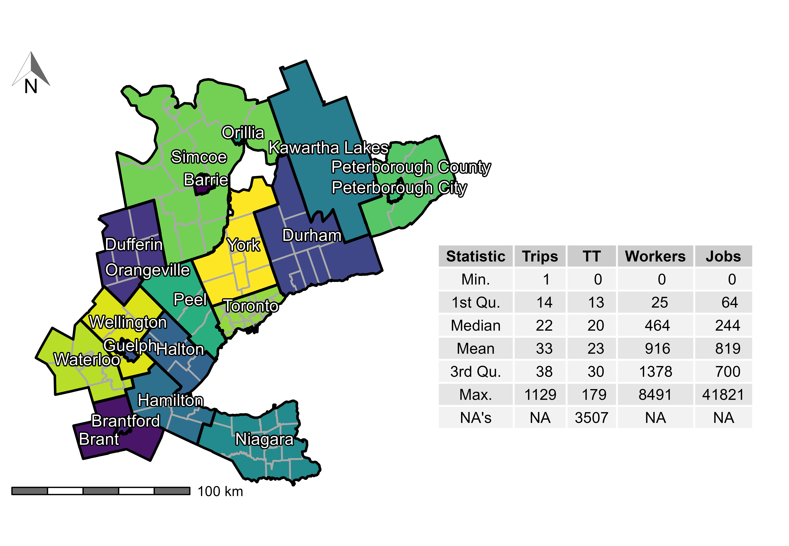
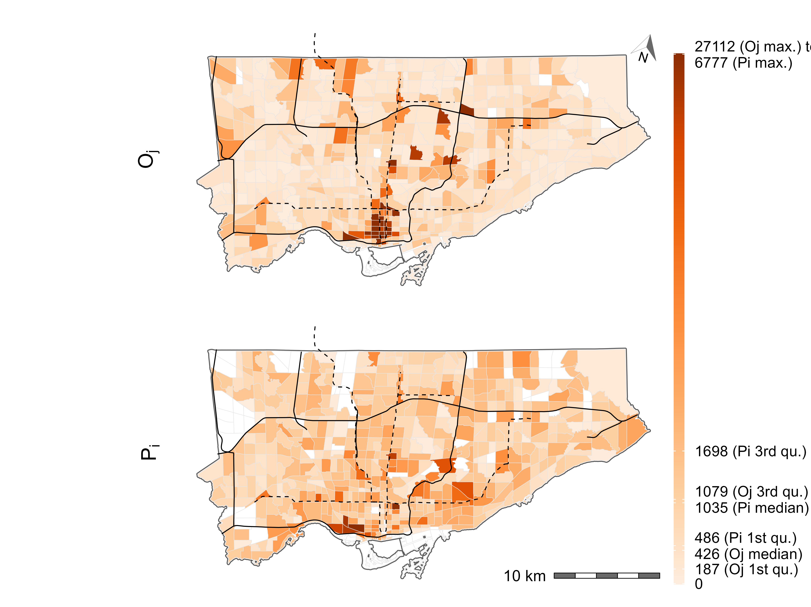
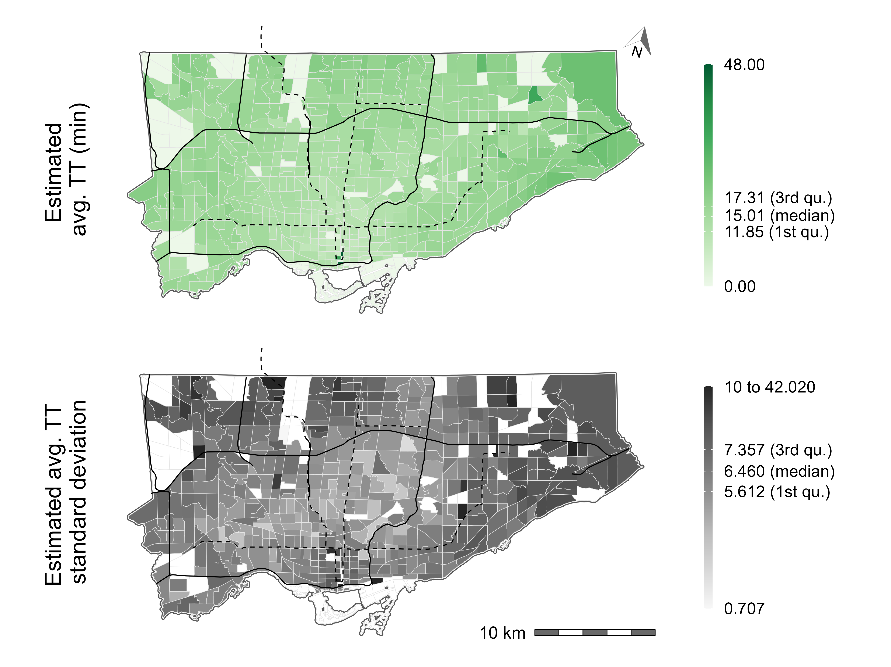
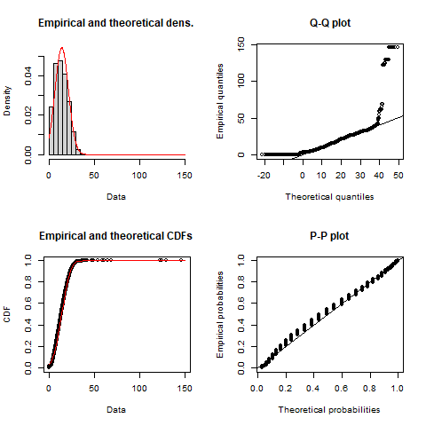
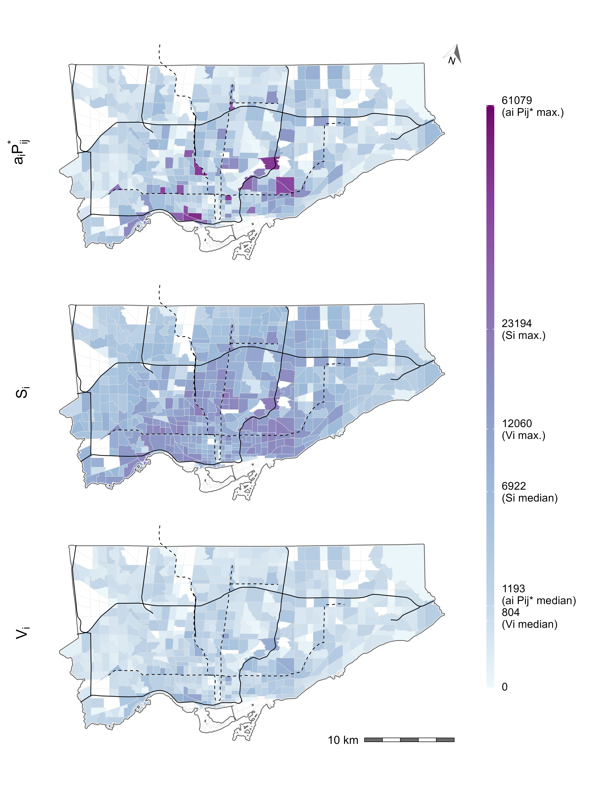
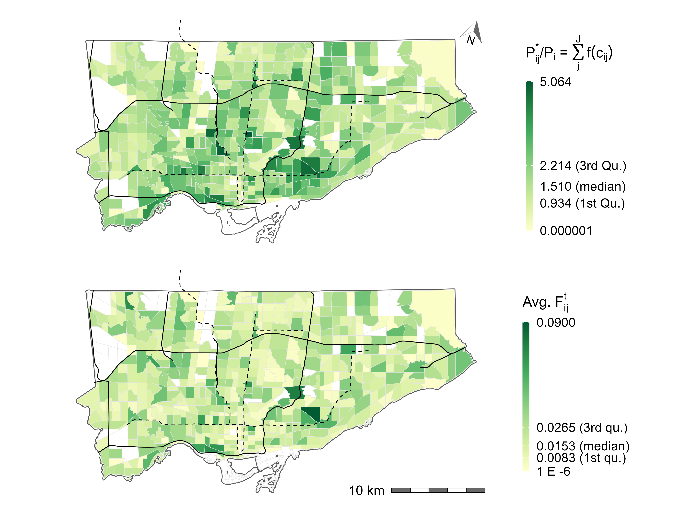
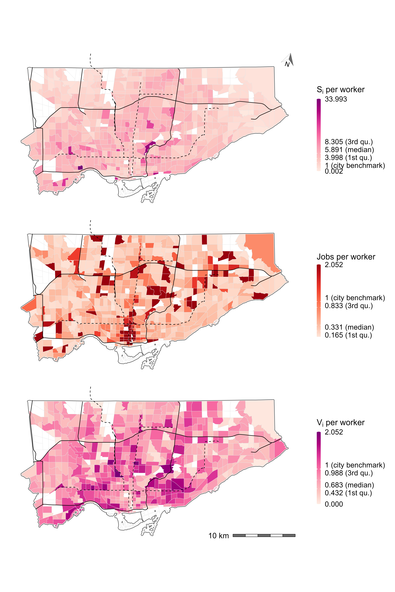

```{r knitr-setup, include=FALSE}
knitr::opts_chunk$set(
  echo = FALSE,
  cache = FALSE,
  warning = FALSE,
  message = FALSE,
  comment = '', 
  out.width = "1\\linewidth")
```

```{r install-data-package, eval = FALSE, include=FALSE}
if (!require("TTS2016R", character.only = TRUE)) {
      remotes::install_github("soukhova/TTS2016R",
                        build_vignettes = TRUE)
  }
```

```{r load-packages, include=FALSE, cache=FALSE}
library(dplyr) # A Grammar of Data Manipulation
library(fitdistrplus) # Help to Fit of a Parametric Distribution to Non-Censored or Censored Data
library(geomtextpath) # Curved Text in 'ggplot2'
library(ggforce) # Accelerating 'ggplot2'
library(ggplot2) # Create Elegant Data Visualisations Using the Grammar of Graphics
library(ggpmisc) # Miscellaneous Extensions to 'ggplot2'
library(ggrepel) # Automatically Position Non-Overlapping Text Labels with 'ggplot2'
library(ggspatial) # Spatial Data Framework for ggplot2
library(gridExtra) # Miscellaneous Functions for "Grid" Graphics 
library(huxtable) # Easily Create and Style Tables for LaTeX, HTML and Other Formats
library(kableExtra) # Construct Complex Table with 'kable' and Pipe Syntax
library(patchwork) # The Composer of Plots
library(RColorBrewer) # ColorBrewer Palettes
library(sf) # Simple Features for R
library(scales) # Scale Functions for Visualization
library(shadowtext) # Shadow Text Grob and Layer
library(skimr) # Compact and Flexible Summaries of Data
library(spdep) # Spatial Dependence: Weighting Schemes, Statistics
library(tidyr) # Tidy Messy Data
library(tmap) # Thematic Maps
library(TTS2016R) # An augmented 2016 Transportation Tomorrow Survey (TTS) data package
options(scipen = 999)
```

```{r sp_avail-function,include=FALSE}
#defining the spatial availability function
sp_avail <- function(x, o_id, d_id, pop, opp, r, f, alpha = 1){

  o_id <- rlang::enquo(o_id)
  d_id <- rlang::enquo(d_id)
  pop <- rlang::enquo(pop)
  opp <- rlang::enquo(opp)
  r <- rlang::enquo(r)
  f <- rlang::enquo(f)

  # Sum of population in system
  sum_pop <- x %>%
    dplyr::distinct(!!o_id,
                    .keep_all = TRUE) %>%
    dplyr::mutate(sum_pop = !!r*(!!pop)^alpha) %>%
    dplyr::pull(sum_pop) %>%
    sum()

  # Balancing factor size
  f_p <- dplyr::pull(x, !!r) * dplyr::pull(x, !!pop)^alpha / sum_pop

  # Sum of impedance
  sum_impedance <- x %>%
    dplyr::group_by(!!d_id) %>%
    dplyr::summarize(sum_impedance = sum(!!f))

  # Join sum of impedance to table
  x <- x %>%
    dplyr::left_join(sum_impedance,
                     by = rlang::as_name(d_id))
  
  # Balancing factor impedance
  f_c <- dplyr::pull(x, !!f) / x$sum_impedance

  # Add balancing factors to table
  x$f_c <- f_c
  x$f_p <- f_p
  
  # Sum of balancing factors for mass and impedance
  sum_pa <- x %>%
    dplyr::group_by(!!d_id) %>%
    dplyr::summarize(sum_pa= sum(f_p * f_c))

  x <- x %>%
    dplyr::left_join(sum_pa,
                     by = rlang::as_name(d_id))
  
  # Joint balancing factor
  f_t <- (f_p * f_c) / dplyr::pull(x, sum_pa)

  dplyr::pull(x, !!opp) * f_t
}

#detailed
sp_avail_detailed <- function(x, o_id, d_id, pop, opp, r, f, alpha = 1){
  
  o_id <- rlang::enquo(o_id)
  d_id <- rlang::enquo(d_id)
  pop <- rlang::enquo(pop)
  opp <- rlang::enquo(opp)
  r <- rlang::enquo(r)
  f <- rlang::enquo(f)
  
  sum_pop <- x %>%
    dplyr::distinct(!!o_id,
                    .keep_all = TRUE) %>%
    dplyr::mutate(sum_pop = !!r*(!!pop)^alpha) %>%
    dplyr::pull(sum_pop) %>%
    sum()
  
  f_p <- dplyr::pull(x, !!r) * dplyr::pull(x, !!pop)^alpha / sum_pop
  
  sum_impedance <- x %>%
    dplyr::group_by(!!d_id) %>%
    dplyr::summarize(sum_impedance = sum(!!f))
  
  x <- x %>%
    dplyr::left_join(sum_impedance,
                     by = rlang::as_name(d_id))
  
  f_c <- dplyr::pull(x, !!f) / x$sum_impedance
  
  x$f_c <- f_c
  x$f_p <- f_p
  
  sum_pa <- x %>%
    dplyr::group_by(!!d_id) %>%
    dplyr::summarize(sum_pa= sum(f_p * f_c))
  
  x <- x %>%
    dplyr::left_join(sum_pa,
                     by = rlang::as_name(d_id))
  x$f_t <- (f_p * f_c) / dplyr::pull(x, sum_pa)
  
  x %>%
    dplyr::mutate(V_ij = !!opp * f_t)
}
```

```{r synthetic-data, include=FALSE}
od_tt <- data.frame(i = c("A", "A", "A", "B", "B", "B", "C", "C", "C"), # Three origins
                    j = c("1", "2", "3", "1", "2", "3", "1", "2", "3"), # Three destinations
                    tt = c(15, 30, 100, 30, 15, 100, 100, 100, 15), # Travel time
                    pop = c(50000, 50000, 50000, 150000, 150000, 150000, 10000, 10000, 10000), # Population
                    opp = c(100000, 100000, 10000, 100000, 100000, 10000, 100000, 100000, 10000)) # Jobs
```

```{r data-figure-with-toy-example, include=FALSE}
od <- data.frame(id = c("A", "B", "C", "1", "2", "3"),
                 type = c("Population", "Population", "Population", "Jobs", "Jobs", "Jobs"),
                 size = c(50000, 150000, 10000, 100000, 100000, 10000),
                 x = c(2.5, 2.5, 6.5, 0.5, 0.5, 6.5),
                 y = c(7.5, 2.5, 4.5, 7.5, 2.5, 2.5))

centers <- data.frame(id = c("Urban center", "Suburb", "Satellite town"),
                 radius = rep(1.3, 3),
                 x = c(1.5, 1.5, 6.5),
                 y = c(2.5, 7.5, 3.5))

# od_lines coded as segments
od_lines <- data.frame(x = c(2.5, 2.5, 2.5, 2.5, 2.5, 2.5, 6.5, 6.5, 6.5),
                         y = c(7.5, 7.5, 7.5, 2.5, 2.5, 2.5, 4.5, 4.5, 4.5),
                         xend = c(0.5, 0.5, 6.5, 0.5, 0.5, 6.5, 0.5, 0.5, 6.5),
                         yend = c(7.5, 2.5, 2.5, 7.5, 2.5, 2.5, 7.5, 2.5, 2.5),
                         group = c("A", "A", "A", "B", "B", "B", "C", "C", "C"),
                    time = c("15 min", "30 min", "100 min",
                             "30 min", "15 min", "100 min",
                             "100 min", "100 min", "15 min"),
                         curvature = c(0.5, 0.5, -0.2, 0.5, 0.5, 0.5, 0.5, 0.5, -0.1))

od_table <- data.frame(Center = c("A", "B", "C", "1", "2", "3"),
  Size = c("50,000 pop", "150,000 pop", "10,000 pop", "100,000 jobs", "100,000 jobs", "10,000 jobs"))

od_table2 <- data.frame(Path = c("A to 1", "A to 2", "A to 3", 
                                "B to 1", "B to 2", "B to 3", 
                                "C to 1", "C to 2", "C to 3"),
  Value = c("15 mins", "30 mins", "100 mins", "30 mins", "15 mins", "100 mins", "100 mins", "100 mins", "15 mins"))
```

\newpage

# Introduction {#sec:introduction}

<!-- explain accessibility and how it's used -->

The concept of accessibility in transportation studies derives its appeal from the combination of the spatial distribution of opportunities and the cost of reaching them [@hansen1959; @handy_measuring_1997]. Accessibility analysis is employed in geography [@weber_2003_evaluating; @farber_2013_social], public health [@paez_healthcare_2010; @wang_2012_measurement; @delamater2013spatial; @pereira_2021_geographic; @zhangDifferencesAccessibilityPublic2021], real estate valuation [@yang_2018_impact], tourism [@jin_2020_influence], and transportation [@sathisan_1998_evaluation; @geurs2004] among other areas, with the number of applications growing [@shi_literature_2020], especially as mobility-based planning is de-emphasized in favor of access-oriented planning [@deboosere2018; @handy2020; @proffitt2017; @yan2021]. 

<!-- Quickly review the backgroud for the research and identify problem -->

Accessibility analysis stems from the foundational works of @harris_market_1954 and @hansen1959. From these seminal efforts, many accessibility measures have been derived, particularly after the influential work of @wilson1971 on spatial interaction^[Utility-based measures derive from a very different theoretical framework, random utility maximization]. Of these, gravity-type accessibility is arguably the most common; since its introduction in the literature, it has been widely adopted in numerous forms [@cervero_transportation_2002; @paez2004network; @geurs2004; @levinson_accessibility_1998; @Arranz2019measuring; @yangStudyImpactHighSpeed2018]. Hansen-type accessibility indicators are essentially weighted sums of opportunities, with the weights given by an impedance function that depends on the cost of movement, and thus measure the _intensity of the possibility of interaction_ [@hansen1959]. This type of accessibility analysis offers a powerful tool to study the intersection between urban structure and transportation infrastructure [@handy_measuring_1997]. 

<!-- Identify a problem -->

Despite their usefulness, the interpretability of Hansen-type accessibility measures can be challenging [@geurs2004; @miller2018]. Since they aggregate opportunities, the results are sensitive to the size of the region of interest (e.g., a large city has more jobs than a smaller city). As a consequence, raw outputs are not necessarily comparable across study areas [@allen2019]. This limitation becomes evident when surveying studies that implement this type of analysis. For example, @paez_healthcare_2010 (in Montreal) and @campbell_2019_accessibility (in Nairobi) report accessibility as the number of health care facilities that can potentially be reached from origins. But what does it mean for a zone to have accessibility to less than 100 facilities in each of these two cities, with their different populations and number of facilities? For that matter, what does it mean for a zone to have accessibility to more than 700 facilities in Montreal, besides being "accessibility rich"? As another example, @bocarejo_s_transport_2012 (in Bogota), @elgeneidy_cost_2016 (in Montreal), and @jiang_2016_accessibility (in Beijing) report accessibility as numbers of jobs, with accessibility values often in the hundreds of thousands, and even exceeding one million jobs for some zones in Beijing and Montreal. As indicators of urban structure, these measures are informative, but the meaning of one million accessible jobs is harder to pin down: how many jobs must any single person have access to? Clearly, the answer to this question depends on how many people demand jobs.

The interpretability of Hansen-type accessibility has been discussed in numerous studies, including recently by @hu_2019_measuring, @kelobonye2020measuring, and in greater depth by @merlin2017competition. As hinted above, the limitations in interpretability are frequently caused by ignoring competition - without competition, each opportunity is assumed to be equally available to every single opportunity-seeking individual that can reach it [@shen1998; @paez2019; @kelobonye2020measuring]. This assumption is appropriate when the opportunity of interest is non-exclusive, that is, if use by one unit of population does not preclude use by another. For instance, national parks with abundant space are seldom used to full capacity, so the presence of some population does not exclude use by others. When it comes to exclusive opportunities, or when operations may be affected by congestion, the solution has been to account for competition. Several efforts exist that do so. In our reckoning, the first such approach was proposed by @weibull_axiomatic_1976, whereby the distance decay of the supply of employment and the demand for employment (by workers) were formulated under so-called axiomatic assumptions. This approach was then applied by @joseph1984 in the context of healthcare, to quantify the availability of general practitioners in Canada. About two decades later, @shen1998 independently re-discovered Weibull's [-@weibull_axiomatic_1976] formula [see footnote (7) in @shen1998] and deconstructed it to consider accessibility for different modes. These advances were subsequently popularized as the family of Two-Stage Floating Catchment area (2SFCA) methods [@luo2003] that have found widespread adoption in healthcare, education, and food systems [@yang_comparing_2006; @chen_spatial_2020; @ye_spatial_2018; @chen_enhancing_2019; @chen_evaluating_2020]. 

<!-- Explain how this paper aims to solve the problem identified -->

An important development contained in Shen's work is a proof that the population-weighted sum of the accessibility measure with competition equates to the number of opportunities available [footnote (7) and Appendix A in @shen1998]. This demonstration gives the impression that Shen-type accessibility allocates _all_ opportunities to the origins, however to the authors' knowledge, it has not interpreted by literature in this way. For instance, @hu_changing_2014, @merlin2017competition, and @tao_investigating_2020 all use Shen-type accessibility to calculate job access but report values as 'competitive accessibility scores' or simply 'job accessibility'. These works do not explicitly recognize that jobs that are assigned to each origin are in fact a proportion of _all_ the opportunities in the system. This recognition, we argue, is critical to interpreting the meaning of the final result. Thus, in this paper we intend to revisit accessibility with competition within the context of disentangling how opportunities are allocated. We first argue that Shen's competitive accessibility misleadingly refers to the the total zonal population to equal the travel-cost discounted opportunity-seeking population. This equivocation, we believe, results in a ambigious interpretation of what Shen-type accessibility represents as the allocation of opportunities to population is masked by the results presenting as rates (i.e., opportunities per capita). We then propose an alternative formulation of accessibility that incorporates competition by adopting a proportional allocation mechanism; we name this measure _spatial availability_. The use of balancing factors for proportional allocation is akin to imposing a single constraint on the accessibility indicator, in the spirit of Wilson's [-@wilson1971] spatial interaction model.

The key motivations of this paper are as follows:

- To address and improve on the interpretability of Hansen-type accessibility measure; and

- To consider competition from the perspective of the population for opportunities within an accessibility measure. 

<!-- Clearly state objectives of paper -->
 
In this way, the paper's aim is three-fold:

- First, we aim to demonstrate that Shen-type (and thus @weibull_axiomatic_1976 accessibility and the popular 2SFCA methods) produce equivocal estimates of opportunities allocated as the result is presented as a rate (i.e., opportunities per capita);

- Second, we introduce a new measure, _spatial availability_, which we submit is a more interpretable alternative to Shen-type accessibility, since opportunities in the system are preserved and proportionally allocated to the population; and

- Third, we show how Shen-type accessibility (and 2SFCA methods) can be seen as measures of singly-constrained accessibility. 

Discussion is supported by the use of the small synthetic example of @shen1998 and empirical data drawn from the 2016 Transportation Tomorrow Survey of the Greater Toronto and Hamilton Area in Ontario, Canada. In the spirit of openness of research in the spatial sciences [@brunsdon2021opening; @paez2021open] this paper has a companion open data product^[\url{https://soukhova.github.io/TTS2016R/}] [@arribas2021Open], and all code is available for replicability and reproducibility purposes^[\url{https://github.com/soukhova/Spatial-Availability-Measure}].

# Accessibility measures revisited {#background}

In this section we revisit Hansen-type and Shen-type accessibility indicators. We adopt the convention of using a capital letter for absolute values (number of opportunities) and lower case for rates (opportunities per capita).

## Hansen-type accessibility

Hansen-type accessibility measures follow the general formulation shown in Equation (\ref{eq:conventional-accessibility}):
```{=tex}
\begin{equation}
\label{eq:conventional-accessibility}
S_i = \sum_{j=1}^JO_j \cdot f(c_{ij})
\end{equation}
```

\noindent where:

-   $c_{ij}$ is a measure of the cost of moving between $i$ and $j$.
-   $f(\cdot)$ is an impedance function of $c_{ij}$; it can take the form of any monotonically decreasing function chosen based on positive or normative criteria [@paez2012measuring].
-   $i$ is a set of origin locations ($i = 1,\cdots,N$).
-   $j$ is a set of destination locations ($j = 1,\cdots,J$).
-   $O_j$ is the number of opportunities at location $j$; $O = \sum_{j=1}^J O_j$ is the total supply of opportunities in the study region.
-   $S$ is Hansen-type accessibility as weighted sum of opportunities.

As formally defined, accessibility $S_i$ is the sum of opportunities that can be reached from location $i$, weighted down by an impedance function of the cost of travel $c_{ij}$. Summing the opportunities in the neighborhood of $i$ provides estimates of the number of opportunities that can _potentially_ be reached from $i$. Several measures result from using a variety of impedance functions; for example, cumulative opportunities measures are obtained when  $f(\cdot)$ is a binary or indicator function [e.g., @elgeneidy_cost_2016; @rosik_forecast_2021; @geurs2004; @qi_decadelong_2018]. Other measures use impedance functions modeled after any monotonically decreasing function [e.g., Gaussian, inverse power, negative exponential, or log-normal, among others, see, *inter alia*, @kwan_spacetime_1998; @vale_influence_2017; @reggiani_accessibility_2011; @li_approach_2020]. In practice, accessibility measures with different impedance functions tend to be highly correlated [@higgins2019; @santanapalacios2022; @kwan_spacetime_1998].

Gravity-based accessibility has been shown to be an excellent indicator of the intersection between spatially distributed opportunities and transportation infrastructure [@shi_literature_2020; @reggiani_accessibility_2011; @kwan_spacetime_1998]. However, beyond enabling comparisons of relative values they are not highly interpretable on their own [@miller2018]. To address the issue of interpretability, previous research has aimed to index and normalize values on a per demand-population basis [e.g., @barboza_balancing_2021; @pereira_distributional_2019; @wang_access_2021]. However, as recent research on accessibility discusses [e.g., @merlin2017competition; @allen2019; @paez2019; @kelobonye2020measuring], these steps do not adequately consider competition. In effect, when calculating $S_i$, every opportunity enters the weighted sum once for every origin $i$ that can reach it. This makes interpretability opaque, and to complicate matters, can also bias the estimated landscape of opportunity.

## Shen-type competitive accessibility

To account for competition, the influential works of @shen1998 and @weibull_axiomatic_1976, as well as the widely used 2SFCA approach of @luo2003, adjust Hansen-type accessibility with the population in the region of interest. The mechanics of this approach consist of calculating, for every destination $j$, the population that can reach it given the impedance function $f(\cdot)$; let us call this the _effective opportunity-seeking population_ (Equation (\ref{eq:effective-opportunity-seeking-population})). This value can be seen as the Hansen-type _market area_ (accessibility to population) of $j$. The opportunities at $j$ are then divided by the sum of the effective opportunity-seeking population to obtain a measure of opportunities per capita, i.e., $R_j$ in Equation (\ref{eq:level-of-service}). This can be thought of as the _level of service_ at $j$. Per capita values are then allocated back to the population at $i$, again subject to the impedance function as seen in Equation (\ref{eq:2SFCA-step2}); this is accessibility with competition.

```{=tex}
\begin{equation}
\label{eq:effective-opportunity-seeking-population}
P_{ij}^{*} = {P_{i} \cdot f(c_{ij})}
\end{equation}
```

```{=tex}
\begin{equation}
\label{eq:level-of-service}
R_{j} = \frac{O_{j}}{\sum_i P_{ij}^*}
\end{equation}
```

```{=tex}
\begin{equation}
\label{eq:2SFCA-step2}
a_{i} = {\sum_j R_{j} \cdot f(c_{ij})}
\end{equation}
```

\noindent where:

-   $a$ is Shen-type accessibility as weighted sum of opportunities per capita (or weighted level of service).
-   $c_{ij}$ is a measure of the cost of moving between $i$ and $j$.
-   $f(\cdot)$ is an impedance function of $c_{ij}$.
-   $i$ is a set of origin locations ($i = 1,\cdots,N$).
-   $j$ is a set of destination locations ($j = 1,\cdots,J$).
-   $O_j$ is the number of opportunities at location $j$; $O = \sum_{j=1}^J O_j$ is the total supply of opportunities in the study region.
-   $P_i$ is the population at location $i$.
-   $P_{ij}^*$ is the population at location $i$ that can reach destination $j$ according to the impedance function; we call this the _effective opportunity-seeking population_.
-   $R_j$ is the ratio of opportunities at $j$ to the sum over all origins of the _effective opportunity-seeking population_ that can reach $j$; in other words, this is the total number of opportunities per capita found at $j$.

@shen1998 describes $P_i$ as the _"the number of people in location $i$ seeking opportunities"_. In our view, this is somewhat equivocal and where misinterpretation of the final results may arise. Consider a population center where the population is only willing to take an opportunity if the trip required is less than or equal to 60 minutes. This is identical to the following impedance function:
```{=tex}
\begin{equation}
\label{eq:binary-impedance}
f(c_{ij}) =
\begin{cases}
1\text{ if }c_{ij}\leq60\text{ min}\\
0\text{ otherwise}\\
\end{cases}
\end{equation}
```

If an employment center is less than 60 minutes away, the population can seek opportunities there (i.e., $f(c_{ij})=1$). But are these people still part of the opportunity-seeking population for jobs located two hours away? Four hours? Ten hours? We assume that they are not because their travel behaviour, as represented by the impedance function would yield $f(c_{ij})=0$, eliminating them from the effective opportunity-seeking population $P_ij*$. We see Shen's definition as ambiguous because, for the purpose of calculating accessibility, the impedance function defines what constitutes the population that effectively can seek opportunities at remote locations. Thus $P_i$ should be plainly understood as the population at location $i$ (as defined above) and not the _"the number of people in location $i$ seeking opportunities"_. In other words, $P_i$ and $P_{ij}*$ are confounded.

Furthermore, an identical misunderstanding can be described for $O_j$ which is defined as _"the number of **relevant** opportunities in location j"_ in @shen1998  (our emphasis). $O_j$ is adjusted by the same $f(c_{ij})$ in Equation (\ref{eq:2SFCA-step2}), so the _relevancy_ is determined by the travel behaviour associated with the impedance function not purely by $O_j$ itself. For this reason, $O_j$ should be understand plainly as the opportunities at location $j$ (as we also defined them above).

Misunderstanding $P_i$ and $O_j$ may lead to a misleading interpretation of the final result $a_i$, especially as expressed in Shen's proof (see Equation (\ref{eq:2SFCA-total})).
```{=tex}
\begin{equation}
\label{eq:2SFCA-total}
\sum_{i=1}^N a_{i} P_i= \sum_{j=1}^JO_j
\end{equation}
```

Notice, confounding $P_i$ with the effective opportunity-seeking population and $O_j$ with the jobs taken may cause us to misunderstand $a_{i}$ as _"relevant opportunities"_ per _"people in location $i$ seeking opportunities"_. Instead, as mathematically expressed in the proof, $a_{i}$ is a proportion of the opportunities available to the population, since multiplying $a_i$ by the population at $i$ and summing for all origins in the system equals to the total number of opportunities in the system. Embedded in $a_i$ is already the travel behaviour so $P_i$ and $O_j$ must be plainly understand as population at $i$ and opportunities at $j$ to have Equation (\ref{eq:2SFCA-total}) hold true.

## Shen's synthetic example

In this section we use the example in @shen1998 to detail the importance of understanding $P_i$ and $O_j$ as simply the population at the origin $i$ and the opportunities at destination $j$ respectively. This is critical to understanding how the opportunities are allocated to the population based on the impedance function.

```{r, create-figure-with-toy-example, fig.cap="\\label{fig:plot-toy-example} Shen (1998) synthetic example with locations of employment centers (in orange), population centers (in blue), number of jobs and population, and travel times.", fig.show='hold', fig.align='center'}

ggplot() + 
  # Plot centers
  geom_circle(data = centers,
             aes(x0 = x, 
                 y0 = y,
                 r = radius)) +
  annotate(geom = "label", 
           x=c(0.5, 0.6, 7),
           y=c(9, 1, 5.2), 
           label = c("Suburban", "Urban", "Satellite"), 
           size=4, 
           label.size=NA) +
  # Connect origins and destinations with curves
  geom_curve(data = od_lines,
               aes(x = x,
                   y = y,
                   xend = xend,
                   yend = yend,
                   linetype = group,
                   group = group),
             curvature = 0.25,
             size = 0,
             arrow = arrow(length = unit(0.03, unit = "npc"))) +
  # Text on curves
  geom_textcurve(data = od_lines,
               aes(x = x,
                   y = y,
                   xend = xend,
                   yend = yend,
                   linetype = group,
                   group = group,
                   label = time),
             curvature = 0.25,
             size = 3) +
  # Plot origins and destinations
  geom_point(data = od,
            aes(size = size,
                x = x, 
                y = y, 
                color = type,
                shape = type)) +
  scale_size(range = c(4, 10)) +
  # Label origins and destinations
  geom_text(data = od, 
            aes(x, 
                y, 
                label=id), 
            size=4) +
  # Create table
  annotate(geom = "table",
           x = 8, 
           y = 9, 
           label = list(od_table),
           fill = "white",
           size=3) +
  # Theme the plot
  coord_fixed() + 
  theme_void() +
  guides(shape = "none", size = "none", color = "none", linetype ="none") 
```

```{r access-calcs-table, include=FALSE}
#table with all the accessibility calculations
# Impedance parameter
b <- 0.1

# Calculate impedance function
od_tt <- od_tt %>% mutate(f = exp(-b * tt))

# Level of service 
LOS_j <- od_tt %>%
  group_by(j) %>%
  summarize(opp = mean(opp),
            R_j = sum(pop * f),
            .groups = "drop") %>%
  mutate(LOS_j = opp/R_j)

# Hansen- and Shen-type accessibility
S <- od_tt %>%
  left_join(LOS_j %>% 
              dplyr::select(j, LOS_j, opp, R_j),
            by = "j") %>%
  group_by(i) %>%
  summarize(S_i = sum(opp.x * f), #first, hansen-type accessibility (unconstrained)
            a_i = sum(LOS_j * f)) #second, shen/2SFCA (singly constrained)
```

```{r toy-example-table-creation, include=FALSE}
od_tt1 <- merge(od_tt, 
                S, 
                by="i", 
                all.x = TRUE) %>%
  transmute(i, 
         pop, 
         j, 
         opp, 
         tt, 
         f, 
         pop_f = pop * f, 
         jobs_f = opp * f,
         S_i, 
         a_i)%>%
  mutate(f = ifelse(f < 0.001, "< 0.001", round(f, 3)),
         pop_f = ifelse(pop_f < 0.001, "< 0.001", round(pop_f, 3)),
         jobs_f = ifelse(jobs_f < 0.001, "< 0.001", round(jobs_f, 3)))

colnames(od_tt1) = c("Origin", "Pop.", "Dest.", "Jobs", "TT", "f(TT)", "Pop * f(TT)", "Jobs * f(TT)", "S_i", "a_i") #, "BFCA_i")

```

```{r access-calcs-table-2, include=FALSE}
# Impedance parameter
b <- 0.6

# Calculate impedance function
od_tt <- od_tt %>% mutate(f = exp(-b * tt))

# Level of service 
LOS_j <- od_tt %>%
  group_by(j) %>%
  summarize(opp = mean(opp),
            R_j = sum(pop * f),
            .groups = "drop") %>%
  mutate(LOS_j = opp/R_j)

# Hansen- and Shen-type accessibility
S <- od_tt %>%
  left_join(LOS_j %>% 
              dplyr::select(j, LOS_j, opp, R_j),
            by = "j") %>%
  group_by(i) %>%
  summarize(S_i = sum(opp.x * f), #first, hansen-type accessibility (unconstrained)
            a_i = sum(LOS_j * f)) #second, shen/2SFCA (singly constrained),
```

```{r toy-example-table-creation-2, include=FALSE, cache=FALSE}
od_tt2 <- merge(od_tt, 
                S, 
                by="i", 
                all.x = TRUE) %>%
  transmute(i, 
         pop, 
         j, 
         opp, 
         tt, 
         f, 
         pop_f = pop * f, 
         jobs_f = opp * f,
         S_i, 
         a_i) %>%
  mutate(f = ifelse(f < 0.001, "< 0.001", round(f, 3)),
         pop_f = ifelse(pop_f < 0.001, "< 0.001", round(pop_f, 3)),
         jobs_f = ifelse(jobs_f < 0.001, "< 0.001", round(jobs_f, 3)))

colnames(od_tt2) = c("Origin", "Pop.", "Dest.", "Jobs", "TT", "f(TT)", "Pop * f(TT)", "Jobs * f(TT)", "S_i", "a_i") #, "BFCA_i")

#merge 1 and 2 and 3
od_tt3 <- rbind(od_tt1, od_tt2)

od_tt3 <- od_tt3  %>%
  as_hux(scientific=TRUE)
```

```{r calculating-beta-0.1-table-creation}
#table with all the accessibility calculations
# Impedance parameter
b <- 0.1

# Calculate impedance function
od_tt1 <- od_tt %>% mutate(f = exp(-b * tt))

# Level of service 
LOS_j <- od_tt1 %>%
  group_by(j) %>%
  summarize(opp = mean(opp),
            R_j = sum(pop * f),
            .groups = "drop") %>%
  mutate(LOS_j = opp/R_j)

# Hansen- and Shen-type accessibility
S <- od_tt1 %>%
  left_join(LOS_j %>% 
              dplyr::select(j, LOS_j, opp, R_j),
            by = "j") %>%
  group_by(i) %>%
  summarize(S_i = sum(opp.x * f), #first, hansen-type accessibility (unconstrained)
            a_i = sum(LOS_j * f)) #second, shen/2SFCA (singly constrained)

od_tt1 <- merge(od_tt1, 
                S, 
                by="i", 
                all.x = TRUE) %>%
  transmute(i, 
            j,
         pop, 
         opp, 
         tt, 
         f, 
         pop_f = pop * f, 
         jobs_f = opp * f,
         S_i, 
         a_i)%>%
  mutate(f = ifelse(f < 0.001, "< 0.001", round(f, 3)),
         pop_f = ifelse(pop_f < 0.001, "< 0.001", round(pop_f, 3)),
         jobs_f = ifelse(jobs_f < 0.001, "< 0.001", round(jobs_f, 3)))

colnames(od_tt1) = c("Origin",  "Dest.","Pop.", "Jobs", "TT", "f(TT)", "Pop * f(TT)", "Jobs * f(TT)", "S_i", "a_i") #, "BFCA_i")
od_tt1 <- t(od_tt1)
```


```{r calculating-beta-0.6-table-creation}
# Impedance parameter
b <- 0.6

# Calculate impedance function
od_tt2 <- od_tt %>% mutate(f = exp(-b * tt))

# Level of service 
LOS_j <- od_tt2 %>%
  group_by(j) %>%
  summarize(opp = mean(opp),
            R_j = sum(pop * f),
            .groups = "drop") %>%
  mutate(LOS_j = opp/R_j)

# Hansen- and Shen-type accessibility
S <- od_tt2 %>%
  left_join(LOS_j %>% 
              dplyr::select(j, LOS_j, opp, R_j),
            by = "j") %>%
  group_by(i) %>%
  summarize(S_i = sum(opp.x * f), #first, hansen-type accessibility (unconstrained)
            a_i = sum(LOS_j * f)) #second, shen/2SFCA (singly constrained),

od_tt2 <- merge(od_tt2, 
                S, 
                by="i", 
                all.x = TRUE) %>%
  transmute(f, 
         pop_f = pop * f, 
         jobs_f = opp * f,
         S_i, 
         a_i) %>%
  mutate(f = ifelse(f < 0.001, "< 0.001", round(f, 3)),
         pop_f = ifelse(pop_f < 0.001, "< 0.001", round(pop_f, 3)),
         jobs_f = ifelse(jobs_f < 0.001, "< 0.001", round(jobs_f, 3)))

colnames(od_tt2) = c("f(TT)", "Pop * f(TT)^1", "Jobs * f(TT)^1", "S_i^1", "a_i^1") #, "BFCA_i")
od_tt2 <- t(od_tt2)
```

```{r calculating-beta-0.1-Vi-table-creation}
# Reset impedance parameter
b <- 0.1

# Calculate impedance function
od_tt3 <- od_tt %>% 
  mutate(f = exp(-b * tt))

od_tt3 <- od_tt3 %>%
  mutate(catch = 1) %>%
  sp_avail_detailed(o_id = i, #spatial availability
                    d_id = j, 
                    pop = pop,
                    opp = opp,
                    r = catch,
                    f = f, 
                    alpha = 1) %>%
  transmute(i,
            f, 
         F_p = f_p, 
         F_c = f_c, 
         F_t = f_t,
         V_ij)

V_i <- od_tt3 %>%
  group_by(i) %>%
  summarize(V_i = sum(V_ij))

od_tt3 <- od_tt3 %>%
  left_join(V_i,
            by = "i") %>% dplyr::select(-c(i,f)) %>%
  mutate(F_p = ifelse(F_p < 0.001, "< 0.001", round(F_p, 3)),
         F_c = ifelse(F_c < 0.001, "< 0.001", round(F_c, 3)),
          F_t = ifelse(F_t < 0.001, "< 0.001", round(F_t, 3)),
          V_ij = ifelse(V_ij < 0.001, "< 0.001", round(V_ij, 3)),
         V_i = ifelse(V_i < 0.001, "< 0.001", round(V_i, 3)),)

colnames(od_tt3) <- c("F^p", "F^c", "F", "V_ij", "V_i")
od_tt3 <- t(od_tt3)
```

```{r merging-data-for-table}
#merge 1 and 2 and 3
od_tt4 <- rbind(od_tt1, od_tt2, od_tt3)

rownames_od_tt4 <- c("Origin", 
"Dest.", "Pop.", "Jobs", "TT", 
"f(TT)", "Pop * f(TT)", "Jobs * f(TT)", "S_i", "a_i", 
"f(TT)", "Pop * f(TT)", "Jobs * f(TT)", "S_i", "a_i", 
"F^c", "F^p", "F", "V_ij", "V_i")

od_tt4 <- cbind(rownames_od_tt4, od_tt4)

od_tt4 <- od_tt4  %>%
  as_hux()
```

```{r toy-example-table-all-values, cache=FALSE}
table_toy  <- od_tt4 %>%
  set_background_color(c(6:10,16:20), 1:10, "lightyellow") %>%
  set_background_color(11:15, 1:10, "grey90") %>%
  set_bold(1:2, everywhere) %>%
  set_bottom_border(c(1,2,5,10,15,20), everywhere) %>%
  set_right_border(everywhere, c(1,4,7,10), brdr(1, "solid", "grey")) %>%
  set_align(1:20, 1, "left") %>%
  set_align(1:20,  2:10, "center") %>%
  set_number_format(c(6,10,11:15,16:18), everywhere, 3) %>% #the smaller numbers, have 3 decimals
  set_number_format(c(7:9,19,20), everywhere, 1) %>% # the larger numbers, have 1 decimal
  merge_cells(1, 2:4) %>% merge_cells(1, 5:7) %>% merge_cells(1, 8:10) %>%
  set_caption("Summary description of synthetic example: Hansen-type accessibility $S_i$, Shen-type accessibility $a_i$, and spatial availability $V_i$ with beta = 0.1 (light yellow) and beta = 0.6 (light grey).") %>%
  set_label("tab:synthetic-example") %>% 
  set_latex_float("h!") %>% 
  set_width(1.1)

font_size(table_toy) <- 7

table_toy[1:20,]
```

Table \ref{tab:synthetic-example} contains the information needed to calculate $S_i$ and $a_i$ for this example. We use a negative exponential impedance function with $\beta=0.1$ as done in @shen1998 [see footnote (5)]:
$$
f(c_{ij}) = \exp(-\beta\cdot c_{ij})
$$

In Table \ref{tab:synthetic-example}, we see that population centers $A$ and $B$ have equal Hansen-type accessibility ($S_A = S_B=$ 27,292 jobs). On the other hand, the isolated satellite town of $C$ has low accessibility ($S_C=$ 2,240 jobs). But center $B$, despite its high accessibility, is a large population center. $C$, in contrast, is smaller but also relatively isolated and has a balanced ratio of jobs (10,0000 jobs) to population (10,000 people). It is difficult from these outputs to determine whether the accessibility at $C$ is better or worse than that at $A$ or $B$.

The results are easier to interpret when we consider Shen-type accessibility. The results indicate that $a_A \approx$ 1.337 jobs per capita, $a_B \approx$ 0.888, and $a_C\approx$ 0.996. The latter value is sensible given the jobs-population balance of $C$. Center $A$ is relatively close to a large number of jobs (more jobs than the population of $A$). The opposite is true of $B$. According to @shen1998, the sum of the population-weighted accessibility $a_i$ is exactly equal to the number of jobs in the region following Shen's proof:
$$
\begin{array}{l}
\sum_{i=1}^N a_{i} P_i= \sum_{j=1}^JO_j\\
50,000\times 1.3366693 \\
+ 150,000 \times 0.8880224 \\
+ 10,000 \times 0.9963171 = 210,000
\end{array}
$$

As mentioned earlier, this property under Shen's definition of $P_i$  _"people in location $i$ seeking opportunities"_ , gives the impression that all jobs sought are allocated to the people located at each origin $i$. In other words, Shen defines $P_i$ to mean $P_{ij}^*$ (i.e., the _effective opportunity-seeking population_ which is already adjusted by travel behaviour) instead of defining it to simply be the full population at $i$ (i.e., $P_i$). As seen in column __Pop * f(TT)__ in Table \ref{tab:synthetic-example} (i.e., $P_{ij}^* = P_i\cdot f(c_{ij})$), the number of individuals from population center $A$ that are _willing to reach_ employment centers 1, 2, and 3 are 11,156, 2,489, and 2.27 respectively. Therefore, the total effective opportunity-seeking population at $A$ is $P_A^* = \sum_jP_{Aj}^*$, that is, 13,647.27 people, which is considerably lower than the total population of $A$ (i.e., $P_A=$ 50,000 people). Demonstrated as follows, using $P_{ij}^*$ in the calculations associated with this proof results in only 56,834.59 jobs being allocated to the population, instead of the nominal number of jobs in the region that is over three times this number (i.e., 210,000 jobs).
$$
\begin{array}{l}
\sum_{i=1}^N a_{i} P_{ij}^* =\\
(11,156.51 + 2,489.35 + 2.26)\times 1.3366693 \\
+ (7,468.06 + 33,469.52 + 6.81)\times 0.8880224\\
+ (4.54 + 4.54 + 2,231.20)\times 0.9963171 \approx 56,834.59
\end{array}
$$

Furthermore, even when Shen's $P_i$ is understood plainly as the total population at $i$, the meaning of the proof may still be ambiguous. The proof can still give the impression that all jobs are allocated to the total population since total population ($\sum_{i=1}^N P_i$) goes into the equation and total jobs ($\sum_{j=1}^JO_j$) in the region is the result. However, this impression is incomplete since it does not reflect the amount of population which takes jobs and the number of people being considered for jobs; these magnitudes are a product of being weighted down by the impedance function. These magnitudes are not obvious from $a_i$ is because the result is presented as a rate (i.e., opportunities per capita). 

Let us consider a modification to the travel behaviour of the example discussed to illustrate how the presentation of $a_i$ as a rate obscures the magnitude of the effective opportunity-seeking population. We modify the example by increasing the $\beta$ to 0.6 (compared to the previous value of 0.1; see Figure \ref{fig:impedance-functions-comparison}). This modification increases the cost of travel and thus the impedance function, which is an expression of the population's relative willingness to travel to opportunities, reflects a population which is relatively less willing to travel to opportunities further away compared to the previous $\beta$ value. The Hansen-type and Shen-type values are presented in the yellow rows of Table \ref{tab:synthetic-example}.

```{r comparison-impedance-functions-synthetic-example, fig.cap="\\label{fig:impedance-functions-comparison}Comparison of two negative exponential impedance functions used in the synthetic example. The x-axis represents the travel time (in mins) and the y-axis represents the impedance function at each travel time."}
b<-0.6
data.frame(tt = seq(0, 110, 1)) %>%
  mutate(f1 = exp(-0.1 * tt),
         f2 = exp(-b * tt)) %>%
  pivot_longer(cols = -tt,
               names_to = "Function",
               values_to = "f") %>%
  mutate(Function = case_when(Function == "f1" ~ "beta = 0.1",
                              Function == "f2" ~ "beta = 0.6")) %>%
  ggplot() +
  xlab("TT") +
  ylab("f(TT)") +
  geom_line(aes(x = tt, 
                y = f,
                color = Function)) +
  theme_minimal()
```

As expected, Hansen-type accessibility drops quite dramatically after this $\beta$ modification: the friction of distance is so high that few opportunities are within reach. In contrast, Shen-type accessibility converges to the jobs:population ratio (i.e., origin $A$ is $\frac{100,000}{50,000} = 2$). This is explained by the way the impedance function excludes the population in droves, thus reducing the competition for jobs: as seen in Table \ref{tab:synthetic-example}, the effective opportunity-seeking population from $A$ is only about equal to `r as.numeric(od_tt4[12, 2])`; likewise, the number of jobs at 1 weighted by the impedance is only `r as.numeric(od_tt4[13, 2])`. In other words, competition is low because jobs are expensive to reach, but those willing to reach jobs enjoy relatively high accessibility (in the limit, the jobs/population ratio). On the other hand, the accessibility is effectively zero for those in the population prevented by the impedance from reaching any jobs.

In what follows, we propose an alternative derivation of @shen1998 accessibility with competition that explicitly clarifies the opportunities allocated to the _effective opportunity-seeking population_ within its formulation. Hence, the results are not only more interpretable, but also extend the potential of accessibility analysis. 

# Introducing spatial availability: a singly-constrained measure of accessibility

In brief, we define the _spatial availability_ at $i$ ($V_{i}$) as the proportion of all opportunities $O$ that are allocated to $i$ from all destinations $j$:
$$
V_i = \sum_{j=1}^NO_jF^t_{ij}
$$

\noindent where:

-   $F^t_{ij}$ is a balancing factor that depends on the population and cost of movement in the system.
-   $O_j$ is the number of opportunities at $j$.
-   $V_i$ is the number of spatially available opportunities from the perspective of $i$.

The general form of spatial availability is also as a sum, and the fundamental difference with Hansen- and Shen-type accessibility is that opportunities are allocated proportionally. Balancing factor $F^t_{ij}$ consists of two components: a population-based balancing factor $F^p_{i}$ and an impedance-based balancing factor $F^c_{ij}$ which, respectively, allocate opportunities to $i$ in proportion to the size of the population of the different competing centers (the mass effect of the gravity model) and the cost of reaching opportunities (the impedance effect). In the next two subsections, we explain the intuition behind the method before defining it in full.

## Proportional allocation by population

According to the gravity modelling framework, the potential for interaction depends on the mass (i.e., the population) and the friction of distance (i.e., the impedance function). We begin by describing the proposed proportional allocation mechanism based on demand by population. Recall, the total population in the example is 210,000. The proportion of the population by population center is as follows:
$$
\begin{array}{l}
F^p_A = \frac{50,000}{210,000}\\
\\
F^p_B = \frac{150,000}{210,000}\\
\\
F^p_C = \frac{10,000}{210,000}\\
\end{array}
$$

Jobs are allocated proportionally from each employment center to each population center depending on their population sizes as per the balancing factors $F^p_i$. In this way, employment center 1 allocates $100,000\cdot \frac{50,000}{210,000}= 23,809.52$ jobs to $A$; $100,000\cdot \frac{150,000}{210,000}= 71,428.57$ jobs to $B$; and $100,000\cdot \frac{10,000}{210,000}= 7,142.857$ jobs to $C$. Notice how this mechanism ensures that the total number of jobs at employment center 1 is preserved at 100,000.

We can verify that the number of jobs allocated is consistent with the total number of jobs in the system:
$$
\begin{array}{l}
\text{Employment center 1 to population centers A, B, and C: }\\
100,000 \cdot \frac{50,000}{210,000} + 100,000 \cdot \frac{150,000}{210,000} + 100,000 \cdot \frac{10,000}{210,000} = 100,000\\
\\
\text{Employment center 2 to population centers A, B, and C: }\\
100,000 \cdot \frac{50,000}{210,000} + 100,000 \cdot \frac{150,000}{210,000} + 100,000 \cdot \frac{10,000}{210,000} = 100,000\\
\\
\text{Employment center 3 to population centers A, B, and C: }\\
10,000 \cdot \frac{50,000}{210,000} + 10,000 \cdot \frac{150,000}{210,000} + 10,000 \cdot \frac{10,000}{210,000} = 10,000\\
\end{array}
$$

In the general case where there are $N$ population centers in the region, we define the following population-based balancing factors in Equation (\ref{eq:population-balancing-factor}):
```{=tex}
\begin{equation}
\label{eq:population-balancing-factor}
F^p_{i} = \frac{P_{i}^\alpha}{\sum_{i=1}^N P_{i}^\alpha}
\end{equation}
```

Balancing factor $F^p_{i}$ corresponds to the proportion of the population in origin $i$ relative to the population in the region. On the right hand side of the equation, the numerator $P_{i}^\alpha$ is the population at origin $i$. The summation in the denominator is over $i=1,\cdots,N$, and adds up to the total population of the region. Notice that we incorporate an empirical parameter $\alpha$. The role of $\alpha$ is to modulate the effect of demand by population. When $\alpha <1$, opportunities are allocated more rapidly to smaller centers relative to larger ones; $\alpha>1$ achieves the opposite effect.

Balancing factor $F^p_{i}$ can now be used to proportionally allocate a share of available jobs at $j$ to origin $i$. The number of jobs available to $i$ from $j$ balanced by population shares is defined as follows:
$$
V^p_{ij} = O_j\frac{F^p_{i}}{\sum_{i=1}^N F^p_{i}}
$$

In the general case where there are $J$ employment centers, the total number of jobs available from all destinations to $i$ is simply the sum of $V^p_{ij}$ over $j=1,\cdots, J$:
$$
V^p_{i} = \sum_{j=1}^J O_j\frac{F^p_{i}}{\sum_{i=1}^N F^p_{i}}
$$

Since the factor $F^p_{i}$, when summed over $i=1,\cdots,N$ always equals to 1 (i.e., $\sum_{i=1}^{N} F^p_{i} = 1$), the sum of all spatially available jobs equals $O$, the total number of opportunities in the region:
$$
\begin{array}{l}
\sum_{i=1}^N V^p_i =\sum_{i=1}^N\sum_{j=1}^JO_j\frac{F^p_{i}}{\sum_{i=1}^N F^p_{i}}\\
=\sum_{i=1}^N \frac{F^p_{i}}{\sum_{i=1}^N F^p_{i}}\cdot\sum_{j=1}^JO_j\\
=\sum_{j=1}^J O_j = O
\end{array}
$$
The terms $F^p_{i}$ act here as the balancing factors of the gravity model when a single constraint is imposed [i.e., to ensure that the sums of columns are equal to the number of opportunities per destination, see @ortuzar_2011_modelling, pp. 179-180 and 183-184]. As a result, the sum of spatial availability for all population centers equals the total number of opportunities.

The discussion so far concerns only the mass effect (i.e., population size) of the gravity model. In addition, the potential for interaction is thought to decrease with increasing cost, so next we define similar balancing factors but based on the impedance.

## Proportional allocation by cost

Clearly, using only balancing factors $F^p_{i}$ to calculate spatial availability $V^p_i$ does not account for the cost of reaching employment centers. Consider instead a set of balancing factors $F^c_{ij}$ that account for the friction of distance for our example. Recall that the impedance function $f(c_{ij})$ equals $\exp(-\beta\cdot c_{ij})$ where  $\beta = 0.1$ and travel time $c_{ij}$ is either 15, 30 or 60 minutes. For instance, the impedance-based balancing factors $F^c_{ij}$ would be the following for employment center 1 (employment center 2 and 3 have their own balancing factor values for each origin $i$ as will be discussed later):
$$
\begin{array}{l}
F^c_{A1} = \frac{0.223130}{0.223130 + 0.049787 + 0.000045} = 0.8174398\\
F^c_{B1} = \frac{0.049787}{0.223130 + 0.049787 + 0.000045} = 0.1823954\\
F^c_{C1} = \frac{0.000045}{0.223130 + 0.049787 + 0.000045} = 0.0001648581\\
\end{array}
$$

Balancing factors $F^c_{ij}$ use the impedance function to proportionally allocate more jobs to closer population centers, that is, to those with populations _more willing to reach the jobs_. Indeed, the factors $F^c_{ij}$ can be thought of as the proportion of the population at $i$ willing to travel to destination $j$, conditional on the travel behavior as given by the impedance function. For instance, ${81.74398}\%$ of jobs from employment center 1 are allocated to population center $A$ based on impedance.

So as follows from our example, of the 100,000 jobs at employment center 1 the number of jobs allocated to population center $A$ is $100,000\times 0.8174398 = 81,743.98$ jobs; the number allocated to population center $B$ is $100,000\times 0.1823954 = 18,239.54$ jobs; and the number allocated to population center $C$ is $100,000\times 0.0001648581 = 16.48581$ jobs. We see once more that the total number of jobs at the employment center is preserved at 100,000. In this example, the proportional allocation mechanism assigns the largest share of jobs to population center $A$, which is the closest to employment center 1, and the smallest to the more distant population center $C$.

In the general case where there are $N$ population centers and $J$ employment centers in the region, we define the following impedance-based balancing factors:
```{=tex}
\begin{equation}
\label{eq:impedance-balancing-factor}
F^c_{ij} = \frac{f(c_{ij})}{\sum_{i=1}^N f(c_{ij})}
\end{equation}
```

The total number of jobs available to $i$ from $j$ according to impedance is defined as follows:
$$
V^c_{ij} = O_j\frac{F^c_{ij}}{\sum_{i=1}^N F^c_{ij}}
$$

The total number of jobs available to $i$ from all destinations is:
$$
V^c_{i} = \sum_{j=1}^J O_j\frac{F^c_{ij}}{\sum_{i=1}^N F^c_{ij}}
$$

Like the population-based allocation factors, $F^c_{i}$ summed over $i=1,\cdots,N$ always equals to 1 (i.e., $\sum_{i=1}^{N} F^c_{ij} = 1$). As before, the sum of all spatially available jobs equals $O$, the total number of opportunities in the region:
$$
\begin{array}{l}
\sum_{i=1}^N V^c_i =\sum_{i=1}^N\sum_{j=1}^JO_j\frac{F^c_{ij}}{\sum_{i=1}^N F^c_{ij}}\\
=\sum_{i=1}^N \frac{F^c_{ij}}{\sum_{i=1}^N F^c_{ij}}\cdot\sum_{j=1}^JO_j\\
=\sum_{j=1}^J O_j = O
\end{array}
$$

We are now ready to more formally define spatial availability with due consideration to both population and travel cost effects.

## Assembling mass and impedance effects

Population and the cost of travel are both part of the gravity modelling framework. Since the balancing factors defined in the preceding sections are proportions (alternatively, can be understood as probabilities), they can be combined multiplicatively to obtain their joint effect. This multiplicative relationship can alternatively be understood as the joint probability of allocating opportunities and is captured by Equation (\ref{eq:balancing-factors}), where $F^p_{i}$ is the population-based balancing factor that grants a larger share of the existing opportunities to larger centers and $F^c_{ij}$ is the impedance-based balancing factor that grants a larger share of the existing opportunities to closer centers. This is in line with the tradition of gravity modeling.
```{=tex}
\begin{equation}
\label{eq:balancing-factors}
F^t_{ij} = \frac{F^p_{i} \cdot F^c_{ij}}{\sum_{i=1}^N F^p_{i} \cdot F^c_{ij}}
\end{equation}
```

\noindent with $F^p_{i}$ and $F^c_{ij}$ as defined in Equations (\ref{eq:population-balancing-factor}) and (\ref{eq:impedance-balancing-factor}) respectively. The combined balancing factor $F^t_{ij}$ is used to proportionally allocate jobs from $j$ to $i$. Hence, spatial availability is given by Equation (\ref{eq:spatial-availability}).

```{=tex}
\begin{equation}
\label{eq:spatial-availability}
V_{i} = \sum_{j=1}^J O_j\ F^t_{ij}
\end{equation}
```

The terms in Equation \ref{eq:spatial-availability} are as follows:

-   $F^t_{ij}$ is a balancing factor as defined in Equation (\ref{eq:balancing-factors}).
-   $i$ is a set of origin locations in the region $i = 1,\cdots, N$.
-   $j$ is a set of destination locations in the region $j = 1,\cdots,J$.
-   $O_j$ is the number of opportunities at location $j$.
-   $V_{i}$ is the spatial availability at $i$.

Notice that, unlike $S_i$ in Hansen-type accessibility (Equation (\ref{eq:conventional-accessibility})), the population enters the calculation of $V_{i}$ through $F^p_i$. Returning to the example in Figure \ref{fig:plot-toy-example}, Table \ref{tab:synthetic-example} also contains the information needed to calculate $V_i$, with $\beta$ set again to 0.1. Column __V_ij__ are the jobs available to each origin from each employment center. In this column $V_{A1}=$ 59,901 is the number of jobs available at $A$ from employment center 1. Column __V_i__ (i.e., $\sum_{j=1}^JV_{ij}$) gives the total number of jobs available to origin $i$. We can verify that the total number of jobs available is consistent with the total number of jobs in the region (with some small rounding error):
$$
\sum_{i=1}^N V_i = 66,833 + 133,203 + 9,963 \approx 210,000 
$$

Compare the calculated values of $V_i$ to column __S_i__ (Hansen-type accessibility) in Table \ref{tab:synthetic-example}. The spatial availability values are more intuitive. Recall that population centers $A$ and $B$ had identical Hansen-type accessibility to employment opportunities. According to $V_i$, population center $A$ has greater job availability due to: 1) its close proximity to employment center 1; combined with 2) less competition (i.e., a majority of the population have to travel longer distances to reach employment center 1). Job availability is lower for population center $B$ due to much higher competition (150,000 people can reach 100,000 jobs at equal cost). And center $C$ has almost as many jobs available as it has population. 

As discussed above, Hansen-type accessibility is not designed to preserve the number of jobs in the region. Shen-type accessibility ends up preserving the number of jobs in the region but the definitions of variables are internally obscured; the only way it preserves the number of jobs is if the effect of the impedance function is ignored when expanding the values of jobs per capita to obtain the total number of opportunities. The proportional allocation procedure described above, in contrast, consistently returns a number of jobs available that matches the total number of jobs in the region. 

Since the jobs spatially available are consistent with the jobs in the region, it is possible to define a measure of spatial availability per capita as presented in Equation (\ref{eq:SA-per-capita}):
```{=tex}
\begin{equation}
\label{eq:SA-per-capita}
v_i = \frac{V_i}{P_i}
\end{equation}
```

And, since the jobs are preserved, it is possible to use the regional jobs per capita ($\frac{\sum_{j=1}^J O_j}{\sum_{i=1}^N P_i}$) as a benchmark to compare the spatial availability of jobs per capita at each origin.

In the example, since the population is equal to the number of jobs, the regional value of jobs per capita is $1.0$. To complete the illustrative example, the spatial availability of jobs per capita by origin is:
```{r SA-6, eval=TRUE, include=FALSE}
V_i$V_i[1]/50000
V_i$V_i[2]/150000
V_i$V_i[3]/10000
```

```{=tex}
\begin{equation}
\label{eq:SA-per-capita-2populations}
\begin{array}{l}
v_{1} = \frac{V_1}{P_1} =  \frac{66,833.47}{50,000} = 1.337\\
v_{2} =  \frac{V_{2}}{P_2} =  \frac{133,203.4}{150,000} = 0.888\\
v_{3} =  \frac{V_{3}}{P_3} =  \frac{9,963.171}{10,000} = 0.996\\
\end{array}
\end{equation}
```

We can see that population center $A$ has fewer jobs per capita than the regional benchmark, center $B$ has more, and center $C$ is at parity. Remarkably, the spatial availability per capita matches the values of $a_i$ in Table \ref{tab:synthetic-example}. Appendix A has a proof of the mathematical equivalence between the two measures. It is interesting to notice how @weibull_axiomatic_1976, @shen1998, as well as this paper, all reach identical expressions starting from different assumptions; this effect is known as _equifinality_ [see @ortuzar_2011_modelling, p. 333; and @williams_hall_1981]. This result means that Shen-type accessibility and 2SFCA can be re-conceptualized as singly-constrained accessibility measures.

## Why does proportional allocation matter?

We have shown that Shen-type accessibility and spatial availability produce equifinal results when accessibility per-capita is computed. At this point it is reasonable to ask whether the distinction between these two measures is of any importance.

Conceptually, we would argue that the confounded populations in Shen-type accessibility leads to internal inconsistency in the calculation of total opportunities in @shen1998: this points to a deeper issue that is only evident when we consider the intermediate values of the method. To illustrate, Table \ref{tab:synthetic-example} shows results of $a_i$ that are reasonable (and they match exactly the spatial availability per capita). But when we dig deeper, these results mask potentially misleading values for the jobs allocated and the number of jobs taken. For instance, a region with a high jobs:population ratio but a prohibitive transportation network that results in a high cost of travel may yield a high $a_i$ value. This value, however, can conceal a low _effective opportunity-seeking population_ and proportionally low number of allocated jobs while additionally obscuring the number of population which does _not_ take jobs and the jobs _not_ taken.

In addition, the intermediate accessibility values of $a_i$ (Shen-type measure) may also lead to impact estimates that are deceptive [see @sarlas_2020_betweenness]. For example, the estimated region-wide cost of travel considering the jobs allocated by $a_i$ in Table \ref{tab:synthetic-example} (i.e., $Jobs*f(TT)$) is as follows:

$$
\begin{array}{l}
22,313\times 15 \text{ min} + 4,979\times 30 \text{ min} + 0.454\times 100 \text{ min}\\
4,979\times 30 \text{ min} + 22,313\times 15 \text{ min} + 0.454\times 100 \text{ min}\\
4.54\times 100 \text{ min} + 4.54\times 100 \text{ min} + 2,231\times 15 \text{ min} = 1,002,594\text{ min}
\end{array}
$$

In contrast, the estimated region-wide cost of travel according to $V_i$ in Table \ref{tab:synthetic-example} is as follows:
$$
\begin{array}{l}
59,901\times 15 \text{ min} + 6,923\times 30 \text{ min} + 10\times 100 \text{ min}\\
40,097\times 30 \text{ min} + 93,076\times 15 \text{ min} + 30\times 100 \text{ min}\\
2.4\times 100 \text{ min} + 1.3\times 100 \text{ min} + 9,959\times 15 \text{ min} = 3,859,054\text{ min}
\end{array}
$$

Often referred to as 'the supply of jobs' (or simply Hansen-style accessibility) in the Shen-type measure: $Jobs*f(TT)$ cannot be used to understand the region-wide cost of travel. Recall how we define $Pop*f(TT)$ as the _effective opportunity-seeking population_ ($P^*_{ij}$),  $Jobs*f(TT)$ similarly represents the _effective **opportunities allocated**_ and sums to approximately 56,824 out of a total of 210,000 jobs. Like $Pop*f(TT)$, the _effective opportunities allocated_ to each origin is only a reflection of the impedance function and not the _actual_ number of opportunities allocated to each origin. Therefore, the resulting $1,002,594\text{ min}$ is not a meaningful measure of the cost of travel in the system. 

However, since spatial availability allocates the _actual_ number of opportunities to each origin; the 3,859,054\text{ min} can be used to quantify the system-wide impacts of competitive accessibility in this region. We know spatial availability's output is the number of opportunities at each $i$ since the combined balancing factors allocate a proportional amount of the total opportunities to each $i$ such that the number of opportunities allocated to each $i$ sum to equal the total opportunities in the region. 

# Empirical example of Toronto

In this section we illustrate the application of spatial availability through an empirical example. For this, we use full-time employment flows from the Greater Golden Horseshoe (GGH) area in Ontario, Canada. Contained with the GGH is the Greater Toronto and Hamilton (GTHA) which forms the most populous metropolitan regions in Canada and the core urban agglomeration in the GGH. 

The GTHA contains the city of Toronto, the most populous city in Canada. The city of Toronto is the focus of this empirical example, it will be used to demonstrate the application of the proposed spatial availability measure along with how it compares to Hansen- and Shen-type measures. We begin this section by explaining the data and then detailing the calculated comparisons. 

## GGH Data

We obtained full-time employment flows from the 2016 Transportation Tomorrow Survey (TTS). This survey collects representative urban travel information from 20 municipalities contained within the GGH area in the southern part of Ontario, Canada (see Figure \ref{fig:TTS-16-survey-area}) [@data_management_group_tts_2018] every five years. The data set includes origin to destination flows associated with full-time employment trips; the number of jobs (n=`r round(sum(TTS2016R::ggh_taz$jobs), 3) %>% prettyNum(big.mark = ",")`) and workers (n=`r round(sum(TTS2016R::ggh_taz$workers), 3) %>% prettyNum(big.mark = ",")`) (i.e., the number of originating trips and destination trips) at each origin and destination are represented at the level of Traffic Analysis Zones (TAZ) (n=`r round(length(TTS2016R::ggh_taz$GTA06), 3) %>% prettyNum(big.mark = ",")`). TAZ are a unit of spatial analysis which are defined as part of the TTS, however, TAZ are commonly used to ascribe production and attraction of trips in the context of transportation planning modelling. In the GGH data set, the TAZ contain on average `r round(mean(TTS2016R::ggh_taz$workers), 0) %>% prettyNum(big.mark = ",")` workers and jobs `r round(mean(TTS2016R::ggh_taz$jobs), 0) %>% prettyNum(big.mark = ",")` with more detailed descriptive statistics discussed later. The TTS data is based on a representative sample of between 3% to 5% of households in the GGH and is weighted to reflect the population covering the study area as a whole [@data_management_group_tts_2018]. 

To generate the travel cost for the full-time employment trips, travel times between origins and destinations (i.e., centroids of the TAZ) are calculated for car travel using the `R` package {r5r} [@r5r_2021] with a street network retrieved from OpenStreetMap. It is also assumed that intra-TAZ trips are equal to 0.1 minutes. For inter-TAZ trips, a 3 hr travel time threshold was selected as it captures 99% of population-employment pairs (see the travel times summarized in Figure \ref{fig:TTS-16-survey-area}). This method does not account for traffic congestion or modal split, which can be estimated through other means [e.g., @allen_suburbanization_2021; @higgins2021changes]. For simplicity, we carry on with the assumption that all trips are taken by car in uncongested travel conditions. All data and data preparation steps are documented and can be freely explored in the companion open data product [{TTS2016R}](https://soukhova.github.io/TTS2016R/).

```{r, echo=FALSE, message=FALSE, warning=FALSE}
# grouping the planning boundaries/municipalities so they make up the 20 regions in the TTS 2016. Note: st_buffer is used as there are small existing gaps between some boundaries. st_buffer of 100 m is enough to widen all boundaries and complete the st_union without issue.
group_ggh_pd_poly <- TTS2016R::ggh_pd %>% st_buffer(100) %>% group_by(REGION) %>% 
  summarize(REGION_name = first(REGION_name),
            geometry = st_union((geometry)))

# creating an object of centroids for each region - this will be used to label polygons on the map
group_ggh_pd <- sf::st_centroid(group_ggh_pd_poly) 
points <- sf::st_coordinates(group_ggh_pd) %>% data.frame() 
group_ggh_pd <- cbind(group_ggh_pd, points)

## manually readjusting the X and Y coordinate of "County of Peterborough" and "Brant" as they overlap some cities
group_ggh_pd[group_ggh_pd$REGION_name=="Brant", "X"] <- 544000.0
group_ggh_pd[group_ggh_pd$REGION_name=="Brant", "Y"] <- 4767466

group_ggh_pd[group_ggh_pd$REGION_name=="Peterborough County", "Y"] <- 4921000
```

```{r, echo=FALSE, message=FALSE, warning=FALSE, include = FALSE}
#plot 
TTS_area_plot <- ggplot() +
  geom_sf(data = TTS2016R::ggh_pd, color = "darkgray",
          aes(fill = REGION_name)) +
  scale_fill_manual(values = viridis::viridis(20)) +
  geom_sf(data = group_ggh_pd_poly, 
          color = "black", fill = NA, size = 0.7) +
  annotation_north_arrow(location = "tl", # north arrow for both the main plot
                         height = unit(0.8, "cm"), 
                         width = unit(0.8, "cm"),
                         style = north_arrow_orienteering(line_width = 0.25,
                                                          line_col = "dimgrey", 
                                                          fill = c("white","dimgrey"))) +
  annotation_scale(bar_cols = c("dimgrey", "white"), # scale bar for both the main plot
                   height = unit(0.15, "cm")) + 
  geom_shadowtext(data = group_ggh_pd,
                  aes(x = X, y = Y, label = REGION_name),
                  size = 3.5,
                  nudge_y = 3000,
                  nudge_x = 2000) +
  theme_void() +
  theme(legend.position = "none",
        axis.title = element_blank()) 

# ggsave("images/TTS16-survey-area.png")
```
```{r creating-desc-stats-table}
#forming a complete descriptive statistic table

Statistics <- data.frame("Statistic" = c("Min.", "1st Qu.", "Median", "Mean", "3rd Qu.", "Max.", "NA's"))

Trips <- data.frame("Trips" = c(summary(od_ft_tt$trips)[[1]] %>% round(), 
                                   summary(od_ft_tt$trips)[[2]] %>% round(),  
                                   summary(od_ft_tt$trips)[[3]] %>% round(), 
                                   summary(od_ft_tt$trips)[[4]] %>% round(), 
                                   summary(od_ft_tt$trips)[[5]] %>% round(),
                                   summary(od_ft_tt$trips)[[6]]%>% round(),
                                   NA))

Travel_time <- data.frame("TT" = c(summary(od_ft_tt$travel_time)[[1]] %>% round(), 
                                               summary(od_ft_tt$travel_time)[[2]] %>% round(),  
                                               summary(od_ft_tt$travel_time)[[3]] %>% round(), 
                                               summary(od_ft_tt$travel_time)[[4]] %>% round(), 
                                               summary(od_ft_tt$travel_time)[[5]] %>% round(), 
                                               summary(od_ft_tt$travel_time)[[6]] %>% round(),  
                                               3507)) 

# TAZ_Area <- data.frame("TAZ_Area" = c(summary(ggh_taz$AREA)[[1]] %>% round(1), 
#                                       summary(ggh_taz$AREA)[[2]] %>% round(1), 
#                                       summary(ggh_taz$AREA)[[3]] %>% round(1), 
#                                       summary(ggh_taz$AREA)[[4]] %>% round(1), 
#                                       summary(ggh_taz$AREA)[[5]] %>% round(1), 
#                                       summary(ggh_taz$AREA)[[6]] %>% round(1), 
#                                       NA))

Workers <- data.frame("Workers" = c(summary(ggh_taz$workers)[[1]] %>% round(), 
                                    summary(ggh_taz$workers)[[2]] %>% round(), 
                                    summary(ggh_taz$workers)[[3]] %>% round(), 
                                    summary(ggh_taz$workers)[[4]] %>% round(), 
                                    summary(ggh_taz$workers)[[5]] %>% round(), 
                                    summary(ggh_taz$workers)[[6]] %>% round(), 
                                    NA))

Jobs <- data.frame("Jobs" = c(summary(ggh_taz$jobs)[[1]] %>% round(), 
                              summary(ggh_taz$jobs)[[2]] %>% round(), 
                              summary(ggh_taz$jobs)[[3]] %>% round(), 
                              summary(ggh_taz$jobs)[[4]] %>% round(), 
                              summary(ggh_taz$jobs)[[5]] %>% round(), 
                              summary(ggh_taz$jobs)[[6]] %>% round(), 
                              NA)) 

desc_stats <- cbind(Statistics, Trips, Travel_time, Workers, Jobs)
```

```{r, TTS-16-survey-area, echo=FALSE, fig.cap="\\label{fig:TTS-16-survey-area}TTS 2016 study area (GGH, Ontario, Canada) along with the descriptive statistics of the trips, calculated origin-destination car travel time (TT), workers per TAZ, and jobs per TAZ. Contains 20 regions (black boundaries) and sub-regions (dark gray boundaries).", fig.show='hold', fig.align='center'}
TTS_area_plot <- TTS_area_plot + annotate(geom = "table",
            x = 915000, y = 4880000, 
           label = list(desc_stats))
ggsave("images/TTS16-survey-area.png",dpi=700)


png()
```

## Spatial employment characteristics in Toronto

```{r data-for-Toronto-boundaries}
#select the toronto muni boundary
toronto_muni_bound <- group_ggh_pd_poly %>% filter(REGION_name == "Toronto")

#indicate which zones are "within" or "intersect" the Toronto Municipality. st_intersects is any TAZ which crosses or is within the Toronto boundary. st_within misses a few edge TAZ... this should be fixed. 
TO_taz <- ggh_taz %>%
  filter(st_within(., toronto_muni_bound, sparse = FALSE)[,1]) %>% 
  dplyr::select(GTA06, AREA)
```

```{r data-for-Toronto-trips, include=FALSE}
TO_od_ft  <- od_ft_tt %>% 
  filter( !is.na(travel_time)) %>% 
  mutate(travel_time = ifelse(travel_time == 0, 0.1, travel_time), # remove all NA trips from dataset and set all 0min travel times to 0.1 min
         In_dest = ifelse(Destination %in% TO_taz$GTA06, 1, 0), #jobs and origins at destinations IN Toronto; i.e., workers who are from Toronto but travel outside of Toronto and workers who travel to Toronto from outside are not included. They are considered edge effects.
         In_org = ifelse(Origin %in% TO_taz$GTA06, 1, 0)) %>%
  filter(In_dest == 1 & In_org == 1) %>%
  dplyr::select(-c(In_dest, 
                   In_org))

all_tt <- TO_od_ft  %>% 
  dplyr::select(trips, travel_time)

sum((TO_od_ft$trips))

all_tt <- all_tt[rep(seq_len(dim(all_tt)[1]), all_tt$trips), 2]
```

```{r data-for-Toronto-boundaries2}
#add a new count of the workers and jobs to the TO_taz; this is done by summing all the origin trips to the origin (i.e., workers going to employment) and all the trip destinations to the destination (i.e., the jobs which the workers are arriving to).
#NOTE this used to just draw the job and worker counts from the full GGH taz (i.e., the Toronto TAZ but the workers and jobs from all over the GGH) 
workers_ft <- TO_od_ft %>%
  group_by(Origin) %>%
  summarize(workers = sum(trips),
            .groups = "drop") %>%
  transmute(GTA06 = Origin,
            workers)
#now jobs
jobs_ft <- TO_od_ft %>%
  group_by(Destination) %>%
  summarize(jobs = sum(trips),
            .groups = "drop") %>%
  transmute(GTA06 = Destination,
            jobs)
#now add jobs and workers to the Toronto TAZ object
TO_taz <- TO_taz %>%
  # Join workers
  left_join(workers_ft,
            by = "GTA06") %>%
  # Join jobs
  left_join(jobs_ft,
            by = "GTA06") %>%
  # Replace NAs with zeros
  mutate(workers = replace_na(workers, 0),
         jobs = replace_na(jobs, 0))

#add the number of jobs and workers to the od_ft_tt matrix
TO_od_ft <- TO_od_ft %>%
  merge(TO_taz %>%
          dplyr::select(GTA06, workers) %>%
          st_drop_geometry(),
        by.x = "Origin",
        by.y="GTA06",
        all.x = TRUE)

TO_od_ft <- TO_od_ft %>%
  merge(TO_taz %>%
          dplyr::select(GTA06, jobs) %>%
          st_drop_geometry(),
        by.x = "Destination",
        by.y="GTA06", all.x = TRUE)
```

```{r mod-TO-taz}
#prepar to add travel time per TAZ to the TAZ
TO_values <- TO_od_ft %>% group_by(Origin) %>%
  summarise(tt_mean = mean(travel_time),
         tt_sd = sd(travel_time))

#add travel time to the TO_taz object and format
TO_taz <- TO_taz %>% merge(TO_values, by.x="GTA06", by.y="Origin", all.x=TRUE)%>% 
  mutate(tt_mean = ifelse(is.na(tt_mean),0,tt_mean),
         jwork = ifelse(jobs==0 | workers ==0, 0, jobs/workers))
```

```{r rotating-N-pole-plus-imports, include=FALSE}
#rotating the WGS84 crs so it displays Toronto aesthetically on a page; 17degree shift using +gamma
# lat_0 and lonc are the approximate centroid of Toronto
crs_string <- "+proj=omerc +lat_0=43.6532 +lonc=-79.3832 +alpha=0 +k_0=.7 +datum=WGS84 +units=m +no_defs +gamma=17"

#importing highways and subway lines in the city of Toronto
Toronto_highways <- st_read("data-inputs/Toronto_highways.shp")
TTC_lines <- st_read("data-inputs/TTC_lines.shp")
```

```{r spatial-dist-Toronto-plot-creation, include=FALSE, fig.width = 6}
plot_TO_taz_jobs <- TO_taz %>% mutate(jobs = ifelse(jobs >= round(max(TO_taz$workers, na.rm=T)), round(max(TO_taz$workers, na.rm=T)), jobs),
                                 jobs = ifelse(jobs == 0, NA, jobs)) %>% #editing the higher range of jobs (10,000 to 41,821) to simply equal 15,000 for mapping purposes
  ggplot() +
  geom_sf(aes(fill = jobs), col = "grey90", size=0.1) +
     scale_fill_distiller(name = "Jobs",
                       palette = "Oranges", #legend scale bar
                       direction = 1,
                       na.value = "white",
                       limits = c(0, 6777))+
                       # label = c( round(min(TO_taz$jobs, na.rm=T)), "187 (1st Qu.)", "426 (median)", "1079 (3rd Qu.)", "6777 to 27112"), 
   annotation_north_arrow(location = "tr", # north arrow for both the main plot and inset
                         height = unit(0.5, "cm"), 
                         width = unit(0.5, "cm"),
                         style = north_arrow_orienteering(line_width = 0.15,
                                                          line_col = "dimgrey", 
                                                          fill = c("white","dimgrey"),
                                                          text_size = 5),
                         which_north = "true") +
  geom_sf(data = toronto_muni_bound, fill=NA, size=0.25)+ #toronto border
  geom_sf(data = Toronto_highways, col = "black", size=0.25)+ #highways
  geom_sf(data = TTC_lines, col = "black",linetype = "dashed", size=0.25)+ #TTC lines
  theme_minimal() + 
  theme(axis.text = element_blank(), #removes lat/long from the axises
        panel.grid.major=element_blank(), #removes grid lat/long lines
        legend.position = "none")+
      coord_sf(crs = crs_string)+
  ylab(expression("O"[j]))

plot_TO_taz_workers <- TO_taz %>% mutate(workers = ifelse(workers == 0, NA, workers),
                                         workers = ifelse(workers >= 6777, 6777, workers)) %>% 
  ggplot() +
  geom_sf(aes(fill = workers), col = "grey90", size=0.1) +
  scale_fill_distiller(name = "Workers",
                       palette = "Oranges", #legend scale bar
                       direction = 1,
                       na.value = "white",
                       label = c("0", "187 (Oj 1st qu.)", "", "486 (Pi 1st qu.)\n426 (Oj median)", "", "1079 (Oj 3rd qu.)\n1035 (Pi median) ", "1698 (Pi 3rd qu.)", "27112 (Oj max.) to \n6777 (Pi max.)"), 
                       breaks = c(0, 187, 426, 486, 1035, 1079, 1698, 6777),
                       limits = c(0, 6777)) + 
  annotation_scale(bar_cols = c("dimgrey", "white"), # scale bar for both the main plot and inset
                   location = "br",
                   height = unit(0.10, "cm"),
                   line_width = 0.5) +
  geom_sf(data = toronto_muni_bound, fill=NA, size=0.25)+ #toronto border
  geom_sf(data = Toronto_highways, col = "black", size=0.25)+ #highways
  geom_sf(data = TTC_lines, col = "black", linetype = "dashed", size=0.25)+ #TTC lines
  theme_minimal() + 
  theme(axis.text = element_blank(), #removes lat/long from the axises
        panel.grid.major=element_blank(), #removes grid lat/long lines
        legend.key.height = unit(2, 'cm'),
        legend.key.width = unit(0.4,"line"),
        legend.position = c(1.15, 1),
        legend.title = element_blank(),
        legend.text = element_text(size=8),
        plot.margin = margin(-0.6, -0.6, -0.6, -0.6, "cm"))+ #expands margins
      coord_sf(crs = crs_string)+
  ylab(expression("P"[i]))

# the following saves the two plots as a png
plot_TO_taz_jobs / plot_TO_taz_workers

ggsave("images/spatial-dist-jobs-pop-Toronto-plot.png",dpi=700)
```

```{r, spatial-dist-Toronto-plot, echo=FALSE, fig.cap="\\label{fig:s-dist-Toronto-plot}  Spatial distribution of full-time jobs (top) and full-time working population (bottom) at each TAZ for Toronto as provided by the 2016 TTS. Black lines represent expressways and black dashed lines represent subway lines. All white TAZ have no worker population or jobs.", out.width="100%"}

png()
```


```{r spatial-dist-Toronto2-plot-creation, include=FALSE, fig.width = 6}
plot_TO_taz_tt_mean <- TO_taz %>% mutate(workers = ifelse(tt_mean == 0, NA, tt_mean)) %>% 
  ggplot() +
  geom_sf(aes(fill = tt_mean), col = "grey90", size=0.1) +
     scale_fill_distiller(name = "Est. average \ntravel time (min)",
                       palette = "Greens", #legend scale bar
                       direction = 1,
                       na.value = "white",
                       label = c( "0.00", "11.85 (1st qu.)", "", "17.31 (3rd qu.)\n15.01 (median)", "48.00"),
                       breaks = c( 0.00, 11.85, 15.01, 17.31, 48.00)) +
  annotation_north_arrow(location = "tr", # north arrow for both the main plot and inset
                         height = unit(0.5, "cm"), 
                         width = unit(0.5, "cm"),
                         style = north_arrow_orienteering(line_width = 0.15,
                                                          line_col = "dimgrey", 
                                                          fill = c("white","dimgrey"),
                                                          text_size = 5),
                         which_north = "true") +
  geom_sf(data = toronto_muni_bound, fill=NA, size=0.25)+ #toronto border
  geom_sf(data = Toronto_highways, col = "black", size=0.25)+ #highways
  geom_sf(data = TTC_lines, col = "black",linetype = "dashed", size=0.25)+ #TTC lines
  theme_minimal() + 
  theme(legend.title = element_blank(),
        axis.text = element_blank(), #removes lat/long from the axises
        panel.grid.major=element_blank(), #removes grid lat/long lines
        legend.key.width = unit(0.3,"line"),
        legend.key.height = unit(1.5,"line"),
        legend.text = element_text(size=8),
        plot.margin = margin(-0.6, -0.6, -0.6, -0.6, "cm"))+ #expands margins
  coord_sf(crs = crs_string) +
  ylab("Estimated \navg. TT (min)")


plot_TO_taz_tt_sd <- TO_taz %>% mutate(tt_sd = ifelse(tt_sd >= 10, 10, tt_sd)) %>%
  ggplot() +
  geom_sf(aes(fill = tt_sd), col = "grey90", size=0.1) +
     scale_fill_distiller(name = "Est. travel time SD",
                       palette = "Greys", #legend scale bar
                       direction = 1,
                       na.value = "white",
                       label = c( "0.707", "5.612 (1st qu.)", "6.460 (median)", "7.357 (3rd qu.)", "10 to 42.020"),
                       breaks = c(0.707, 5.612, 6.460, 7.357, 10),
                       limits = c(0.707, 10)) +
  annotation_scale(bar_cols = c("dimgrey", "white"), # scale bar for both the main plot and inset
                   location = "br",
                   height = unit(0.10, "cm"),
                   line_width = 0.5) +
  geom_sf(data = toronto_muni_bound, fill=NA, size=0.25)+ #toronto border
  geom_sf(data = Toronto_highways, col = "black", size=0.25)+ #highways
  geom_sf(data = TTC_lines, col = "black",linetype = "dashed", size=0.25)+ #TTC lines
  theme_minimal() + 
  theme(legend.title = element_blank(),
        axis.text = element_blank(), #removes lat/long from the axises
        panel.grid.major=element_blank(), #removes grid lat/long lines
        legend.key.width = unit(0.3,"line"),
        legend.key.height = unit(1.5,"line"),
        legend.text = element_text(size=8),
        plot.margin = margin(-0.6, -0.6, -0.6, -0.6, "cm"))+ #expands margins
  coord_sf(crs = crs_string) +
  ylab("Estimated avg. TT \nstandard deviation")


# the following saves the two plots as a png
plot_TO_taz_tt_mean / plot_TO_taz_tt_sd

ggsave("images/spatial-dist-jobs-pop-Toronto-plot2.png",dpi=700)
```

```{r, spatial-dist-Toronto-plot2, echo=FALSE, fig.cap="\\label{fig:s-dist-Toronto-plot2}  Spatial distribution of full-time working population to jobs ratio (top) and car travel time to jobs estimated using R5R (bottom) for the city of Toronto as provided by the 2016 TTS. Black lines represent expressways and black dashed lines represent subway lines. White TAZ represent a TAZ with no workers thus no travel time for the top plot, for the bottom plot they represent no travel time TAZ and TAZ with only 1 travel time.", out.width="100%"}

png()
```


As mentioned, the focus of this empirical example is on the city of Toronto. It is the largest city in the GGH and represents a significant subset of workers and jobs in the GGH; `r percent(sum(TO_taz$workers)/sum(TTS2016R::ggh_taz$workers))` of workers in the GGH live in Toronto and `r percent(sum(TO_taz$jobs)/sum(TTS2016R::ggh_taz$jobs))` of jobs that these workers take are located within Toronto. The spatial distribution of jobs and workers is shown in Figure \ref{fig:s-dist-Toronto-plot}. It can be seen that a large cluster of jobs can be found in the central southern part of Toronto (the downtown core). Spatial trends in the distribution of workers is more even relative to the distribution of jobs.

Next, the spatial distribution of the estimated car travel time (green) and the associated standard deviation (grey) is visualized in Figure \ref{fig:s-dist-Toronto-plot2}. It can be seen that the car travel time is lower within the downtown core and, unexpectedly higher as the TAZ is further from the downtown core. These travel time estimations are to be expected, as these car travel time are calculated using an uncongested OpenStreetMaps road network from the centroid of origin TAZ to destination TAZ. Since within Toronto trips are only considered, trips which originate from the center of Toronto, an area with high job density, relatively closer proximity to all other Toronto TAZ, and high road connectivity, travel times are lower than outside in an areas further from the downtown core. In terms of the variability of the travel times, the center TAZ of Toronto have lower variability than TAZ closer to the borders of Toronto. Trends from both plots indicate that trips originating from within the center of Toronto are shorter and more similar in length than traips originating from closer to the border of Toronto. 

Nonetheless, the point of these visualizations is to demonstrate the spatial distribution of worker and job data in the city of Toronto to contextualize spatial availability and Shen- and Hansen- type measures. <!--Assessing contributing factors to patterns of variable clustering are outside of the paper's scope and left to further research. -->

## Calibration of an impedance function for Toronto

In the synthetic example introduced before, we used a negative exponential function with the parameter reported by @shen1998. For the empirical Toronto data set, we calibrate an impedance function on the trip length distribution (TLD) of commute trips. Briefly, a TLD represents the proportion of trips that are taken at a specific travel cost (e.g., travel time); this distribution is commonly used to derive impedance functions in accessibility research [@lopez_2017_spatial; @horbachov_theoretical_2018; @batista_estimation_2019].

As mentioned, the calculations are undertaken for the city of Toronto using only the  employed population in the city and jobs taken by residents of Toronto. Specifically, edge trips are not included such as trips originating in Toronto but finishing outside of Toronto and trips originating outside of Toronto but finishing in Toronto. The empirical and theoretical TLD for this Toronto data set are represented in the top-left panel of Figure \ref{fig:TLD-norm-plot}. Maximum likelihood estimation and the Nelder-Mead method for direct optimization available within the {fitdistrplus} package [@fitdistrplus_2015] were used. Based on goodness-of-fit criteria and diagnostics the normal distribution was selected (see Figure \ref{fig:TLD-norm-plot}).

```{r fitting-impedance-function, cache=TRUE}
# using fitdist function to fit a distribution using the default maximum likelihood estimation method and Nelder-Mead method for direct optimization

# gamma_ <- fitdistrplus::fitdist(data=all_tt, "gamma", method="mle", optim.method="Nelder-Mead")
# lnorm_ <- fitdistrplus::fitdist(data=all_tt, "lnorm", method="mle", optim.method="Nelder-Mead")
norm_ <-fitdistrplus::fitdist(data=all_tt, "norm", method="mle", optim.method="Nelder-Mead")
#exp_ <- fitdistrplus::fitdist(data=all_tt, "exp", method="mme", optim.method="Brent")
# pois_ <- fitdistrplus::fitdist(data=all_tt, "pois", method="mle", optim.method="Nelder-Mead")
# nbinom_ <- fitdistrplus::fitdist(data=all_tt, "nbinom", method="mle", optim.method="Nelder-Mead")
# geom_ <- fitdistrplus::fitdist(data=all_tt, "geom", method="mle", optim.method="Nelder-Mead")
# beta_ <- fitdistrplus::fitdist(data=all_tt, "beta", method="mle", optim.method="Nelder-Mead")
# logis_ <- fitdistrplus::fitdist(data=all_tt, "logis", method="mle", optim.method="Nelder-Mead")
# plot(gamma_)
# plot(lnorm_)
# plot(pois_)
# plot(nbinom_)
# plot(geom_)
# plot(beta_)
# plot(logis_)

# fitdistrplus::descdist(data=all_tt)

# lnorm_$aic
# norm_$aic #norm has the lowest aic and bic, thus we pick normal distribution. 
# gamma_$aic
# 
# lnorm_$bic
# norm_$bic
# gamma_$bic
```

```{r save-impedance-plot, include=FALSE, cache=TRUE}
# For some reason plot(norm_) does not play well with knitr, so instead we save the figure and then include it as a graphic in the following chunk
png("images/impedance_function.png")
plot(norm_)
dev.off()
```

```{r TLD-norm-plot, cache=TRUE, fig.cap="\\label{fig:TLD-norm-plot}Car trip length distribution and calibrated normal distribution impedance function (red line) with associated Q-Q and P-P plots. Based on the estimated car travel times for full-time employment and workers in Toronto from the TTS 2016.", fig.show='hold', fig.align='center'}

```

The normal distribution is defined in Equation (\ref{norm-dist}), where we see that it depends on a mean parameter $\mu$ and a standard deviation parameter $\sigma$. The estimated values of these parameters are $\mu=$ `r round(norm_$estimate[1], 3)` and $\sigma =$ `r round(norm_$estimate[2], 3)`.

```{=tex}
\begin{equation}
\label{norm-dist}
\begin{array}{l} 
f(x) = \frac{1}{\sigma \sqrt{2\pi}}e^{-\frac{1}{2}(\frac{x-\mu}{\sigma})^2}\\
\end{array}
\end{equation}
```
$$
\frac{1}{\sigma \sqrt{2\pi}}e^{\frac{1}{2}(\frac{x-\mu}{\sigma})^2}
$$

## Accessibility and spatial availability of jobs in Toronto

### Absolute opportunity values

```{r prepare-table-for-calc-accessibility-Toronto}
# f = dgamma(travel_time, gamma_$estimate["shape"], gamma_$estimate["rate"]) #norm dis fits Toronto data better than gamma, this is for full GGH

# transfer calibrated impedance function values to OD matrix
TO_od_ft <- TO_od_ft %>%
  mutate(f = dnorm(travel_time, norm_$estimate["mean"], norm_$estimate["sd"]))
         #f = dexp(travel_time, exp_$estimate["rate"]))
         #f = dgamma(travel_time, gamma_$estimate["shape"], gamma_$estimate["rate"]))

#table with all the accessibility calculations
TO_od_ft <- TO_od_ft %>%
  transmute(Origin, 
         workers, 
         Destination, 
         jobs, 
         travel_time, 
         f, 
         workers_f = workers * f, # <-- This is the opportunity-seeking population in Shen-type accessibility
         jobs_f = jobs * f) # <- Needed to calculate Hansen-type accessibility

# Level of service for Shen-type accessibility
LOS_j <- TO_od_ft %>%
  group_by(Destination) %>%
  summarize(R_j = first(jobs)/sum(workers_f),
            sum_f_j = (sum(f)),
            .groups = "drop")

# Hansen-type accessibility
S_i <- TO_od_ft %>%
  group_by(Origin) %>%
  summarize(S_i = sum(jobs_f)) # Hansen-type accessibility (unconstrained)

# Shen-type accessibility and 'equivalent' balancing factor in Shen
a_i <- TO_od_ft %>%
  left_join(LOS_j,
            by = "Destination") %>%
  group_by(Origin) %>%
  summarize(a_i = sum(R_j * f),  #Shen/2SFCA,
            f_i = sum(f), #the sum of impedance at each origin
            a_i_BFeq = sum(sum_f_j/workers_f), #the 'equivalent' balancing factor in Shen
            .groups = "drop")
  
# Opportunity seeking population by origin in Shen-type measure
osp_i <- TO_od_ft %>%
  group_by(Origin) %>%
  summarise(osp = sum(workers_f),
            total_population = first(workers),
            .groups = "drop")
  
# Spatial availability disaggregated
V_ij <- TO_od_ft %>% # then Spatial Availability (singly constrained)
  mutate(r = 1) %>%
  sp_avail_detailed(o_id = Origin,
                    d_id = Destination, pop = workers, opp = jobs, r = r, f = f, alpha = 1.0) #alpha 1.54 

# Spatial availability and the balancing factor
V_i <- V_ij %>%
  group_by(Origin) %>%
  summarise(V_i = sum(V_ij),
            V_i_BF = mean(f_t),
            V_i_sum_pa = sum(sum_pa),
            i_sum_impedance = sum(sum_impedance),
            V_i_f_p = sum(f_p),
            V_i_f_c = sum(f_c)) #the proportion of jobs that the origin gets allocated based on all the destinations that origin can access + the competition
```

```{r, include=FALSE}
V_ij %>%
  group_by(Destination) %>%
  summarise(V_i = sum(V_ij),
            f_t = sum(f_t),
            f_c = sum(f_c),
            f_p = sum(f_p),
            sum_pa = mean(sum_pa),
            sum_impedance = mean(sum_impedance)) %>% summary()
```

```{r join-results}
# Join all results to traffic analysis zones
TO_taz_acc <- TO_taz %>%
  dplyr::select(-c(AREA)) %>%
  left_join(osp_i,
            by = c("GTA06" = "Origin")) %>%
  left_join(S_i,
            by = c("GTA06" = "Origin")) %>%
  left_join(a_i,
            by = c("GTA06" = "Origin")) %>%
  left_join(V_i,
            by = c("GTA06" = "Origin")) %>%
  mutate(#jobs = replace_na(jobs, 0),
         s_i = S_i/total_population,
         v_i = V_i/total_population,
         # Shen=type accessibility in number of jobs after multiplying by total population 
         A1_i = a_i * total_population,
         # Shen=type accessibility in number of jobs after multiplying by opportunity-seeking population
         A2_i = a_i * osp)
```

```{r verify-employment, include=FALSE}
# Regional total number of jobs (this is the number of jobs in each TAZ in Toronto as defined by the TTS)
TO_taz_acc %>%
  st_drop_geometry() %>%
  summarize(jobs = sum(jobs))

# Verify that A_i times workers adds up to regional total (there's a discrepency of 3254 jobs here. These jobs exist in Toronto but are taken by workers outside of Toronto and are thus not within the TO_od_ft object.) As a note, the 
TO_taz_acc %>%
  st_drop_geometry() %>%
  #transmute(jobs = A_i * workers) %>%
  summarize(jobs = sum(A1_i, 
                       na.rm = TRUE))
```

```{r verify-population, include=FALSE}
# Regional total population
TO_taz_acc %>%
  st_drop_geometry() %>%
  summarize(workers = sum(workers,
                          na.rm = TRUE))

# Regional total opportunity-seeking population in Shen-type accessibility
TO_taz_acc %>%
  st_drop_geometry() %>%
  summarize(workers = sum(osp,
                          na.rm = TRUE))

# Regional total opportunity-seeking population in spatial availability
TO_taz_acc %>%
  st_drop_geometry() %>%
  summarize(workers = sum(V_i,
                          na.rm = TRUE))
```

```{r descriptive-statistics, eval=FALSE, include=FALSE}
TO_taz_acc %>%
  st_drop_geometry() %>%
  dplyr::select(-c(GTA06)) %>%
  skim()
```

```{r absolute-accessibility-plot-creation, include=FALSE, fig.width = 6, fig.height= 8}
plot_TO_AS_i <- TO_taz_acc %>%
  ggplot() +
  geom_sf(aes(fill = A2_i),col = "grey90", size=0.1) +
  scale_fill_distiller(name = "Shen-type accessibility (a_i) x P_ij*",
                       trans = "sqrt",
                       palette = "BuPu", #legend scale bar,
                       direction = 1,
                       limits = c(0.1, 61079),
                       na.value = "white")+
  annotation_north_arrow(location = "tr", # north arrow for both the main plot and inset
                         pad_x = unit(0.0, "cm"),
                         height = unit(0.5, "cm"), 
                         width = unit(0.5, "cm"),
                         style = north_arrow_orienteering(line_width = 0.15,
                                                          line_col = "dimgrey", 
                                                          fill = c("white","dimgrey"),
                                                          text_size = 5),
                         which_north = "true") +
  geom_sf(data = toronto_muni_bound, fill=NA, size=0.25)+ #toronto border
  geom_sf(data = Toronto_highways, col = "black", size=0.25)+ #highways
  geom_sf(data = TTC_lines, col = "black", linetype = "dashed", size=0.25)+ #TTC lines
  theme_minimal() + 
  theme(axis.text = element_blank(), #removes lat/long from the axises
        panel.grid.major=element_blank(), #removes grid lat/long lines
        legend.position="none",
        plot.margin = margin(-0.6, -0.6, -0.6, -0.6, "cm"))+
      coord_sf(crs = crs_string)+
    ylab(expression("a"[i]*"P"[ij]^'*'))

plot_TO_Si <- TO_taz_acc %>% 
  ggplot() +
  geom_sf(aes(fill = S_i),col = "grey90", size=0.1) +
  scale_fill_distiller(name = "Hansen-type accessibility (S_i)",
                       trans = "sqrt",
                       palette = "BuPu", #legend scale bar,
                       direction = 1,
                       na.value = "white", 
                       label = c("0",
                                 "",
                                 "1193\n(ai Pij* median)\n804\n(Vi median)", 
                                 "6922 \n(Si median)", 
                                 "12060\n(Vi max.)", 
                                 "23194\n(Si max.)", 
                                 "61079\n(ai Pij* max.)"),
                       # label = c("", "804 \n(V_i median) \n1193 \n(a_ixP_ij* median)", "6922 \n(S_i median)", "12060 \n(V_i max.)", "23194 \n(S_i max.)", "61079 \n(a_ixP_ij* max.)"),
                       breaks = c(0.1, 804, 1193, 6922, 12060, 23194, 61079),
                       limits = c(0.1, 61079)) +
  geom_sf(data = toronto_muni_bound, fill=NA, size=0.25)+ #toronto border
  geom_sf(data = Toronto_highways, col = "black", size=0.25)+ #highways
  geom_sf(data = TTC_lines, col = "black", linetype = "dashed", size=0.25)+ #TTC lines
  theme_minimal() + 
  theme(axis.text = element_blank(), #removes lat/long from the axises
        panel.grid.major=element_blank(), #removes grid lat/long lines
        legend.key.height = unit(3, 'cm'),
        legend.key.width = unit(0.4,"line"),
        legend.title = element_blank(),
        legend.text = element_text(size=8),
        plot.margin = margin(-0.6, -0.6, -0.6, -0.6, "cm"))+ #expands margins
      coord_sf(crs = crs_string)+
  ylab(expression("S"[i]))

plot_TO_SA <- TO_taz_acc %>%
  ggplot() +
  geom_sf(aes(fill = V_i),col = "grey90", size=0.1) +
  scale_fill_distiller(name = "Spatial availability (V_i)",
                       trans = "sqrt",
                       palette = "BuPu", #legend scale bar,
                       direction = 1,
                       na.value = "white",
                       limits = c(0.1, 61079))+
  geom_sf(data = toronto_muni_bound, fill=NA, size=0.25)+ #toronto border
  geom_sf(data = Toronto_highways, col = "black", size=0.25)+ #highways
  geom_sf(data = TTC_lines, col = "black", linetype = "dashed", size=0.25)+ #TTC lines
  annotation_scale(bar_cols = c("dimgrey", "white"), # scale bar for both the main plot and inset
                   location = "br",
                   height = unit(0.10, "cm"),
                   line_width = 0.5) +
  theme_minimal() + 
  theme(axis.text = element_blank(), #removes lat/long from the axises
        panel.grid.major=element_blank(), #removes grid lat/long lines
        legend.position="none",
        plot.margin = margin(-0.6, -0.6, -0.6, -0.6, "cm"))+
      coord_sf(crs = crs_string) +
    ylab(expression("V"[i]))

# # the following saves the plots as a png
plot_TO_AS_i / plot_TO_Si / plot_TO_SA

ggsave("images/access-job-Toronto-plot.png",dpi=700)
```

```{r absolute-accessibility-plot, fig.cap="\\label{fig:absolute-accessibility-plot}Estimated accessibility to jobs (\\# of jobs) in Toronto according to Shen-type measure times effective opportunity-seeking population (top), Hansen-type measure (middle), and spatial availability (bottom). Black lines represent expressways and black dashed lines represent subway lines. All white TAZ have no worker population or jobs, i.e., with null accessibility values. Legend scale is square root transformed to effectively visualize the spread range.", out.width="100%"}


png()
```

Figure \ref{fig:absolute-accessibility-plot} contains the number of jobs accessible using Shen-type accessibility, Hansen-type accessibility, and the number of jobs _available_ using the spatial availability measure. The values from all these measures are represented on the same axis as they are comparable as they measure the absolute value of _jobs_ accessible to the workers in the origin. In the top plot, the Shen-type accessibility is multiplied by the _effective opportunity-seeking population_ to yield a value that corresponds to absolute number of accessible jobs (considering competition) according to Shen's definition. In the middle plot, the Hansen-type accessibility is an unconstrained case of accessibility in which all jobs which are in-reach of each origin (according to the impedance function); each value corresponds to the number of jobs which can be reach at each origin assuming no competition. Lastly, in the bottom plot, the spatial availability measure is a constrained case of accessibility which yields the number of jobs, at each origin, considering competition from the population in nearby origin and the relative travel cost (according to the impedance function).

What is notable about the bottom plot is that the proportional allocation mechanism of spatial availability ensures that the job availability value for each origin all sums to the city-wide total of `r TO_taz_acc$V_i %>% sum(na.rm=T) %>% prettyNum(big.mark = ",")` jobs (i.e., the number of destination flows from Toronto origins to Toronto destinations). The number of accessible jobs at each origin can therefore be interpreted as the number of _available_ jobs to each origin based on the relative travel behaviour and density of competition for jobs (i.e., worker population). A proportion of each of the `r TO_taz_acc$jobs %>% sum() %>% prettyNum(big.mark = ",")` jobs in Toronto are only allocated once to each origin. In terms fo the middle plot, the city-wide total for Hansen-type accessibility is `r TO_taz_acc$S_i %>% sum(na.rm = T) %>% sum() %>% prettyNum(big.mark = ",")` jobs, which as a value is meaningless since the measure is unconstrained; it represents the sum of opportunities that have been counted anywhere from 1 to many times depending on the impedance function. As previously discussed, unconstrained counting of the same opportunity by all origins is not an issue if the opportunity itself is non-exclusive, but since one job can only be given to one worker (especially since the worker and job data is derived from origin-destination flows), it is inappropriate to use unconstrained measures to capture employment characteristics. Comparing the middle and bottom plots, it is evident that the unconstrained counting of opportunities (Hansen-style) results in absolute values that are higher throughout the city, particularly in TAZ that are in proximity to high job density (recall Figure \ref{fig:s-dist-Toronto-plot}). These same trends are not present in the spatial availability bottom plot, as the absolute value is lower than Hansen-style accessibility as the proximity to high job density and competition from worker density is proportionally metered; the resulting values are thus lower than the middle plot and reflect the spatial distribution trends of both the workers and job density (recall Figure \ref{fig:s-dist-Toronto-plot}).

Lastly, the top plot that visualizes the _absolute_ Shen-type measure (as understood by Shen's definition of $P_i$ being equal to $P_{ij}^*$ sums to the city-wide value of `r TO_taz_acc$A2_i %>% sum(na.rm = T) %>% sum() %>% prettyNum(big.mark = ",")` by multiplying $a_i$ by the _effective opportunity-seeking population_  $P_{ij}^*$ (i.e., the denominator of the rate ). This plot thus demonstrates how confounding $P_i$ with $P_{ij}^*$ yields an _incorrect_ number of competitively accessible jobs: it is evidently incorrect because the sum of $a_iP_{ij}^*$ greatly exceeds the city-wide total of workers (i.e., `r TO_taz_acc$A2_i %>% sum(na.rm = T) %>% sum() %>% prettyNum(big.mark = ",")` > `r TO_taz_acc$jobs %>% sum() %>% prettyNum(big.mark = ",")`). To the authors' knowledge, literature has not attempted to convert Shen-type accessibility to the absolute value of accessible jobs in the way demonstrated in the top plot: we suspect this is the case because of the ambiguous definition that conflates $P_{ij}^*$ with $P_i$. If $a_i$ is multiplied by $P_i$, it yields the same value as $V_i$, but since the definition of Shen-type measure is equivocal doing so is not clear since the denominator of $a_i$ (which is a rate) is _not_ $P_i$. The resulting plot, spatially, is similar to spatial availability (bottom plot) but certain TAZ have exceptionally high values in an inconsistent way. This is because $a_i$ uses the impedance function values for both access to jobs (numerator) and the competition from neighboring workers (denominator  $P_{ij}^*$) to adjust their impact:  using $P_{ij}^*$ does not _consistently_ isolate the absolute value of accessible jobs. However, if $a_i$ is multiplied by $P_i$ it yields the same values at $V_i$ (bottom plot) (the proof for mathematically equivalency is in Appendix A). As also mentioned earlier, the formulation of the denominator and numerator of $a_i$ is ambigious so to presume that multiplying it by $P_i$ would disintangle the rate and yield the absolute value of accessible _and available_ (i.e., considering competition) jobs is unclear. 

### Internal values

```{r internal-values-plot-creation, include=FALSE, fig.width = 6}
plot_TO_osp_i <- osp_i %>%
  mutate(ratio = osp/total_population) %>% 
  left_join(TO_taz,
            by = c("Origin" = "GTA06")) %>%
  st_sf() %>%
  ggplot() +
  geom_sf(aes(fill = ratio), col = "grey90", size=0.1) + #note: mappping 'ratio' is the same as mapping 'f_i'. 
  scale_fill_distiller(name = expression('P'[ij]^'*'*'/P'[i]~'='~sum(f(c[ij]),j,J)),
                       palette = "YlGn", #legend scale bar,
                       direction = 1,
                       na.value = "white",
                       label = c("0.000001", "0.934 (1st Qu.)", "1.510 (median)", "2.214 (3rd Qu.)", "5.064"),
                       breaks = c(0.001, 0.933648 , 1.509887 , 2.213611 , 5.064)) +
  annotation_north_arrow(location = "tr", # north arrow for both the main plot and inset
                         height = unit(0.5, "cm"), 
                         width = unit(0.5, "cm"),
                         style = north_arrow_orienteering(line_width = 0.15,
                                                          line_col = "dimgrey", 
                                                          fill = c("white","dimgrey"),
                                                          text_size = 5),
                         which_north = "true") +
  geom_sf(data = toronto_muni_bound, fill=NA, size=0.25)+ #toronto border
  geom_sf(data = Toronto_highways, col = "black", size=0.25)+ #highways
  geom_sf(data = TTC_lines, col = "black", linetype = "dashed", size=0.25)+ #TTC lines
 theme_minimal() + 
  theme(axis.text = element_blank(), #removes lat/long from the axises
        panel.grid.major=element_blank(), #removes grid lat/long lines
        legend.key.width = unit(0.3,"line"),
        legend.key.height = unit(1.3,"line"),
        legend.title = element_text(size=9),
        legend.text = element_text(size=8),
        plot.margin = margin(-0.6, -0.6, -0.6, -0.6, "cm"))+ #expands margins
  coord_sf(crs = crs_string)

#Some notes about this plot: The interpretation of this plot is tricky. A high average BF can be awarded to an origin if it 1) does not have any competing origins (so 100% F_p) AND/OR 2) it has a really high population relative to all TAZ in the region AND/OR 3) it has a really favourable TT relative to competing TAZ. Because the balancing factor combines all three of these cases AND doesnt include the magnitude of these cases (that comes from the jobs allocated), it's confusing to understand. summing f_p by origin is just a proportion of the population - the same spatial trend as if plotting the workers values. summing f_c by origin could be interesting since the TAZ with the best TT would get the highest score, however, this isn't always the case. Origins with only 1 destination TAZ are assigned 100% f_c because they have a relatively 'perfect' travel time (as they are the only option - so any travel time is 'perfect'). These TAZ typically are small in population/jobs, so when their high f_t (combined f_c and f_p) is multipled by the number of opportunities, they aren't notable to the region.

plot_TO_Vi_BF <- TO_taz_acc %>%
  ggplot() +
  geom_sf(aes(fill = V_i_BF),col = "grey90", size=0.1) +
  scale_fill_distiller(name = expression('Avg. F'[ij]^'t'),
                       palette = "YlGn", #legend scale bar,
                       direction = 1,
                       na.value = "white",
                       label = c("1 E -6", "0.0083 (1st qu.)", "0.0153 (median)", "0.0265 (3rd qu.)", "0.0900"),
                       breaks = c(0.00001 , 0.00829    , 0.01532   , 0.02651  , 0.09)) +
                       # label = c("", "", "", "1.442 (3rd qu.)\n0.633 (median)\n0.247 (1st qu.)\n1 E -10", "10.081"),
                       # breaks = c(0.01 , 0.2470   , 0.6327  , 1.4421 , 10.08)) +
  geom_sf(data = toronto_muni_bound, fill=NA, size=0.25)+ #toronto border
  geom_sf(data = Toronto_highways, col = "black", size=0.25)+ #highways
  geom_sf(data = TTC_lines, col = "black", linetype = "dashed", size=0.25)+ #TTC lines
  annotation_scale(bar_cols = c("dimgrey", "white"), # scale bar for both the main plot and inset
                   location = "br",
                   height = unit(0.10, "cm"),
                   line_width = 0.5) +
 theme_minimal() +
  theme(axis.text = element_blank(), #removes lat/long from the axises
        panel.grid.major=element_blank(), #removes grid lat/long lines
        legend.key.width = unit(0.3,"line"),
        legend.key.height = unit(1.3,"line"),
        legend.title = element_text(size=9),
        legend.text = element_text(size=8),
        plot.margin = margin(-0.6, -0.6, -0.6, -0.6, "cm"))+ #expands margins
  coord_sf(crs = crs_string)

#NOTE: This plot doesn't make much practical sense 

# plot_TO_ai_BF <- TO_taz_acc %>% mutate(a_i_BFeq = ifelse(a_i_BFeq >= 15, 15, a_i_BFeq)) %>%
#   ggplot() +
#   geom_sf(aes(fill = a_i_BFeq),col = "grey90", size=0.1) +
#   scale_fill_distiller(name = "Shen-type balancing factor equivalent",
#                        palette = "BuPu", #legend scale bar,
#                        direction = 1,
#                        na.value = "white")+
#                        # label = c("0", "4.00 (1st Qu.)", "5.89 (median)", "8.31 (3rd Qu.) to 33.99 (max.)"),
#                        # breaks = c(0, 4.00, 5.89, 8.31)) +
#   geom_sf(data = toronto_muni_bound, fill=NA, size=0.5)+ #toronto border
#   geom_sf(data = Toronto_highways, col = "black")+ #highways
#   geom_sf(data = TTC_lines, col = "black", linetype = "dashed")+ #TTC lines
#   annotation_scale(bar_cols = c("dimgrey", "white"), # scale bar for both the main plot and inset
#                    location = "br",
#                    height = unit(0.10, "cm"),
#                    line_width = 0.5) +
#   theme_void() + 
#   theme(axis.text = element_blank(),
#         legend.key.height = unit(0.3, 'cm'),
#         legend.title = element_blank(),
#         legend.text = element_text(size=8))+
#       coord_sf(crs = crs_string)

# the following saves the plot as a png
plot_TO_osp_i / plot_TO_Vi_BF #/ plot_TO_ai_BF

ggsave("images/internal-values-plot.png",dpi=700)
```

```{r,  internal-values-plot, echo=FALSE, fig.cap="\\label{fig:internal-values-plot}  The ratio of the effective opportunity seeking population to the population (top) and the average spatial availability's balancing factor (Equation (9)) (bottom) for Toronto TAZ. Black lines represent expressways and black dashed lines represent subway lines. All white TAZ have no worker population or jobs, i.e., with null accessibility values."}

png()
```

```{r, include=FALSE}
effpopTTT <- TO_od_ft %>%
  left_join(a_i,
            by = "Origin") %>%
  mutate(total_travel_time = a_i * workers_f * travel_time) %>%
  summarize(total_travel_time = sum(total_travel_time)) %>%
  mutate(total_travel_time = units::set_units(total_travel_time,
                                              min) %>%
           units::set_units(h))

ViTTT <- V_ij %>%
  mutate(total_travel_time = V_ij * travel_time) %>%
  summarize(total_travel_time = sum(total_travel_time)) %>%
  mutate(total_travel_time = units::set_units(total_travel_time,
                                              min) %>%
           units::set_units(h))
```

Carrying on the discussion on how to retrieve the absolute value of _available_ jobs using the Shen-type measure ($a_i$), Figure \ref{fig:internal-values-plot} highlights how the differences between $P_i$ and $P_{ij}^*$ are not uniform across space;  the values at each origin are equivalent to $\sum_j f(c_{ij})$.  Recall, $P_i$ is the number of workers at each TAZ (city-wide sum of `r osp_i$total_population %>% sum()%>% prettyNum(big.mark = ",")`) while $P_{ij}^*$ is the number of workers who _seek_ jobs (city-wide sum of `r osp_i$osp %>% sum() %>% prettyNum(big.mark = ",")`) in that TAZ based on their travel behaviour. $P_{ij}^*$  is an internal value of $a_i$ and the top plot presents the ratio of $P_{ij}^*$ to $P_i$ which reflects how the effective opportunity-seeking population is sometimes inflated (i.e., impedance values is greater than 1) and others deflated (i.e., impedance value is less than 1) by the Shen-type measure ($a_i$). As such, using $P_{ij}^*$ to untangle the absolute job availability from $a_i$ instead of $P_{ij}^*$ can lead to exaggerating the total travel time in the city since it does not represent the _actual_ number of workers but the _effective_ number of workers. For instance, when trying to calculate the city-wide travel time using $a_i P_{ij}^*$, Shen-type accessibility yields `r effpopTTT[1,] %>% prettyNum(big.mark = ",")` instead of the city-wide travel time of `r ViTTT[1,] %>% prettyNum(big.mark = ",")` that corresponds to the _absolute_ (i.e., the total number of jobs in the city is preserved) number of available jobs from $V_i$. The absolute number of opportunities cannot be easily disentangled from $a_i$. 

<!-- NOTE: not sure if this is worth leaving in? It may be a bit too confusing but I think it's an interesting feature to discuss... Shen doesn't have an equivalent.-->
By contrast, not only are the absolute values a direct result of $V_i$, the internal combined balancing factor $F_{ij}^t$ (Equation (\ref{eq:balancing-factors})) can be used for analysis. The bottom plot shows the average $F_{ij}^t$ for each TAZ which is the proportional allocation mechanism of opportunities to origins in the $V_i$ calculation. Practically, the visualized values corresponds to the average of _proportion_ of opportunities available that are claimed by the zone based on travel behaviour and population competition for opportunities. These values can allow the analyst to understand the magnitude of the _proportion of opportunities_ that the origin TAZ is assigned based on the opportunities located at reachable destination TAZ. For instance, the TAZ with the maximum value of 0.090 has many origin to destination trips (112 trips, upper 3rd quantile), many workers (5538 workers, upper 3rd quantile), and located centrally within Toronto. Averaging $F_{ij}^t$ demonstrates that this TAZ claims on average a high proportion of jobs from reachable TAZs. This does not necessarily mean TAZ with a high $V_i$ have an exceptionally high average $F_{ij}^t$; for instance, many TAZ around the downtown core have high $V_i$ values but do not have exceptionally high average $F_{ij}^t$. The average $F_{ij}^t$ can thus be used to identify relatively "greedy" areas that could possibly whitstand reductions in availability, if that meant increasing spatial availability in areas with a deficit of jobs available. The balancing factor is an interesting feature of spatial availability which opens up avenues for future analysis; alas, there does not seem to be an equivalent for the Shen-type measure.

<!-- NOTE: this is the equivalent internal for Shen-, can't really make sense of what it means -->
<!-- $$ -->
<!-- BFa_{i} = { \sum_j f(c_{ij}) \cdot \frac{1}{\sum_i P_i \cdot f(c_{ij})} }\\ -->
<!-- $$ -->


### Benchmarking opportunity availability

```{r rate-accessibility-plot-creation, include=FALSE, fig.width=6, fig.height=9}
plot_TO_Si_rate <- TO_taz_acc %>% #mutate(s_i = ifelse(s_i >= 3.99793, 3.99793, s_i )) %>%
  ggplot() +
  geom_sf(aes(fill = s_i),col = "grey90", size=0.1) +
  scale_fill_distiller(name = expression("S"[i]~"per worker"),
                       palette = "RdPu", #legend scale bar,
                       direction = 1,
                       na.value = "white",
                       # trans = "sqrt",
                       label = c("0.002", "", "", "", "8.305 (3rd qu.)\n5.891 (median)\n3.998 (1st qu.)\n1 (city benchmark)", "33.993"),
                       breaks = c(0.00163, 1, 3.99793, 5.89111  , 8.30510 , 33.99289 )) +
  annotation_north_arrow(location = "tr", # north arrow for both the main plot and inset
                         height = unit(0.5, "cm"), 
                         width = unit(0.5, "cm"),
                         style = north_arrow_orienteering(line_width = 0.15,
                                                          line_col = "dimgrey", 
                                                          fill = c("white","dimgrey"),
                                                          text_size = 5),
                         which_north = "true") +
  geom_sf(data = toronto_muni_bound, fill=NA, size=0.25)+ #toronto border
  geom_sf(data = Toronto_highways, col = "black", size=0.25)+ #highways
  geom_sf(data = TTC_lines, col = "black", linetype = "dashed", size=0.25)+ #TTC lines
  theme_minimal() + 
  theme(axis.text = element_blank(), #removes lat/long from the axises
        panel.grid.major=element_blank(), #removes grid lat/long lines
        legend.key.width = unit(0.3,"line"),
        legend.key.height = unit(1.1,"line"),
        legend.title = element_text(size=9),
        legend.text = element_text(size=8),
        plot.margin = margin(-0.6, -0.6, -0.6, -0.6, "cm"))+ #expands margins
      coord_sf(crs = crs_string)

plot_TO_taz_jobs_workers <- TO_taz %>% mutate(jwork = ifelse(jwork >= 2.052, 2.052, jwork),
                                         jwork = ifelse(jwork ==0, NA, jwork)) %>%
  ggplot() +
  geom_sf(aes(fill = jwork), col = "grey90", size=0.1) +
  scale_fill_distiller(name = "Jobs per worker",
                       palette = "Reds", #legend scale bar
                       direction = 1,
                       na.value = "white",
                       label = c( "0.003","0.331 (median)\n0.165 (1st qu.)", "","", "1 (city benchmark)\n0.833 (3rd qu.)", "2.052"),
                       breaks = c(0.00287 , 0.16538 , 0.33056 , 0.83339 , 1, 2.052)) +
  geom_sf(data = toronto_muni_bound, fill=NA, size=0.25)+ #toronto border
  geom_sf(data = Toronto_highways, col = "black", size=0.25)+ #highways
  geom_sf(data = TTC_lines, col = "black", linetype = "dashed", size=0.25)+ #TTC lines
theme_minimal() + 
  theme(axis.text = element_blank(), #removes lat/long from the axises
        panel.grid.major=element_blank(), #removes grid lat/long lines
        legend.key.width = unit(0.3,"line"),
        legend.key.height = unit(1.1,"line"),
        legend.title = element_text(size=9),
        legend.text = element_text(size=8),
        plot.margin = margin(-0.6, -0.6, -0.6, -0.6, "cm"))+ #expands margins
  coord_sf(crs = crs_string)

plot_TO_SA_rate <- TO_taz_acc %>%
  ggplot() +
  geom_sf(aes(fill = v_i),col = "grey90", size=0.1) +
  scale_fill_distiller(name = expression("V"[i]~"per worker"),
                       palette = "RdPu", #legend scale bar,
                       direction = 1,
                       na.value = "white",
                       # trans = "sqrt",
                       label = c("0.000", "0.683 (median)\n0.432 (1st qu.)", "","", "1 (city benchmark)\n0.988 (3rd qu.)", "2.052"),
                       breaks = c(0.0001  , 0.4317, 0.6828    , 0.9872   , 1, 2.05)) +
  geom_sf(data = toronto_muni_bound, fill=NA, size=0.25)+ #toronto border
  geom_sf(data = Toronto_highways, col = "black", size=0.25)+ #highways
  geom_sf(data = TTC_lines, col = "black", linetype = "dashed", size=0.25)+ #TTC lines
  annotation_scale(bar_cols = c("dimgrey", "white"), # scale bar for both the main plot and inset
                   location = "br",
                   height = unit(0.10, "cm"),
                   line_width = 0.5) +
 theme_minimal() + 
  theme(axis.text = element_blank(), #removes lat/long from the axises
        panel.grid.major=element_blank(), #removes grid lat/long lines
        legend.key.width = unit(0.3,"line"),
        legend.key.height = unit(1.1,"line"),
        legend.title = element_text(size=9),
        legend.text = element_text(size=8),
        plot.margin = margin(-0.6, -0.6, -0.6, -0.6, "cm"))+ #expands margins
  coord_sf(crs = crs_string)

# the following saves the plots as a png
plot_TO_Si_rate / plot_TO_taz_jobs_workers / plot_TO_SA_rate 

ggsave("images/access-job-Toronto-plot-rates.png",dpi=700)
```

```{r rate-accessibility-plot, fig.cap="\\label{fig:rate-accessibility-plot}Hansen-type accessible jobs per capita (top), number of jobs to population ratio (middle), and spatially available jobs per capita (bottom) for Toronto. The city benchmark corresponds to total number of jobs in Toronto divided by the number of workers in Toronto, since this is equal the value is 1. Black lines represent expressways and black dashed lines represent subway lines. All white TAZ have no worker population or jobs, i.e., with null accessibility values."}

png()
```

Figure \ref{fig:rate-accessibility-plot} presents the number of jobs per capita for Hansen-type accessibility (top plot), the raw number of jobs per capita (middle plot), and the spatially available jobs per capita (bottom plot).  In addition to clarifying the meaning of internal values, spatial availability can also be divided by population at each origin and expressed as a rate: this rate can be used as a benchmark for equity analysis and compared directly to the raw number of jobs per capita.

The bottom plot features a value which is mathematically equivalent to Shen-type measure, but with stronger interpretability thanks to the proportional allocation mechanism. This mechanism makes clear that all the opportunities are allocated proportionally to origins, which improves interpretability since the $V_i$ values are the absolute value of _opportunity availability_. The value can thus can be directly divided by the population at the origin and expressed as opportunities per capita. When spatial availability is compared to Hansen-type measure (top plot), dividing the output by population directly yield's a more difficult to interpret number of _unconstrained_ accessible jobs per capita. For instance, the median light-pink shaded TAZ corresponds to approximately 5.89 unconstrained accessible jobs per capita; this value is difficult to intercept, because as discussed in the introduction, jobs are _exclusive_ opportunity types so their accessibility value should take into consideration competition. 

The bottom plot displays the spatially available jobs per capita. It can be interpreted as a benchmark its values can be compared directly to the raw number of jobs per capita (middle plot) since the total number of opportunities are preserved (and the population, in this case, is equivalent to the number of opportunities). For instance, a TAZ with a $v_i > 1$ have more _available jobs_ (based on travel behaviour and competition) than their working population. This TA has sufficient employment opportunities (under the assumptions of the input data), while TAZ with a $v_i < 1$ do not have sufficient employment opportunities. From an equity perspective, $v_i$ can be used to target where residential housing, job opportunities, and/or transportation system improvements should be created. For TAZ with $v_i$ values significantly greater than 1 (dark pinks), constructing more residential housing for the type of workers who occupy the _available jobs_ in the proximate TAZ should be considered. Assuming the input data is correct, increasing the competition in the area will decrease the $v_i$ score but if can be decreased up to threshold of $v_i = 1$. For TAZ with $v_i$ values significantly less than 1 (light pinks), constructing more employment opportunities for the type of workers who live in proximate TAZ and/or prioritizing transportation network improvements to create more favourable travel time conditions. Depending on the raw jobs per worker ratio, different approaches are appropriate. For instance, adding more residential locations near the downtown core (bottom center on the bottom plot) could be a good approach to increasing $v_i$ as there is already a high jobs per worker ratio (middle plot). However, doing so will decrease the $v_i$ availability in areas near the border of the city, so in addition to doing so, adding more employment opportunities to areas with low raw jobs per worker ratio and low $v_i$ is needed. In addition to these changes, the travel time landscape would also influence the resulting $v_i$ score, so transportation network improves to areas with low $v_i$ could also be considered. This is to say, $v_i$ is dependent on the magnitude and spatial distribution of residential housing, job opportunities, and transportation system so the region could be optimized to achieve thresholds of specific $v_i$ values and thus the difference in residential housing, job opportunities, and transportation system can become policy targets. It should also be kept in mind, that though $v_i = 1$ and the comparison to the raw jobs per worker values can be used for policy planning, $v_i$ can easily be transformed back to $V_i$ to understand the magnitude of the job availability within that origin.  

<!-- Reminder for me: notice, in this section I do not discuss urban form or what areas have a higher or lower value than other areas - this is so we don't lead readers into thinking that's the focus of the paper. the paper is to introduce the method and , lucky us, is equal to Shen's which is an established measure-->

\newpage

# Conclusion

In this paper we show how a widely used measure of accessibility with competition (Shen-type accessibility) obscures some important internal values of opportunities taken. This is caused by confounding the population of zones with the _effective opportunity-seeking population_. We then propose an alternative derivation of accessibility with competition that we call spatial availability. This measure ensures that opportunities are allocated in a proportional way and preserved in the regional total. We also show that spatial availability and Shen-type accessibility are equifinal: formally the equations are the same (along with 2SFCA) and can be consider as singly-constrained measures. 

Spatial availability matters because competition is an important consideration for certain opportunity types and conventional Hansen-type accessibility does not capture it [@merlin2017competition]. Spatial availability also brings forward a different interpretation to competition than the Shen-type measure through its intermediate values. In equity analysis and policy planning, an analyst might be interested in the internal values of their accessibility analysis, for example travel times, and who pays how much for accessibility. The increased interpretability and internal consistency of spatial availability can help to push accessibility analysis forward. Hansen-type measure tends to result in values which are very extreme as a result of multiple-counting opportunities as shown in empirical example. Multiple-counting may not be an issue if the opportunity-type is non-exclusive, but with the case of employment where one worker can only take one job, the resulting values are difficult to interpret (though it can be interpreted relatively to speak about urban form). In this paper, we also demonstrated how attempting to disentangle the absolute values of opportunities from the Shen-type measure is difficult as a result of Shen's definition which confounds the population with the effective-opportunity seeking population.

As demonstrated in this paper, spatial availability increases interpretability by first presenting the absolute value of _available_ jobs and then by dividing the available jobs value by the number of working population. This rate is equivalent to Shen-type measure but contains internal values, such as the proportional allocation mechanism, that yield more realistic estimates of opportunities taken, as well as a set of balancing factors that can be used to better understand the absolute and rate values obtained. 

Based on the research presented, we suggest the following guidelines for the application of spatial availability and the topic of future work:

1) The Hansen-style accessibility should be used when opportunities are non-exclusive. When opportunities are perfectly exclusive (i.e., 1 spot for 1 person), spatial availability (i.e., accessibility with competition) should be used.

2) Shen-type accessibility can be used to compute the availability of jobs (the rate and the absolute values if the original definition is corrected), however, if the analyst is interested in internal values and secondary analysis of the results, spatial availability should be considered. 

3) With the renewed interpretability of what the absolute _opportunity availability_ is at each origin, the spatial availability per capita $v_i$ value of 1 can be used as a policy goal. For areas with a value below 1, targeted increases to the quantity of opportunities, residential housing, and transportation system improvements can be considered such that the number of _available jobs_ per capita in the zone is at least equal to 1. Since spatial availability per capita implicitly preserves the number of opportunities in the region, it can be directly compared to the the region's raw jobs to population ratio to inform policy. Additionally, the absolute values of spatial availability can be used to understand the magnitude of the opportunity availability deficit (or surplus).

4) Spatial availability per capita can also be compared directly to other regions as done by literature using Shen-type measure/2SFCA [e.g., @giannotti_inequalities_2021; @zhouTransportationAccessibilityEvaluation2021; @zhangDifferencesAccessibilityPublic2021]. However, as a result of the renewed interpretation, the magnitude of _spatially available_ opportunities can be quantified. 

5) Lastly, since opportunities are preserved, many new avenues of analysis can be pursued. This is especially important in light of emerging concerns with equity. For instance, the population and opportunities can be segmented (i.e., transit users, active transportation users, low income, low education, new comers, children) and their spatial availability to opportunities can be assessed, benchmarked, and corresponding policy to target inequities can be theorized. As another example, the combined balancing factor can be analysed to identify which populations currently do not seek opportunities because of friction of distance. 

\begin{landscape}

\section{Appendix A}

The mathematical equivalence of Shen-type accessibility measure and spatial availability is provided in 4 steps in this appendix. Spatial availability per population $v_i$ is solved for population center $A$ (Shen's synthetic example as discussed in Section 2.3): this value is represented by $v_A$ and is equivalent to $a_A$ as follows.

\textbf{First step}: the population-based balancing factor $F^p_{i}$ used in $V_i$ is defined as:
$$
F^p_{i} = \frac{P_{i}^\alpha}{\sum_{i}^N P_{i}^\alpha}
$$

For population center $A$, $F^p_{i}$ is equal to:
$$
F^p_{A} = \frac{P_{A}^\alpha}{P_{A}^\alpha + P_{B}^\alpha + P_{C}^\alpha}
$$

\textbf{Second step}: the impedance-based balancing factor $F^c_{ij}$ in $V_i$ is defined as:
$$
F^c_{ij} = \frac{f(c_{ij})}{\sum_{i=A}^N f(c_{ij})}
$$

In this synthetic example, combinations of workers from population center $A$ are permitted to go to all employment centers ($1$, $2$, $3$), so their relative impedance value is experienced in all of the nine origin-destination trip combinations. Therefore, all nine $F^c_{ij}$ are computed as follows, since they all consider the impact of population center $A$ trip combinations (i.e., either $A1$, $A2$, $A3$).
$$
F^c_{A1} = \frac{f(c_{A1})}{f(c_{A1})+f(c_{B1})+f(c_{C1})}
$$

$$
F^c_{B1} = \frac{f(c_{B1})}{f(c_{A1})+f(c_{B1})+f(c_{C1})}
$$

$$
F^c_{C1} = \frac{f(c_{C1})}{f(c_{A1})+f(c_{B1})+f(c_{C1})}
$$

$$
F^c_{A2} = \frac{f(c_{A2})}{f(c_{A2})+f(c_{B2})+f(c_{C2})}
$$

$$
F^c_{B2} = \frac{f(c_{B2})}{f(c_{A2})+f(c_{B2})+f(c_{C2})}
$$

$$
F^c_{C2} = \frac{f(c_{C2})}{f(c_{A2})+f(c_{B2})+f(c_{C2})}
$$

$$
F^c_{A3} = \frac{f(c_{A3})}{f(c_{A3})+f(c_{B3})+f(c_{C3})}
$$

$$
F^c_{B3} = \frac{f(c_{B3})}{f(c_{A3})+f(c_{B3})+f(c_{C3})}
$$

$$
F^c_{C3} = \frac{f(c_{C3})}{f(c_{A3})+f(c_{B3})+f(c_{C3})}
$$

\textbf{Third step}: when these balancing factors ($F^p_{i}$ and $F^c_{ij}$) concerning population center $A$ are assembled and divided by $P_i$ allow the denominators of the denominators to cancel out. The following equation is the assigned general form, with the strike-through indicating which values cancel out:
$$
v_{i} = \sum_{j}\frac{O_j}{P_{i }^\alpha}\frac{\frac{P_{i}^\alpha}{\cancel{\sum_{i}^N P_{i}^\alpha}} \cdot \frac{f(c_{ij})}{\cancel{\sum_{i}^N f(c_{ij})}}}{\sum_{i}^N \frac{P_{i}^\alpha}{\cancel{\sum_{i}^N P_{i}^\alpha}} \cdot \frac{f(c_{ij})}{\cancel{\sum_{i}^N f(c_{ij})}}}\
$$

To demonstrate that those denominator terms cancel out, the following following terms for $v_A$ are subbed into the general form as follows:
$$
v_{A} = \frac{O_1}{P_{A}^\alpha}(\frac{\frac{P_{A}^\alpha}{P_{A}^\alpha+P_{B}^\alpha+P_{C}^\alpha} \cdot \frac{f(c_{A1})}{f(c_{A1})+f(c_{B1})+f(c_{C1})}}{\frac{P_{A}^\alpha}{P_{A}^\alpha+P_{B}^\alpha+P_{C}^\alpha} \cdot \frac{f(c_{A1})}{f(c_{A1})+f(c_{B1})+f(c_{C1})} + \frac{P_{A}^\alpha}{P_{A}^\alpha+P_{B}^\alpha+P_{C}^\alpha} \cdot \frac{f(c_{B1})}{f(c_{A1})+f(c_{B1})+f(c_{C1})}+ \frac{P_{A}^\alpha}{P_{A}^\alpha+P_{B}^\alpha+P_{C}^\alpha} \cdot \frac{f(c_{C1})}{f(c_{A1})+f(c_{B1})+f(c_{C1})}}) +
$$

$$
\frac{O_2}{P_{A}^\alpha}(\frac{\frac{P_{A}^\alpha}{P_{A}^\alpha+P_{B}^\alpha+P_{C}^\alpha} \cdot \frac{f(c_{A2})}{f(c_{A2})+f(c_{B2})+f(c_{C2})}}{\frac{P_{A}^\alpha}{P_{A}^\alpha+P_{B}^\alpha+P_{C}^\alpha} \cdot \frac{f(c_{A2})}{f(c_{A2})+f(c_{B2})+f(c_{C2})} + \frac{P_{A}^\alpha}{P_{A}^\alpha+P_{B}^\alpha+P_{C}^\alpha} \cdot \frac{f(c_{B2})}{f(c_{A2})+f(c_{B2})+f(c_{C2})}+\frac{P_{A}^\alpha}{P_{A}^\alpha+P_{B}^\alpha+P_{C}^\alpha} \cdot \frac{f(c_{C2})}{f(c_{A2})+f(c_{B2})+f(c_{C2})}} )+
$$

$$
\frac{O_3}{P_{A}^\alpha}(\frac{\frac{P_{A}^\alpha}{P_{A}^\alpha+P_{B}^\alpha+P_{C}^\alpha} \cdot \frac{f(c_{A3})}{f(c_{A3})+f(c_{B3})+f(c_{C3})}}{\frac{P_{A}^\alpha}{P_{A}^\alpha+P_{B}^\alpha+P_{C}^\alpha} \cdot \frac{f(c_{A3})}{f(c_{A3})+f(c_{B3})+f(c_{C3})} + \frac{P_{A}^\alpha}{P_{A}^\alpha+P_{B}^\alpha+P_{C}^\alpha} \cdot \frac{f(c_{B3})}{f(c_{A3})+f(c_{B3})+f(c_{C3})}+\frac{P_{A}^\alpha}{P_{A}^\alpha+P_{B}^\alpha+P_{C}^\alpha} \cdot \frac{f(c_{C3})}{f(c_{A3})+f(c_{B3})+f(c_{C3})}} )
$$

$v_A$ simplifies to the following:
$$
v_{A} = \frac{O_1}{P_{A}^\alpha}(\frac{\frac{P_{A}^\alpha}{P_{A}^\alpha+P_{B}^\alpha+P_{C}^\alpha} \cdot \frac{f(c_{A1})}{f(c_{A1})+f(c_{B1})+f(c_{C1})}}{\frac{P_{A}^\alpha \cdot f(c_{A1}) + P_{A}^\alpha \cdot f(c_{B1}) + P_{A}^\alpha \cdot f(c_{C1})}{(P_{A}^\alpha+P_{B}^\alpha+P_{C}^\alpha) \cdot (f(c_{A1})+f(c_{B1})+f(c_{C1}))}}) +
\frac{O_2}{P_{A}^\alpha}(\frac{\frac{P_{A}^\alpha}{P_{A}^\alpha+P_{B}^\alpha+P_{C}^\alpha} \cdot \frac{f(c_{A2})}{f(c_{A2})+f(c_{B2})+f(c_{C2})}}{\frac{P_{A}^\alpha \cdot f(c_{A2}) + P_{A}^\alpha \cdot f(c_{B2}) + P_{A}^\alpha \cdot f(c_{C2})}{(P_{A}^\alpha+P_{B}^\alpha+P_{C}^\alpha) \cdot (f(c_{A2})+f(c_{B2})+f(c_{C2}))}}) + \frac{O_3}{P_{A}^\alpha}(\frac{\frac{P_{A}^\alpha}{P_{A}^\alpha+P_{B}^\alpha+P_{C}^\alpha} \cdot \frac{f(c_{A3})}{f(c_{A3})+f(c_{B3})+f(c_{C3})}}{\frac{P_{A}^\alpha \cdot f(c_{A3}) + P_{A}^\alpha \cdot f(c_{B3}) + P_{A}^\alpha \cdot f(c_{C3})}{(P_{A}^\alpha+P_{B}^\alpha+P_{C}^\alpha) \cdot (f(c_{A3})+f(c_{B3})+f(c_{C3}))}} )
$$


Now, notice how the denominator of the denominator is the same as the denominator of the numerator for each $j$ (j=1, j=2, and j=3)? We remove those cancelled out terms (as indicated at the beginning of this step) and re-write $v_a$ as follows:
$$
v_{A} = \frac{O_1}{P_{A}^\alpha}(\frac{P_{A}^\alpha \cdot f(c_{A1})}{P_{A}^\alpha \cdot f(c_{A1}) + P_{A}^\alpha \cdot f(c_{B1}) + P_{A}^\alpha \cdot f(c_{C1})} + \frac{O_2}{P_{A}^\alpha}\frac{P_{A}^\alpha \cdot f(c_{A2})}{P_{A}^\alpha \cdot f(c_{A2}) + P_{A}^\alpha \cdot f(c_{B2}) + P_{A}^\alpha \cdot f(c_{C2})} + \frac{O_3}{P_{A}^\alpha}\frac{P_{A}^\alpha \cdot f(c_{A3})}{P_{A}^\alpha \cdot f(c_{A3}) + P_{A}^\alpha \cdot f(c_{B3}) + P_{A}^\alpha \cdot f(c_{C3})} )
$$

\textbf{Fourth step}: We can now cancel out one more term, $P_{A}^\alpha$, from the denominator and numerator as follows:
$$
v_{A} = \frac{O_1}{\cancel{P_{A}^\alpha}}(\frac{\cancel{P_{A}^\alpha} \cdot f(c_{A1})}{P_{A}^\alpha \cdot f(c_{A1}) + P_{A}^\alpha \cdot f(c_{B1}) + P_{A}^\alpha \cdot f(c_{C1})} + \frac{O_2}{\cancel{P_{A}^\alpha}}\frac{\cancel{P_{A}^\alpha} \cdot f(c_{A2})}{P_{A}^\alpha \cdot f(c_{A2}) + P_{A}^\alpha \cdot f(c_{B2}) + P_{A}^\alpha \cdot f(c_{C2})} + \frac{O_3}{\cancel{P_{A}^\alpha}}\frac{\cancel{P_{A}^\alpha} \cdot f(c_{A3})}{P_{A}^\alpha \cdot f(c_{A3}) + P_{A}^\alpha \cdot f(c_{B3}) + P_{A}^\alpha \cdot f(c_{C3})} )
$$

Which can be expressed as: 
$$
v_{A} = (\frac{O_1 \cdot f(c_{A1})}{P_{A}^\alpha \cdot f(c_{A1}) + P_{B}^\alpha \cdot f(c_{B1}) + P_{C}^\alpha \cdot f(c_{C1})} + \frac{O_2  \cdot f(c_{A2})}{P_{A}^\alpha \cdot f(c_{A2}) + P_{B}^\alpha \cdot f(c_{B2}) + P_{C}^\alpha \cdot f(c_{C2})} + \frac{O_3 \cdot f(c_{A3})}{P_{A}^\alpha \cdot f(c_{A3}) + P_{B}^\alpha \cdot f(c_{B3}) + P_{C}^\alpha \cdot f(c_{C3})} )
$$
And generalized to be formally identical to the Shen-type accessibility measure with competition as follows:
$$
v_{i} = {a_i} = \sum_j{\frac{O_j \cdot f(c_{ij})}{\sum_i P_{i} \cdot f(c_{ij})}}
$$\\


\end{landscape}


\section{References}

<!-- # ```{r toy-example-table-2, cache=FALSE} -->
<!-- # #old table -->
<!-- # table_toy  <- od_tt3 %>% -->
<!-- #   set_background_color(2:10, 1:10, "lightyellow") %>% -->
<!-- #   set_background_color(11:19, 1:10, "lightgrey") %>% -->
<!-- #   set_bold(1, everywhere) %>% -->
<!-- #   set_bottom_border(c(1,4,7,10,13,16), everywhere) %>% -->
<!-- #   set_align(everywhere, c(1, 3), "left") %>% -->
<!-- #   set_align(everywhere, c(2, 4:10), "center") %>% -->
<!-- #   set_number_format(everywhere, 2, fmt_pretty()) %>% -->
<!-- #   set_number_format(everywhere, 4, fmt_pretty()) %>% -->
<!-- #   #set_number_format(everywhere, 6:8, 6) %>% -->
<!-- #   set_number_format(everywhere, 9:10, fmt_pretty(digits = 4, format = "f")) %>% -->
<!-- #   merge_cells(2:4, 1) %>% merge_cells(5:7, 1) %>% merge_cells(8:10, 1) %>% merge_cells(11:13, 1) %>% merge_cells(14:16, 1) %>% merge_cells(17:19, 1)%>% -->
<!-- #   merge_cells(2:4, 2) %>% merge_cells(5:7, 2) %>% merge_cells(8:10, 2) %>% merge_cells(11:13, 2) %>% merge_cells(14:16, 2) %>% merge_cells(17:19, 2)%>% -->
<!-- #   merge_cells(2:4, 9) %>% merge_cells(5:7, 9) %>% merge_cells(8:10, 9) %>% merge_cells(11:13, 9) %>% merge_cells(14:16, 9) %>% merge_cells(17:19, 9)%>% -->
<!-- #   merge_cells(2:4, 10) %>% merge_cells(5:7, 10) %>% merge_cells(8:10, 10) %>% merge_cells(11:13, 10) %>% merge_cells(14:16, 10) %>% merge_cells(17:19, 10)%>% -->
<!-- #   set_width(1.2) %>% -->
<!-- #   set_height(5) %>% -->
<!-- #   set_right_border(everywhere, 1:9, brdr(1, "solid", "grey")) %>% -->
<!-- #   set_caption("Summary description of synthetic example: Hansen-type accessibility and Shen-type accessibility with competition with beta = 0.1 (light yellow) and beta = 0.6 (light grey).") %>% -->
<!-- #   set_label("tab:synthetic-example-2") -->
<!-- #  -->
<!-- # font_size(table_toy) <- 7 -->
<!-- #  -->
<!-- # table_toy[1:19,] -->
<!-- # ``` -->

<!-- # ```{r toy-example-spatial-availability-table} -->
<!-- # table_toy_2  <- od_tt2 %>% -->
<!-- #   set_bold(1, everywhere) %>% -->
<!-- #   set_bottom_border(c(1,4,7), everywhere) %>% -->
<!-- #   set_align(everywhere, c(1, 3), "left") %>% -->
<!-- #   set_align(everywhere, c(2, 4:10), "center") %>% -->
<!-- #   set_number_format(everywhere, 2, fmt_pretty()) %>% -->
<!-- #   set_number_format(everywhere, 4, fmt_pretty()) %>% -->
<!-- #   set_number_format(everywhere, 6:9, 6) %>% -->
<!-- #   set_number_format(everywhere, 10:11, fmt_pretty(digits = 2, format = "f")) %>% -->
<!-- #   merge_cells(2:4, 1) %>% merge_cells(5:7, 1) %>% merge_cells(8:10, 1) %>% -->
<!-- #   merge_cells(2:4, 2) %>% merge_cells(5:7, 2) %>% merge_cells(8:10, 2) %>% -->
<!-- #   merge_cells(2:4, 11) %>% merge_cells(5:7, 11) %>% merge_cells(8:10, 11) %>%  -->
<!-- #   set_width(1.2) %>% -->
<!-- #   set_height(4) %>% -->
<!-- #   set_right_border(everywhere, 1:10, brdr(1, "solid", "grey")) %>% -->
<!-- #   set_caption("Summary description of synthetic example: spatial availability") %>% -->
<!-- #   set_label("tab:synthetic-example-spatial-availability") -->
<!-- #  -->
<!-- # font_size(table_toy_2) <- 7 -->
<!-- #  -->
<!-- # table_toy_2[1:10,] -->
<!-- # ``` -->

<!-- # ```{r toy-example-table-creation-3} -->
<!-- # # Reset impedance parameter -->
<!-- # b <- 0.1 -->
<!-- #  -->
<!-- # # Calculate impedance function -->
<!-- # od_tt2 <- od_tt %>%  -->
<!-- #   mutate(f = exp(-b * tt)) -->
<!-- #  -->
<!-- # od_tt2 <- od_tt2 %>% -->
<!-- #   mutate(catch = 1) %>% -->
<!-- #   sp_avail_detailed(o_id = i, #spatial availability -->
<!-- #                     d_id = j,  -->
<!-- #                     pop = pop, -->
<!-- #                     opp = opp, -->
<!-- #                     r = catch, -->
<!-- #                     f = f,  -->
<!-- #                     alpha = 1) %>% -->
<!-- #   transmute(f,  -->
<!-- #          F_p = f_p,  -->
<!-- #          F_c = f_c,  -->
<!-- #          F_t = f_t, -->
<!-- #          V_ij) -->
<!-- #  -->
<!-- # V_i <- od_tt2 %>% -->
<!-- #   group_by(i) %>% -->
<!-- #   summarize(V_i = sum(V_ij)) -->
<!-- #  -->
<!-- # od_tt2 <- od_tt2 %>% -->
<!-- #   left_join(V_i, -->
<!-- #             by = "i") -->
<!-- #  -->
<!-- # colnames(od_tt2) = c("Origin", "Pop.", "Dest.", "Jobs", "TT", "f(TT)", "F^p", "F^c", "F", "V_ij", "V_i") -->
<!-- #  -->
<!-- # od_tt2 <- od_tt2 %>%  -->
<!-- #   as_hux(scientific=FALSE) -->
<!-- # ``` -->

<!-- # ```{r toy-example-spatial-availability-table-creation, include=FALSE} -->
<!-- # # Reset impedance parameter -->
<!-- # b <- 0.1 -->
<!-- #  -->
<!-- # # Calculate impedance function -->
<!-- # od_tt2 <- od_tt %>%  -->
<!-- #   mutate(f = exp(-b * tt)) -->
<!-- #  -->
<!-- # od_tt2 <- od_tt2 %>% -->
<!-- #   mutate(catch = 1) %>% -->
<!-- #   sp_avail_detailed(o_id = i, -->
<!-- #                     d_id = j,  -->
<!-- #                     pop = pop, -->
<!-- #                     opp = opp, -->
<!-- #                     r = catch, -->
<!-- #                     f = f,  -->
<!-- #                     alpha = 1) %>% -->
<!-- #   transmute(i,  -->
<!-- #          pop,  -->
<!-- #          j,  -->
<!-- #          opp,  -->
<!-- #          tt,  -->
<!-- #          f,  -->
<!-- #          F_p = f_p,  -->
<!-- #          F_c = f_c,  -->
<!-- #          F_t = f_t, -->
<!-- #          V_ij) -->
<!-- #  -->
<!-- # V_i <- od_tt2 %>% -->
<!-- #   group_by(i) %>% -->
<!-- #   summarize(V_i = sum(V_ij)) -->
<!-- #  -->
<!-- # od_tt2 <- od_tt2 %>% -->
<!-- #   left_join(V_i, -->
<!-- #             by = "i") -->
<!-- #  -->
<!-- # colnames(od_tt2) = c("Origin", "Pop.", "Dest.", "Jobs", "TT", "f(TT)", "F^p", "F^c", "F", "V_ij", "V_i") -->
<!-- #  -->
<!-- # od_tt2 <- od_tt2 %>%  -->
<!-- #   as_hux(scientific=FALSE) -->
<!-- # ``` -->
