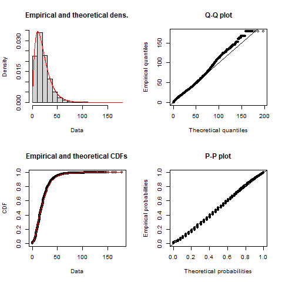

```{r knitr-setup, include=FALSE}
knitr::opts_chunk$set(
  echo = FALSE,
  cache = TRUE,
  comment = '', 
  out.width = "1\\linewidth"
)
```

```{r load-packages, include=FALSE, cache=FALSE}
library(AccessPack)
library(dplyr)
library(fitdistrplus)
library(ggplot2)
library(kableExtra)
library(patchwork)
library(sf)
library(scales)
library(ggpmisc)
library(ggrepel)
library(cowplot)
library(ggspatial)
# library(extrafont)
# font_import()
# loadfonts(device = "win")

options(scipen = 999)
```

\newpage

# Introduction

The concept of accessibility is a relatively simple one whose appeal derives from combining the spatial distribution of opportunities and the cost of reaching them [@hansen1959]. Numerous methods for calculating accessibility have been proposed that can be broadly organized into infrastructure-, place-, person-, and utility-based measures [@geurs2004]. Of these, the place-based family of measures is arguably the most common, capturing the number of opportunities reachable from an origin using the transportation network. This type of measure is also referred to as a gravity-based measure of accessibility that captures the potential for interaction.

What accessibility measures is sometimes referred to as _opportunity access_ and the analysis of opportunity access  is widely employed in transportation, geography, public health, and many other areas, and there is increasing emphasis on a shift from mobility-oriented to access-oriented planning [@deboosere2018; @handy2020; @proffitt2017; @yan2021]. However, while these types of opportunity access measures are excellent indicators of the intersection between urban structure and transportation infrastructure, they have been criticized in the past for not being highly interpretable. Previous research has highlighted how the weighting of opportunities using an impedance function can make gravity measures more difficult for planners and policymakers to interpret compared to simpler cumulative opportunity measures [@geurs2004; @miller2018]. Moreover, because place-based measures are sensitive to the number of opportunities and the characteristics of the transportation network, raw values cannot be easily compared across study areas [@allen2019].

Intra- and inter-regional comparisons are challenging because gravity-based accessibility indicators are spatially smoothed estimates of the total number of opportunities, however, the meaning of their magnitudes is unclear. This is evident when we consider the "total accessibility" in the region, a quantity that is not particularly meaningful since it is not constrained to resemble, let alone match the number of opportunities available. Furthermore, while accessibility depends on the supply of destination opportunities weighted by the travel costs associated with reaching them, the calculated accessibilities are not sensitive to the demand for those opportunities at the origins. Put another way, traditional measures of place-based accessibility do not capture the competition for opportunities. This theoretical shortcoming [@geurs2004] is particularly problematic when those opportunities are "non-divisible" in the sense that, once they have been taken by someone, are no longer available to other members of the population. Examples of indivisible opportunities include jobs (when a person takes up a job, the same job cannot be taken by someone else) and placements at schools (once a student takes a seat at a school, that particular opportunity is no longer there for another student). From a different perspective, employers may see workers as opportunities, so when a worker takes a job, this particular individual is no longer in the available pool of candidates for hiring.

To remedy these issues, researchers have proposed several different approaches for calculating competitive accessibility values. On the one hand, this includes several approaches that first normalize the number of opportunities available at a destination by the demand for them from the origin zones and, second, sum the demand-corrected opportunities which can be reached from the origins [e.g. @joseph1984; @shen1998]. These advances were popularized in the family of two-step floating catchment area methods [@luo2003] that have found widespread adoption for calculating competitive accessibility to healthcare and other uses. In principle floating catchment areas purport to account for competition/congestion effects, although in practice several researchers [e.g., @delamater2013spatial; @wan2012three] have found that they tend to over-estimate the level of demand and/or service. The underlying issue, as demonstrated by @paez2019, is the multiple counting of both population and level of service, which can lead to biased estimates if not corrected.

A second approach is to impose constraints on the gravity model to ensure flows between zones are equal to the observed totals. Based on Wilson's [-@wilson1971] entropy-derived gravity model, researchers can incorporate constraints to ensure that the modeled flows match some known quantities in the data inputs. In this way, models can be singly-constrained to match the row- or column-marginals (the trips produced or attracted, respectively), whereas a doubly-constrained model is designed to match both marginals. Allen and Farber [-@allen2019] recently incorporated a version of the doubly-constrained gravity model within the floating catchment area approach to calculate competitive accessibility to employment using transit across eight cities in Canada. But while such a model can account for competition, the mutual dependence of the balancing factors in a doubly-constrained model means they must be iteratively calculated which makes them more computationally-intensive. Furthermore, the double constraint means that the sum of opportunity-seekers and the sum of opportunities must match, which is not necessarily true in every case (e.g., there might be more people searching for work than jobs exist in a region).

In this paper we propose an alternative approach to measuring competitive accessibility. We call it a measure of **spatial availability** (SA), and it aims to capture the number of indivisible opportunities that are not only _accessible_ but also _available_ to the opportunity-seeking population, in the sense that they have not been claimed by a competing seeker of the opportunity. As we will show, spatial availability is a singly-constrained measure of accessibility. By allocating opportunities in a proportional way based on demand and distance, this method avoids the issues of conglomeration that result from multiple counting of opportunities in traditional accessibility measures. The method returns meaningful accessibilities that correspond to the rate of available opportunities per person. Moreover, the method also returns a benchmark value for the region under study against which results for individual origins can be compared.

In the following sections we will describe and illustrate this new measure using simple numerical examples. First, we will describe the measure. Second, we will calculate the SA using a simple hypothetical population and employment centers data set for three use-cases: one of jobs from the perspective of the population, another considering catchment restrictions, and another of workers from the perspective of employers. Thirdly, we calculate the SA using real world data for the Transportation Tomorrow Survey (TTS) home-to-work commute in 2016 for the Greater Golden Horseshoe (GGH) area in Ontario, Canada. Finally, we discuss the differences between accessibility estimates to the proposed measure of SA and the potential range of uses of the SA measure.

<!-- is it worth explaining some concepts in greater detail or is this redundant for the audience? i.e. gravity-based measures, raw accessibility values, floating catchment methods, the idea of marginals, a competitive vs. non-competitive opportunity, etc -->

# Background {#background}

Most accessibility measures (excluding utility-based measures) are derived from the gravity model and follow the widely used formulation in (\ref{eq:conventional-accessibility}). A thorough explanation of this conventional accessibility measure through a numerical example and its limitations are detailed in this section. The limitations of the conventional accessibility measure, namely issues in interpretation and basis, are the motivation for the _spatial availability_ measure which we propose and describe in the following sections. 

\begin{equation}
\label{eq:conventional-accessibility}
A_i = \sum_{j=1}^JO_jf(c_{ij})
\end{equation}

\noindent where:

-   $A$ is accessibility. 
-   $i$ is a set of origin locations.
-   $j$ is a set of destination locations.
-   $O_j$ is the number of opportunities at location $j$. These are opportunities for activity and add some sort of *supply* to the area;
-   $c_{ij}$ is a measure of the cost of moving between $i$ and $j$
-   $f(\cdot)$ is an impedance function of $c_{ij}$; it can take the form of any monotonically decreasing function (e.g., negative exponential distribution) .

The accessibility value $A_i$ is the weighted sum of opportunities that can be reached from location $i$, given the cost of travel $c_{ij}$ determined by the impedance function $f(\cdot)$. Summing the opportunities in the neighborhood of $i$ (the neighborhood is defined by the impedance function) estimates of the total number of opportunities that can be reached from $i$ at a certain cost. The type of accessibility value $A_i$ can be changed depending on the impedance function, the measure could be cumulative opportunities (if $f(\cdot)$ is a binary or indicator function e.g., [XX]) or a more traditional gravity measure (e.g., a Gaussian impedance function [XX], inverse cost impedance function [XX], ..).  <!--- more citations--> .

We use a simple numerical example to introduce the key concepts, and we will use the usual accessibility measure for comparison. In this way, we aim to show the differences between accessibility and spatial availability, which helps to explain how spatial availability can improve interpretability in the analysis of spatially dispersed opportunities.

## Accessibility Numerical Example {#accessibility-numerical-example}

The setup for the simple numerical example is a system with three employment centers and nine population centers, as summarized in Table \ref{tab:toy-example}. The access to jobs for each population center is calculated using the conventional accessibility measure $A_i$ (\ref{eq:conventional-accessibility}). In this numerical example we use the straight line distance between the population and jobs for $c_{ij}$ and a negative exponential function with $\beta = 0.0015$. <!-- why? is this value within a common range-->. As noted, $A_i$ represents the number of jobs (i.e., opportunities) that can be reached from each population center given the estimated cost as depicted in Figure \ref{fig:toy-example-accessibility}. 

```{r toy-example, eval = FALSE}
ggplot(data = toy_sim_zones) + 
  geom_sf(aes(color = type,
              shape = type,
              size = number)) +
  geom_sf_text(aes(label = id_short),
               size = 3,
               nudge_y = -600) +
  scale_size(range = c(2, 7))  + 
  theme(legend.position = "none",
        axis.text = element_blank(),
        panel.grid = element_blank(),
        panel.background = element_rect(size = 1, 
                                        color = "black", 
                                        fill = NA))
```

```{r create-figure-with-toy-example, fig.height=2, include=FALSE}
ggplot(data = toy_sim_zones) + 
  geom_sf(aes(color = type,
              shape = type,
              size = number)) +
  geom_sf_text(aes(label = id_short),
               size = 3,
               nudge_y = -600) +
  scale_size(range = c(2, 7))  + 
  theme(legend.position = "none",
        axis.title = element_blank(),
        axis.text = element_blank(),
        panel.grid = element_blank(),
        panel.background = element_rect(size = 1, 
                                        color = "black", 
                                        fill = NA))

ggsave("images/figure-1.png",
       width = 3,
       height = 2)
```

```{r toy-example-table}
toy_sim_zones %>%
  st_drop_geometry() %>%
  dplyr::select(-id) %>%
  mutate(fig = "") %>%
  kable(format = "latex",
        booktabs = TRUE,
        col.names = c("id", "number", "type", ""),
        caption = "\\label{tab:toy-example}Numerical example") %>%
  #kable_styling(latex_options = c("scale_down")) %>%
  column_spec(4, 
              image = "images/figure-1.png") %>%
  collapse_rows(columns = 4, 
                latex_hline = "major", 
                valign = "middle")
```

 

```{r toy-example-accessibility}
# Calculate impedance function
beta <- 0.0015
toy_od_table <- toy_od_table %>%
  mutate(f = exp(-beta * distance))

# using the origin-destination table (OD) of all origin to destination trips; filter in only jobs which are mean distance or less away from a population center and sum number of jobs available in each origin (population center)
c_accessibility <- toy_od_table %>% 
  mutate(A_ij = f * Jobs) %>%
  group_by(Origin) %>%
  summarise(A_i = sum(A_ij))

#pass conventional accessibility calculation into the spatial object (toy_sim_zones)
toy_sim_zones_access  <- toy_sim_zones %>% 
  left_join(c_accessibility, 
            by = c("id" = "Origin")) 
```

```{r toy-example-accessibility-plot, fig.cap="\\label{fig:toy-example-accessibility}Accessibility of jobs from population centers for the simple numerical example"}
# Plot the accessibility to employment in the example;
ggplot() +
  geom_sf(data = toy_sim_zones_access %>% 
            filter(type == "population"),
          aes(fill = A_i, size = A_i, shape = type)) +
  geom_sf(data = toy_sim_zones_access %>%
            filter(type == "jobs"),
          aes(shape = type,
              size = number),
          fill = "black") +
  geom_sf_text(data = toy_sim_zones_access , aes(label = id_short),
               size = 3, nudge_y = -400) +
  scale_shape_manual(values = c('population' = 24, 'jobs' = 21), 
                     name = "Location Type", 
                     labels=c("Population", "Jobs"),
                     guide = guide_legend(order = 2)) +
  guides(shape =guide_legend(override.aes=list(size=5))) +
  scale_size_continuous(range = c(2,7), name = "Accessibility \n(A_i)", guide = "none") +
  scale_fill_distiller(palette = "OrRd", direction = 1, name = "Accessibility \n(A_i)",
                       limits = c(0, max(toy_sim_zones_access$A_i)),
                       guide = guide_colorbar(order = 1)) +
  theme(legend.position = "right", axis.text = element_blank(), axis.title = element_blank(),
        panel.grid = element_blank(),
        panel.background = element_rect(size = 1.5, 
                                        color = "grey", 
                                        fill = "gray95"))
```
Figure \ref{fig:toy-example-accessibility} depicts three employment centers locations (black circles), where the size of the symbol is in proportion to the number of jobs at each location. We also see nine population centers (triangles), where the size of the symbol is proportional to the accessibility ($A_i$) to jobs. The accessibility values illustrates the following:

-   Population centers (triangles) in the middle of the plot are relatively close to all three employment centers and thus have the highest levels of job accessibility. Population center `r toy_sim_zones_access %>% slice_max(A_i, n=1) %>% pull(id_short)` is relatively central and close to all employment centers, and it is the closest population to the second largest employment center in the region. Unsurprisingly, this population center has the highest accessibility `r  toy_sim_zones_access %>% slice_max(A_i, n=1) %>% pull(A_i) %>% round(2)`);

-   Population centers (triangles) near the left edge of the map (only in proximity to the small employment center) have the lowest levels of job accessibility. Population center `r toy_sim_zones_access %>% slice_min(A_i, n=1) %>% pull(id_short)` is quite peripheral and the closest employment center is also the smallest one. Consequently, it has the lowest accessibility with $A_i=$ `r toy_sim_zones_access %>% slice_min(A_i, n=1, with_ties = F) %>% pull(A_i) %>% round(2)`);

### Issues With the Conventional Accessibility Measure

Accessibility measures are excellent indicators of the intersection between urban structure and transportation infrastructure <!-- cite -->. However, beyond enabling comparisons of relative values they are not highly interpretable on their own. For instance, from Figure \ref{fig:toy-example-accessibility}, `r toy_sim_zones_access %>% slice_min(A_i, n=1) %>% pull(id_short)` has lower accessibility than `r toy_sim_zones_access %>% slice_max(A_i, n=1) %>% pull(id_short)` but despite the accessibility value for `r toy_sim_zones_access %>% slice_min(A_i, n=1) %>% pull(id_short)` being relatively low it is still better than _zero_. To address this interpretability issue, previous research index and normalize values on a per-capita basis <!-- cite -->. However, as recent critical research on accessibility discusses (see for instance Paez, Higgins, Vivona [-@paez2019] and Allen and Farber [-@allen2019]), these steps do not address the bias introduced through the uneven multiple-counting of opportunities which are unconstrainted by demand-side competition. We call this issue the 'conglomeration effect' and it arises as a result of the underlying mathematical assumption that for conventional accessibility $A_i$ all opportunities for all origins $i=1,\cdots,n$ are divisible and non-competitive. This results in every opportunity entering the weighted sum once for every origin $i$ that can reach it. Put another way, if a densely populated population center pops up next to `r toy_sim_zones_access %>% slice_max(A_i, n=1) %>% pull(id_short)` this center too will have a high accessibility score since $A_i$ does not consider competition of opportunities from neighbouring demand centers. This neglect to constraint opportunity counts (i.e., single-constraint) obscures the interpretability of accessibility which may manifests in the following two ways of biased estimation:

1) less dense urban periphery demand centers may be assigned disproportionately _high_ accessibility values. These periphery areas are traditionally located in proximity to more dense urban demand centers and large urban opportunity centers and thus may have low travel cost to these large opportunity centers. Accessibility $A_i$ does not consider opportunity-constraints and as such these periphery demand centers benefit from the high accessibility to opportunities without competition considerations from their more dense and more centrally located neighbours. 

2) remote/isolated areas which are still within the region of the analysis and have regionally-relative low demand centers, opportunity centers, and travel cost to opportunity centers, are assigned disproportionately _low_ accessibility values. These remote/isolated areas may be sufficiently supplied with opportunities proportionate to their demand but is obscured by the artificially high accessibility awarded to periphery/other areas in which conglomeration disproportionally occurs. 

The spatially uneven multiple-counting of opportunities (i.e., the conglomeration effect) leave decision makers unclear on how to interpret resulting access values and all recent accessibility measures which seek to improve interpretability are either vulnerable to this impact or require potentially unrealistic assumptions <!-- cite -->. For instance, the floating catchment areas (FCA) method increases interpretability by purporting to account for competition, however, as discussed by Paez, Higgins, and Vivona [-@paez2019], FCA methods are vulnerable to conglomeration effect. On this same note, the doubly-constrained gravity model proposed by Allen and Farber [-@allen2019] which is based on the FCA method accounts for competition but requires that the magnitude of demand matches the opportunities. As already mentioned, this assumption is not always realistic for many opportunity types such as in the case of job seekers and jobs.  

To address the conglomeration effect and introduce a more realistic assumption for opportunities, we propose a singly-constrained gravity measure called **spatial availability**. This measure fundamentally seeks to answer for a individual at a specific population center the following questions: _"many jobs are accessible, but the same jobs are also accessible to my (possibly) numerous neighborus... what does a high accessibility actually mean to me?"_ and _"few jobs are accessible but I am located in a remote area with proportionally few neighbours... what does low accessibility mean to me?"_. 

## The Analytical Framework of Spatial Availability

Spatial availability $V_{ij}$ is defined by opportunities $O$ which are proportionally allocated based on the relative population allocation factor $F^p_{ij}$ and cost of travel allocation factor $F^c_{ij}$ for all origins $i$ to all destinations $j$ as detailed in (\ref{eq:spatial-availability}). In line with the gravity tradition, the proposed framework distinguishes between opportunities at a destination and demand for opportunities at the origin. 

\begin{equation}
\label{eq:spatial-availability}
V_{ij} = O_j\frac{F^p_{ij} \cdot F^c_{ij}}{\sum_{i=1}^K F^p_{ij} \cdot F^c_{ij}}
\end{equation}

\noindent where:

-   $V_{ij}$ is spatial availability. 
-   $i$ is a set of origin locations in the region $K$.
-   $j$ is a set of destination locations in the region $K$.
-   $O_j$ is the number of opportunities at location $j$ in the region $K$.
-   $F^p_{ij}$ is the proportional allocation factor of the population in $i$ relative to the population in region $K$.
-   $F^c_{ij}$ is the proportion allocation factor of travel cost for $i$ relative to the travel cost in region $K$; it is a product of a monotonically decreasing (i.e., impedance) function associated with the cost of travel between $i$ and $j$.

To explain the analytical framework, the calculation of _job access_ is illustrated with a simple step-by-step example for two population centers ($P_2$ and $P_3$) in the role of demand (i.e., the number of individuals in the labour market who "demand" employment) and one employment center ($O_1$) in the role of opportunities. 

Additionally, since spatial availability $V_{ij}$ consists of these two allocation factors, we detail first how the role of population allocation factor $F^p_{ij}$ in producing $V^p_{ij}$, next the role of the travel cost allocation factor $F^c_{ij}$ in producing $V^c_{ij}$, and finally how both allocation factors in the final general form of spatial availability $V_{ij}$ are combined. <!-- Is this approach to explaining correct? how do V^p and V^c interact?  -->

### Population and Travel Cost Allocation Factors

We begin with allocation based on demand; consider an employment center $j$ with $O_j^r$ jobs of type $r$. In the general case where there are $K$ population centers in the region, the following factor can be defined (\ref{eq:pop-alloc-factor}). 

\begin{equation}
\label{eq:pop-alloc-factor}
F^p_{ij} = \frac{P_{i\in r}^\alpha}{\sum_{i=1}^K P_{i\in r}^\alpha}
\end{equation}

The population allocation factor $F^p_{ij}$ corresponds to the proportion of the population in origin $i$ relative to the rest of the region's population centres $K$. On the right hand side of the equation, the numerator $P_{i\in r}$ is the population at origin $i$ that is eligible and 'demand' jobs of type $r$ (maybe those with a certain level of training or in a designated age group). The summation in the denominator is over $i=1,\cdots,K$, the number of population at all origins $i$ in the region $K$. To modulate the effect of the size in from this factor we also add an empirical parameter $\alpha$ (i.e., $\alpha <1$ places greater weight on smaller centres relative to larger ones while $\alpha>1$ achieves the opposite effect). This population allocation factor $F^p_{ij}$ can now be used to proportionally allocate a share of the jobs at a destination $j$ to all origin pairs. 

More broadly, since the factor $F^p_{ij}$ is a proportion, when it is summed over $i=1,\cdots,K$ it always equals to 1 (i.e., $\sum_i^{K} F^p_{ij} = 1$). This is notable since the share of jobs (the spatial availability based on population $V^p_{ij}$) at each destination $j$ allocated to (i.e., available to) each origin is equal to $V^p_{ij} = O_j \cdot F^p_{ij}$ and since the sum of F^p_{ij} is equal to 1 it follows that $\sum_{i=1}^I V_{ij} = O_j$. In other words, the number of jobs across the region is preserved. The result is a proportional allocation of jobs (opportunities) to origins based on population demand; this factor does not consider travel cost, that is defined in the travel cost allocation factor $F^c_{ij}$ which is introduced shortly. 

To illustrate the population allocation factor, consider an employment center has 300 jobs ($O_1= 300$) in a region with two population centers which have 240 and 120 people, respectively, ($P_2= 240$ and $P_3 = 120$). For simplicity, assume that all the population in the region is eligible for these jobs, that is, that the entirety of the population is included in the set $r$.  Also assume that $\alpha=1$ meaning the only impact on value is the population size for each center. The population allocation factors $F^p_{ij}$ for the jobs at $O_1$ for each population center $P_2$ and $P_3$ would be defined as (\ref{eq:pop-alloc-factor-2populations}). 

\begin{equation}
\label{eq:pop-alloc-factor-2populations}
\begin{array}{l}\
F^p_{2,1} = \frac{P_2 ^\alpha}{P_2^\alpha + P_3^\alpha} = \frac{240}{240 + 120} = \frac{240}{360}\\
F^p_{3,1} = \frac{P_3^\alpha}{P_2^\alpha + P_3^\alpha}  = \frac{120}{240 + 120} = \frac{120}{360}\\
\end{array}
\end{equation}


The $F^p_{ij}$ values can be used to find a _partial_ spatial availability of jobs which is only defined by the relative population demanding jobs; this partial spatial availability $V^p_{ij}$ for each population center would be calculated as follows in (\ref{eq:pop-alloc-factor-SA-2populations}). 

\begin{equation}
\label{eq:pop-alloc-factor-SA-2populations}
\begin{array}{l}\
V^p_{2,1} = O_1 \cdot F^p_{2,1} = 300 \cdot \frac{240}{360} = 200 \\
V^p_{3,1} = O_1 \cdot F^p_{3,1} = 300 \cdot \frac{120}{360} = 100 \\
\end{array}
\end{equation}

It can be seen that when using only the proportional allocation factor $F^p_{ij}$ to calculate spatial availability (differentiated here by being defined as $V^p_{ij}$ instead of $V_{ij}$), proportionally more jobs are allocated to the bigger population center (i.e., 2 times more jobs as it is 2 times larger in population). We can also see that the sum of spatial availability for all population centers is equal to the sum of jobs, i.e., total opportunities are preserved. However, as mentioned, using only the proportional allocation factor $F^p_{ij}$ to calculate spatial availability does not account for how far population centers $P_2$ or $P_3$ are from employment center $O_1$. To account for this effect we introduce a second allocation factor $F^c_{ij}$ based on distance to the employment centers defined in (\ref{eq:tcost-alloc-factor}).

\begin{equation}
\label{eq:tcost-alloc-factor}
F^c_{ij} = \frac{f(c_{ij})}{\sum_{i=1}^K f(c_{ij})}\\
\end{equation} 

Where $c_{ij}$ is the cost (e.g., the distance, travel time, etc.) from population center $i$ to employment center $j$, and $f(\cdot)$ is an impedance function that is a monotonically decreasing function of cost ($c_{ij}$); in other words, the travel cost allocation factor $F^c_{ij}$ serves to proportionally allocates more jobs to closer locations through an impedance function. To continue illustrating, assume that the impedance function is a negative exponential function and assume that $\beta$ (which modulates the steepness of the impedance effect and is an empirical parameter) is the value of 1 for simplicity. Also suppose that the distance from population center $P_2$ to employment center $O_1$ is 0.6 km, and the distance from population center $P_3$ to employment center $O_1$ is 0.3 km. The proportional allocation factor $F^p_{ij}$ for the jobs at $O_1$ for both population centers $P_2$ and $P_3$ is defined as follows (\ref{eq:tcost-allocation-factor-2populations}). 

\begin{equation}
\label{eq:tcost-allocation-factor-2populations}
\begin{array}{l}\
F^c_{2,1} = \frac{\exp(-\beta \cdot D_{2,1})}{\exp(-\beta \cdot D_{2,1}) + \exp(-\beta \cdot D_{3,1})} = \frac{\exp(-0.6)}{\exp(-0.6) + \exp(-0.3)} = 0.426\\
F^c_{3,1} = \frac{\exp(-\beta \cdot D_{3,1})}{\exp(-\beta \cdot D_{2,1}) + \exp(-\beta \cdot D_{3,1})}  = \frac{\exp(-0.3)}{\exp(-0.6) + \exp(-0.3)} = 0.574\\
\end{array}
\end{equation}

We can see that the proportional allocation factor for $P_3$ is larger than $P_2$ since the distance to $O_1$ is shorter. Using the travel cost proportional allocation factors $F^c_{ij}$ as defined in (\ref{eq:tcost-allocation-factor-2populations}), we can now calculate the spatial availability of jobs for each population center based only on $F^c_{ij}$ and the jobs available $O_1$ to these two competing population centers (note: $V^c_{ij}$ not the complete $V_{ij}$) as follows in (\ref{eq:tcost-allocation-factor-SA-2populations}).

\begin{equation}
\label{eq:tcost-allocation-factor-SA-2populations}
\begin{array}{l}\
V^c_{2,1} = O_1 \cdot F^c_{2,1} = 300 \times 0.426 = 127.8\\
V^c_{3,1} = O_1 \cdot F^c_{3,1} = 300 \times  0.574 = 172.2\\
\end{array}
\end{equation}

As shown, the spatial availability defined by $F^c_{ij}$ (i.e., $V^c_{ij}$) allocates $P_3$ a larger share of jobs since the population center is closer to $O_1$. However, as previously discussed, $P_3$ has a smaller population than $P_2$, so $P_2$ receives a larger share of jobs when spatial availability when it is defined by $F^p_{ij}$ (i.e., $V^p_{ij}$). It is necessary to combine both population and travel cost factors to accurate reflect demand; these two components are in line with how demand is conventionally modelled in accessibility calculations<!-- cite -->. Fortunately, since both $F^c_{ij}$ and $F^p_{ij}$ preserve the total number of opportunities (jobs) as they independently sum to 1, they can be combined multiplicatively to calculate the proposed spatial availability ($V_{ij}$) which considers demand to be based on both population and travel cost. 


### Putting Spatial Availability Together

We can combine the proportional allocation factors by population $F^p_{ij}$ and travel cost $F^c_{ij}$ and calculate spatial availability $V_{ij}$ as introduced in (\ref{eq:spatial-availability}) and repeated below:

$$
V_{ij} = O_j\frac{F^p_{ij} \cdot F^c_{ij}}{\sum_{i=1}^K F^p_{ij} \cdot F^c_{ij}}
$$

To complete the illustrative example of employment center $O_1$ and population centers $P_2$ and $P_3$, the resulting spatial availability $V_{ij}$ is calculated for both population centers is calculated in (\ref{eq:SA-2populations}). 

\begin{equation}
\label{eq:SA-2populations}
\begin{array}{l}\
V_{2,1} = O_1\cdot \frac{F^p_{2,1} \cdot F^c_{2,1}}{F^p_{2,1} \cdot F^c_{2,1} + F^p_{3,1} \cdot F^c_{3,1}} = 300 \frac{\big(\frac{2}{3} \big) \big(0.426 \big)}{\big(\frac{2}{3} \big) \big(0.426 \big) + \big(\frac{1}{3} \big) \big(0.574 \big)} = 179.4\\
V_{3,1} = O_1\cdot \frac{F^p_{3,1} \cdot F^c_{3,1}}{F^p_{2,1} \cdot F^c_{2,1} + F^p_{ik} \cdot F^c_{ik}} = 300 \frac{\big(\frac{1}{3} \big) \big(0.574 \big)}{\big(\frac{2}{3} \big) \big(0.426 \big) + \big(\frac{1}{3} \big) \big(0.574 \big)}  =  120.6 \\
\end{array}
\end{equation}

As can be seen, fewer number of jobs are allocated to population center $P_2$ compared to the allocation by population only, to account for the higher cost of reaching the employment center. On the other hand, distance alone allocated more jobs to the closest population center (i.e., $P_3$), but since it is smaller, it also gets a smaller share of the jobs overall. To reiterate, the sum of jobs at employment center $O_1$ that are allocated to population centers $P_2$ and $P_3$ simultaneously based on *population-* and *travel cost* allocation factors are preserved (i.e., $V_{2,1} + V_{3,1} = O_1$).

In the common case that population centers have multiple destination opportunities $j$, availability is simply the sum of (\ref{eq:spatial-availability}) for all opportunities $J$ (i.e., $V_i = \sum_{j=1}^J V_{ij}$). This quantity represents opportunities (e.g., jobs) that can be accessed from $i$ and that are *not* allocated to a competitor: therefore the weighted sum of available opportunities. Compare $V_i$ to the singly-constrained gravity model (see Wilson [-@wilson1971]) <!-- detail? -->. In essence, $V_i$ is the result of constraining $A_i$ to match one of the marginals in the origin-destination table, the known total of opportunities.

Since the sum of opportunities is preserved in the procedures above, it is possible to calculate a highly interpretable measure of spatial availability per capita (lower-case $v_i$) as follows in (\ref{eq:SA-per-capita}).

\begin{equation}
\label{eq:SA-per-capita}
v_i = \frac{V_i}{P_i}
\end{equation}

To complete the illustrative example, the per capita spatial availability of jobs would be calculated as follows in (\ref{eq:SA-per-capita-2populations}). 

\begin{equation}
\label{eq:SA-per-capita-2populations}
\begin{array}{l}\
v_{2,1} = \frac{V_{2,1}}{P_2} =  \frac{179.4}{240} = 0.8\\
v_{3,1} =  \frac{V_{3,1}}{P_3} =  \frac{120.6}{120} = 1.0\\
\end{array}
\end{equation}

We can see that since $P_3$ is closer to $O_1$ and has less competition (as it has a smaller population than $P_2$), $P_3$ benefits with a higher spatial availability of jobs per capita. 

Where the overall ratio of jobs to population in the region is $300/(240 + 120)=$ `r round(300/(240 + 120), 2)`, the spatially available jobs per capita at $k$ is closer to unity. <!--?? -->

<!-- concluding sentences  -->

# Empirical Example: Spatial Availability and Accessibility of Jobs in Toronto

In this section, we calculate both spatial availability () and accessibility () using empirical data for home-based work trips in the Greater Golden Horseshoe (GGH) area. We first introduce the data used, then illustrate two cases in which the multiple-counting property of accessibility obscurs intrepretability and spatial availability addresses it. 

## Data

The 2016 Transportation Tomorrow Survey (TTS) data for 20 municipalities contained within the GGH area in the province of Ontario, Canada (43.6°N 79.73°W) is analysed (Figure \ref{fig:TTS-16-survey-area}). This data set includes home-based origins and employment destinations defined by centroids of Traffic Analysis Zones (TAZ) of varying areas (n=`r round(length(AccessPack::ggh_taz$GTA06), 3)`), the number of jobs (n=`r round(sum(AccessPack::ggh_taz$jobs), 3)`) and workers (n=`r round(sum(AccessPack::ggh_taz$workers), 3)`) at each origin and destination, and the trips from origin to destination for the morning home-to-work commute (n=`r round(sum(AccessPack::od_ft_tt$trips), 3)`). Also included are calculated travel times by car (calculated via [`r5r`](https://github.com/ipeaGIT/r5r)) and a derived impedance function values corresponding to the cost of travel based on the trip length distribution (TLD). The descriptive statistics are presented in Table \ref{tab:TTS-16-desc-stats} and a [data-package](https://github.com/soukhova/AccessPack) is available to explore the data in greater detail.

```{r TTS-16-survey-area, echo=FALSE, fig.cap="\\label{fig:TTS-16-survey-area}The TTS 2016 study area within the Greater Golden Horseshoe in Ontario, Canada.", out.width="70%", fig.align='center'}

```

```{r}
od_ft_tt %>% 
  dplyr::select(trips, travel_time) %>% summary() %>%
  kable(format = "latex", 
        col.names = c("Trips", "Travel_Time"),
        caption = "\\label{tab:TTS-16-desc-stats}Descriptive statistics of the TTS 2016 dataset for the Greater Golden Horshoe Area")
```

## Calibrating an Impedance Function

In the hypothetical toy data set, an arbitrary negative exponential function describing the increase in travel cost as distance increases was used as the impedance function to derive both accessibility and availability. In this data set, an impedance function can be derived from the empirical trip length distribution (TLD) as the number of trips and their travel cost (in the case, travel time in minutes) are known (see black data points in Figure \ref{fig:TLD-Gamma-plot}).

The TLD density plot appears to follow a gamma distribution, as such, this theoretical distribution along with other common TLD distributions such as log-normal and exponential distributions <!-- cite--> were fitted to the empirical TLD using the maximum likelihood estimation method and Nelder-Mead method for direct optimization available within the fitdistrplus package in R [@fitdistrplus_2015; @R_2021] <!-- cite, why this fitting method -->. Based on goodness-of-fit criteria, the gamma distribution was selected (see red line in Figure \ref{fig:TLD-Gamma-plot}). The gamma distribution function is given in the following general form: 
$$ 
f(x, \alpha, \beta) = \frac {x^{\alpha-1}e^{-\frac{x}{\beta}}}{ \beta^{\alpha}\Gamma(\alpha)} \quad \text{for }	0 \leq x \leq \infty
$$
\noindent where the estimated 'shape' is $\alpha$,the estimated 'rate' is $\beta$, and $\Gamma(\alpha)$ is defined as:

$$
\Gamma(\alpha) =  \int_{0}^{\infty} x^{\alpha-1}e^{-x} \,dx
$$  

```{r data-for-impedance}
# remove all NA trips from dataset and set all 0min travel times to 0.1 min
od_ft_tt  <- od_ft_tt %>% 
  filter( !is.na(travel_time)) %>% 
  mutate(travel_time = ifelse(travel_time == 0, 0.1, travel_time))
all_tt <- od_ft_tt  %>% 
  dplyr::select(trips, travel_time)

all_tt <- all_tt[rep(seq_len(dim(all_tt)[1]), all_tt$trips), 2]
```

```{r fitting-impedance-function}
# using fitdist function to fit a distribution using the default maximum likelihood estimation method and Nelder-Mead method for direct optimization
gamma_ <- fitdistrplus::fitdist(data=all_tt, "gamma", method="mle", optim.method="Nelder-Mead") 
#lnorm_ <- fitdistrplus::fitdist(data=all_tt, "lnorm", method="mle", optim.method="Nelder-Mead")
#norm_ <-fitdistrplus::fitdist(data=all_tt, "norm", method="mle", optim.method="Nelder-Mead")
# #exp_ <- fitdistrplus::fitdist(data=all_tt, "exp", method="mle", optim.method="Nelder-Mead")
# pois_ <- fitdistrplus::fitdist(data=all_tt, "pois", method="mle", optim.method="Nelder-Mead") 
# nbinom_ <- fitdistrplus::fitdist(data=all_tt, "nbinom", method="mle", optim.method="Nelder-Mead")
# geom_ <- fitdistrplus::fitdist(data=all_tt, "geom", method="mle", optim.method="Nelder-Mead")
# beta_ <- fitdistrplus::fitdist(data=all_tt, "beta", method="mle", optim.method="Nelder-Mead")
# logis_ <- fitdistrplus::fitdist(data=all_tt, "logis", method="mle", optim.method="Nelder-Mead")
# 
# plot(gamma_)
# plot(pois_)
# plot(nbinom_)
# plot(geom_)
# plot(beta_)
# plot(logis_)
```

```{r save-impedance-plot, include=FALSE}
# For some reason plot(gamma_) does not play well with knitr, so instead we save the figure and then include it as a graphic in the following chunk
png("images/impedance_function.png")
plot(gamma_)
dev.off()
```

```{r plot-impedance-function, fig.cap="\\label{fig:impedance-function-plot}Impedance function and diagnostics."}

```

```{r TLD-gamma-calculation}
tld <- od_ft_tt %>%
  mutate(tt_classes = cut(travel_time, 
                          150,
                          ordered_result = TRUE)) %>%
  group_by(tt_classes) %>%
  summarize(trips = sum(trips),
            travel_time = mean(travel_time))

# processing data for plot
plot_data1 <- data.frame(estimate = "Empirical",
                         travel_time = tld$travel_time,
                         prop_trips = tld$trips/sum(tld$trips))
plot_data2 <- data.frame(estimate = "Calibrated",
                         travel_time = tld$travel_time,
                         prop_trips = dgamma(tld$travel_time, gamma_$estimate["shape"], gamma_$estimate["rate"]))
plot_data3 <- rbind(plot_data1, plot_data2)
plot_data3$estimate <- factor(plot_data3$estimate, levels=c("Empirical", "Calibrated"))

```

```{r TLD-Gamma-plot, fig.cap="\\label{fig:TLD-Gamma-plot}Empirical TTS 2016 home-based car trip length distribution (black) and calibrated gamma distribution impedance function (red)"}
#dgamma is the density plot for gamma function
ggplot(data = plot_data3, aes(x = travel_time, y = prop_trips, colour=estimate,linetype=estimate,shape=estimate)) + 
  geom_point(size = 2) +
  geom_line(size=1) +
  labs(title = "Trip length distribution",
       x = "Home-based car travel time to work (min)",
       y = "Proportion of trips") + 
      scale_color_manual("Distribution", 
                         values = c("Empirical" = "Black",
                                    "Calibrated" = "Red"))    +
      scale_linetype_manual("Distribution",values=c(0,1)) +
      scale_shape_manual("Distribution",values=c(16,NA))+
  theme_light() +
  theme(plot.title = element_text(hjust=0.5),
        legend.position = c(0.85,0.80),
        axis.line = element_line(colour = "black"),
        panel.border = element_blank()) 
  
```

The calibrated impedance function has a shape parameter of `r round(gamma_$estimate[1], 3)` and a rate parameter of `r round(gamma_$estimate[2], 3)`. The function and diagnostics are plotted in Figure \ref{fig:impedance-function-plot} and the predicted values are plotted alongside the empirical TLD in Figure \ref{fig:TLD-Gamma-plot}. As a point of summary, values calculated by this calibrated impedance function captures our theoretical cost of travel (i.e. probability of travel based on the trip length distribution of empirical trips and associated travel time) within the following accessibility and spatial availability calculations.

## Accessibility and Spatial Availability of Jobs in Toronto 

```{r calc-for-accessibility-Toronto}
#transform CRS
toronto_muni_bound <- st_transform(toronto_muni_bound, crs=32617)

#select only zones within Toronto Municipality

TO_taz <- ggh_taz %>%
  filter(st_intersects(., toronto_muni_bound, sparse = FALSE)[,1]) %>% dplyr::select(GTA06, AREA, jobs)

# transfer calibrated impedance function values to OD matrix
od_ft_tt <- od_ft_tt %>%
  mutate(f = dgamma(travel_time, gamma_$estimate["shape"], gamma_$estimate["rate"]))

#add the number of jobs and workers to the od_ft_tt matrix
od_ft <- od_ft_tt %>% merge(ggh_taz %>% dplyr::select(GTA06, workers) %>% st_drop_geometry(),
                   by.x = "Origin", by.y="GTA06", all.x = TRUE)

od_ft <- od_ft %>% merge(ggh_taz %>% dplyr::select(GTA06, jobs) %>% st_drop_geometry(),
                   by.x = "Destination", by.y="GTA06", all.x = TRUE)

#jobs at destinations IN Toronto and origins from anywhere; workers are associated with the origin (ggh) and jobs with the destination (Toronto)
TO_od_ft <- od_ft %>% filter(Destination %in% TO_taz$GTA06)

#calculate accessibility for workers from any origin to jobs in Toronto 
TO_c_accessibility <- TO_od_ft %>% 
  mutate(TO_A_ij = f * jobs) %>%
  group_by(Origin) %>%
  summarise(TO_A_i = sum(TO_A_ij, na.rm = T),
            trips_i = sum(trips, na.rm = T))

#Merge TO accessibly calculation to the ggh_taz:
TO_taz_acc <- ggh_taz %>% merge(TO_c_accessibility, by.x=c("GTA06"), by.y=c("Origin"), all.y=T) 
```

```{r calc-for-accessibility-GGH}
# transfer calibrated impedance function values to OD matrix
od_ft_tt <- od_ft_tt %>%
  mutate(f = dgamma(travel_time, gamma_$estimate["shape"], gamma_$estimate["rate"]))

#add the number of jobs and workers to the od_ft_tt matrix
od_ft <- od_ft_tt %>% merge(ggh_taz %>% dplyr::select(GTA06, workers) %>% st_drop_geometry(),
                   by.x = "Origin", by.y="GTA06", all.x = TRUE)

od_ft <- od_ft %>% merge(ggh_taz %>% dplyr::select(GTA06, jobs) %>% st_drop_geometry(),
                   by.x = "Destination", by.y="GTA06", all.x = TRUE)

#calculate accessibility for workers from any origin to jobs in Toronto 
GGH_c_accessibility <- od_ft %>% 
  mutate(GGH_A_ij = f * jobs) %>%
  group_by(Origin) %>%
  summarise(GGH_A_i = sum(GGH_A_ij, na.rm = T),
            trips_i = sum(trips, na.rm = T))

#Merge TO accessibly calculation to the ggh_taz:
GGH_taz_acc <- ggh_taz %>% merge(GGH_c_accessibility, by.x=c("GTA06"), by.y=c("Origin"), all.y=T) 
```

In this section we calculate _job access_ for subset of jobs and workers in the GGH to demonstrate the first property of the spatial availability measure: not including a the single-constraint in accessibility overestimates _job access_ for TAZ with a low proportion of workers (relative to TAZs with higher jobs). This is demonstrated by using the impedance function defined in the previous section and calculating accessibility and spatial availability to employment destinations only within the boundaries of Toronto from home-based origins anywhere in the GGH. It should be noted that Toronto represents a significant subset of workers and jobs in the GGH; `r percent(sum(TO_od_ft$workers)/sum(od_ft$workers))` of workers in the GGH travel to jobs in Toronto and  `r percent(sum(TO_od_ft$jobs)/sum(od_ft$jobs))` of jobs are located within Toronto. 

Accessibility is first calculated in which the higher the accessibility value, the more accessible places of employment are to home-based origins as seen in Figure \ref{fig:plot-accessibility-Toronto-TTS}. It can be briefly summarized that the accessibility values follow a radial trend where the majority of TAZs in Toronto have high accessibility values and values decrease in TAZs which are further from the city boundary.

Next, the spatial availability using the same impedance function is calculated for the same survey area; the higher the spatial availability value the more available employment destinations in Toronto are to any home-based origins in the GGH (Figure \ref{fig:plot-avail-Toronto-TTS}). If a TAZ has a spatial availability value which is higher or lower than `r round(mean(TO_taz_acc$TO_V_i), 3)` it has above or below average spatial availability of jobs relative to all job opportunities within the City of Toronto (for all origins in the GGH). Spatial availability can also be normalized per workers within each TAZ to provide meaningful insight on how many jobs are _available_ on average for each TAZ. This normalization, shown in Figure \ref{fig:plot-avail-Toronto-TTS-per-worker}, demonstrates which TAZ have above and below the average (`r round(mean(TO_taz_acc$TO_V_i)/mean(TO_taz_acc$worker), 3)`) available jobs per worker in the GGH (to jobs located within the city of Toronto). It can be briefly summarized that the spatial availability measure has a smaller and less pronounced radial impact than the accessibility measure; TAZs within and immediately outside the boundary of Toronto have above average spatial availability of jobs but at a lower relative intensity than compared to the availability measure. Additionally, more TAZs outside of Toronto have low spatial availability values.


```{r bbox-main-plot-accessibility-Toronto-TTS}
bbox_new1 <- st_bbox(toronto_muni_bound) # current bounding box

xrange <- bbox_new1$xmax - bbox_new1$xmin # range of x values
yrange <- bbox_new1$ymax - bbox_new1$ymin # range of y values

bbox_new1[1] <- bbox_new1[1] - (0.3 * xrange) # xmin - left
bbox_new1[3] <- bbox_new1[3] + (0.2 * xrange) # xmax - right
bbox_new1[2] <- bbox_new1[2] - (0.2 * yrange) # ymin - bottom
bbox_new1[4] <- bbox_new1[4] + (0.3 * yrange) # ymax - top

bbox_new <- bbox_new1 %>%  # take the bounding box ...
  st_as_sfc()
```

```{r calc-for-avail, include=FALSE, warning=FALSE, message=FALSE}
#calculate spatial availability
TO_od_ft <- TO_od_ft %>%
  mutate(catch = 1) %>%
  mutate(TO_V_ij = sp_avail(., 
                         o_id = Origin,
                         d_id = Destination,
                         pop = workers,
                         opp = jobs,
                         r = catch,
                         f = f))

#verify that the sum of all jobs is consistent with the number of jobs
sum(TO_od_ft$TO_V_ij, na.rm=T)
sum_jobs <- TO_od_ft %>% group_by(Destination) %>% summarise(jobs = mean(jobs))
sum(sum_jobs$jobs, na.rm = T)

#aggregating spatial availability  
TO_availability <- TO_od_ft %>%
  group_by(Origin) %>%
  summarize(TO_V_i = sum(TO_V_ij),
            TO_avgtt_i = mean(travel_time),
            TO_avg_f_i = mean(f)) 

#Merge TO availability calculation to the TAZ sf object created for accessibility above:
TO_taz_acc <- TO_taz_acc %>% merge(TO_availability, by.x=c("GTA06"), by.y=c("Origin"), all.x=T) 
```

```{r plot-access-SA-Toronto-TTS, fig.cap="\\label{fig:plot-access-SA-Toronto-TTS}Calculated accessibility (top) and spatial availability (bottom) of employment from origins in the GGH to destinations in the City of Toronto.", fig.width=7, fig.height=9}

## accessibility

#creating the main plot
mplot_access_TTS <- ggplot() +
  geom_sf(data = TO_taz_acc, aes(fill= TO_A_i), color = NA) + #data
    scale_fill_distiller(palette = "Spectral", #legend scale bar
                         name = "Accessibility \n(A_i)",
                         limits = c(0, 25000), 
                         na.value = "grey80") + 
  geom_sf(data = toronto_muni_bound, # border for Toronto
          colour=alpha("dimgrey",1), 
          size = 0.5, fill=NA, 
          show.legend = "polygon") +
  annotation_north_arrow(location = "tl", # north arrow for both the main plot and inset
                         height = unit(0.8, "cm"), 
                         width = unit(0.8, "cm"),
                         style = north_arrow_orienteering(line_width = 0.25,
                                                          line_col = "dimgrey", 
                                                          fill = c("white","dimgrey"))) +
  annotation_scale(bar_cols = c("dimgrey", "white"), # scale bar for both the main plot and inset
                   height = unit(0.15, "cm")) +
  geom_rect(data = data.frame(xmin = bbox_new1$xmin, ymin = bbox_new1$ymin, # rectangle on main plot marking inset location
                              xmax = bbox_new1$xmax, ymax = bbox_new1$ymax),
              aes(xmin = bbox_new1$xmin, ymin = bbox_new1$ymin, 
                  xmax = bbox_new1$xmax, ymax = bbox_new1$ymax),
            fill = NA, colour = "dimgrey", size = 1) +
  theme_void() +
  theme(legend.position = c(1.15, 0.75), 
        plot.margin = margin(t = 0, r = 0, b = 0, l = -80)) # positing legend and clipping out white space

#main plot + adding the inset map. 
mplot_access_TTS <- ggdraw(mplot_access_TTS) +
  draw_plot({mplot_access_TTS + coord_sf(xlim = st_coordinates(bbox_new)[c(1,2),1],
                                         ylim = st_coordinates(bbox_new)[c(2,3),2],
                                         expand = FALSE) + 
      theme(legend.position = "none")},
    x = 0.57, y = 0.01,  # The distance along a (0,1) x-axis (and y axis) to draw the left edge (the bottom edge) of the plot
    width = 0.46, height = 0.46) # The width and height of the plot expressed as proportion of the entire ggdraw object

mplot_SA_TTS <- ggplot() +
  geom_sf(data = TO_taz_acc, aes(fill= TO_V_i), color = NA) + #data
    scale_fill_distiller(palette = "Spectral", #legend scale bar
                         name = "Spatially Availability \n(V_i)",
                         limits = c(0, 15000), 
                         na.value = "grey80") + 
  geom_sf(data = toronto_muni_bound, # border for Toronto
          colour=alpha("dimgrey",1), 
          size = 0.5, fill=NA, 
          show.legend = "polygon") +
  annotation_north_arrow(location = "tl", # north arrow for both the main plot and inset
                         height = unit(0.8, "cm"), 
                         width = unit(0.8, "cm"),
                         style = north_arrow_orienteering(line_width = 0.25,
                                                          line_col = "dimgrey", 
                                                          fill = c("white","dimgrey"))) +
  annotation_scale(bar_cols = c("dimgrey", "white"), # scale bar for both the main plot and inset
                   height = unit(0.15, "cm")) +
  geom_rect(data = data.frame(xmin = bbox_new1$xmin, ymin = bbox_new1$ymin, # rectangle on main plot marking inset location
                              xmax = bbox_new1$xmax, ymax = bbox_new1$ymax),
              aes(xmin = bbox_new1$xmin, ymin = bbox_new1$ymin, 
                  xmax = bbox_new1$xmax, ymax = bbox_new1$ymax),
            fill = NA, colour = "dimgrey", size = 1) +
  theme_void() +
  theme(legend.position = c(1.15, 0.75), 
        plot.margin = margin(t = 0, r = 0, b = 0, l = -80)) # positing legend and clipping out white space

#main plot + adding the inset map. 
mplot_SA_TTS <- ggdraw(mplot_SA_TTS) +
  draw_plot({mplot_SA_TTS + coord_sf(xlim = st_coordinates(bbox_new)[c(1,2),1],
                                         ylim = st_coordinates(bbox_new)[c(2,3),2],
                                         expand = FALSE) + 
      theme(legend.position = "none")},
    x = 0.57, y = 0.01,  # The distance along a (0,1) x-axis (and y axis) to draw the left edge (the bottom edge) of the plot
    width = 0.46, height = 0.46) # The width and height of the plot expressed as proportion of the entire ggdraw object

## spatial availability
mplot_SA_TTS <- ggplot() +
  geom_sf(data = TO_taz_acc, aes(fill= TO_V_i), color = NA) + #data
    scale_fill_distiller(palette = "Spectral", #legend scale bar
                         name = "Spatially Availability \n(V_i)",
                         limits = c(0, 15000), 
                         na.value = "grey80") + 
  geom_sf(data = toronto_muni_bound, # border for Toronto
          colour=alpha("dimgrey",1), 
          size = 0.5, fill=NA, 
          show.legend = "polygon") +
  annotation_north_arrow(location = "tl", # north arrow for both the main plot and inset
                         height = unit(0.8, "cm"), 
                         width = unit(0.8, "cm"),
                         style = north_arrow_orienteering(line_width = 0.25,
                                                          line_col = "dimgrey", 
                                                          fill = c("white","dimgrey"))) +
  annotation_scale(bar_cols = c("dimgrey", "white"), # scale bar for both the main plot and inset
                   height = unit(0.15, "cm")) +
  geom_rect(data = data.frame(xmin = bbox_new1$xmin, ymin = bbox_new1$ymin, # rectangle on main plot marking inset location
                              xmax = bbox_new1$xmax, ymax = bbox_new1$ymax),
              aes(xmin = bbox_new1$xmin, ymin = bbox_new1$ymin, 
                  xmax = bbox_new1$xmax, ymax = bbox_new1$ymax),
            fill = NA, colour = "dimgrey", size = 1) +
  theme_void() +
  theme(legend.position = c(1.15, 0.75), 
        plot.margin = margin(t = 0, r = 0, b = 0, l = -80)) # positing legend and clipping out white space

#main plot + adding the inset map. 
mplot_SA_TTS <- ggdraw(mplot_SA_TTS) +
  draw_plot({mplot_SA_TTS + coord_sf(xlim = st_coordinates(bbox_new)[c(1,2),1],
                                         ylim = st_coordinates(bbox_new)[c(2,3),2],
                                         expand = FALSE) + 
      theme(legend.position = "none")},
    x = 0.57, y = 0.01,  # The distance along a (0,1) x-axis (and y axis) to draw the left edge (the bottom edge) of the plot
    width = 0.46, height = 0.46) # The width and height of the plot expressed as proportion of the entire ggdraw object

mplot_access_TTS / mplot_SA_TTS

```


```{r plot-avail-Toronto-TTS-per-worker, fig.cap="\\label{fig:plot-avail-Toronto-TTS-per-worker}Calculated spatial availability of employment, per worker, from origins in the GGH to destinations in the City of Toronto.", fig.width=7}
benchmark_TO_V_i_workers <- TO_taz_acc %>% st_drop_geometry() %>% summarise(avg_VO = sum(TO_V_i)/sum(workers)) %>% as.numeric()

mplot_SApW_TTS <- ggplot() +
  geom_sf(data = TO_taz_acc, aes(fill= TO_V_i/workers), color = NA) + #data
    scale_fill_gradient2(low = "deepskyblue4",
                         mid = "ghostwhite",
                         high = "red", #legend scale bar
                         name = "Spatially Availability \n per Worker (v_i)",
                         limits = c(0, max(TO_taz_acc$TO_V_i/TO_taz_acc$workers)), 
                         midpoint= benchmark_TO_V_i_workers, #average V_i per capita
                         ) + 
  geom_sf(data = toronto_muni_bound, # border for Toronto
          colour=alpha("dimgrey",1), 
          size = 0.5, fill=NA, 
          show.legend = "polygon") +
  annotation_north_arrow(location = "tl", # north arrow for both the main plot and inset
                         height = unit(0.8, "cm"), 
                         width = unit(0.8, "cm"),
                         style = north_arrow_orienteering(line_width = 0.25,
                                                          line_col = "dimgrey", 
                                                          fill = c("white","dimgrey"))) +
  annotation_scale(bar_cols = c("dimgrey", "white"), # scale bar for both the main plot and inset
                   height = unit(0.15, "cm")) +
  geom_rect(data = data.frame(xmin = bbox_new1$xmin, ymin = bbox_new1$ymin, # rectangle on main plot marking inset location
                              xmax = bbox_new1$xmax, ymax = bbox_new1$ymax),
              aes(xmin = bbox_new1$xmin, ymin = bbox_new1$ymin, 
                  xmax = bbox_new1$xmax, ymax = bbox_new1$ymax),
            fill = NA, colour = "dimgrey", size = 1) +
  theme_void() +
  theme(legend.position = c(1.15, 0.75), 
        plot.margin = margin(t = 0, r = 0, b = 0, l = -80))# positing legend and clipping out white space

#main plot + adding the inset map. 
mplot_SApW_TTS <- ggdraw(mplot_SApW_TTS) +
  draw_plot({mplot_SApW_TTS + coord_sf(xlim = st_coordinates(bbox_new)[c(1,2),1],
                                         ylim = st_coordinates(bbox_new)[c(2,3),2],
                                         expand = FALSE) + 
      theme(legend.position = "none")},
    x = 0.57, y = 0.00,  # The distance along a (0,1) x-axis (and y axis) to draw the left edge (the bottom edge) of the plot
    width = 0.46, height = 0.46) # The width and height of the plot expressed as proportion of the entire ggdraw object
mplot_SApW_TTS
```

## Accessibility and Spatial Availabiltiy of all jobs in GGH

In this section we calculate _job access_ for the entire GGH to demonstrate the second property of the spatial availability measure: not including a the single-constraint in accessibility underestimates _job access_ for TAZ with a low proportion of workers (relative to TAZs with higher jobs), meaning less populous TAZ areas accessibility underestimates _job access_. This is demonstrated by using the impedance function defined and calculating accessibility and spatial availability to employment destinations in Toronto from home-based origins anywhere in the GGH. 

Accessibility is first calculated in which the higher the accessibility value, the more accessible places of employment are to home-based origins as seen in Figure \ref{fig:plot-accessibility-GGH-TTS}. It can be briefly summarized that the accessibility values follow a radial trend where the majority of TAZs in Toronto have high accessibility values and values decrease in TAZs which are further from the city boundary.


```{r calc-for-avail-GGH, include=FALSE, warning=FALSE, message=FALSE}
#calculate spatial availability
GGH_od_ft <- od_ft %>%
  mutate(catch = 1) %>%
  mutate(GGH_V_ij = sp_avail(., 
                         o_id = Origin,
                         d_id = Destination,
                         pop = workers,
                         opp = jobs,
                         r = catch,
                         f = f))

#verify that the sum of all jobs is consistent with the number of jobs
sum(GGH_od_ft$GGH_V_ij, na.rm=T)
sum_jobs <- GGH_od_ft %>% group_by(Destination) %>% summarise(jobs = mean(jobs))
sum(sum_jobs$jobs, na.rm = T)

#aggregating spatial availability  
GGH_availability <- GGH_od_ft %>%
  group_by(Origin) %>%
  summarize(GGH_V_i = sum(GGH_V_ij),
            GGH_avgtt_i = mean(travel_time),
            GGH_avg_f_i = mean(f)) 

#Merge TO availability calculation to the TAZ sf object created for accessibility above:
GGH_taz_acc <- GGH_taz_acc %>% merge(GGH_availability, by.x=c("GTA06"), by.y=c("Origin"), all.x=T) 
```


```{r plot-access-SA-GGH, fig.cap="\\label{fig:plot-access-SA-GGH-TTS}Calculated accessibility (top) and spatial availability (bottom) of employment from origins in the GGH to destinations in the GGH.", fig.width=7, fig.height=9}
## accessibility

#creating the main plot
mplot_access_TTS_GGH <- ggplot() +
  geom_sf(data = GGH_taz_acc, aes(fill= GGH_A_i), color = NA) + #data
    scale_fill_distiller(palette = "Spectral", #legend scale bar
                         name = "Accessibility \n(A_i)",
                         na.value = "grey80") +
  geom_sf(data = toronto_muni_bound, # border for Toronto
          colour=alpha("dimgrey",1), 
          size = 0.5, fill=NA, 
          show.legend = "polygon") + 
  geom_sf(data = hamilton_cma, # border for Hamilton CMA
          colour=alpha("dimgrey",1), 
          size = 0.5, fill=NA, 
          show.legend = "polygon") +
  annotation_north_arrow(location = "tl", # north arrow for both the main plot and inset
                         height = unit(0.8, "cm"), 
                         width = unit(0.8, "cm"),
                         style = north_arrow_orienteering(line_width = 0.25,
                                                          line_col = "dimgrey", 
                                                          fill = c("white","dimgrey"))) +
  annotation_scale(bar_cols = c("dimgrey", "white"), # scale bar for both the main plot and inset
                   height = unit(0.15, "cm")) +
  theme_void() +
  theme(legend.position = c(1.15, 0.75), 
        plot.margin = margin(t = 0, r = 0, b = 0, l = -80)) # positing legend and clipping out white space

## spatial availability 

mplot_SA_TTS_GGH <- ggplot() +
  geom_sf(data = GGH_taz_acc, aes(fill= GGH_V_i), color = NA) + #data
    scale_fill_distiller(palette = "Spectral", #legend scale bar
                         name = "Spatially Availability \n(V_i)",
                         na.value = "grey80") + 
  geom_sf(data = toronto_muni_bound, # border for Toronto
          colour=alpha("dimgrey",1), 
          size = 0.5, fill=NA, 
          show.legend = "polygon") + 
  geom_sf(data = hamilton_cma, # border for Toronto
          colour=alpha("dimgrey",1), 
          size = 0.5, fill=NA, 
          show.legend = "polygon") +
  annotation_north_arrow(location = "tl", # north arrow for both the main plot and inset
                         height = unit(0.8, "cm"), 
                         width = unit(0.8, "cm"),
                         style = north_arrow_orienteering(line_width = 0.25,
                                                          line_col = "dimgrey", 
                                                          fill = c("white","dimgrey"))) +
  annotation_scale(bar_cols = c("dimgrey", "white"), # scale bar for both the main plot and inset
                   height = unit(0.15, "cm")) +
  theme_void() +
  theme(legend.position = c(1.15, 0.75), 
        plot.margin = margin(t = 0, r = 0, b = 0, l = -80)) # positing legend and clipping out white space

mplot_access_TTS_GGH / mplot_SA_TTS_GGH
```


```{r plot-avail-GGH-TTS-per-worker, fig.cap="\\label{fig:plot-avail-GGH-TTS-per-worker}Calculated spatial availability of employment, per worker, from origins in the GGH to destinations in the City of Toronto.", fig.width=7}

benchmark_GGH_V_i_workers <- GGH_taz_acc %>% st_drop_geometry() %>% summarise(avg_VO = sum(GGH_V_i)/sum(workers)) %>% as.numeric()

mplot_SApW_TTS_GGH <- ggplot() +
  geom_sf(data = GGH_taz_acc, aes(fill= GGH_V_i/workers), color = NA) + #data
    scale_fill_gradient2(low = "deepskyblue4",
                         mid = "ghostwhite",
                         high = "red", #legend scale bar
                         name = "Spatially Availability \n per Worker (v_i)",
                         limits = c(0, max(GGH_taz_acc$GGH_V_i/GGH_taz_acc$workers)), 
                         midpoint= benchmark_GGH_V_i_workers, #average V_i per capita
                         ) + 
  geom_sf(data = toronto_muni_bound, # border for Toronto
          colour=alpha("dimgrey",1), 
          size = 0.5, fill=NA, 
          show.legend = "polygon") + 
  geom_sf(data = hamilton_cma, # border for Hamilton
          colour=alpha("dimgrey",1), 
          size = 0.5, fill=NA, 
          show.legend = "polygon") +
  annotation_north_arrow(location = "tl", # north arrow for both the main plot and inset
                         height = unit(0.8, "cm"), 
                         width = unit(0.8, "cm"),
                         style = north_arrow_orienteering(line_width = 0.25,
                                                          line_col = "dimgrey", 
                                                          fill = c("white","dimgrey"))) +
  annotation_scale(bar_cols = c("dimgrey", "white"), # scale bar for both the main plot and inset
                   height = unit(0.15, "cm")) +
  theme_void() +
  theme(legend.position = c(1.15, 0.75), 
        plot.margin = margin(t = 0, r = 0, b = 0, l = -80))# positing legend and clipping out white space

mplot_SApW_TTS_GGH
```


# Discussion

## Comparing Opportunity Access Measures - Toronto

```{r indexed-measures-calculation-Toronto}
indexed_measures_pos <- TO_taz_acc %>%
  mutate(A_indexed = TO_A_i/(max(TO_A_i))*100,
         V_indexed = TO_V_i/(max(TO_V_i))*100,
         A_V_indexed_change = (V_indexed - A_indexed)/A_indexed,
         TO_avg_f_i) %>%
  filter(A_V_indexed_change >= 0) %>%
  mutate(A_V_indexed_change_rank = ntile(A_V_indexed_change,5))

indexed_measures_neg <- TO_taz_acc %>%
  mutate(A_indexed = TO_A_i/(max(TO_A_i))*100,
         V_indexed = TO_V_i/(max(TO_V_i))*100,
         A_V_indexed_change = (V_indexed - A_indexed)/A_indexed,
         TO_avg_f_i) %>% 
  filter(A_V_indexed_change < 0) %>%
  mutate(A_V_indexed_change_rank = ntile(A_V_indexed_change,5))
```

Accessibility and spatial availability in our example both measure _access to jobs_. However, these two measures cannot be meaningfully compared through normalization on a per worker basis since the accessibility methodology inherently multiple-counts opportunities. We thus take a different approach to compare the relative magnitudes (within each measure) by re-scaling both measures from 0 to 100 where each value of the measure is divided by the maximum value. The percentage change between re-scaled spatial availability and accessibility for each TAZ is then calculated;`r round(length(indexed_measures_neg$GTA06)/(length(indexed_measures_neg$GTA06)+length(indexed_measures_pos$GTA06)),3)*100`% of TAZs have lower re-scaled spatial availability values than accessibility values and they are on average `r round(mean(indexed_measures_neg$A_V_indexed_change),4)*100`% different and range between `r round(max(indexed_measures_neg$A_V_indexed_change),4)*100`% to `r round(min(indexed_measures_neg$A_V_indexed_change),3)*100`% different than re-scaled accessibility. To simplify the presentation of percentage change in difference between measures, five quantiles are calculated and coloured to represent each TAZ in Figure \ref{fig:indexed-measures-comparison-plot}. The quantile ranks range from 1 to 5 where 1 represents the highest percentage difference between spatial availability and accessibility. In other words, the higher the quantile rank, the more pronounced the overestimation of _job access_ is in that TAZ when referring to the accessibility measure relative to the spatial availability measure. It should be noted that the `r round(length(indexed_measures_pos$GTA06)/(length(indexed_measures_neg$GTA06)+length(indexed_measures_pos$GTA06)),3)*100`% of TAZs which experience a positive change between the re-scaled measures are shown in grey.


```{r indexed-measures-comparison-plot, fig.cap="\\label{fig:indexed-measures-comparison-plot}Difference in rescaled accessbility and spatial availability values in the context of employment from origins in the GGH to destinations in the City of Toronto. TAZs with rescaled spatial accessibility values that are lower than rescaled accessibility values are presented in five quantiles from 1 to 5 with 1 representing the highest negative change between spatial availability and accessibility. TAZs with values which are higher than re-scaled accessibility are shown in grey."}

indexed_change <- ggplot() +
  geom_sf(data = indexed_measures_neg,
          aes(fill = A_V_indexed_change_rank),  color = NA) +
  scale_fill_distiller(palette = "Spectral", direction = 1, name = "Quantile Ranks 
of the % Difference
Between Job Access 
Measures")+
  geom_sf(data = toronto_muni_bound, colour="black", fill=NA,  color = NA) +
  geom_sf(data = indexed_measures_pos, fill = "#999999") +
  geom_sf(data = toronto_muni_bound, # border for Toronto
          colour=alpha("dimgrey",1), 
          size = 0.5, fill=NA, 
          show.legend = "polygon") +
  annotation_north_arrow(location = "tl", # north arrow for both the main plot and inset
                         height = unit(0.8, "cm"), 
                         width = unit(0.8, "cm"),
                         style = north_arrow_orienteering(line_width = 0.25,
                                                          line_col = "dimgrey", 
                                                          fill = c("white","dimgrey"))) +
  annotation_scale(bar_cols = c("dimgrey", "white"), # scale bar for both the main plot and inset
                   height = unit(0.15, "cm")) +
  guides(fill = guide_legend(reverse = FALSE)) + 
  theme_void() + 
  theme(legend.position = "right")


## I was attempting to insert a table on the plot which shows the ranges of the quantiles... thoughts? Ex. Quantile 1 represents a -100% to -95% difference, Quantile 2 represents.. etc.

quantile_ranges <- indexed_measures_neg %>% group_by(A_V_indexed_change_rank) %>% st_drop_geometry() %>%
  summarise(low = percent(min(A_V_indexed_change)),
            high = percent(max(A_V_indexed_change))) %>% plyr::rename(., c("A_V_indexed_change_rank" = "Quantile",
                           "low" = "Lower",
                           "high" = "Upper"))
# indexed_change +                                               
#   annotate(geom = "table",
#             x = Inf, y = - Inf,
#            label = list(quantile_ranges))

indexed_change
```
```{r calculating-correlation-Toronto, include=FALSE}
t <- indexed_measures_neg %>% st_drop_geometry()
cor(t[, c('workers', 'jobs', "TO_A_i", "TO_V_i", "trips_i", "A_indexed", "V_indexed", "A_V_indexed_change", "TO_avg_f_i")])
```


We can see from Figure \ref{fig:indexed-measures-comparison-plot} that when we re-scale the accessibility values, they consistently overestimate  _job access_ compared to the re-scaled spatial availability measure. Overestimation ranges from  `r min(quantile_ranges$Upper)` to `r min(quantile_ranges$Lower)` and is on average `r percent(mean(indexed_measures_neg$A_V_indexed_change))`. However, while accessibility consistently overestimates _job access_ relative to spatial availability, it does so in a variable way. _Job access_ is more overestimated in TAZs that have a low number of workers and is less overestimated in TAZs with a high number of workers; the correlation between the number of workers and the percentage difference between measures is `r round(cor(t[, c('workers', "A_V_indexed_change")])[1,2],3)`. As such, the TAZs that have a relatively low number of workers are located between the border of the GGH and the City of Toronto and are also mostly coloured by red and orange indicating Quantiles 1 and 2 (highest percentage of overestimation) and vice versa. Both _job access_ measures are more similar when the number of workers correlates with travel cost and the number of jobs at the destination. However, when the calibrated travel cost outpaces the number of workers, as is the case for the low-worker TAZs within this empirical example, then these measures increasingly diverge. This difference emphasizes the importance in using an accurate and well-informed impedance function and origin-destination data. For reference to these trends, the plots for workers and impedance function values for all TAZs are presented in Figure \ref{fig:plot-workers-imp}.

```{r plot-workers-imp, fig.cap="\\label{fig:plot-workers-imp}Number of workers (top) and average impedance function value (bottom) for each origin TAZ in the GGH.", fig.height=9}
plot_workers <- ggplot() +
  geom_sf(data = indexed_measures_neg, aes(fill= workers), color = NA) + #data
    scale_fill_distiller(palette = "Spectral", #legend scale bar
                         name = "# of Workers",
                         limits = c(0, max(indexed_measures_neg$workers)), 
                         na.value = "grey80") + 
  geom_sf(data = toronto_muni_bound, # border for Toronto
          colour=alpha("dimgrey",1), 
          size = 0.5, fill=NA, 
          show.legend = "polygon") +
  annotation_north_arrow(location = "tl", # north arrow for both the main plot and inset
                         height = unit(0.8, "cm"), 
                         width = unit(0.8, "cm"),
                         style = north_arrow_orienteering(line_width = 0.25,
                                                          line_col = "dimgrey", 
                                                          fill = c("white","dimgrey"))) +
  annotation_scale(bar_cols = c("dimgrey", "white"), # scale bar for both the main plot and inset
                   height = unit(0.15, "cm")) +
  geom_rect(data = data.frame(xmin = bbox_new1$xmin, ymin = bbox_new1$ymin, # rectangle on main plot marking inset location
                              xmax = bbox_new1$xmax, ymax = bbox_new1$ymax),
              aes(xmin = bbox_new1$xmin, ymin = bbox_new1$ymin, 
                  xmax = bbox_new1$xmax, ymax = bbox_new1$ymax),
            fill = NA, colour = "dimgrey", size = 1) +
  theme_void() +
  theme(legend.position = c(1.15, 0.75), 
        plot.margin = margin(t = 0, r = 0, b = 0, l = -80)) # positing legend and clipping out white space

#main plot + adding the inset map. 
 plot_workers <- ggdraw( plot_workers) +
  draw_plot({ plot_workers + coord_sf(xlim = st_coordinates(bbox_new)[c(1,2),1],
                                         ylim = st_coordinates(bbox_new)[c(2,3),2],
                                         expand = FALSE) + 
      theme(legend.position = "none")},
    x = 0.57, y = 0.01,  # The distance along a (0,1) x-axis (and y axis) to draw the left edge (the bottom edge) of the plot
    width = 0.46, height = 0.46) # The width and height of the plot expressed as proportion of the entire ggdraw object
 

 plot_imp <- ggplot() +
  geom_sf(data = indexed_measures_neg, aes(fill= TO_avg_f_i), color = NA) + #data
    scale_fill_distiller(palette = "Spectral", #legend scale bar
                         name = "Impedence function value",
                         limits = c(0, max(indexed_measures_neg$TO_avg_f_i)), 
                         na.value = "grey80") + 
  geom_sf(data = toronto_muni_bound, # border for Toronto
          colour=alpha("dimgrey",1), 
          size = 0.5, fill=NA, 
          show.legend = "polygon") +
  annotation_north_arrow(location = "tl", # north arrow for both the main plot and inset
                         height = unit(0.8, "cm"), 
                         width = unit(0.8, "cm"),
                         style = north_arrow_orienteering(line_width = 0.25,
                                                          line_col = "dimgrey", 
                                                          fill = c("white","dimgrey"))) +
  annotation_scale(bar_cols = c("dimgrey", "white"), # scale bar for both the main plot and inset
                   height = unit(0.15, "cm")) +
  geom_rect(data = data.frame(xmin = bbox_new1$xmin, ymin = bbox_new1$ymin, # rectangle on main plot marking inset location
                              xmax = bbox_new1$xmax, ymax = bbox_new1$ymax),
              aes(xmin = bbox_new1$xmin, ymin = bbox_new1$ymin, 
                  xmax = bbox_new1$xmax, ymax = bbox_new1$ymax),
            fill = NA, colour = "dimgrey", size = 1) +
  theme_void() +
  theme(legend.position = c(1.15, 0.75), 
        plot.margin = margin(t = 0, r = 0, b = 0, l = -80)) # positing legend and clipping out white space

#main plot + adding the inset map. 
 plot_imp <- ggdraw( plot_imp) +
  draw_plot({ plot_imp + coord_sf(xlim = st_coordinates(bbox_new)[c(1,2),1],
                                         ylim = st_coordinates(bbox_new)[c(2,3),2],
                                         expand = FALSE) + 
      theme(legend.position = "none")},
    x = 0.57, y = 0.01,  # The distance along a (0,1) x-axis (and y axis) to draw the left edge (the bottom edge) of the plot
    width = 0.46, height = 0.46) # The width and height of the plot expressed as proportion of the entire ggdraw object

plot_workers / plot_imp
```
Accessibility when used to measure _job access_ obscures the _availability_ of jobs. Overall, this can be seen when comparing Figure \ref{fig:plot-accessibility-Toronto-TTS} and Figure \ref{fig:plot-avail-Toronto-TTS} where the intra-measure magnitude of accessibility is much higher within and closer to the boundary of the City of Toronto while spatial availability is more level as it is proportioned by the number of workers within each origin TAZs. Since spatial availability is proportioned by the number of workers, the resulting _job access_ value is numerically meaningful to determine what _job access_ is available per worker and how it compares to the average _job access_ for the region. In this way, spatial availability is more interpretable than accessibility as it can be stated that the average Toronto jobs per worker is XX for the GGH and XX for Toronto; interestingly, all TAZs in Toronto have a higher _job access_ than the GGH value but still range between XX and XX. <!-- add values? worth it? -->

<!-- Does it make sense to report some sort of uncertainty? How does the uncertainty in the calculation of spatial availability vary between high and low values. -->

## Comparing Opportunities Access Measures - All GGH

```{r indexed-measures-calculation-GGH}
GGH_indexed_measures_pos <- GGH_taz_acc %>%
  mutate(A_indexed = GGH_A_i/(max(GGH_A_i))*100,
         V_indexed = GGH_V_i/(max(GGH_V_i))*100,
         A_V_indexed_change = (V_indexed - A_indexed)/A_indexed) %>%
  filter(A_V_indexed_change >= 0) %>%
  mutate(A_V_indexed_change_rank = ntile(A_V_indexed_change,5))

GGH_indexed_measures_neg <- GGH_taz_acc %>%
  mutate(A_indexed = GGH_A_i/(max(GGH_A_i))*100,
         V_indexed = GGH_V_i/(max(GGH_V_i))*100,
         A_V_indexed_change = (V_indexed - A_indexed)/A_indexed) %>% 
  filter(A_V_indexed_change < 0) %>%
  mutate(A_V_indexed_change_rank = ntile(A_V_indexed_change,5))
```

```{r indexed-measures-comparison-plot-GGH, fig.cap="\\label{fig:indexed-measures-comparison-plot-GGH}Difference in rescaled accessbility and spatial availability values for access to employement in the GGH. TAZs with rescaled spatial accessibility values that are lower (top) and higher (bottom) than rescaled accessibility values are presented in five quantiles from 1 to 5 with 1 representing the highest magnitude of change between spatial availability and accessibility.", fig.height=7}

## Negative

GGH_indexed_change_neg <- ggplot() + ggtitle("Overestimation") +
  geom_sf(data = GGH_indexed_measures_neg,
          aes(fill = A_V_indexed_change_rank),  color = NA) +
  scale_fill_distiller(palette = "Spectral", direction = 1,  
  name = "Quantile Ranks of the 
  % Difference Between 
  Job Access Measures")+
  geom_sf(data = GGH_indexed_measures_pos, fill = "#999999") +
  annotation_north_arrow(location = "tl", # north arrow for both the main plot and inset
                         height = unit(0.8, "cm"), 
                         width = unit(0.8, "cm"),
                         style = north_arrow_orienteering(line_width = 0.25,
                                                          line_col = "dimgrey", 
                                                          fill = c("white","dimgrey"))) +
  annotation_scale(bar_cols = c("dimgrey", "white"), # scale bar for both the main plot and inset
                   height = unit(0.15, "cm")) +
  guides(fill = guide_legend(reverse = FALSE),
         title  ) + 
  theme_void() + 
  theme(legend.position = "none",
        plot.title = element_text(hjust = 0.5))

## Positive 
GGH_indexed_change_pos <- ggplot() + ggtitle("Underestimation") +
  geom_sf(data = GGH_indexed_measures_pos,
          aes(fill = A_V_indexed_change_rank),  color = NA) +
  scale_fill_distiller(palette = "Spectral", direction = 1, 
  name = "Quantile Ranks of the 
  % Difference Between 
  Job Access Measures")+
  geom_sf(data = GGH_indexed_measures_neg, fill = "#999999") +
  annotation_north_arrow(location = "tl", # north arrow for both the main plot and inset
                         height = unit(0.8, "cm"), 
                         width = unit(0.8, "cm"),
                         style = north_arrow_orienteering(line_width = 0.25,
                                                          line_col = "dimgrey", 
                                                          fill = c("white","dimgrey"))) +
  annotation_scale(bar_cols = c("dimgrey", "white"), # scale bar for both the main plot and inset
                   height = unit(0.15, "cm")) +
  guides(fill = guide_legend(reverse = FALSE)) + 
  theme_void() + 
  theme(legend.position = "none",
        plot.title = element_text(hjust = 0.5))

GGH_indexed_change_neg + GGH_indexed_change_pos & theme(legend.position = "bottom")
```

```{r calculating-correlation-GGH, include = FALSE}
t <- GGH_indexed_measures_neg %>% st_drop_geometry()
cor(t[, c('workers', 'jobs', "GGH_A_i", "GGH_V_i", "trips_i", "A_indexed", "V_indexed", "A_V_indexed_change", "GGH_avgtt_i")])
```


## Contextualizing Spatial Availability Use Cases
Note:  $A_i$ is vulnerable to the modifiable areal unit problem (MAUP) <!-- cit -->

With the toy and empirical example presented, we propose that spatial availability be seen as a type of *spatial mismatch* and an evolution of  the *balanced floating catchment* approach (BFCA) <!-- how? -->. Historically, literature has iteratively improved measures assessing access to opportunities. In the context of employment and healthcare opportunities, simple container counting solutions such as the population-to-provider ratio (PPR) for healthcare services and jobs to housing ratio were implemented. This approach, while straight forward, is highly sustible to the modifiable unit area problem (MUAP). Recognizing this and harnessing the computation power and access to finer resolution data as it became available, scholars proposed the next evolution, namely the accessibility measure which is widely used today and we implemented in our examples for comparison. It partially addresses the MUAP by considering opportunities outside of the conventional 'containers' which represented opportunities in a census areas/neighbourhoods by counting opportunities informed by an impedance function based on travel cost. Our measure, spatial availability, iterates on the accessibility measure by proportionally allocating travel cost and population (workers) of origins to opportunities at destinations. This single-constrained approach ensures that the population is mutually exclusive in essence replicating the properties of the self-contained unit which is _not_ limited to a zoning system proposed; the pros of accessibility solution in using the impedance function and pros of the container solutions.

Similar to the accessibility measure, it should be noted that spatial availability is only as robust to the MUAP as the input data allows. For instance, in the empirical example present, the measure of _job access_ still only considers population, opportunities, and travel times from the centroids of TAZs. However, unlike the accessibility measure, spatial availability can be meaningful calculated on a per population basis at higher resolutions because of the proportionality property.

Further, the measure of spatial availability can be a useful way to distinguish between low accessibility/low population centers, which may enjoy higher availability than the accessibility value may suggest, and contrariwise, high accessibility/high population centers (which potentially can result in lower availability due to competition). For instance, as presented in the numerical example, more remote, smaller population centers can have sufficient spatial availability by being in close proximity to the smaller employment centers; however this sufficiency is obscured by accessibility measure by conglomerating accessibly of population centers which are more central to more (and larger) employment centers. Conversely, referring to the empirical GGH example, the TAZs that are relatively close to the Toronto job destinations but have a relatively low number of workers receive sufficiently high values of accessibility and signficantly lower spatial availability values; this trend is opposite to what is experienced in the numerical example and is a result of higher job competition (i.e. job opportunities are more highly allocated to TAZs with lower travel costs and higher worker populations). Measuring access to opportunities is a multi-scale problem; since the number of opportunities are preserved, different scales, populations, and time-windows can be incorporated within the measure without introducing additional spatial basis.

Fundamentally, accessibility measure's methodology results in the overestimation of _jobs access_ since it simply sums the count of destination opportunities based on travel cost to opportunities; the measure does not include factors to bound the summation so origins, hypothetically, can have infinite _opportunity access_. This property can be practical for calculating _opportunity access_ for opportunities which have large capacities and are _non-competitive_ such as large natural parks and beaches. These non-competitive opportunities can be considered infinitely divisible as they offer more 'spots' at any given time than the population. However, often times opportunities are not divisible but are in fact indivisible and competitive meaning, such as the numerical and GGH empirical example of _jobs access_, where only 1 worker can access 1 job at any given time. In these cases, spatial availability measure can be used to calculate the _opportunity access_ in which the report values are numerically meaningful, the MUAP is potentially addressed, and _opportunity access_ values across regions, neighbourhoods, and spatial scales can be compared. 

## Spatial Availability Use Cases

With the analytical framework for spatial availability outlined, in the following sub-sections, we return to the numerical example which was introduced at the start of this [section](#accessibility-numerical-example) and illustrate how spatial availability $V_i$ can be used for two other use cases.

### Available Jobs for The Working Population

<!-- remove this use case... same as tts conceptually --> 

In this use case, we calculate the spatial availability of jobs using the same impedance function that was used to calculate job accessibility in Figure \ref{fig:toy-example-accessibility}. The spatial availability calculations are implemented in the function `sp_avail`. The inputs are an Origin-Destination table with labels for the origins (`o_id`), labels for the destinations (`d_id`), the population (`pop)` and number of opportunities (`opp`), an indicator for catchments or other eligibility constraints (`r`), and a pre-calculated impedance function (`f`). For this example, we assume that there are no catchment restrictions by setting `r` to 1.

The value of the function (its output) is a vector with $V_ij$ given the inputs, that is, the opportunities available to $i$ from $j$:

```{r toy-example-jobs-proportional-allocation}
toy_od_table <- toy_od_table %>%
  mutate(catch = 1) %>% # No catchment restrictions, all members of the population are eligible for the opportunities
  mutate(V_ij = sp_avail(., 
                         o_id = Origin, 
                         d_id = Destination, 
                         pop = Population, 
                         opp = Jobs,
                         r = catch,
                         f = f))
```

```{r toy-example-availability-jobs-verification, include=FALSE}
# After calculating that spatial availability, we can verify that the sum of all available jobs  is consistent with the total number of jobs in the region:
sum(toy_od_table$V_ij)

toy_sim_zones %>% 
  filter(type == "jobs") %>% 
  pull(number) %>%
  sum()

# The total number of jobs is preserved, as desired.
```

```{r  toy-example-availability-jobs-calculation, include=FALSE}
# Next we aggregate the jobs spatially available by origin-destination pair to obtain $V_i$:
availability <- toy_od_table %>%
  group_by(Origin) %>%
  summarize(V_i = sum(V_ij))
availability

# To visualize the outcome we proceed to join the availability to the zones in the example:
toy_sim_zones_access <- toy_sim_zones_access %>%
  left_join(availability, 
            by = c("id" = "Origin"))

# per person availability
toy_sim_zones_access <- toy_sim_zones_access %>%
  mutate(v_i = V_i/number)

```

Figure \ref{fig:toy-example-availability-jobs} shows the estimates of spatial availability:

```{r toy-example-availability-jobs, fig.cap="\\label{fig:toy-example-availability-jobs}Spatial availability of jobs from population centers for the simple numerical example"}
ggplot() +
  geom_sf(data = toy_sim_zones_access %>% 
            filter(type == "population"),
          aes(size = V_i, fill = V_i, shape = type)) +
  geom_sf(data = toy_sim_zones_access %>%
            filter(type == "jobs"),
          aes(shape = type),
          size = 7, fill = "black") +
  geom_sf_text(data = toy_sim_zones_access , aes(label = id_short),
               size = 3, nudge_y = -400) +
  scale_size_continuous(range = c(3,7), name = "Spatial Availability \n(V_i)", guide = "none") +
  scale_fill_distiller(palette = "Greens", direction = 1, name = "Spatial Availability \n(V_i)",
                       limits = c(0, max(toy_sim_zones_access$V_i)),
                       guide = guide_colourbar(order = 1)) +
  scale_shape_manual(values = c('population' = 24, 'jobs' = 21), name = "Location Type", labels=c("Population", "Jobs"),
                       guide = guide_legend(order = 2)) +
  theme(legend.position = "right", axis.text = element_blank(), axis.title = element_blank(),
        panel.grid = element_blank(),
        panel.background = element_rect(size = 1.5, 
                                        color = "grey", 
                                        fill = "gray95"))
```

We see that population center 5 has the highest level of spatial availability, due to being a large population center that is moreover relatively close to jobs. To improve the interpretability of this measure, we first note that the regional measure of jobs per capita is `r round((toy_sim_zones %>% filter(type == "jobs") %>% pull(number) %>% sum())/(toy_sim_zones %>% filter(type == "population") %>% pull(number) %>% sum()), 3)`. We then calculate the spatially available jobs per person by dividing each spatial availability value by the population at each population center (Figure \ref{fig:toy-example-availability-jobs-per-capita}).

Some population centers have almost two jobs available per person (compared to the overall regional value of approximately one job per person), while others have less than one job available per person. This does not mean that people are not taking some of the jobs. It means that controlling for the cost of reaching jobs, they are worse off than those with more jobs spatially available.

```{r toy-example-availability-jobs-per-capita, fig.cap="\\label{fig:toy-example-availability-jobs-per-capita}Spatial availability of jobs per capita from population centers for the simple numerical example"}
ggplot() +
  geom_sf(data = toy_sim_zones_access %>% 
            filter(type == "population"),
          aes(fill = v_i, size = v_i, shape = type)) +
  geom_sf(data = toy_sim_zones_access %>%
            filter(type == "jobs"),
          aes(shape = type),
          size = 7, fill = "black") +
  geom_sf_text(data = toy_sim_zones_access , aes(label = id_short),
               size = 3, nudge_y = -400) +
  scale_shape_manual(values = c('population' = 24, 'jobs' = 21), name = "Location Type", labels=c("Population", "Jobs"), 
                     guide = guide_legend(order = 2)) +
  scale_size_continuous( range = c(3,7), name = "Spatial Availability \nper Capita (v_i)", guide = "none") +
  scale_fill_gradient2(name = "Spatial Availability \nper Capita (v_i)",
                      low = "goldenrod1",
                      mid = "white",
                      high = "darkgreen",
                      midpoint = mean(toy_sim_zones_access$v_i, na.rm = T),
                      limits = c(0, max(toy_sim_zones_access$v_i)),
                      guide = guide_colorbar(order = 1)) +
  theme(legend.position = "right", axis.text = element_blank(), axis.title = element_blank(),
        panel.grid = element_blank(),
        panel.background = element_rect(size = 1.5, 
                                        color = "grey", 
                                        fill = "gray95"))

```


### Alternative Use Case 2: Available Jobs for Specialized Working Populations

In this sub-section we introduce catchment/eligibility constraints. Due to differences in educational achievement among the population, the jobs in Employment Center 1 can only be taken by individuals in population centers 1 and 2. Jobs in Employment Center 2 can be taken by individuals in population centers 3, 4, 5, 7, and 8. Lastly, jobs in Employment Center 3 require qualifications available only among individuals in population centers 5, 6, 8, and 9. 

Calculate the spatial availability by proportionally allocating _specialized_ workers to jobs (we refer to spatial availability in this case as $V_ij_r$):
 
```{r toy-example-create-catchments}
# Create catchments for visualization:
catchment_1 <- toy_sim_zones_access %>% filter(id == "Employment Center 1" | 
                                                 id == "Population 1" | 
                                                 id == "Population 2") %>%
  st_union %>% 
  st_convex_hull()  %>%
  st_buffer(480) 

catchment_2 <- toy_sim_zones_access %>% filter(id == "Employment Center 2" | 
                                                 id == "Population 3" | 
                                                 id == "Population 4" | 
                                                 id == "Population 5" | 
                                                 id == "Population 7" | 
                                                 id == "Population 8") %>% 
  st_union %>% 
  st_convex_hull()  %>%
  st_buffer(480)

catchment_3 <- toy_sim_zones_access %>% filter(id == "Employment Center 3" | 
                                                 id == "Population 5" | 
                                                 id == "Population 6" |  
                                                 id == "Population 8" | 
                                                 id == "Population 9") %>% 
  st_union %>% 
  st_convex_hull()  %>%
  st_buffer(480)
```

```{r toy-example-with-catchments-proportional-allocation}
#Calculate the proportional allocation of opportunities but now with catchment constraint (referred to as $V_ij_r$):
toy_od_table <- toy_od_table %>%
  mutate(V_ij_r = sp_avail(.,
                           o_id = Origin,
                           d_id = Destination,
                           pop = Population,
                           opp = Jobs,
                           r = catchments,
                           f = f))
```

```{r toy-example-availability-with-catchment-verification, include=FALSE}
#Verify that the sum of all jobs allocated is consistent with the total number of jobs:
sum(toy_od_table$V_ij_r)

sum_jobs <- toy_od_table %>% group_by(Destination) %>% summarise(Jobs = mean(Jobs))
sum(sum_jobs$Jobs, na.rm = T)
```

```{r toy-example-availability-with-catchments-calculation}
#Repeat the availability calculation:
availability <- toy_od_table %>%
  group_by(Origin) %>%
  summarize(V_i_r = sum(V_ij_r))
#availability

#Join the availability to the toy_sim_zones_access:
toy_sim_zones_access <- toy_sim_zones_access %>%
  left_join(availability,
            by = c("id" = "Origin"))
```

Plot the availability estimates:

```{r toy-example-availability-with-catchments, fig.cap="\\label{fig:toy-example-availability-with-catchments}Spatial availability of jobs from population centers assuming catchment restrictions for the simple numerical example"}
ggplot() +
  geom_sf(data = catchment_1,
          fill = "orange",
          alpha = 0.05) +
  geom_sf(data = catchment_1,
          color = "orange",
          fill = NA) +
  geom_sf(data = catchment_2,
          fill = "blue",
          alpha = 0.05) +
  geom_sf(data = catchment_2,
          color = "blue",
          fill = NA) +
  geom_sf(data = catchment_3,
          fill = "red",
          alpha = 0.05) +
  geom_sf(data = catchment_3,
          color = "red",
          fill = NA) +
  geom_sf(data = toy_sim_zones_access %>% 
            filter(type == "population"),
          aes(fill = V_i_r, size = V_i_r, shape = type)) +
  geom_sf(data = toy_sim_zones_access %>%
            filter(type == "jobs"),
          aes(shape = type),
          size = 7, fill = "black") +
  geom_sf_text(data = toy_sim_zones_access , aes(label = id_short),
               size = 3, nudge_y = -400) +
  scale_shape_manual(values = c('population' = 24, 'jobs' = 21), name = "Location Type", labels=c("Population", "Jobs"),
                     guide = guide_legend(order = 2)) +
  scale_size_continuous(range = c(3,7), name = "Spatial Availability \n(V_i_r)", guide = "none") +
  scale_fill_distiller(palette = "Greens", direction = 1, name = "Spatial Availability \n(V_i_r)",
                       limits = c(0, max(toy_sim_zones_access$V_i_r)),
                       guide = guide_colorbar(order = 1)) +
  theme(legend.position = "right", axis.text = element_blank(), axis.title = element_blank(),
        panel.grid = element_blank(),
        panel.background = element_rect(size = 1.5, 
                                        color = "grey", 
                                        fill = "gray95"))
```

Available jobs per person with catchment/eligibility conditions:

```{r toy-example-availability-per-capita-with-catchment-calculation}
toy_sim_zones_access <- toy_sim_zones_access %>%
  mutate(v_i_r = V_i_r/number)
```

The plot in Figure \ref{fig:toy-example-availability-with-catchments-per-capita} shows the availability per person without and with catchment restrictions.

```{r toy-example-availability-with-catchments-per-capita, fig.cap="\\label{fig:toy-example-availability-with-catchments-per-capita}Spatial availability of jobs per capita of jobs from population centers with and without catchment restrictions for the simple numerical example"}
ggplot() +
  geom_sf(data = catchment_1,
          color = "orange",
          fill = "orange",
          alpha = 0.02) +
  geom_sf(data = catchment_2,
          color = "blue",
          fill = "blue",
          alpha = 0.02) +
  geom_sf(data = catchment_3,
          color = "red",
          fill = "red",
          alpha = 0.02) +
  geom_sf(data = toy_sim_zones_access %>% 
            filter(type == "population"),
          aes(fill = v_i_r, size = v_i_r, shape = type)) +
  geom_sf(data = toy_sim_zones_access %>%
            filter(type == "jobs"),
          aes(shape = type),
          size = 7, fill = "black") +
  geom_sf_text(data = toy_sim_zones_access , aes(label = id_short),
               size = 3, nudge_y = -400) +
  scale_shape_manual(values = c('population' = 24, 'jobs' = 21), name = "Location Type", labels=c("Population", "Jobs"),
                     guide = guide_legend(order=2)) +
  scale_size_continuous( range = c(3,7), name = "Spatial Availability \nper Capita (v_i_r)", guide = "none") +
  scale_fill_gradient2(low = "goldenrod1",
                       mid = "white",
                       high = "darkgreen",
                       name = "Spatial Availability \nper Capita (v_i_r)",
                       midpoint = mean(toy_sim_zones_access$v_i_r, na.rm=T),
                       limits = c(0, max(toy_sim_zones_access$v_i_r)),
                       guide = guide_colorbar(order = 1)) +
  theme(legend.position = "right", axis.text = element_blank(), axis.title = element_blank(),
        panel.grid = element_blank(),
        panel.background = element_rect(size = 1.5, 
                                        color = "grey", 
                                        fill = "gray95"))
```

We can see that when there are catchment restrictions population center 2, despite being relatively peripheral, has higher spatial availability due to spatial specialization. With catchments, the spatial availability of jobs declines from the perspective of population center 4: the population here has skills required for jobs at a small employment center, where they face substantial competition from other population centers.

### Alternative Use Case 3: Available Workers for Employment Centers

We can also examine the pool of workers available to each employment center by considering the workers as the opportunities and the jobs as the population.

Calculate the spatial availability by proportionally allocating jobs to workers (we refer to spatial availability in this case as $W_ji$) as follows:

```{r toy-example-workers-proportional-allocation}
toy_od_table <- toy_od_table %>%
  mutate(catch = 1) %>%
  mutate(W_ji = sp_avail(., 
                         o_id = Destination, 
                         d_id = Origin, 
                         pop = Jobs, 
                         opp = Population,
                         r = catch,
                         f = f))
```

```{r toy-example-availability-workers-verification, include=FALSE}
#Verify that the sum of all population allocated is consistent with the total number of population:
sum(toy_od_table$W_ji)

toy_sim_zones %>% 
  filter(type == "population") %>% 
  pull(number) %>%
  sum()
# The total population is preserved, as desired.
```

```{r toy-example-availability-workers-calculation}
# Aggregate available workers by employment center:
availability <- toy_od_table %>%
  group_by(Destination) %>%
  summarize(W_j = sum(W_ji))
#availability

# Join the availability to the toy_sim_zones_access:
toy_sim_zones_access <- toy_sim_zones_access %>%
  left_join(availability, 
            by = c("id" = "Destination"))
```

Plot the availability estimates:

```{r toy-example-availability-workers, fig.cap="\\label{fig:toy-example-availability-workers}Spatial availability of workers"}
ggplot() +
  geom_sf(data = toy_sim_zones_access %>% 
            filter(type == "jobs"),
          aes(fill = W_j, size = W_j, shape = type)) +
  geom_sf(data = toy_sim_zones_access %>%
            filter(type == "population"),
          aes(shape = type),
          size = 6, fill = "black") +
  geom_sf_text(data = toy_sim_zones_access , aes(label = id_short),
               size = 3, nudge_y = -400) +
  scale_shape_manual(values = c('population' = 24, 'jobs' = 21), name = "Location Type", labels=c("Population", "Jobs"),
                     guide = guide_legend(order = 2)) +
  scale_size_continuous(range = c(4,9), name = "Spatial Availability \n(W_j)", guide = "none") +
  scale_fill_distiller(palette = "Greens", direction = 1, name = "Spatial Availability \n(W_j)",
                       limits = c(0, max(toy_sim_zones_access$W_j)),
                       guide = guide_colourbar(order = 1)) +
  theme(legend.position = "right", axis.text = element_blank(), axis.title = element_blank(),
        panel.grid = element_blank(),
        panel.background = element_rect(size = 1.5, 
                                        color = "grey", 
                                        fill = "gray95"))
```

```{r toy-example-spatial-availability-workers-per-job-calculation, include=FALSE}
toy_sim_zones_access <- toy_sim_zones_access %>%
  mutate(w_j = W_j/number)

toy_sim_zones_access %>% 
  st_drop_geometry() %>%
  filter(type == "jobs") %>%
  dplyr::select(id, w_j)
```

Plot the spatial availability of workers per job:

```{r toy-example-availability-workers-per-job, fig.cap="\\label{fig:toy-example-availability-workers-per-job}Spatial availability of workers per job"}
ggplot() +
  geom_sf(data = toy_sim_zones_access %>% 
            filter(type == "jobs"),
          aes(fill = w_j, size = w_j, shape = type)) +
  geom_sf(data = toy_sim_zones_access %>%
            filter(type == "population"),
          aes(shape = type),
          size = 6, fill = "black") +
  geom_sf_text(data = toy_sim_zones_access , aes(label = id_short),
               size = 3, nudge_y = -400) +
  scale_shape_manual(values = c('population' = 24, 'jobs' = 21), name = "Location Type", labels=c("Population", "Jobs"),
                     guide = guide_legend(order = 2)) +
  scale_size_continuous( range = c(4,9), name = "Spatial Availability \nper Job (w_j)", guide = "none") +
   scale_fill_gradient2(low = "goldenrod1",
                       mid = "white",
                       high = "darkgreen",
                       name = "Spatial Availability \nper Job (w_j)",
                       midpoint = mean(toy_sim_zones_access$w_j, na.rm=T),
                       guide = guide_colorbar(order = 1)) +
  theme(legend.position = "right", axis.text = element_blank(), axis.title = element_blank(),
        panel.grid = element_blank(),
        panel.background = element_rect(size = 1.5, 
                                        color = "grey", 
                                        fill = "gray95"))
```

## Limitations 

still does not tell us how many accessible opportunities will lead to participation/positive outcomes; it does come closer... this is an important question for equity analysis. 

<!-- 
This measure is a type of spatial mismatch and evolution on BFCA (how?).
1. when opportunity is indivisible; 
2. When an opportunity is not indivisible it can be used to calculate "peak" accessibility in transportation planning cases
3. Accessibility is still a multi-scale problem; since the number of opportunities are preserved, different scales, populations, and time-windows can be incorporated within the measure without introducing additional spatial basis. 
-->

# Conclusion

Words go here.

<!-- 
- This measure is a type of spatial mismatch and evolution on BFCA (how?).
- Preserves the number of opportunities, this results in an interpretable measure which depicts spatial availability
- Interpretable benchmark for the region and across regions (e.g., availability of jobs per person)
-->

# References {#references .unnumbered}
