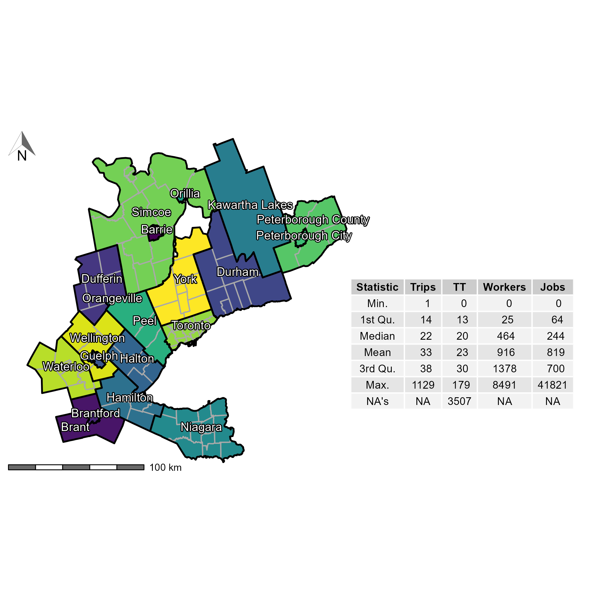
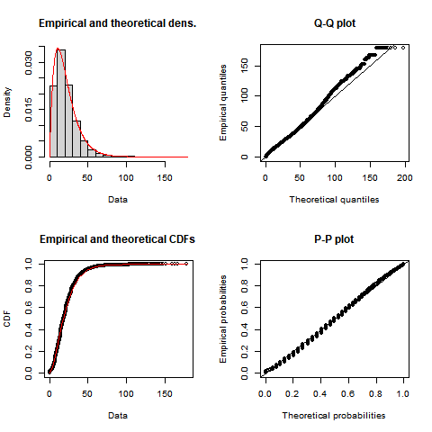

```{r knitr-setup, include=FALSE}
knitr::opts_chunk$set(
  echo = FALSE,
  cache = TRUE,
  warning = FALSE,
  message = FALSE,
  comment = '', 
  out.width = "1\\linewidth")
```

```{r install-data-package, eval = FALSE, include=FALSE}
if (!require("TTS2016R", character.only = TRUE)) {
      remotes::install_github("soukhova/TTS2016R",
                        build_vignettes = TRUE)
  }
```

```{r load-packages, include=FALSE, cache=FALSE}
library(TTS2016R)
library(dplyr)
library(fitdistrplus)
library(ggplot2)
library(kableExtra)
library(patchwork)
library(sf)
library(scales)
library(ggpmisc)
library(ggrepel)
library(cowplot)
library(ggspatial)
library(spdep)
library(RColorBrewer)
library(tmap)
library(shadowtext)
library(grid)
# library(extrafont)
# font_import()
# loadfonts(device = "win")

options(scipen = 999)
```

```{r sp_avail-function,include=FALSE}
#defining the spatial availability function
sp_avail <- function(x, o_id, d_id, pop, opp, r, f, alpha = 1){

  o_id <- rlang::enquo(o_id)
  d_id <- rlang::enquo(d_id)
  pop <- rlang::enquo(pop)
  opp <- rlang::enquo(opp)
  r <- rlang::enquo(r)
  f <- rlang::enquo(f)

  sum_pop <- x %>%
    dplyr::distinct(!!o_id,
                    .keep_all = TRUE) %>%
    dplyr::mutate(sum_pop = !!r*(!!pop)^alpha) %>%
    dplyr::pull(sum_pop) %>%
    sum()

  f_p <- dplyr::pull(x, !!r) * dplyr::pull(x, !!pop)^alpha / sum_pop

  sum_impedance <- x %>%
    dplyr::group_by(!!d_id) %>%
    dplyr::summarize(sum_impedance = sum(!!f))

  x <- x %>%
    dplyr::left_join(sum_impedance,
                     by = rlang::as_name(d_id))

  f_c <- dplyr::pull(x, !!f) / x$sum_impedance

  x$f_c <- f_c
  x$f_p <- f_p

  sum_pa <- x %>%
    dplyr::group_by(!!d_id) %>%
    dplyr::summarize(sum_pa= sum(f_p * f_c))

  x <- x %>%
    dplyr::left_join(sum_pa,
                     by = rlang::as_name(d_id))
  f_t <- (f_p * f_c) / dplyr::pull(x, sum_pa)

  dplyr::pull(x, !!opp) * f_t
}
```

\newpage

# Introduction

Accessibility analysis is employed in transportation, geography, public health, and many other areas, particularly as mobility-based planning is de-emphasized in favor of access-oriented planning [@deboosere2018; @handy2020; @proffitt2017; @yan2021]. The concept of accessibility derives its appeal from combining the spatial distribution of opportunities and the cost of reaching them [@hansen1959]. 

Numerous methods for calculating accessibility have been proposed that can be broadly organized into infrastructure-, place-, person-, and utility-based measures [@geurs2004]. Of these, the place-based family of measures is arguably the most common, capturing the number of opportunities reachable from an origin using the transportation network. A common type of accessibility measure is based on the gravity model of spatial interaction; since it was first developed by @hansen1959 it has been widely adopted in many forms [e.g., @cervero_transportation_2002; @paez2004network; @geurs2004; @handy_measuring_1997; @levinson_accessibility_1998; @Arranz2019measuring]. Accessibility analysis offers a powerful tool to study the intersection between urban structure and transportation infrastructure - however, the interpretability of accessibility measures can be challenging [@geurs2004; @miller2018]. A key issue is that accessibility measures are sensitive to the number of opportunities in a region (e.g., a large city has more jobs than a smaller city), and therefore raw values cannot be easily compared across study areas [@allen2019].

Gravity-based accessibility indicators are in essence spatially smoothed estimates of the total number of opportunities in a region, but the meaning of their magnitudes is unclear. This is evident when we consider the "total accessibility" in the region, a quantity that is not particularly meaningful since it is not constrained to resemble, let alone match, the number of opportunities available. Furthermore, while accessibility depends on the number of opportunities weighted by the travel costs associated with reaching them, the calculated accessibilities are not sensitive to the demand for those opportunities at the origins. Put another way, traditional measures of accessibility do not capture the competition for opportunities. This shortcoming [see @geurs2004] is particularly acute when opportunities are "non-divisible" in the sense that, once taken they are no longer available to other members of the population. Examples of these types of opportunities include jobs (when a person takes up a job, the same job cannot be taken by anyone else) and placements at schools (once a student takes a seat at a school, that opportunity is no longer available for another student). From a different perspective, employers may see workers as opportunities, so when a worker takes a job, this particular individual is no longer in the available pool of candidates for hiring.

To remedy these issues, researchers have proposed several different approaches for calculating competitive accessibility values. On the one hand, this includes several approaches that first normalize the number of opportunities available at a destination by the demand for them from the origin zones and, second, sum the demand-corrected opportunities which can be reached from the origins [e.g. @joseph1984; @shen1998]. These advances were popularized in the family of two-step floating catchment area (FCA) methods [@luo2003] that have found widespread adoption for calculating competitive accessibility to a variety of opportunities such as healthcare, education, and food access [@yang_comparing_2006; @chen_spatial_2020; @ye_spatial_2018; @chen_enhancing_2019; @chen_evaluating_2020]. In principle, floating catchments purport to account for competition/congestion effects, although in practice several researchers [e.g., @delamater2013spatial; @wan2012three] have found that they tend to over-estimate the level of demand and/or service. The underlying issue, as demonstrated by @paez2019, is the multiple counting of both population and level of service, which can lead to biased estimates if not corrected.

A second approach is to impose constraints on the gravity model to ensure potential interaction between zones are equal to the observed totals. Based on Wilson's [-@wilson1971] entropy-derived gravity model, researchers can incorporate constraints to ensure that the modeled flows match some known quantities in the data inputs. In this way, models can be singly-constrained to match the row- or column-marginals (the trips produced or attracted, respectively), whereas a doubly-constrained model is designed to match both marginals. Allen and Farber [-@allen2019] recently incorporated a version of the doubly-constrained gravity model within the floating catchment area approach to calculate competitive accessibility to employment using transit across eight cities in Canada. But while such a model can account for competition, the mutual dependence of the balancing factors in a doubly-constrained model means they must be iteratively calculated which makes them more computationally-intensive. Furthermore, the double constraint means that the sum of opportunity-seekers and the sum of opportunities must match, which is not necessarily true in every potential use case (e.g., there might be more people searching for work than jobs exist in a region).

In this paper we propose an alternative approach to measuring competitive accessibility. We call it a measure of **spatial availability**, and it aims to capture the number of opportunities that are not only *accessible* but also *available* to the opportunity-seeking population, in the sense that they have not been claimed by a competing seeker of the opportunity. As we will show, spatial availability is a singly-constrained measure of accessibility. By allocating opportunities in a proportional way based on demand and distance, this method avoids the issues that result from multiple counting of opportunities in conventional accessibility analysis. The method returns a measure of the rate of available opportunities per opportunity-seeking population. Moreover, the method also returns a benchmark value for the region under study against which results for individual origins can be compared both inter- and intra-regionally.

In the following sections we introduce and illustrate the proposed measure using a synthetic example and an empirical example. First, we describe the analytical framework of the measure. Second, we calculate the spatial availability using data from the Transportation Tomorrow Survey (TTS) home-to-work commute in 2016 for the Greater Golden Horse (GGH) area in Ontario, Canada, and discuss differences with conventional unconstrained accessibility analysis. Third, we return to the synthetic example and calculate spatial availability for two additional use-cases: one use case for jobs from the perspective of the population considering catchment restrictions and another use case for workers from the perspective of employers. Finally, we conclude by discussing the advantages of the spatial availability measure and the breadth of potential uses.

In the spirit of openness of research in the spatial sciences [@brunsdon2021opening; @paez2021open] this paper has a companion open data product [@arribas2021Open], and all code will be available for replicability and reproducibility purposes.

# Background {#background}

Most accessibility measures (excluding utility-based measures) are derived from the gravity model and follow the formulation shown in Equation (\ref{eq:conventional-accessibility}). The limitations associated with this common and widely used measure, namely issues in interpretation and spatial bias, are the motivation for the proposed *spatial availability* measure. We begin this section by conceptually demonstrating the issues associated with conventional accessibility analysis using a simple synthetic example.

```{=tex}
\begin{equation}
\label{eq:conventional-accessibility}
A_i = \sum_{j=1}^JO_jf(c_{ij})
\end{equation}
```
\noindent where:

-   $A$ is accessibility.
-   $i$ is a set of origin locations.
-   $j$ is a set of destination locations.
-   $O_j$ is the number of opportunities at location $j$; $\sum_j O_j$ is the total supply of opportunities in the study region.
-   $c_{ij}$ is a measure of the cost of moving between $i$ and $j$.
-   $f(\cdot)$ is an impedance function of $c_{ij}$; it can take the form of any monotonically decreasing function chosen based on positive or normative criteria [@paez2012measuring].

As formally defined, accessibility $A_i$ is the weighted sum of opportunities that can be reached from location $i$, given the cost of travel $c_{ij}$. Summing the opportunities in the neighborhood of $i$, as determined by the impedance function $f(\cdot)$, provides estimates of the number of opportunities that can be reached from $i$ at a certain cost. The type of accessibility can be modified depending on the impedance function; for example, the measure could be cumulative opportunities [if $f(\cdot)$ is a binary or indicator function e.g., @elgeneidy_cost_2016; @rosik_forecast_2021; @geurs2004; @qi_decadelong_2018] or a gravity measure using an impedance function modeled after any monotonically decreasing function [e.g., Gaussian, inverse power, negative exponential, or log-normal, among others, see, *inter alia*, @kwan_spacetime_1998; @vale_influence_2017; @reggiani_accessibility_2011; @li_approach_2020]. In practice, the accessibility measures derived from many cumulative and gravity formulations tend to be highly correlated with one another [@higgins2019; @santanapalacios2022; @kwan_spacetime_1998].

## Synthetic example {#accessibility-numerical-example}

The setup for our synthetic example is a system with three employment centers and nine population centers, as summarized in Table \ref{tab:toy-example}. Accessibility to jobs at each population center is calculated using the accessibility measure $A_i$ in Equation (\ref{eq:conventional-accessibility}). In this simple example, we use the straight line distance between the population and jobs for $c_{ij}$ and a negative exponential function with $\beta = 0.0015$. As noted, $A_i$ represents the number of jobs (i.e., opportunities) that can be reached from each population center given the estimated cost as depicted in Figure \ref{fig:toy-example-accessibility}.

```{r toy-example, eval = FALSE}
ggplot() + 
  geom_sf(data = toy_sim_zones %>% filter(type=="jobs"),
            aes(size = number),
          shape = 16,
          color = "Black") +
    geom_sf(data = toy_sim_zones %>% filter(type=="population"),
            aes(size = number),
          shape = 17,
          color = "dimgrey") +
  geom_sf_text(data = toy_sim_zones,
               aes(label = id_short),
               size = 3,
               nudge_y = -500) +
  scale_size(range = c(2, 5))  + 
  theme(legend.position = "none",
        axis.text = element_blank(),
        panel.grid = element_blank(),
        panel.background = element_rect(size = 1, 
                                        color = "black", 
                                        fill = NA))
```

```{r create-figure-with-toy-example, fig.height=2, include=FALSE}
ggplot() + 
  geom_sf(data = toy_sim_zones %>% filter(type=="jobs"),
            aes(size = number),
          shape = 16,
          color = "grey") +
    geom_sf(data = toy_sim_zones %>% filter(type=="population"),
            aes(size = number),
          shape = 17,
          color = "dimgrey") +
  geom_sf_text(data = toy_sim_zones,
               aes(label = id_short),
               size = 3,
               nudge_y = -600) +
  scale_size(range = c(2, 4))  + 
  theme(legend.position = "none",
        axis.text = element_blank(), axis.title = element_blank(),
        panel.grid = element_blank(),
        panel.background = element_rect(size = 1, 
                                        color = "black", 
                                        fill = NA))
ggsave("images/figure-1.png",
       width = 3,
       height = 2)
```

```{r toy-example-table}
toy_sim_zones %>%
  st_drop_geometry() %>%
  dplyr::select(-id) %>%
  mutate(fig = "") %>%
  kable(format = "latex",
        booktabs = TRUE,
        col.names = c("ID", "Number", "Location Type", " "),
        caption = "\\label{tab:toy-example}Description of synthetic example") %>%
  #kable_styling(latex_options = c("scale_down")) %>%
  column_spec(4, 
              image = "images/figure-1.png") %>%
  collapse_rows(columns = 4, 
                latex_hline = "major", 
                valign = "middle")
```

```{r toy-example-accessibility}
# Calculate impedance function
beta <- 0.0015
toy_od_table <- toy_od_table %>%
  mutate(f = exp(-beta * distance))

# using the origin-destination table (OD) of all origin to destination trips; filter in only jobs which are mean distance or less away from a population center and sum number of jobs available in each origin (population center)
c_accessibility <- toy_od_table %>% 
  mutate(A_ij = f * Jobs) %>%
  group_by(Origin) %>%
  summarise(A_i = sum(A_ij))

#pass conventional accessibility calculation into the spatial object (toy_sim_zones)
toy_sim_zones_access  <- toy_sim_zones %>% 
  left_join(c_accessibility, 
            by = c("id" = "Origin")) 
```

```{r toy-example-accessibility-plot, fig.cap="\\label{fig:toy-example-accessibility}Accessibility to jobs from population centers in the synthetic example"}
# Plot the accessibility to employment in the example;
ggplot() +
  geom_sf(data = toy_sim_zones_access %>% 
            filter(type == "population"),
          aes(fill = A_i, size = A_i, shape = type)) +
  geom_sf(data = toy_sim_zones_access %>%
            filter(type == "jobs"),
          aes(shape = type,
              size = number),
          fill = "black") +
  geom_sf_text(data = toy_sim_zones_access , aes(label = id_short),
               size = 3, nudge_y = -400) +
  scale_shape_manual(values = c('population' = 24, 'jobs' = 21), 
                     name = "Location Type", 
                     labels=c("Population", "Jobs"),
                     guide = guide_legend(order = 2)) +
  guides(shape =guide_legend(override.aes=list(size=5))) +
  scale_size_continuous(range = c(2,7), name = expression(A["i"]), guide = "none") +
  scale_fill_distiller(palette = "OrRd", direction = 1, name = expression(A["i"]),
                       limits = c(0, max(toy_sim_zones_access$A_i, na.rm = T)),
                       guide = guide_colorbar(order = 1)) +
  theme(legend.position = "right", axis.text = element_blank(), axis.title = element_blank(),
        panel.grid = element_blank(),
        panel.background = element_rect(size = 1.5, 
                                        color = "grey", 
                                        fill = "gray95"))
```

Figure \ref{fig:toy-example-accessibility} shows the locations of the three employment centers (black circles), where the size of the symbol is in proportion to the number of jobs at each location. We also see nine population centers (triangles), where the size of the symbol is proportional to the accessibility ($A_i$) to jobs. The accessibility values illustrate the following:

-   Population centers (triangles) in the middle of the plot are relatively close to all three employment centers and thus have the highest levels of job accessibility. Population center `r toy_sim_zones_access %>% slice_max(A_i, n=1) %>% pull(id_short)` is relatively central and close to all employment centers, and it is the closest population to the second largest employment center in the region. Unsurprisingly, this population center has the highest accessibility `r  toy_sim_zones_access %>% slice_max(A_i, n=1) %>% pull(A_i) %>% round(2)`);

-   Population centers (triangles) near the left edge of the map (only in proximity to the small employment center) have the lowest levels of job accessibility. Population center `r toy_sim_zones_access %>% slice_min(A_i, n=1) %>% pull(id_short)` is quite peripheral and the closest employment center is also the smallest one. Consequently, it has the lowest accessibility with $A_i=$ `r toy_sim_zones_access %>% slice_min(A_i, n=1, with_ties = F) %>% pull(A_i) %>% round(2)`);

## The effect of competition for opportunities

Accessibility measures are excellent indicators of the intersection between urban structure and transportation infrastructure [@shi_literature_2020; @reggiani_accessibility_2011; @kwan_spacetime_1998]. However, beyond enabling comparisons of relative values they are not highly interpretable on their own [@miller2018]. For instance, from Figure \ref{fig:toy-example-accessibility}, `r toy_sim_zones_access %>% slice_min(A_i, n=1) %>% pull(id_short)` has lower accessibility than `r toy_sim_zones_access %>% slice_max(A_i, n=1) %>% pull(id_short)` but despite the accessibility value for `r toy_sim_zones_access %>% slice_min(A_i, n=1) %>% pull(id_short)` being relatively low it is still better than *zero*. On the other hand, P5 has high accessibility, but is its accessibility excellent, good, or only fair? What does it _mean_ for a location to have accessibility to so many jobs? 

To address this interpretability issue, previous research has aimed to index and normalize values on a per demand-population basis [e.g., @barboza_balancing_2021; @pereira_distributional_2019; @wang_access_2021]. However, as recent research on accessibility discusses [@allen2019; @paez2019], these steps do not address the bias introduced through the uneven multiple-counting of opportunities and/or population. This is similar to the congestion effect that floating catchment area methods aim to address, although these methods do not necessarily solve the issue completely [see @paez2019]. The underlying issue arises as a result of the assumption that for conventional accessibility $A_i$ all opportunities are *available* to anyone from any origin $i=1,\cdots,n$ who can reach them: in other words, they are assumed to be infinitely divisible and non-competitive. This results in every opportunity entering the weighted sum once for every origin $i$ that can reach it. Put another way, if a densely populated population center pops up next to `r toy_sim_zones_access %>% slice_max(A_i, n=1) %>% pull(id_short)` this center too will have a high accessibility score since $A_i$ does not consider competition of opportunities from neighbouring population centers. Neglecting to constrain opportunity counts (i.e., single-constraint) in addition to obscuring the interpretability of accessibility can also bias results in two ways:

1)  Demand centers in less dense outer limits of cores may be assigned disproportionately *high* accessibility values. These periphery areas are traditionally located in proximity to more dense urban demand centers and large urban opportunity centers and thus may have low travel cost to these large opportunity centers. Accessibility $A_i$ does not consider opportunity-constraints and, as such, these periphery demand centers benefit from the high accessibility to opportunities without competition considerations from their more dense and more centrally located neighbours.

2)  Remote areas which are still within the region of the analysis and are near relative smaller opportunity centers may be assigned disproportionately *low* accessibility values, despite facing low competition for opportunities. These more remote areas may be sufficiently supplied with opportunities proportionate to their demand but this relationship is obscured by the artificially high accessibility awarded to demand- and opportunity-rich areas in which competition disproportionately occurs.

The spatially uneven multiple-counting of opportunities (i.e., the competition effect) makes accessibility estimates difficult. Recent accessibility measures which seek to improve interpretability are either vulnerable to this impact or require heroic assumptions. As previously mentioned, the floating catchment areas (FCA) method increases interpretability by purporting to account for competition, however, as discussed by Paez et al. [-@paez2019], FCA methods are vulnerable to a similar multiple-counting effect. On this same note, the doubly-constrained gravity model proposed by Allen and Farber [-@allen2019] which is based on the FCA method, accounts for competition, but requires that the magnitude of demand matches the opportunities or be re-scaled to match. As noted, this assumption is not always realistic for many opportunity types such as in the case of job seekers and jobs.

To address the competition effect and to more accurately treat non-divisible opportunities, we propose a singly-constrained gravity measure called **spatial availability**. This measure seeks to address the following questions from the perspective of an individual at a specific demand center: *"many opportunities are accessible, but the same opportunities are also accessible to my (possibly) numerous neighbors... what does high accessibility actually mean to me?"* and *"few opportunities are accessible to me but I am located in a remote area with proportionally few neighbors... what does low accessibility mean to me?"*. Beyond the individual, spatial availability, can also be used as-is to evaluate the *spatial mismatch* of accessible opportunities and demand-seeking population within regions and between regions.

# Analytical framework

Next, we introduce the analytical framework of spatial availability and highlight the differences between the measures to demonstrate how the proposed method improves the interpretability of opportunity access. 

Formally, spatial availability $V_{ij}$ is defined by the number of opportunities $O$ that are proportionally allocated based on a population allocation factor $F^p_{ij}$ and cost of travel allocation factor $F^c_{ij}$ for all origins $i$ to all destinations $j$ as detailed in Equation (\ref{eq:spatial-availability}). In line with the tradition of gravity modeling, the proposed framework distinguishes between opportunities at a destination and demand for opportunities at the origin.
```{=tex}
\begin{equation}
\label{eq:spatial-availability}
V_{ij} = O_j\frac{F^p_{ij} \cdot F^c_{ij}}{\sum_{i=1}^K F^p_{ij} \cdot F^c_{ij}}
\end{equation}
```

The terms in Equation \ref{eq:spatial-availability} are as follows:

-   $V_{ij}$ is the spatial availability of opportunities in $j$ to origin $i$.
-   $i$ is a set of origin locations in the region $K$.
-   $j$ is a set of destination locations in the region $K$.
-   $O_j$ is the number of opportunities at location $j$ in the region $K$.
-   $F^p_{ij}$ is a proportional allocation factor of the population in $i$.
-   $F^c_{ij}$ is a proportional allocation factor of travel cost for $i$; it is a product of a monotonically decreasing (i.e., impedance) function associated with the cost of travel between $i$ and $j$.

Notice that, unlike $A_i$ in Equation (\ref{eq:conventional-accessibility}), the population in the region enters the calculation of $V_{ij}$. It is important to detail the role of the two proportional allocations factors in the formulation of spatial availability. We begin by considering the population allocation factor $F^p_{ij}$ followed by the role of the travel cost allocation factor $F^c_{ij}$; finally we show how both allocation factors combine in the final general form of spatial availability $V_{ij}$. The calculation of spatial availability is introduced with a step-by-step example for two population centers ($P_1$ and $P_2$) in the role of demand (i.e., the number of individuals in the labor market who 'demand' employment) and one employment center ($O_1$) in the role of opportunities.

## Population and travel cost allocation factors

We begin with allocation based on demand by population; consider an employment center $j$ with $O_j^r$ jobs of type $r$. In the general case where there are $K$ population centers in the region, we define the following factor:

```{=tex}
\begin{equation}
\label{eq:pop-alloc-factor}
F^p_{ij} = \frac{P_{i\in r}^\alpha}{\sum_{i=1}^K P_{i\in r}^\alpha}
\end{equation}
```

The population allocation factor $F^p_{ij}$ corresponds to the proportion of the population in origin $i$ relative to the population in the region. On the right hand side of the equation, the numerator $P_{i\in r}$ is the population at origin $i$ that is eligible for and 'demands' jobs of type $r$ (e.g., those with a certain level of training or in a designated age group). The summation in the denominator is over $i=1,\cdots,K$, the population at origins $i$ in the region. To modulate the effect of demand by population in this factor we include an empirical parameter $\alpha$ (i.e., $\alpha <1$ places greater weight on smaller centers relative to larger ones while $\alpha>1$ achieves the opposite effect). This population allocation factor $F^p_{ij}$ can now be used to proportionally allocate a share of the jobs at $j$ to origins.

More broadly, since the factor $F^p_{ij}$ is a proportion, when it is summed over $i=1,\cdots,K$ it always equals to 1 (i.e., $\sum_i^{K} F^p_{ij} = 1$). This is notable since the share of jobs (the spatial availability based on population $V^p_{ij}$) at each destination $j$ allocated to (i.e., available to) each origin is equal to $V^p_{ij} = O_j \cdot F^p_{ij}$ and since the sum of $F^p_{ij}$ is equal to 1 it follows that $\sum_{i=1}^I V_{ij} = O_j$. In other words, the number of jobs across the region is preserved. The result is a proportional allocation of jobs (opportunities) to origins based on the size of their populations.

To illustrate the population allocation factor, suppose that the employment center in the example has 300 jobs ($O_1= 300$), and that the two population centers have 240 and 120 people, respectively, ($P_1= 240$ and $P_2 = 120$). For simplicity, assume that all the population in the region is eligible for these jobs, that is, that the entirety of the population is included in the set $r$. Also assume that $\alpha=1$. The population allocation factors $F^p_{ij}$ for the jobs at $O_1$ for each population center $P_1$ and $P_2$ are as shown in Equation (\ref{eq:pop-alloc-factor-2populations}).

```{=tex}
\begin{equation}
\label{eq:pop-alloc-factor-2populations}
\begin{array}{l}\
F^p_{1,1} = \frac{P_1 ^\alpha}{P_1^\alpha + P_2^\alpha} = \frac{240}{240 + 120} = \frac{240}{360}\\
F^p_{2,1} = \frac{P_2^\alpha}{P_1^\alpha + P_2^\alpha}  = \frac{120}{240 + 120} = \frac{120}{360}\\
\end{array}
\end{equation}
```
These $F^p_{ij}$ values can be used to find a *partial* spatial availability in which jobs are allocated proportionally to population; this partial spatial availability $V^p_{ij}$ for each population center is calculated as follows in Equation (\ref{eq:pop-alloc-factor-SA-2populations}).

```{=tex}
\begin{equation}
\label{eq:pop-alloc-factor-SA-2populations}
\begin{array}{l}\
V^p_{1,1} = O_1 \cdot F^p_{1,1} = 300 \cdot \frac{240}{360} = 200 \\
V^p_{2,1} = O_1 \cdot F^p_{2,1} = 300 \cdot \frac{120}{360} = 100 \\
\end{array}
\end{equation}
```

When using only the proportional allocation factor $F^p_{ij}$ to calculate spatial availability (differentiated here by being defined as $V^p_{ij}$ instead of $V_{ij}$), proportionally more jobs are allocated to the bigger population center (i.e., 2 times more jobs as it is 2 times larger in population). We can also see that the sum of spatial availability for all population centers is equal to the sum of jobs, i.e., total opportunities are preserved. 

Clearly, using only the proportional allocation factor $F^p_{ij}$ to calculate spatial availability does not account for how far population centers $P_1$ or $P_2$ are from employment center $O_1$. It is the job of the second allocation factor $F^c_{ij}$ to account for the friction of distance, as seen in Equation (\ref{eq:tcost-alloc-factor}).

```{=tex}
\begin{equation}
\label{eq:tcost-alloc-factor}
F^c_{ij} = \frac{f(c_{ij})}{\sum_{i=1}^K f(c_{ij})}\\
\end{equation}
```
\noindent where $c_{ij}$ is the cost (e.g., the distance, travel time, etc.) to reach employment center $j$ from $i$, and $f(\cdot)$ is an impedance function that depends on cost ($c_{ij}$); in other words, this allocation factor $F^c_{ij}$ serves to proportionally allocate more jobs to closer locations through an impedance function. To continue with the example, assume that the impedance function is a negative exponential function with $\beta=1$. This parameter modulates the steepness of the impedance effect and is empirically determined in the case of positive accessibility, or set by the analyst to meet a preset condition in the case of normative accessibility [@paez2012measuring]. Also suppose that the distance from population center $P_1$ to employment center $O_1$ is 0.6 km, and the distance from population center $P_2$ to employment center $O_1$ is 0.3 km. The proportional allocation factor $F^p_{ij}$ for the jobs at $O_1$ for both population centers $P_1$ and $P_2$ is defined as follows in Equation (\ref{eq:tcost-allocation-factor-2populations}).

```{=tex}
\begin{equation}
\label{eq:tcost-allocation-factor-2populations}
\begin{array}{l}\
F^c_{1,1} = \frac{\exp(-\beta \cdot D_{1,1})}{\exp(-\beta \cdot D_{1,1}) + \exp(-\beta \cdot D_{2,1})} = \frac{\exp(-0.6)}{\exp(-0.6) + \exp(-0.3)} = 0.426\\
F^c_{2,1} = \frac{\exp(-\beta \cdot D_{2,1})}{\exp(-\beta \cdot D_{1,1}) + \exp(-\beta \cdot D_{2,1})}  = \frac{\exp(-0.3)}{\exp(-0.6) + \exp(-0.3)} = 0.574\\
\end{array}
\end{equation}
```
We can see that the proportional allocation factor for $P_2$ is larger than $P_1$ since the cost (i.e., distance) to $O_1$ is lower. Using the travel cost proportional allocation factors $F^c_{ij}$ as defined in Equation (\ref{eq:tcost-allocation-factor-2populations}), we can calculate the spatial availability of jobs for each population center based only on $F^c_{ij}$ and the jobs available at $O_1$, as shown in Equation (\ref{eq:tcost-allocation-factor-SA-2populations})

```{=tex}
\begin{equation}
\label{eq:tcost-allocation-factor-SA-2populations}
\begin{array}{l}\
V^c_{1,1} = O_1 \cdot F^c_{1,1} = 300 \times 0.426 = 127.8\\
V^c_{2,1} = O_1 \cdot F^c_{2,1} = 300 \times  0.574 = 172.2\\
\end{array}
\end{equation}
```
As seen above, spatial availability defined by $F^c_{ij}$ only (i.e., $V^c_{ij}$) allocates a larger share of jobs to $P_2$ since the population center is closer to $O_1$. However, as previously discussed, $P_2$ has a smaller population than $P_1$, so $P_1$ receives a larger share of jobs when spatial availability when it is defined by $F^p_{ij}$ (i.e., $V^p_{ij}$). It is necessary to combine both population and travel cost factors to better reflect demand; these two components are in line with how demand is conventionally modelled in accessibility calculations which are re-scaled on a per demand-population basis or also consider competition [e.g., @allen2019; @barboza_balancing_2021; @yang_comparing_2006]. Fortunately, since both $F^c_{ij}$ and $F^p_{ij}$ preserve the total number of opportunities (jobs) as they independently sum to 1, they can be combined multiplicatively to calculate the proposed spatial availability ($V_{ij}$) which considers demand to be based on both population and travel cost.

## Putting spatial availability together

We can combine the proportional allocation factors by population $F^p_{ij}$ and travel cost $F^c_{ij}$ and calculate spatial availability $V_{ij}$ as introduced in Equation (\ref{eq:spatial-availability}) and repeated below:

$$
V_{ij} = O_j\frac{F^p_{ij} \cdot F^c_{ij}}{\sum_{i=1}^K F^p_{ij} \cdot F^c_{ij}}
$$

To complete the illustrative example of employment center $O_1$ and population centers $P_1$ and $P_2$, the resulting spatial availability $V_{ij}$ is calculated for both population centers is calculated in Equation (\ref{eq:SA-2populations}).

```{=tex}
\begin{equation}
\label{eq:SA-2populations}
\begin{array}{l}\
V_{1,1} = O_1\cdot \frac{F^p_{1,1} \cdot F^c_{1,1}}{F^p_{1,1} \cdot F^c_{1,1} + F^p_{2,1} \cdot F^c_{2,1}} = 300 \frac{\big(\frac{2}{3} \big) \big(0.426 \big)}{\big(\frac{2}{3} \big) \big(0.426 \big) + \big(\frac{1}{3} \big) \big(0.574 \big)} = 179.4\\
V_{2,1} = O_1\cdot \frac{F^p_{2,1} \cdot F^c_{2,1}}{F^p_{1,1} \cdot F^c_{1,1} + F^p_{ik} \cdot F^c_{ik}} = 300 \frac{\big(\frac{1}{3} \big) \big(0.574 \big)}{\big(\frac{2}{3} \big) \big(0.426 \big) + \big(\frac{1}{3} \big) \big(0.574 \big)}  =  120.6 \\
\end{array}
\end{equation}
```
In this example, fewer jobs are allocated to population center $P_1$ compared to the allocation by population only, to account for the higher cost of reaching the employment center. On the other hand, distance alone allocated more jobs to the closest population center (i.e., $P_2$), but since it is smaller, it also gets a smaller share of the jobs overall. To reiterate, the sum of jobs at employment center $O_1$ that are allocated to population centers $P_1$ and $P_2$ simultaneously based on *population-* and *travel cost* allocation factors are preserved (i.e., $V_{1,1} + V_{2,1} = O_1$).

In the common case that population centers have multiple destination opportunities $j$, spatial availability is simply the sum of Equation (\ref{eq:spatial-availability}) for all opportunities $J$ (i.e., $V_i = \sum_{j=1}^J V_{ij}$). The resulting value of $V_i$ represents opportunities (e.g., jobs) that can be accessed from origin $i$ and that are *not* allocated to any other competing origin: $V_i$ is thus the weighted sum of available opportunities. When comparing $V_i$ to the singly-constrained gravity model (see Wilson [-@wilson1971]), $V_i$ is the result of constraining $A_i$ to match one of the marginals in the origin-destination table, the known total of opportunities.

Since the sum of opportunities is preserved in the procedures above, it is possible to calculate an interpretable measure of spatial availability per capita (lower-case $v_i$) as shown in Equation (\ref{eq:SA-per-capita}).

```{=tex}
\begin{equation}
\label{eq:SA-per-capita}
v_i = \frac{V_i}{P_i}
\end{equation}
```
To complete the illustrative example, the per capita spatial availability of jobs is calculated in Equation (\ref{eq:SA-per-capita-2populations}).

```{=tex}
\begin{equation}
\label{eq:SA-per-capita-2populations}
\begin{array}{l}\
v_{1,1} = \frac{V_{1,1}}{1_2} =  \frac{179.4}{240} = 0.8\\
v_{2,1} =  \frac{V_{2,1}}{P_2} =  \frac{120.6}{120} = 1.0\\
\end{array}
\end{equation}
```
We can see that since $P_2$ is closer to $O_1$ and has less competition (as it has a smaller population than $P_1$), $P_2$ benefits with a higher spatial availability of jobs per job-seeking population. We can also compare these values to the overall ratio of jobs-to-population in this region of one job center and two population centers is $300/(240 + 120)=$ `r round(300/(240 + 120), 2)`.

# Empirical example: spatial accessibility and availability of jobs in the GGH

In this section we use population and employment data from the Golden Horseshoe Area (GGH). This is the largest metropolitan region in Canada and includes the cities of Toronto and Hamilton. We present two scales of analysis. The first example demonstrates how accessibility broadly overestimates *job access* (relative to spatial availability) and particularly overestimates job access for areas in the less dense outer limits of the urban core. The second example demonstrates how accessibility underestimates job access for areas in the urban periphery. We first introduce the data used, then calibrate an impedance function, and finally discuss the results.

## Data

Population and employment data are drawn from the 2016 Transportation Tomorrow Survey (TTS). This survey collects representative urban travel information from 20 municipalities contained within the GGH area in the southern part of Ontario, Canada (see Figure \ref{fig:TTS-16-survey-area}) [@data_management_group_tts_2018]. The data set includes Traffic Analysis Zones (TAZ) (n=`r round(length(TTS2016R::ggh_taz$GTA06), 3) %>% prettyNum(big.mark = ",")`), the number of jobs (n=`r round(sum(TTS2016R::ggh_taz$jobs), 3) %>% prettyNum(big.mark = ",")`) and workers (n=`r round(sum(TTS2016R::ggh_taz$workers), 3) %>% prettyNum(big.mark = ",")`) at each origin and destination. The TTS data is based on a representative sample of between 3% to 5% of households in the GGH and is weighted to reflect the population covering the study area has a whole [@data_management_group_tts_2018]. 

To generate the travel cost for these trips, travel times between origins and destinations are calculated for car travel using the R package {r5r} [@r5r_2021] with a street network retrieved from OpenStreetMap for the GGH area. A the 3 hr travel time threshold was selected as it captures 99% of population-employment pairs (see the travel times summarized in Figure \ref{fig:TTS-16-survey-area}). This method does not account for traffic congestion or modal split, which can be estimated through other means [e.g., @allen_suburbanization_2021; @higgins2021changes]. For simplicity, we carry on with the assumption that all trips are taken by car in uncongested travel conditions.

All data and data preparation steps are documented and can be freely explored in a companion open data product [{TTS2016R}](https://github.com/soukhova/TTS2016R).

```{r, echo=FALSE, message=FALSE, warning=FALSE}
# grouping the planning boundaries/municipalities so they make up the 20 regions in the TTS 2016. Note: st_buffer is used as there are small existing gaps between some boundaries. st_buffer of 10 m is enough to widen all boundaries and complete the st_union without issue.
group_ggh_pd_poly <- TTS2016R::ggh_pd %>% st_buffer(10) %>% group_by(REGION) %>% 
  summarize(REGION_name = first(REGION_name),
            geometry = st_union((geometry)))

# creating an object of centroids for each region - this will be used to label polygons on the map
group_ggh_pd <- sf::st_centroid(group_ggh_pd_poly) 
points <- sf::st_coordinates(group_ggh_pd) %>% data.frame() 
group_ggh_pd <- cbind(group_ggh_pd, points)

## manually readjusting the X and Y coordinate of "County of Peterborough" and "Brant" as they overlap some cities
group_ggh_pd[group_ggh_pd$REGION_name=="Brant", "X"] <- 544000.0
group_ggh_pd[group_ggh_pd$REGION_name=="Brant", "Y"] <- 4767466

group_ggh_pd[group_ggh_pd$REGION_name=="Peterborough County", "Y"] <- 4921000
```
```{r, echo=FALSE, message=FALSE, warning=FALSE, include = FALSE}
#plot 
TTS_area_plot <- ggplot() +
  geom_sf(data = TTS2016R::ggh_pd, color = "darkgray",
          aes(fill = REGION_name)) +
  scale_fill_manual(values = viridis::viridis(20)) +
  geom_sf(data = group_ggh_pd_poly, 
          color = "black", fill = NA, size = 0.7) +
  annotation_north_arrow(location = "tl", # north arrow for both the main plot
                         height = unit(0.8, "cm"), 
                         width = unit(0.8, "cm"),
                         style = north_arrow_orienteering(line_width = 0.25,
                                                          line_col = "dimgrey", 
                                                          fill = c("white","dimgrey"))) +
  annotation_scale(bar_cols = c("dimgrey", "white"), # scale bar for both the main plot
                   height = unit(0.15, "cm")) + 
  geom_shadowtext(data = group_ggh_pd,
                  aes(x = X, y = Y, label = REGION_name),
                  size = 3.5,
                  nudge_y = 3000,
                  nudge_x = 2000) +
  theme_void() +
  theme(legend.position = "none",
        axis.title = element_blank()) 

# ggsave("images/TTS16-survey-area.png")
```
```{r creating-desc-stats-table}
#forming a complete descriptive statistic table

Statistics <- data.frame("Statistic" = c("Min.", "1st Qu.", "Median", "Mean", "3rd Qu.", "Max.", "NA's"))

Trips <- data.frame("Trips" = c(summary(od_ft_tt$trips)[[1]] %>% round(), 
                                   summary(od_ft_tt$trips)[[2]] %>% round(),  
                                   summary(od_ft_tt$trips)[[3]] %>% round(), 
                                   summary(od_ft_tt$trips)[[4]] %>% round(), 
                                   summary(od_ft_tt$trips)[[5]] %>% round(),
                                   summary(od_ft_tt$trips)[[6]]%>% round(),
                                   NA))

Travel_time <- data.frame("TT" = c(summary(od_ft_tt$travel_time)[[1]] %>% round(), 
                                               summary(od_ft_tt$travel_time)[[2]] %>% round(),  
                                               summary(od_ft_tt$travel_time)[[3]] %>% round(), 
                                               summary(od_ft_tt$travel_time)[[4]] %>% round(), 
                                               summary(od_ft_tt$travel_time)[[5]] %>% round(), 
                                               summary(od_ft_tt$travel_time)[[6]] %>% round(),  
                                               3507)) 

# TAZ_Area <- data.frame("TAZ_Area" = c(summary(ggh_taz$AREA)[[1]] %>% round(1), 
#                                       summary(ggh_taz$AREA)[[2]] %>% round(1), 
#                                       summary(ggh_taz$AREA)[[3]] %>% round(1), 
#                                       summary(ggh_taz$AREA)[[4]] %>% round(1), 
#                                       summary(ggh_taz$AREA)[[5]] %>% round(1), 
#                                       summary(ggh_taz$AREA)[[6]] %>% round(1), 
#                                       NA))

Workers <- data.frame("Workers" = c(summary(ggh_taz$workers)[[1]] %>% round(), 
                                    summary(ggh_taz$workers)[[2]] %>% round(), 
                                    summary(ggh_taz$workers)[[3]] %>% round(), 
                                    summary(ggh_taz$workers)[[4]] %>% round(), 
                                    summary(ggh_taz$workers)[[5]] %>% round(), 
                                    summary(ggh_taz$workers)[[6]] %>% round(), 
                                    NA))

Jobs <- data.frame("Jobs" = c(summary(ggh_taz$jobs)[[1]] %>% round(), 
                              summary(ggh_taz$jobs)[[2]] %>% round(), 
                              summary(ggh_taz$jobs)[[3]] %>% round(), 
                              summary(ggh_taz$jobs)[[4]] %>% round(), 
                              summary(ggh_taz$jobs)[[5]] %>% round(), 
                              summary(ggh_taz$jobs)[[6]] %>% round(), 
                              NA)) 

desc_stats <- cbind(Statistics, Trips, Travel_time, Workers, Jobs)

# #kable tabling 
# desc_stats %>%
#   kable(format = "latex",
#         align="lrrrrrr",
#         booktabs = T,
#         col.names = c(" ", "(#)", "(min)", "(km^2)", "(#)", "(#)"),
#         caption = "\\label{tab:TTS-16-desc-stats}Descriptive statistics of the trips, calculated origin-destination car travel time, TAZ area, workers per TAZ, and jobs per TAZ.") %>%
#   add_header_above(c(" ", "Trips", "Travel Time", "Area", "Workers", "Jobs"), align = "r")%>%
#   kable_styling(full_width = "T", 
#                 latex_options = c("scale_down"),
#                 position = "center")
```

```{r, TTS-16-survey-area, echo=FALSE, fig.cap="\\label{fig:TTS-16-survey-area}TTS 2016 study area within the GGH in Ontario, Canada along with the descriptive statistics of the trips, calculated origin-destination car travel time (TT), workers per TAZ, and jobs per TAZ. Contains 20 regions (black boundaries) and sub-regions (dark gray boundaries).", out.width="80%", fig.show='hold', fig.align='center'}
TTS_area_plot <- TTS_area_plot + annotate(geom = "table",
            x = 915000, y = 4880000, 
           label = list(desc_stats))
ggsave("images/TTS16-survey-area.png")

```

## Calibration of an impedance function

In the synthetic example introduced in a preceding section, a negative exponential function with an arbitrary parameter was used. For the empirical example, we calibrate an impedance function on the trip length distribution (TLD) of commute trips. Briefly, a TLD represents the proportion of trips that are taken at a specific travel cost (e.g., travel time); this distribution is commonly used to derive impedance functions in accessibility research [@horbachov_theoretical_2018; @batista_estimation_2019].

The empirical and theoretical TLD for this data set are represented in the top-left panel of Figure \ref{fig:TLD-Gamma-plot}. Maximum likelihood estimation and the Nelder-Mead method for direct optimization available within the `fitdistrplus` package [@fitdistrplus_2015] were used. Based on goodness-of-fit criteria and diagnostics seen in Figure \ref{fig:TLD-Gamma-plot}, the gamma distribution was selected (also see Figure \ref{fig:plot-cullen-frey} in Appendix A).

```{r data-for-impedance}
# remove all NA trips from dataset and set all 0min travel times to 0.1 min
od_ft_tt  <- od_ft_tt %>% 
  filter( !is.na(travel_time)) %>% 
  mutate(travel_time = ifelse(travel_time == 0, 0.1, travel_time))
all_tt <- od_ft_tt  %>% 
  dplyr::select(trips, travel_time)

all_tt <- all_tt[rep(seq_len(dim(all_tt)[1]), all_tt$trips), 2]
```

```{r fitting-impedance-function}
# using fitdist function to fit a distribution using the default maximum likelihood estimation method and Nelder-Mead method for direct optimization


gamma_ <- fitdistrplus::fitdist(data=all_tt, "gamma", method="mle", optim.method="Nelder-Mead") 


#lnorm_ <- fitdistrplus::fitdist(data=all_tt, "lnorm", method="mle", optim.method="Nelder-Mead")
#norm_ <-fitdistrplus::fitdist(data=all_tt, "norm", method="mle", optim.method="Nelder-Mead")
# #exp_ <- fitdistrplus::fitdist(data=all_tt, "exp", method="mle", optim.method="Nelder-Mead")
# pois_ <- fitdistrplus::fitdist(data=all_tt, "pois", method="mle", optim.method="Nelder-Mead") 
# nbinom_ <- fitdistrplus::fitdist(data=all_tt, "nbinom", method="mle", optim.method="Nelder-Mead")
# geom_ <- fitdistrplus::fitdist(data=all_tt, "geom", method="mle", optim.method="Nelder-Mead")
# beta_ <- fitdistrplus::fitdist(data=all_tt, "beta", method="mle", optim.method="Nelder-Mead")
# logis_ <- fitdistrplus::fitdist(data=all_tt, "logis", method="mle", optim.method="Nelder-Mead")
# plot(gamma_)
# plot(pois_)
# plot(nbinom_)
# plot(geom_)
# plot(beta_)
# plot(logis_)
```

```{r save-impedance-plot, include=FALSE}
# For some reason plot(gamma_) does not play well with knitr, so instead we save the figure and then include it as a graphic in the following chunk
png("images/impedance_function.png")
plot(gamma_)
dev.off()
```

```{r TLD-Gamma-plot, fig.cap="\\label{fig:TLD-Gamma-plot}Empirical TTS 2016 home-based car trip length distribution (black points) and calibrated gamma distribution impedance function (red line) with associated Q-Q and P-P plots", fig.show='hold', fig.align='center'}

```

```{r, echo=FALSE, warning=FALSE, message=FALSE}
#dgamma is the density plot for gamma function; adding values as "f" our impedance function
od_ft_tt <- od_ft_tt %>%
  mutate(f = dgamma(travel_time, gamma_$estimate["shape"], gamma_$estimate["rate"]))
```

The gamma distribution takes the following general form where the estimated 'shape' is $\alpha=$ `r round(gamma_$estimate[1], 3)`, the estimated 'rate' is $\beta =$ `r round(gamma_$estimate[2], 3)`, and $\Gamma(\alpha)$ is defined in Equation (\ref{gamma-dist}).

```{=tex}
\begin{equation}
\label{gamma-dist}
\begin{array}{l}\ 
f(x, \alpha, \beta) = \frac {x^{\alpha-1}e^{-\frac{x}{\beta}}}{ \beta^{\alpha}\Gamma(\alpha)} \quad \text{for } 0 \leq x \leq \infty\\

\Gamma(\alpha) =  \int_{0}^{\infty} x^{\alpha-1}e^{-x} \,dx\\
\end{array}
\end{equation}
```

```{r calc-for-accessibility-Toronto}
#select the toronto muni boundary
toronto_muni_bound <- group_ggh_pd_poly %>% filter(REGION_name == "Toronto")

#select the GTA boundary
GTA_bound <- group_ggh_pd_poly %>% filter(REGION_name == "Toronto" |
                                            REGION_name == "Durham" |
                                            REGION_name == "Halton" |
                                            REGION_name == "Peel" |
                                            REGION_name == "York" ) %>% st_union() %>% st_as_sf()

#indicate which zones are within or intersect the Toronto Municipality
TO_taz <- ggh_taz %>%
  filter(st_intersects(., toronto_muni_bound, sparse = FALSE)[,1]) %>% 
  dplyr::select(GTA06, AREA, jobs) %>%
  mutate(TAZToronto = "Yes")

#indicate which zones are within the GTA boundaries
GTA_taz <- ggh_taz %>%
  filter(st_intersects(., GTA_bound, sparse = FALSE)[,1]) %>% 
  dplyr::select(GTA06, AREA, jobs) %>%
  mutate(TAZGTA = "Yes")

# transfer calibrated impedance function values to OD matrix
od_ft_tt <- od_ft_tt %>%
  mutate(f = dgamma(travel_time, gamma_$estimate["shape"], gamma_$estimate["rate"]))

#add the number of jobs and workers to the od_ft_tt matrix
od_ft <- od_ft_tt %>% merge(ggh_taz %>% dplyr::select(GTA06, workers) %>% st_drop_geometry(),
                   by.x = "Origin", by.y="GTA06", all.x = TRUE)

od_ft <- od_ft %>% merge(ggh_taz %>% dplyr::select(GTA06, jobs) %>% st_drop_geometry(),
                   by.x = "Destination", by.y="GTA06", all.x = TRUE)

#jobs at destinations IN Toronto and origins from anywhere; workers are associated with the origin (ggh) and jobs with the destination (Toronto)
TO_od_ft <- od_ft %>% filter(Destination %in% TO_taz$GTA06)

#calculate accessibility for workers from any origin to jobs in Toronto 
TO_c_accessibility <- TO_od_ft %>% 
  mutate(TO_A_ij = f * jobs) %>%
  group_by(Origin) %>%
  summarise(TO_A_i = sum(TO_A_ij, na.rm = T),
            trips_i = sum(trips, na.rm = T))

#Merge TO accessibly calculation to the ggh_taz:
TO_taz_acc <- ggh_taz %>% merge(TO_c_accessibility, by.x=c("GTA06"), by.y=c("Origin"), all.x=T) 

```

```{r calc-for-accessibility-GGH}
# transfer calibrated impedance function values to OD matrix
od_ft_tt <- od_ft_tt %>%
  mutate(f = dgamma(travel_time, gamma_$estimate["shape"], gamma_$estimate["rate"]))

#add the number of jobs and workers to the od_ft_tt matrix
od_ft <- od_ft_tt %>% merge(ggh_taz %>% dplyr::select(GTA06, workers) %>% st_drop_geometry(),
                   by.x = "Origin", by.y="GTA06", all.x = TRUE)

od_ft <- od_ft %>% merge(ggh_taz %>% dplyr::select(GTA06, jobs) %>% st_drop_geometry(),
                   by.x = "Destination", by.y="GTA06", all.x = TRUE)

#calculate accessibility for workers from any origin to jobs in Toronto 
GGH_c_accessibility <- od_ft %>% 
  mutate(GGH_A_ij = f * jobs) %>%
  group_by(Origin) %>%
  summarise(GGH_A_i = sum(GGH_A_ij, na.rm = T),
            trips_i = sum(trips, na.rm = T))

#Merge TO accessibly calculation to the ggh_taz:
GGH_taz_acc <- ggh_taz %>% merge(GGH_c_accessibility, by.x=c("GTA06"), by.y=c("Origin"), all.x=T) 
```

```{r create-bounding-boxes}
#create the bounding box for the GGH region + a little extra
bbox_new1 <- st_bbox(group_ggh_pd_poly) # current bounding box

xrange <- bbox_new1$xmax - bbox_new1$xmin # range of x values
yrange <- bbox_new1$ymax - bbox_new1$ymin # range of y values

bbox_new1[1] <- bbox_new1[1] - (0.3 * xrange) # xmin - left
bbox_new1[3] <- bbox_new1[3] + (0.2 * xrange) # xmax - right
bbox_new1[2] <- bbox_new1[2] - (0.2 * yrange) # ymin - bottom
bbox_new1[4] <- bbox_new1[4] + (0.3 * yrange) # ymax - top

bbox_new <- bbox_new1 %>%  # take the bounding box ...
  st_as_sfc()

#create the bounding box for the GTA region + a little extra
bbox_new1 <- st_bbox(GTA_bound) # current bounding box

xrange <- bbox_new1$xmax - bbox_new1$xmin # range of x values
yrange <- bbox_new1$ymax - bbox_new1$ymin # range of y values

bbox_new1[1] <- bbox_new1[1] - (0.0 * xrange) # xmin - left
bbox_new1[3] <- bbox_new1[3] - (0.1 * xrange) # xmax - right
bbox_new1[2] <- bbox_new1[2] + (0.0 * yrange) # ymin - bottom
bbox_new1[4] <- bbox_new1[4] - (0.3 * yrange) # ymax - top

bbox_GTA <- bbox_new1 %>%  # take the bounding box ...
  st_as_sfc()

#create the bounding box for the Toronto region + a little extra
bbox_new1 <- st_bbox(toronto_muni_bound) # current bounding box

xrange <- bbox_new1$xmax - bbox_new1$xmin # range of x values
yrange <- bbox_new1$ymax - bbox_new1$ymin # range of y values

bbox_new1[1] <- bbox_new1[1] - (0.0 * xrange) # xmin - left
bbox_new1[3] <- bbox_new1[3] + (0.0 * xrange) # xmax - right
bbox_new1[2] <- bbox_new1[2] - (0.0 * yrange) # ymin - bottom
bbox_new1[4] <- bbox_new1[4] + (0.0 * yrange) # ymax - top

bbox_Toronto <- bbox_new1 %>%  # take the bounding box ...
  st_as_sfc()
```

```{r calc-for-avail, include=FALSE, warning=FALSE, message=FALSE}
#calculate spatial availability
TO_od_ft <- TO_od_ft %>%
  mutate(catch = 1) %>%
  mutate(TO_V_ij = sp_avail(., 
                         o_id = Origin,
                         d_id = Destination,
                         pop = workers,
                         opp = jobs,
                         r = catch,
                         f = f))

#verify that the sum of all jobs is consistent with the number of jobs
sum(TO_od_ft$TO_V_ij, na.rm=T)
sum_jobs <- TO_od_ft %>% group_by(Destination) %>% summarise(jobs = mean(jobs))
sum(sum_jobs$jobs, na.rm = T)

#aggregating spatial availability  
TO_availability <- TO_od_ft %>%
  group_by(Origin) %>%
  summarize(TO_V_i = sum(TO_V_ij),
            TO_avgtt_i = mean(travel_time),
            TO_avg_f_i = mean(f)) 

#Merge TO availability calculation to the TAZ sf object created for accessibility above:
TO_taz_acc <- TO_taz_acc %>% merge(TO_availability, by.x=c("GTA06"), by.y=c("Origin"), all.x=T) 

#created filtered version - only TAZs within the Toronto and GTA boundaries
TO_taz_acc <- TO_taz_acc %>% merge(TO_taz %>% dplyr::select(GTA06,TAZToronto) %>% st_drop_geometry(), by="GTA06", all.x=TRUE)
TO_taz_acc <- TO_taz_acc %>% merge(GTA_taz %>% dplyr::select(GTA06,TAZGTA) %>% st_drop_geometry(), by="GTA06", all.x=TRUE)

TO_taz_acc_Torontofl <- dplyr::filter(TO_taz_acc, TAZToronto == "Yes")
TO_taz_acc_GTAfl <- dplyr::filter(TO_taz_acc, TAZGTA == "Yes")
```

## Measuring access to jobs in the GGH
```{r calc-for-avail-GGH, include=FALSE, message=FALSE}
#calculate spatial availability
GGH_od_ft <- od_ft %>%
  mutate(catch = 1) %>%
  mutate(GGH_V_ij = sp_avail(., 
                         o_id = Origin,
                         d_id = Destination,
                         pop = workers,
                         opp = jobs,
                         r = catch,
                         f = f))

#verify that the sum of all jobs is consistent with the number of jobs
sum(GGH_od_ft$GGH_V_ij, na.rm=T)
sum_jobs <- GGH_od_ft %>% group_by(Destination) %>% summarise(jobs = mean(jobs))
sum(sum_jobs$jobs, na.rm = T)

#aggregating spatial availability  
GGH_availability <- GGH_od_ft %>%
  group_by(Origin) %>%
  summarize(GGH_V_i = sum(GGH_V_ij),
            GGH_avgtt_i = mean(travel_time),
            GGH_avg_f_i = mean(f)) 

#Merge TO availability calculation to the TAZ sf object created for accessibility above:
GGH_taz_acc <- GGH_taz_acc %>% merge(GGH_availability, by.x=c("GTA06"), by.y=c("Origin"), all.x=T) 
```

Toronto is the largest city in the GGH and represents a significant subset of workers and jobs in the GGH; `r percent(sum(TO_od_ft$workers)/sum(od_ft$workers))` of workers in the GGH travel to jobs in Toronto and `r percent(sum(TO_od_ft$jobs)/sum(od_ft$jobs))` of jobs are located within Toronto. As will be discussed, when accessibility and spatial availability values are compared, this significant subset of jobs in Toronto illustrates both issues associated with the competition effect. Specifically, since accessibility does not include the single-opportunity constraint like spatial availability does, it *overestimates* the jobs available for most TAZs in proximity to Toronto (i.e., GTA) and *underestimates* the jobs available for TAZs in the periphery of the GGH.

Figure \ref{fig:plot-access-SA-GGH-TTS} presents the accessibility and spatial availability for the full TTS data set. Conventionally, higher accessibility is interpreted as the ability to reach more opportunities. Within the accessibility plot, job access values follow a radial trend where a few TAZ with a high values are strictly located within the boundaries of Toronto and values radially decrease further from the boundaries of Toronto. This general trend is echoed in qualitative studies which find the further from Toronto the longer the employment commute [@axisa_factors_2012] and the closer to core of Toronto the more opportunities are accessible [for some to certain types of jobs, see @paez_jobs_2013].

Next, spatial availability measure and is presented alongside the accessibility plot in Figure \ref{fig:plot-access-SA-GGH-TTS}. Similar to the accessibility plot, the higher the value, the more access that TAZ has to jobs in the GGH. Since spatial availability constrains the total to match the number of opportunities, high values of spatial availability can be seen as higher access to *available* jobs (i.e., competitive job access) and we can observe which TAZs have spatial availability values which are above or below the regional average of `r round(mean(TO_taz_acc$TO_V_i, na.rm=T), 0)`. It is worth noting that the spatial availability and accessibility plots do not follow the same spatial distribution. Within the spatial availability plot, job access appears more evenly assigned throughout the GGH. Particularly, job access values, as measured by spatial availability, are higher around the north east and south west periphery TAZs and more moderate in and around Toronto than compared to accessibility.

Note that in Figure \ref{fig:plot-access-SA-GGH-TTS} it can be observed that a few TAZ are greyed out; this corresponds to a null accessibility and spatial availability. Overall, `r percent(length(cumsum((GGH_taz_acc %>% filter(is.na(GGH_A_i)) %>% st_drop_geometry)$GGH_A_i))/length(cumsum((GGH_taz_acc %>% st_drop_geometry)$GGH_A_i)))` of TAZ are greyed out as a result of containing zero home-to-work GGH trips and as such are allocated a null accessibility and spatial availability. The majority of these no-trip TAZ because they contain no worker population, specifically, `r round(GGH_taz_acc %>% filter(is.na(GGH_A_i) & workers == "0") %>% dplyr::select(workers) %>% st_drop_geometry %>% count()/GGH_taz_acc %>% filter(is.na(GGH_A_i)) %>% dplyr::select(workers) %>% st_drop_geometry %>% count(),2)*100`% have zero workers while only `r round(GGH_taz_acc %>% filter(is.na(GGH_A_i) & jobs == "0") %>% dplyr::select(jobs) %>% st_drop_geometry %>% count()/GGH_taz_acc %>% filter(is.na(GGH_A_i)) %>% dplyr::select(jobs) %>% st_drop_geometry %>% count(),2)*100`% of these TAZ have zero jobs (`r round(GGH_taz_acc %>% filter(is.na(GGH_A_i) & jobs == "0" & workers=="0") %>% dplyr::select(jobs) %>% st_drop_geometry %>% count()/GGH_taz_acc %>% filter(is.na(GGH_A_i)) %>% dplyr::select(GGH_A_i) %>% st_drop_geometry %>% count(),2)*100`% have both zero workers and jobs). 

```{r plot-access-SA-GGH-TTS, fig.cap="\\label{fig:plot-access-SA-GGH-TTS}Calculated accessibility (top) and spatial availability (bottom) of employment from origins in the GGH to destinations in the GGH. Greyed out TAZs represent null accessibility and spatial availability values .", fig.width=7, fig.height=9, message=FALSE}

## accessibility

#creating the main plot
mplot_access_TTS_GGH <- ggplot() +
  geom_sf(data = GGH_taz_acc, aes(fill= GGH_A_i), color = NA) + #data
    scale_fill_distiller(palette = "Spectral", #legend scale bar
                         name = expression(A["i"]),
                         na.value = "grey90") +
  geom_sf(data = toronto_muni_bound, # border for Toronto
          colour=alpha("dimgrey",1), 
          size = 0.5, fill=NA, 
          show.legend = "polygon") + 
  annotation_north_arrow(location = "tl", # north arrow for both the main plot and inset
                         height = unit(0.8, "cm"), 
                         width = unit(0.8, "cm"),
                         style = north_arrow_orienteering(line_width = 0.25,
                                                          line_col = "dimgrey", 
                                                          fill = c("white","dimgrey"))) +
  annotation_scale(bar_cols = c("dimgrey", "white"), # scale bar for both the main plot and inset
                   height = unit(0.15, "cm")) +
  theme_void() +
  theme(legend.position = c(1.15, 0.75), 
        plot.margin = margin(t = 0, r = 0, b = 0, l = -80)) # positing legend and clipping out white space

# #main plot + adding the inset map. 
mplot_access_TTS <- ggdraw(mplot_access_TTS_GGH) +
  draw_plot({mplot_access_TTS_GGH + coord_sf(xlim = st_coordinates(bbox_Toronto)[c(1,2),1],
                                         ylim = st_coordinates(bbox_Toronto)[c(2,3),2],
                                         expand = FALSE) +
      theme(legend.position = "none")},
    x = 0.57, y = 0.00,  # The distance along a (0,1) x-axis (and y axis) to draw the left edge (the bottom edge) of the plot
    width = 0.46, height = 0.46) # The width and height of the plot expressed as proportion of the entire ggdraw object

## spatial availability 

mplot_SA_TTS_GGH <- ggplot() +
  geom_sf(data = GGH_taz_acc, aes(fill= GGH_V_i), color = NA) + #data
    scale_fill_distiller(palette = "Spectral", #legend scale bar
                         name =  expression(V["i"]),
                         na.value = "grey90") + 
  geom_sf(data = toronto_muni_bound, # border for Toronto
          colour=alpha("dimgrey",1), 
          size = 0.5, fill=NA, 
          show.legend = "polygon") + 
  annotation_north_arrow(location = "tl", # north arrow for both the main plot and inset
                         height = unit(0.8, "cm"), 
                         width = unit(0.8, "cm"),
                         style = north_arrow_orienteering(line_width = 0.25,
                                                          line_col = "dimgrey", 
                                                          fill = c("white","dimgrey"))) +
  annotation_scale(bar_cols = c("dimgrey", "white"), # scale bar for both the main plot and inset
                   height = unit(0.15, "cm")) +
  theme_void() +
  theme(legend.position = c(1.15, 0.75), 
        plot.margin = margin(t = 0, r = 0, b = 0, l = -80)) # positing legend and clipping out white space

# #main plot + adding the inset map. 
mplot_SA_TTS <- ggdraw(mplot_SA_TTS_GGH) +
  draw_plot({mplot_SA_TTS_GGH + coord_sf(xlim = st_coordinates(bbox_Toronto)[c(1,2),1],
                                         ylim = st_coordinates(bbox_Toronto)[c(2,3),2],
                                         expand = FALSE) +
      theme(legend.position = "none")},
    x = 0.57, y = 0.00,  # The distance along a (0,1) x-axis (and y axis) to draw the left edge (the bottom edge) of the plot
    width = 0.46, height = 0.46) # The width and height of the plot expressed as proportion of the entire ggdraw object

mplot_access_TTS / mplot_SA_TTS
```

\newpage

```{r GGH-benchmark, include=FALSE}
benchmark_GGH_V_i_workers <- GGH_taz_acc %>% st_drop_geometry() %>% summarise(avg_VO = sum(GGH_V_i, na.rm = TRUE)/sum(workers, na.rm = TRUE)) %>% as.numeric()
```

To enhance the interpretability of spatial availability, the measure can be normalized to provide more meaningful insight into how many jobs are *available* on average for each TAZ. This normalization, shown in Figure \ref{fig:plot-avail-GGH-TTS-per-worker}, demonstrates which TAZ have above (reds) and below (blue) the average (<!--` round(benchmark_TO_V_i_workers, 2)`) --> available jobs per worker in the GGH. Similar to the spatial availability plot of the GGH jobs in Figure \ref{fig:plot-access-SA-GGH-TTS}, we can see that many average or above average jobs per worker TAZ (whites and reds) are present in southern Peel and Halton (south-west of Toronto), Waterloo and Brantford (even more south-west of Toronto), and Hamilton and Niagara (south of Toronto), however, the distribution is uneven and many TAZ within these areas do have below average values (blues). 

Interestingly, when considering *competitive* job access, many areas outside of Toronto have similar jobs per worker values as TAZ in Toronto. This is contrary to the notion that since Toronto has high job access it has a significant density of employment opportunities in the GGH. Not all jobs in Toronto are *available* since Toronto has a high density of _competition_ in addition to density of jobs opportunities. For instance, urban centers outside of Toronto such as those found in Brantford, Guelph, southern Peel, Halton, and Niagara have TAZ which are far above the the TTS average jobs per worker and higher than TAZ within Toronto. High job access is not seen in the accessibility plot which suggests that these less densely populated urban centers may have sufficient employment opportunities for their populations; This finding is obscured when only considering the accessibility measure for job access as will be later discussed.

It is also worth noting that there is almost two times more jobs per worker in the GGH jobs spatial availability results than the GGH Toronto spatial availability results. This suggests that all GGH people who work in the city of Toronto, on average, face more competition for jobs than all GGH people who work anywhere in the GGH <!---The causes for this trend are numerous and can include .... as mentioned by study  cite ? Or no-->.

```{r plot-avail-GGH-TTS-per-worker, fig.cap="\\label{fig:plot-avail-GGH-TTS-per-worker}Spatial availability per worker, from origins to job opportunities in the GGH.", fig.width=7, message = FALSE}

mplot_SApW_TTS_GGH <- ggplot() +
  geom_sf(data = GGH_taz_acc, aes(fill= GGH_V_i/workers), color = NA) + #data
    scale_fill_gradient2(low = "deepskyblue4",
                         mid = "ghostwhite",
                         high = "red", #legend scale bar
                         name = expression(V["i"]~per~worker),
                         limits = c(0, max(GGH_taz_acc$GGH_V_i/GGH_taz_acc$workers)), 
                         midpoint= benchmark_GGH_V_i_workers, #average V_i per capita
                         na.value = "grey90") + 
  geom_sf(data = toronto_muni_bound, # border for Toronto
          colour=alpha("dimgrey",1), 
          size = 0.5, fill=NA, 
          show.legend = "polygon") + 
  annotation_north_arrow(location = "tl", # north arrow for both the main plot and inset
                         height = unit(0.8, "cm"), 
                         width = unit(0.8, "cm"),
                         style = north_arrow_orienteering(line_width = 0.25,
                                                          line_col = "dimgrey", 
                                                          fill = c("white","dimgrey"))) +
  annotation_scale(bar_cols = c("dimgrey", "white"), # scale bar for both the main plot and inset
                   height = unit(0.15, "cm")) +
  theme_void() +
  theme(legend.position = c(1.15, 0.75), 
        plot.margin = margin(t = 0, r = 0, b = 0, l = -80))# positing legend and clipping out white space

# #main plot + adding the inset map. 
mplot_SApW_TTS <- ggdraw(mplot_SApW_TTS_GGH) +
  draw_plot({mplot_SApW_TTS_GGH + coord_sf(xlim = st_coordinates(bbox_Toronto)[c(1,2),1],
                                         ylim = st_coordinates(bbox_Toronto)[c(2,3),2],
                                         expand = FALSE) +
      theme(legend.position = "none")},
    x = 0.57, y = 0.00,  # The distance along a (0,1) x-axis (and y axis) to draw the left edge (the bottom edge) of the plot
    width = 0.46, height = 0.46) # The width and height of the plot expressed as proportion of the entire ggdraw object

mplot_SApW_TTS
```

\newpage

# Discussion

In the preceding section we used both spatial accessibility and availability measures to explore the landscape of employment opportunities in the GGH. To build on these findings, we return to the two issues associated with spatial accessibility. As noted earlier, accessibility has the tendency to overestimate the number of opportunities in areas with high competition (issue 1) and underestimate the number of opportunities in areas with low competition (issue 2).

To compare both accessibility and spatial availability, we calculate their relative magnitudes by re-scaling both measures from 0 to 100 where each value of the measure is divided by the maximum value as described in Equation \ref{eq:index-measures} by $A^I_{ij}$ and $V^I_{ij}$. Re-scaling is repeated for both measures and the proportional difference between the measures is calculated as described in Equation \ref{eq:dif-index-measures}. This difference represents how many times over- or under- estimates the number of jobs for a TAZ when measured by the re-scaled accessibility relative to the re-scaled spatial availability (e.g., accessibility is X times _larger_ than spatial availability thus job access is _overestimated_ when using the accessibility measure compared to the spatial availability measure).

```{=tex}
\begin{equation}
\label{eq:index-measures}
\begin{array}{l}\
A^I_{ij} = \frac{A_{ij}}{\max(A_{ij})}\cdot100\\
V^I_{ij} = \frac{V_{ij}}{\max(V_{ij})}\cdot100\\
\end{array}
\end{equation}
```

```{=tex}
\begin{equation}
\label{eq:dif-index-measures}
\Delta_{ij} = \frac{A^I_{ij}}{V^I_{ij}}
\end{equation}
```

## Over- and under-estimation of opportunities in space by accessibility measures

```{r indexed-measures-calculation-GGH}
#here we index (re-scale) the accessibility and spatial availability measures and split up the objects into POSITIVE change (i.e. when SA is higher than accessibility) and NEGATIVE change (i.e. when SA is lower than accessibility)
GGH_indexed_measures_ALL <- GGH_taz_acc %>%
  mutate(A_indexed = GGH_A_i/(max(GGH_A_i, na.rm = TRUE))*100,
         V_indexed = GGH_V_i/(max(GGH_V_i, na.rm = TRUE))*100,
         A_V_indexed_change = A_indexed/V_indexed,
         GGH_avg_f_i) 

GGH_indexed_measures_over <- GGH_indexed_measures_ALL %>%
  filter(A_V_indexed_change >= 1)

GGH_indexed_measures_under <- GGH_indexed_measures_ALL %>%
  filter(A_V_indexed_change < 1 ) 
```

Here we explore the difference between the two measures for the full data set, namely, all jobs within the GGH and all workers within the GGH. While the majority of TAZ have difference values which correspond to accessibility being overestimated relative to spatial availability, `r percent(nrow(GGH_indexed_measures_over)/(nrow(GGH_indexed_measures_over) + nrow(GGH_indexed_measures_under)))` of TAZ are underestimated. 

The overestimated TAZ have a median difference of `r round(median(GGH_indexed_measures_over$A_V_indexed_change),2)` which indicates that the median accessibility value over-estimates the median spatial availability by `r round(median(GGH_indexed_measures_over$A_V_indexed_change),2)` times. Differences when overestimating the number of opportunities ranges between `r round(min(GGH_indexed_measures_over$A_V_indexed_change),2)` to `r round(max(GGH_indexed_measures_over$A_V_indexed_change))` with an upper quartile value (75%) of `r round(quantile(GGH_indexed_measures_over$A_V_indexed_change) %>% data.frame() %>% slice(n=4),2)`. It should be noted that these TAZ with an upper 95% of difference values (`r round(quantile(GGH_indexed_measures_over$A_V_indexed_change, probs = seq(0, 1, 0.05)) %>% data.frame() %>% slice(n=20),0)` to `r round(quantile(GGH_indexed_measures_over$A_V_indexed_change, probs = seq(0, 1, 0.05)) %>% data.frame() %>% slice(n=21),0)`) are a result of high competition and/or high multiple-counting of opportunities; They contain exceptionally low spatial availability values and relatively high accessibility values. 

Conversely, a few TAZ are underestimated and are plotted in Figure \ref{fig:plot-difference-GGH} alongside the overestimated TAZ for comparison. Of the underestimated TAZ, the median spatial availability value is `r round(median(GGH_indexed_measures_under$A_V_indexed_change),3)` indicating that the median accessibility is `r round(median(GGH_indexed_measures_under$A_V_indexed_change),3)` the spatial availability value. The difference values ranges between `r round(min(GGH_indexed_measures_under$A_V_indexed_change),3)` to `r round(max(GGH_indexed_measures_under$A_V_indexed_change),3)`. 

```{r distribution-of-change-GGH, include=FALSE}
boxplot(GGH_indexed_measures_ALL$A_V_indexed_change, horizontal=TRUE)

# as a comment.. Moran I's test is not robust to outliers- if we remove all of Quantile 5 (i.e. ~ -70%-0%) from the negative change data set and Quantile 5 from the positive set (i.e. ~ ) (this will remove all the outliers. For the time being though, I am not doing that and am just proceeding. 
```

```{r weights-matrix-for-moran-GGH, include=FALSE}
taz_nb <- poly2nb(GGH_indexed_measures_ALL, queen = TRUE)
taz_w <- nb2listw(taz_nb, zero.policy = TRUE)
```

```{r moran-test-access-change-GGH, include=FALSE}
moran.test(GGH_indexed_measures_ALL$A_V_indexed_change, taz_w, zero.policy = TRUE, na.action=na.exclude)
```

```{r local-moran-i-GGH, include=FALSE}
local_i <- localmoran(GGH_indexed_measures_ALL$A_V_indexed_change,
                      taz_w, 
                      alternative = "two.sided",
                      zero.policy = TRUE, na.action=na.exclude) %>%
  data.frame() %>%
  rename(p_val = Pr.z....E.Ii..) %>%
  mutate(significance = ifelse(p_val <= 0.10, "sig", "n.s."),
         significance = factor(significance,
                               levels = c("n.s.", "sig")))
#many of the underestiamted TAZs are outliers. 
summary(local_i)
```

```{r join-local-i-to-table-GGH, include=FALSE}
#GGH_indexed_measures_under$significance <- local_i$significance

GGH_indexed_measures_over <- GGH_indexed_measures_ALL %>%
  filter(A_V_indexed_change >= 1)

GGH_indexed_measures_under <- GGH_indexed_measures_ALL %>%
  filter(A_V_indexed_change < 1 ) 
```

```{r plot-difference-GGH, echo=FALSE, fig.cap="\\label{fig:plot-difference-GGH}Overestimated (top) and underestimated (bottom) differences between the re-scaled accessibility and spatial availability job access measures in the context of employment from all origins and destinations in the GGH. Values are expressed in five quantile ranges. Greyed TAZs have values which are underestimated in the top plot and are overestimated in the bottom plot. TAZs with no trips and thus no spatial availability or accessibility values are not drawn.", fig.width=7, fig.height=9, message=FALSE}

#underestimated (accessibility is smaller than spatial availability)
GGH_indexed_change_under <- ggplot() + ggtitle("Underestimation") +
  geom_sf(data = GGH_indexed_measures_over, fill = "#999999", size = 0.01) +
  geom_sf(data = GGH_indexed_measures_under,
          aes(fill = cut(A_V_indexed_change,quantile(A_V_indexed_change, probs = seq(0, 1, 0.20)))),
          color = NA,
          size = 0.01) +
  geom_sf(data = toronto_muni_bound, # border for Toronto
          colour=alpha("dimgrey",1), 
          size = 0.5, fill=NA, 
          show.legend = "polygon") +
  scale_fill_manual(values = brewer.pal(5,"Blues"),
                    name = " ",
                    labels = c("0.36 or under (Q1)",
                                  "0.36 to 0.53 (Q2)",
                                  "0.53 to 0.67 (Q3)",
                                  "0.67 to 0.82 (Q4)",
                                  "0.82 to 0.99 (Q5)",
                               "Overestimated")) +
  guides(alpha = "none",
         fill = guide_legend(title.position = "top")) +
  annotation_north_arrow(location = "tl", # north arrow for both the main plot and inset
                         height = unit(0.8, "cm"), 
                         width = unit(0.8, "cm"),
                         style = north_arrow_orienteering(line_width = 0.25,
                                                          line_col = "dimgrey", 
                                                          fill = c("white","dimgrey"))) +
  annotation_scale(bar_cols = c("dimgrey", "white"), # scale bar for both the main plot and inset
                   height = unit(0.15, "cm")) +
  theme_void() 

#overestimated (accessibility is larger than spatial availability)
GGH_indexed_change_over <- ggplot() + ggtitle("Overestimation") +
  geom_sf(data = GGH_indexed_measures_under, fill = "#999999", size = 0.01) +
  geom_sf(data = GGH_indexed_measures_over,
          aes(fill = cut(A_V_indexed_change,quantile(A_V_indexed_change, probs = seq(0, 1, 0.20)))),
          color = NA,
          size = 0.01) +
  geom_sf(data = toronto_muni_bound, # border for Toronto
          colour=alpha("dimgrey",1), 
          size = 0.5, fill=NA, 
          show.legend = "polygon") +
  scale_fill_manual(values = (brewer.pal(5,"Reds")),
                    name = " ",
                    labels = c("1.00 to 1.90 (Q1)",
                                  "1.90 to 3.36 (Q2)",
                                  "3.36 to 5.96 (Q3)",
                                  "5.96 to 13.7 (Q4)",
                                  "13.7 or more (Q5)",
                               "Underestimated")) +
  guides(alpha = "none",
         fill = guide_legend(title.position = "top")) +
  annotation_north_arrow(location = "tl", # north arrow for both the main plot and inset
                         height = unit(0.8, "cm"), 
                         width = unit(0.8, "cm"),
                         style = north_arrow_orienteering(line_width = 0.25,
                                                          line_col = "dimgrey", 
                                                          fill = c("white","dimgrey"))) +
  annotation_scale(bar_cols = c("dimgrey", "white"), # scale bar for both the main plot and inset
                   height = unit(0.15, "cm")) +
  guides(fill = guide_legend(reverse = FALSE)) + 
  theme_void() + 
  theme(legend.position = "none",
        plot.title = element_text(hjust = 0.5))
  
  
GGH_indexed_change_over / GGH_indexed_change_under  & theme(legend.position = "right")
```

```{r calculating-correlation-GGH, include = FALSE}
t <- GGH_indexed_measures_over %>% st_drop_geometry()
cor(t[, c('workers', 'jobs', "GGH_A_i", "GGH_V_i", "trips_i", "A_indexed", "V_indexed", "A_V_indexed_change", "GGH_avgtt_i")])
```

As observed from the top plot in Figure \ref{fig:plot-difference-GGH}, the TAZ with overestimated job access are coloured in varying shades of red. TAZ with the highest degree of overestimation (darkest reds) are concentrated within Toronto and the periphery of the GTA. Differences between the number of workers and travel time partially explain the overestimation, with TAZs that have a lower number of workers and higher travel time having a larger overestimation. Specifically, the correlations between workers and overestimation, and travel time and overestimation is `r round(cor(t[, c('workers', "A_V_indexed_change")])[1,2],2)` and `r round(cor(t[, c('GGH_avgtt_i', "A_V_indexed_change")])[1,2],2)` respectively. 

Nonetheless, the TAZ-specific density of workers and travel time does not fully explain the variation in overestimation; the number of opportunities and the value of these variables in neighbouring TAZ also factor into the calculation for both measures. From the perspective of accessibility, since opportunity-constraints are not considered, the *overestimated* TAZ (relative to spatial availability) are awarded higher values since they are more centrally located to opportunities (i.e., low travel cost) and are not discounted from being in proximity to highly competitive TAZ (i.e., high density of workers). On the other hand, spatial availability considers this competition by proportionally allocating jobs to TAZ relative to their travel cost and worker population. In other words, TAZ appears *overestimated* when the impact of travel cost alone outpaces the impact of both travel cost and workers thus the proportional allocation of opportunity results in a significantly smaller job access than the resulting value for accessibility. This may explain why TAZ which are exceptionally overestimated (dark reds) are on the periphery of more densely populated urban cities. These TAZ are located far enough away from workers in densely populated TAZ but still relatively close enough to jobs in Toronto. As such, their high accessibility value is a result of counting many more opportunities than the single-constrained spatial availability proportionally allocates. In general, the results suggest that overestimation of the number of opportunities in accessibility results from multiple-counting in situations where there is high competition. 

Turning to the bottom plot in Figure \ref{fig:plot-difference-GGH}, TAZ with underestimated job access (i.e., re-scaled accessibility values are smaller than re-scaled spatial availability values) are located on the periphery of the GGH area. The majority of these underestimated TAZ are not within the center of the GGH where the GTA is located but are in proximity to other, smaller, employment areas within smaller municipalities. Higher spatial availability results from low job competition, whereas low accessibility scores simply reflect the lower density of opportunities. Accessibility's multiple-counting effectively deflates the job access in these peripheral TAZ since their accessibility values are significantly lower compared to their multiple-counted GTA TAZ neighbours. The impact of this multiple-counting is starkly apparent when compared to the re-scaled spatial availability measure since spatial availability allocates jobs proportionally based on workers and travel cost, TAZ do not multiple-counting of jobs and TAZ which are not in the position to multiple-count are not deflated as a consequence. This is further butressed when we examine the spatial availability of jobs per worker in Figure \ref{fig:plot-avail-GGH-TTS-per-worker}, where we can see that commercial areas throughout the GGH area have similar job access values as within some commercial areas in the GTA; this is not the case for the accessibility measure (see trends in Figure \ref{fig:plot-access-SA-GGH-TTS}).

\newpage

```{r indexed-measures-calculation-Toronto}
#here we index (re-scale) the accessibility and spatial availability measures and split up the objects into POSITIVE change (i.e. when SA is higher than accessibility) and NEGATIVE change (i.e. when SA is lower than accessibility)

TO_indexed_measures_ALL <- TO_taz_acc %>%
  mutate(A_indexed = TO_A_i/(max(TO_A_i, na.rm = TRUE))*100,
         V_indexed = TO_V_i/(max(TO_V_i, na.rm = TRUE))*100,
         A_V_indexed_change = A_indexed/V_indexed,
         TO_avg_f_i)

TO_indexed_measures_over <- TO_indexed_measures_ALL %>%
  filter(A_V_indexed_change >= 1 ) 

TO_indexed_measures_under <- TO_indexed_measures_ALL %>%
  filter(A_V_indexed_change < 1 )#& (
           # A_V_indexed_change_rank == 1|
           # A_V_indexed_change_rank == 2 |
           # A_V_indexed_change_rank == 3 |
           #  A_V_indexed_change_rank == 4 ))
```

```{r distribution-of-change, include=FALSE}
boxplot(TO_indexed_measures_over$A_V_indexed_change, horizontal=TRUE)
boxplot(TO_indexed_measures_under$A_V_indexed_change, horizontal=TRUE)
boxplot(TO_indexed_measures_ALL$A_V_indexed_change, horizontal=TRUE)

# as a comment.. Moran I's test is not robust to outliers- if we remove all of Quantile 5 (i.e. ~ -70%-0%) from the negative change data set this will remove all the outliers. For the time being though, I am not doing that and am just proceeding. 
```

```{r weights-matrix-for-moran, include=FALSE}
taz_nb <- poly2nb(TO_indexed_measures_under, queen = TRUE)
taz_w <- nb2listw(taz_nb, zero.policy = TRUE)
```

```{r moran-test-access-change, include=FALSE}
moran.test(TO_indexed_measures_under$A_V_indexed_change, taz_w, zero.policy = TRUE, na.action=na.exclude)
```

```{r Toronto-local-moran-i, include=FALSE}
local_i <- localmoran(TO_indexed_measures_under$A_V_indexed_change,
                      taz_w, 
                      alternative = "two.sided",
                      zero.policy = TRUE, na.action=na.exclude) %>%
  data.frame() %>%
  rename(p_val = Pr.z....E.Ii..) %>%
  mutate(significance = ifelse(p_val <= 0.10, "sig", "n.s."),
         significance = factor(significance,
                               levels = c("n.s.", "sig")))

summary(local_i)
```

```{r join-local-i-to-table, include=FALSE}
TO_indexed_measures_under$significance <- local_i$significance


#graphinh histogram to create good breaks for plot
hist(TO_indexed_measures_under$A_V_indexed_change, breaks = 4)
```


```{r plot-diff-Toronto-vs-GGH, echo=FALSE, fig.cap="\\label{fig:plot-diff-Toronto-vs-GGH}Overestimated and underestimated difference quantiles between the re-scaled accessibility and spatial availability for Toronto only jobs (left) and all GGH jobs (right). Red represent overestimated differences (i.e., accessibility larger than spatial availability) and blue represents underestimated diffeences (i.e., spatial availability larger than accessibility). TAZs with no trips and thus no spatial availability or accessibility values are not drawn.", fig.width=7, fig.height=4.5}

# Toronto Jobs only
plot_access_SA_dif_Toronto <- ggplot() + ggtitle("Only Toronto jobs") +
  geom_sf(data = TO_indexed_measures_under, 
          aes(fill = cut(A_V_indexed_change,quantile(A_V_indexed_change, probs = seq(0, 1, 0.2)))),
          color = NA,
          size = 0.01) +
  geom_sf(data = TO_indexed_measures_over,
          aes(fill = cut(A_V_indexed_change,quantile(A_V_indexed_change, probs = seq(0, 1, 0.2)))),
          color = NA,
          size = 0.01) +
  scale_fill_manual(values = c(brewer.pal(5,"Blues"), brewer.pal(5,"Reds")),
                    name = " ",
                    labels = c("Q1","Q2","Q3","Q4","Q5",
                               "Q1","Q2","Q3","Q4","Q5")) +
                    # labels = c("0.38- (Q1)",
                    #               "0.38-0.55 (Q2)",
                    #               "0.55-0.70 (Q3)",
                    #               "0.70-0.81 (Q4)",
                    #               "0.81-0.97 (Q5)",
                    #            "1.03-3.30 (Q1)",
                    #               "3.30-5.39 (Q2)",
                    #               "5.39-9.10 (Q3)",
                    #               "9.10-20.0 (Q4)",
                    #               "20.0+ (Q5)")) +
  annotation_north_arrow(location = "tl", # north arrow for both the main plot and inset
                         height = unit(0.8, "cm"), 
                         width = unit(0.8, "cm"),
                         style = north_arrow_orienteering(line_width = 0.25,
                                                          line_col = "dimgrey", 
                                                          fill = c("white","dimgrey"))) +
  annotation_scale(bar_cols = c("dimgrey", "white"), # scale bar for both the main plot and inset
                   height = unit(0.10, "cm")) +
  theme_void() + 
  theme(legend.key.size = unit(0.25, 'cm'), #changes the legend color box size
        legend.text = element_text(size = 6),  #changes the size of the legend text
        legend.position = "bottom",
        legend.justification='left') +
  guides(fill = guide_legend(nrow = 1, # 1 legend row
                              label.position = "bottom") #legend labels on bottom
         )

# GGH Jobs only
plot_access_SA_dif_GGH <- ggplot() + ggtitle("All GGH jobs") +
  geom_sf(data = GGH_indexed_measures_under, 
          aes(fill = cut(A_V_indexed_change,quantile(A_V_indexed_change, probs = seq(0, 1, 0.2)))),
          color = NA,
          size = 0.01) +
  geom_sf(data = GGH_indexed_measures_over,
          aes(fill = cut(A_V_indexed_change,quantile(A_V_indexed_change, probs = seq(0, 1, 0.2)))),
          color = NA,
          size = 0.01) +
  scale_fill_manual(values = c(brewer.pal(5,"Blues"), brewer.pal(5,"Reds")),
                    name = " ",
                    labels = c("Q1","Q2","Q3","Q4","Q5",
                               "Q1","Q2","Q3","Q4","Q5")) +
                    # labels = c("0.36 or under (Q1)",
                    #               "0.36 to 0.53 (Q2)",
                    #               "0.53 to 0.67 (Q3)",
                    #               "0.67 to 0.82 (Q4)",
                    #               "0.82 to 0.99 (Q5)",
                    #            "1.00 to 1.90 (Q1)",
                    #               "1.90 to 3.36 (Q2)",
                    #               "3.36 to 5.96 (Q3)",
                    #               "5.96 to 13.7 (Q4)",
                    #               "13.7 or more (Q5)")) +
  annotation_north_arrow(location = "tl", # north arrow for both the main plot and inset
                         height = unit(0.8, "cm"), 
                         width = unit(0.8, "cm"),
                         style = north_arrow_orienteering(line_width = 0.25,
                                                          line_col = "dimgrey", 
                                                          fill = c("white","dimgrey"))) +
  annotation_scale(bar_cols = c("dimgrey", "white"), # scale bar for both the main plot and inset
                   height = unit(0.10, "cm")) +
  theme_void() + 
  theme(legend.key.size = unit(0.25, 'cm'), #changes the legend color box size
        legend.text = element_text(size = 6),  #changes the size of the legend text
        legend.position = "bottom",
        legend.justification='left') +
  guides(fill = guide_legend(nrow = 1, # 1 legend row,
                              label.position = "bottom") #legend labels on bottom
         )

plot_access_SA_dif_Toronto + plot_access_SA_dif_GGH
```

```{r calculating-correlation-Toronto, include=FALSE}
t <- TO_indexed_measures_under %>% st_drop_geometry()
cor(t[, c('workers', 'jobs', "TO_A_i", "TO_V_i", "trips_i", "A_indexed", "V_indexed", "A_V_indexed_change", "TO_avg_f_i")])
```

```{r distribution-SA-Access-Toronto, include=FALSE}
# not included.. this is the density distribution of the scaled values. It doesn't give us any thing new. 
x <- data.frame(TO_A = TO_indexed_measures_ALL$A_indexed, TO_V = TO_indexed_measures_ALL$V_indexed)
library(reshape2)
data <- melt(x)
ggplot(data,aes(x=value, fill=variable)) + geom_density(alpha=0.25)
```


## Differences in accessible and available employment opportunities

Next, we present two additional difference plots in Figure \ref{fig:plot-diff-Toronto-vs-GGH} as a point of comparison; included is a consolidated plot of those included in Figure \ref{fig:plot-diff-Toronto-vs-GGH} and another plot calculated only using the subset of jobs in Toronto (i.e., all workers in the GGH who travel to work in a Toronto-located job). This subset of jobs is a substantial share of employment in the region but are concentrated in the City of Toronto, which is spatially a small portion of the whole GGH. Specifically,  `r percent(sum(TO_od_ft$workers)/sum(od_ft$workers))` of workers in the GGH travel to jobs in Toronto and `r percent(sum(TO_od_ft$jobs)/sum(od_ft$jobs))` of jobs are located within Toronto. It can be observed, that when subseting the analysis to _only_ include Toronto jobs, almost all TAZ are overestimated (i.e., accessibility is larger than spatial availability). Notably, we can see virtually all *underestimation* disappears (blues) and the TAZs in the GHG periphery are now all overestimated (reds).

When inspecting the results for the subset of jobs in Toronto and comparing it to the results of the GGH periphery TAZ within the full GGH analysis, the effect of the single-constraint of the spatial availability measure is evident. Looking at the GGH peripheral TAZ in the left plot (Figure \ref{fig:plot-difference-GGH}), these TAZ have relatively low spatial availability as they experience moderately high job competition since they have relatively high travel times to jobs in Toronto and have a moderately low worker population. Similarly, these peripheral TAZ also have relatively low accessibility (compared to the region) as a result of the multiple-counting which occurs within and around the high density of jobs in Toronto. However, when spatial availability and accessibility are compared, accessibility is still *higher* than spatial availability thus the difference appears *overestimated* (red). 

Interestingly, the difference in the two measures flips when the workers who work in areas outside of Toronto are re-introduced to these peripheral TAZ as represented in right plot (Figure \ref{fig:plot-difference-GGH}). Since more workers (more competition) and more jobs with lower travel costs (less competition) are introduced, it can be inferred that these peripheral TAZ experience moderately higher job access as measured with spatial availability. Conversely, for the accessibility measure, the introduction of additional workers does not meter the accessibility gained by the introduction of additional jobs and as such, the re-scaled accessibility values are *higher* than the spatial availability resulting in underestimated TAZ.

As such, we see that when including all the jobs in the region back into the analysis - these periphery TAZ are much less _job deprived_ when measured using spatial availabily than when measuring using accessibility. Overall, within the full set of jobs in the GGH, it is wasy to see the first and second issues associated with the lack of competition in accessibility analysis.

# Other use cases of spatial availability

In addition to measuring access to jobs for workers, spatial availability can be used to measure many other opportunity types and scenarios. In this section we briefly discuss two additional ways in which spatial availability can be applied in practice. Since spatial availability singly-constraints opportunities which are allocated to the demand seeking population, opportunities or demand seeking populations can be subset while the resulting access measure does not lose any interpretability. As such, we firstly present an example with specialized population subsets and specialized employment centers. We then present an example where the focus is changed to employers seeking worker.

To illustrate these two additional examples, we return to the synthetic example initially introduced in Background section.

## Specialized employment opportunities

Suppose that population centers P1 through P8 are not all eligible for employment at the three employment centers E1, E2, and E3. This can be due to education attainment or more simply a geographic barrier (i.e., river without a bridge) making it impossible for certain populations to be employed at certain employment centers. In this example, we consider that only population center P1 and P2 are eligible for employment at employment center E1. Next assume that jobs in employment center E2 can be taken by individuals in population centers P3, P4, P5, P7, and P8. Lastly, jobs in employment center E3 require qualifications available only among individuals in population centers P5, P6, P8, and P9. In essence, eligibility criteria creates catchments as seen in Figure \ref{fig:toy-example-availability-with-catchments}.

```{r toy-example-create-catchments}
# Create catchments for visualization:
catchment_1 <- toy_sim_zones_access %>% filter(id == "Employment Center 1" | 
                                                 id == "Population 1" | 
                                                 id == "Population 2") %>%
  st_union %>% 
  st_convex_hull()  %>%
  st_buffer(480) 

catchment_2 <- toy_sim_zones_access %>% filter(id == "Employment Center 2" | 
                                                 id == "Population 3" | 
                                                 id == "Population 4" | 
                                                 id == "Population 5" | 
                                                 id == "Population 7" | 
                                                 id == "Population 8") %>% 
  st_union %>% 
  st_convex_hull()  %>%
  st_buffer(480)

catchment_3 <- toy_sim_zones_access %>% filter(id == "Employment Center 3" | 
                                                 id == "Population 5" | 
                                                 id == "Population 6" |  
                                                 id == "Population 8" | 
                                                 id == "Population 9") %>% 
  st_union %>% 
  st_convex_hull()  %>%
  st_buffer(480)
```

```{r toy-example-with-catchments-proportional-allocation}
#Calculate the proportional allocation of opportunities but now with catchment constraint (referred to as $V_ij_r$):
toy_od_table <- toy_od_table %>%
  mutate(V_ij_r = sp_avail(.,
                           o_id = Origin,
                           d_id = Destination,
                           pop = Population,
                           opp = Jobs,
                           r = catchments,
                           f = f))
```

```{r toy-example-availability-with-catchment-verification, include=FALSE}
#Verify that the sum of all jobs allocated is consistent with the total number of jobs:
sum(toy_od_table$V_ij_r)

sum_jobs <- toy_od_table %>% group_by(Destination) %>% summarise(Jobs = mean(Jobs))
sum(sum_jobs$Jobs, na.rm = T)
```

```{r toy-example-availability-with-catchments-calculation}
#Repeat the availability calculation:
availability <- toy_od_table %>%
  group_by(Origin) %>%
  summarize(V_i_r = sum(V_ij_r))
#availability

#Join the availability to the toy_sim_zones_access:
toy_sim_zones_access <- toy_sim_zones_access %>%
  left_join(availability,
            by = c("id" = "Origin"))
```

```{r toy-example-availability-with-catchments, fig.cap="\\label{fig:toy-example-availability-with-catchments}Spatial availability of jobs from population centers assuming catchment restrictions (r) for the simple synthetic example"}
ggplot() +
  geom_sf(data = catchment_1,
          fill = "orange",
          alpha = 0.05) +
  geom_sf(data = catchment_1,
          color = "orange",
          fill = NA) +
  geom_sf(data = catchment_2,
          fill = "blue",
          alpha = 0.05) +
  geom_sf(data = catchment_2,
          color = "blue",
          fill = NA) +
  geom_sf(data = catchment_3,
          fill = "red",
          alpha = 0.05) +
  geom_sf(data = catchment_3,
          color = "red",
          fill = NA) +
  geom_sf(data = toy_sim_zones_access %>% 
            filter(type == "population"),
          aes(fill = V_i_r, size = V_i_r, shape = type)) +
  geom_sf(data = toy_sim_zones_access %>%
            filter(type == "jobs"),
          aes(shape = type),
          size = 7, fill = "black") +
  geom_sf_text(data = toy_sim_zones_access , aes(label = id_short),
               size = 3, nudge_y = -400) +
  scale_shape_manual(values = c('population' = 24, 'jobs' = 21), name = "Location Type", labels=c("Population", "Jobs"),
                     guide = guide_legend(order = 2)) +
  scale_size_continuous(range = c(3,7), name = expression(V["ir"]), guide = "none") +
  scale_fill_distiller(palette = "Greens", direction = 1, name = expression(V["ir"]),
                       limits = c(0, max(toy_sim_zones_access$V_i_r, na.rm = T)),
                       guide = guide_colorbar(order = 1)) +
  theme(legend.position = "right", axis.text = element_blank(), axis.title = element_blank(),
        panel.grid = element_blank(),
        panel.background = element_rect(size = 1.5, 
                                        color = "grey", 
                                        fill = "gray95"))
```

```{r toy-example-availability-per-capita-with-catchment-calculation, include=FALSE}
toy_sim_zones_access <- toy_sim_zones_access %>%
  mutate(v_i_r = V_i_r/number)
```

```{r toy-example-jobs-proportional-allocation}
toy_od_table <- toy_od_table %>%
  mutate(catch = 1) %>% # No catchment restrictions, all members of the population are eligible for the opportunities
  mutate(V_ij = sp_avail(., 
                         o_id = Origin, 
                         d_id = Destination, 
                         pop = Population, 
                         opp = Jobs,
                         r = catch,
                         f = f))
```

```{r toy-example-availability-jobs-verification, include=FALSE}
# After calculating that spatial availability, we can verify that the sum of all available jobs  is consistent with the total number of jobs in the region:
sum(toy_od_table$V_ij)

toy_sim_zones %>% 
  filter(type == "jobs") %>% 
  pull(number) %>%
  sum()

# The total number of jobs is preserved, as desired.
```

```{r  toy-example-availability-jobs-calculation, include=FALSE}
# Next we aggregate the jobs spatially available by origin-destination pair to obtain $V_i$:
availability <- toy_od_table %>%
  group_by(Origin) %>%
  summarize(V_i = sum(V_ij))
availability

# To visualize the outcome we proceed to join the availability to the zones in the example:
toy_sim_zones_access <- toy_sim_zones_access %>%
  left_join(availability, 
            by = c("id" = "Origin"))

# per person availability
toy_sim_zones_access <- toy_sim_zones_access %>%
  mutate(v_i = V_i/number)

```

```{r toy-example-availability-jobs-per-capita, fig.cap="\\label{fig:toy-example-availability-jobs-per-capita} Spatial availability of jobs per capita for each population centers with catchment restrictions (r) (top) and without catchment restrictions (bottom) for the synthetic example", fig.width=7, fig.height=9, message=FALSE}

plot_toy_SA_catch <- ggplot() +
  geom_sf(data = catchment_1,
          color = "orange",
          fill = "orange",
          alpha = 0.02) +
  geom_sf(data = catchment_2,
          color = "blue",
          fill = "blue",
          alpha = 0.02) +
  geom_sf(data = catchment_3,
          color = "red",
          fill = "red",
          alpha = 0.02) +
  geom_sf(data = toy_sim_zones_access %>% 
            filter(type == "population"),
          aes(fill = v_i_r, size = v_i_r, shape = type)) +
  geom_sf(data = toy_sim_zones_access %>%
            filter(type == "jobs"),
          aes(shape = type),
          size = 7, fill = "black") +
  geom_sf_text(data = toy_sim_zones_access , aes(label = id_short),
               size = 3, nudge_y = -400) +
  scale_shape_manual(values = c('population' = 24, 'jobs' = 21), name = "Location Type", labels=c("Population", "Jobs"),
                     guide = guide_legend(order=2)) +
  scale_size_continuous( range = c(3,7), name = expression(V["ir"]~per~capita), guide = "none") +
  scale_fill_gradient2(low = "goldenrod1",
                       mid = "white",
                       high = "darkgreen",
                       name = expression(V["ir"]~per~capita),
                       midpoint = mean(toy_sim_zones_access$v_i_r, na.rm = T),
                       limits = c(0, max(toy_sim_zones_access$v_i_r, na.rm = T)),
                       guide = guide_colorbar(order = 1)) +
  theme(legend.position = "right", axis.text = element_blank(), axis.title = element_blank(),
        panel.grid = element_blank(),
        panel.background = element_rect(size = 1.5, 
                                        color = "grey", 
                                        fill = "gray95"))

plot_toy_SA <- ggplot() +
  geom_sf(data = toy_sim_zones_access %>% 
            filter(type == "population"),
          aes(fill = v_i, size = v_i, shape = type)) +
  geom_sf(data = toy_sim_zones_access %>%
            filter(type == "jobs"),
          aes(shape = type),
          size = 7, fill = "black") +
  geom_sf_text(data = toy_sim_zones_access , aes(label = id_short),
               size = 3, nudge_y = -400) +
  scale_shape_manual(values = c('population' = 24, 'jobs' = 21), name = "Location Type", labels=c("Population", "Jobs"), 
                     guide = guide_legend(order = 2)) +
  scale_size_continuous( range = c(3,7), name = expression(V["i"]~per~capita), guide = "none") +
  scale_fill_gradient2(name =  expression(V["i"]~per~capita),
                      low = "goldenrod1",
                      mid = "white",
                      high = "darkgreen",
                      midpoint = mean(toy_sim_zones_access$v_i, na.rm = T),
                      limits = c(0, max(toy_sim_zones_access$v_i, na.rm = T)),
                      guide = guide_colorbar(order = 1)) +
  theme(legend.position = "right", axis.text = element_blank(), axis.title = element_blank(),
        panel.grid = element_blank(),
        panel.background = element_rect(size = 1.5, 
                                        color = "grey", 
                                        fill = "gray95"))

plot_toy_SA_catch / plot_toy_SA

```

For higher interpretability, we can inspect Figure \ref{fig:toy-example-availability-jobs-per-capita} which presents plots of spatial availability per capita with and without catchments.

In the bottom plot of Figure \ref{fig:toy-example-availability-jobs-per-capita}, we see that population center P5 has the highest level of spatial availability, due to being a large population center that is relatively close to jobs. We also see population centers which are further from employment centers have low spatial availability (P1, P3, P6, P7, P9) and population centers which are more central have, evidently, higher job access. We can also discern that the regional spatial availability per capita is `r round(mean(toy_sim_zones_access$v_i, na.rm = TRUE),3)`. In contrast, when catchments are introduced, as shown in the top plot of Figure \ref{fig:toy-example-availability-jobs-per-capita}, we see that the number of opportunities available for population centers in the blue catchment decreases as job competition increases. However, we also observe that access marginally increases for the population centers in the yellow catchment and the regional spatial availability per capita increases slightly to `r round(mean(toy_sim_zones_access$v_i_r, na.rm = TRUE),3)`.

## Spatial availability of labor pool

In this use case, we remove the catchments and switch the demand and opportunity roles of the employment centers and population centers. In this way, the spatial availability measure reflects the opportunities to find workers from the perspective of employers. In this example, workers are allocated proportionally to employment centers based on travel cost (i.e., distance) and population (i.e., jobs at each employment center). Figure \ref{fig:toy-example-availability-workers-per-job} presents spatial availability generally and per capita for this use case.

```{r toy-example-workers-proportional-allocation}
toy_od_table <- toy_od_table %>%
  mutate(catch = 1) %>%
  mutate(W_ji = sp_avail(., 
                         o_id = Destination, 
                         d_id = Origin, 
                         pop = Jobs, 
                         opp = Population,
                         r = catch,
                         f = f))
```

```{r toy-example-availability-workers-verification, include=FALSE}
#Verify that the sum of all population allocated is consistent with the total number of population:
sum(toy_od_table$W_ji)

toy_sim_zones %>% 
  filter(type == "population") %>% 
  pull(number) %>%
  sum()
# The total population is preserved, as desired.
```

```{r toy-example-availability-workers-calculation}
# Aggregate available workers by employment center:
availability <- toy_od_table %>%
  group_by(Destination) %>%
  summarize(W_j = sum(W_ji))
#availability

# Join the availability to the toy_sim_zones_access:
toy_sim_zones_access <- toy_sim_zones_access %>%
  left_join(availability, 
            by = c("id" = "Destination"))
```

```{r toy-example-spatial-availability-workers-per-job-calculation, include=FALSE}
toy_sim_zones_access <- toy_sim_zones_access %>%
  mutate(w_j = W_j/number)

toy_sim_zones_access %>% 
  st_drop_geometry() %>%
  filter(type == "jobs") %>%
  dplyr::select(id, w_j)
```

```{r toy-example-availability-workers-per-job, fig.cap= "\\label{fig:toy-example-availability-workers-per-job} Spatial availability of workers for each employment center (top) and the spatial availability of workers per job for each employment center (bottom) for the simple synthetic example", fig.width=7, fig.height=9, message=FALSE}

plot_toy_SA_workers <- ggplot() +
  geom_sf(data = toy_sim_zones_access %>% 
            filter(type == "jobs"),
          aes(fill = W_j, size = W_j, shape = type)) +
  geom_sf(data = toy_sim_zones_access %>%
            filter(type == "population"),
          aes(shape = type),
          size = 6, fill = "black") +
  geom_sf_text(data = toy_sim_zones_access , aes(label = id_short),
               size = 3, nudge_y = -400) +
  scale_shape_manual(values = c('population' = 24, 'jobs' = 21), name = "Location Type", labels=c("Population", "Jobs"),
                     guide = guide_legend(order = 2)) +
  scale_size_continuous(range = c(4,9), name = expression(V["i"]), guide = "none") +
  scale_fill_distiller(palette = "Greens", direction = 1, name = expression(V["i"]),
                       limits = c(0, max(toy_sim_zones_access$W_j, na.rm = T)),
                       guide = guide_colourbar(order = 1)) +
  theme(legend.position = "right", axis.text = element_blank(), axis.title = element_blank(),
        panel.grid = element_blank(),
        panel.background = element_rect(size = 1.5, 
                                        color = "grey", 
                                        fill = "gray95"))

plot_toy_SA_workers_perjob <- ggplot() +
  geom_sf(data = toy_sim_zones_access %>% 
            filter(type == "jobs"),
          aes(fill = w_j, size = w_j, shape = type)) +
  geom_sf(data = toy_sim_zones_access %>%
            filter(type == "population"),
          aes(shape = type),
          size = 6, fill = "black") +
  geom_sf_text(data = toy_sim_zones_access , aes(label = id_short),
               size = 3, nudge_y = -400) +
  scale_shape_manual(values = c('population' = 24, 'jobs' = 21), name = "Location Type", labels=c("Population", "Jobs"),
                     guide = guide_legend(order = 2)) +
  scale_size_continuous( range = c(4,9), name = expression(V["i"]~per~job), guide = "none") +
   scale_fill_gradient2(low = "goldenrod1",
                       mid = "white",
                       high = "darkgreen",
                       name = expression(V["i"]~per~job),
                       midpoint = mean(toy_sim_zones_access$w_j, na.rm=T),
                       guide = guide_colorbar(order = 1)) +
  theme(legend.position = "right", axis.text = element_blank(), axis.title = element_blank(),
        panel.grid = element_blank(),
        panel.background = element_rect(size = 1.5, 
                                        color = "grey", 
                                        fill = "gray95"))

plot_toy_SA_workers / plot_toy_SA_workers_perjob

```

As shown in Figure \ref{fig:toy-example-availability-workers-per-job}, the top plot demonstrates the spatial availability which measures accessibility to labor for the three employment centers. As with all spatial availability calculations, the number of all opportunities (in this case *workers*) are proportionally allocated to each employment center so employment center E3, E2 and E1 have access to `r round(toy_sim_zones_access %>% filter(id_short == "E3") %>% pull(W_j),2)`, `r round(toy_sim_zones_access %>% filter(id_short == "E2") %>% pull(W_j),2)`, and `r round(toy_sim_zones_access %>% filter(id_short == "E1") %>% pull(W_j),2)` workers respectively. Again, this totals to `r toy_sim_zones_access %>% filter(type == "jobs") %>% pull(number) %>% sum()` workers in the area. In the bottom plot, these spatial availability values are normalized per job (i.e. the 'population' of the employment centers) and we can see that employment center E3 has an above average worker access of `r round(toy_sim_zones_access %>% filter(id_short == "E3") %>% pull(w_j), 2)` workers per job while E2 and E1 have `r round(toy_sim_zones_access %>% filter(id_short == "E2") %>% pull(w_j), 2)` and `r round(toy_sim_zones_access %>% filter(id_short == "E1") %>% pull(w_j), 2)` workers per job respectively.

# Concluding remarks

In this paper, we introduce a singly-constrained accessibility measure that we term *spatial availability*. This measure is an alternative to conventional accessibility calculations that provides more meaningful estimates than accessibility by ensuring that the estimates match the observed number of opportunities. This enables the calculation of per-capita measures and measures relative to regional averages. This development makes it easier to compare opportunity landscapes across regions and/or time.

<!-- As a reminder, the competition effect results in the over- and under- estimation of opportunity access, under specific conditions, due to the multiple-counting of opportunities which is embedded in accessibility's method and thus makes comparing accessibility across regions potentially biased <!-- cite -->. Spatial availability, however, proportionally allocates opportunities based on the demand population and travel cost thus constraining the number of opportunities allocated across the measured region to the number of opportunities available. This single-sided opportunity constraint can be said to only consider opportunity competition for any magnitude of demand population (i.e., when measuring job access per worker the number of workers (demanding population) does not need to match the number of jobs (opportunities)).

We demonstrated the use of spatial availability and compared it to spatial accessibility in an empirical example of workers and jobs in the GGH. We also discussed two additional use cases to emphasize the versatility of our new measure. In all examples, we highlight how intuitive the per demand population access values are and how the can be interpreted.

<!--We acknowledge recent work in the accessibility literature; in this light, we propose that spatial availability be seen as a type of spatial mismatch and an evolution of the BFCA approach. Historically, literature has iteratively improved measures assessing access to opportunities. In the context of employment and healthcare opportunities, simple container counting solutions such as the population-to-provider ratio (PPR) for healthcare services and jobs to housing ratio were implemented. This approach, while straight forward, is highly susceptible to the modifiable unit area problem (MUAP). Recognizing this and harnessing the computation power and access to finer resolution data as it became available, scholars proposed the next evolution, namely the accessibility measure which is widely used today and we implemented in our examples for comparison. It partially addresses the MUAP by considering opportunities outside of the conventional 'containers' which represented opportunities in a census areas/neighbourhoods by counting opportunities informed by an impedance function based on travel cost. Our measure, spatial availability, iterates on the accessibility measure by proportionally allocating travel cost and population (workers) of origins to opportunities at destinations. This single-constrained approach ensures that the population is mutually exclusive in essence replicating the properties of the self-contained unit which is *not* limited to a zoning system proposed; the pros of accessibility solution in using the impedance function and pros of the container solutions.

However, similar to the accessibility measure, it should be noted that spatial availability is only as robust to the MUAP as the input data allows. For instance, in the empirical TTS data set, job access calculated using accessibility and spatial availability still only considers population, opportunities, and travel times from the centroids of TAZ and those TAZ are vulnerable to MUAP. Even though spatial availability can be can be meaningful calculated on a per population basis because of the proportionality property (unlike accessibility) it will still include issues of MUAP because of the input data. That said, since spatial availability does not inconsistently multiple-counts opportunities (like accessibility) it is not prone to replicating existing MUAP issues. For this reason, spatial availability is more robust to MUAP than the accessibility measure and this idea along with other multi-scale dimensions of access such as scales, populations and time-windows, will be explored in future papers.-->

Fundamentally, accessibility measure's methodology results in the overestimation or underestimation of opportunity access as a result of the competition effect. Accessibility does not include factors to bound the summation so origins, hypothetically, can have infinite opportunity access. By including an intuitive single-sided constraint in the new spatial availability measure, it can be used to calculate access to non-divisible opportunities. In this paper, we focused on employment, but any competitive opportunities such as schools, hospitals, and other essential services with finite capacity at a given time can be studied. Additionally, opportunities which are non-competitive in the sense that they have always larger capacities than population can still benefit from this measure as access will not be over or underestimated as a result of the competition effect seen in accessibility; non-competitive opportunities can include large natural parks and beaches. As such, values measured for opportunities of any type can benefit from an availability perspective through the reduction in competition effect (from accessibility) and a meaningful benchmark of demand per population unit.

# Appendix A
\newpage

```{r create-cullen-frey-data}
# remove all NA trips from dataset and set all 0min travel times to 0.1min
od_ft_tt  <- od_ft_tt %>% filter( !is.na(travel_time)) %>% mutate(travel_time = ifelse(travel_time == 0, 0.1, travel_time))
all_tt <- od_ft_tt  %>% dplyr::select(trips, travel_time)
all_tt <- all_tt[rep(seq_len(dim(all_tt)[1]), all_tt$trips), 2]
```
```{r plot-cullen-frey, results = FALSE, fig.height=6, fig.cap="\\label{fig:plot-cullen-frey}Cullen and frey graphy for the 2016 TTS calculated travel times.", fig.show='hold', fig.align='center'}
fitdistrplus::descdist(data=all_tt) 
```


# References {#references .unnumbered}
