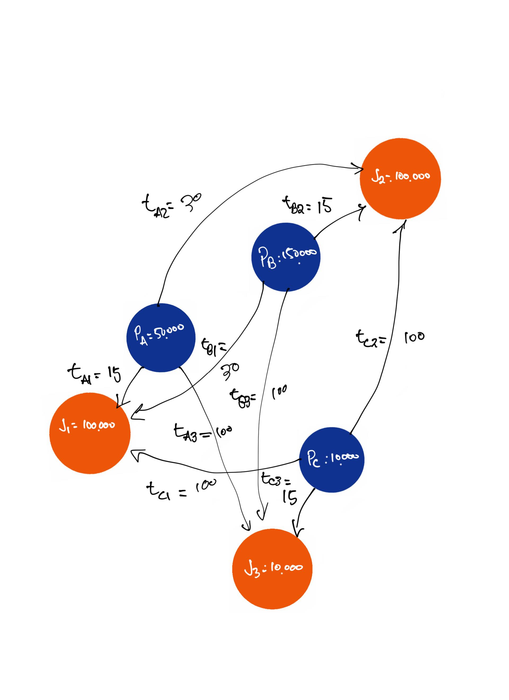

Toy-data, an origin-destination matrix for 3 population centers and travel-times to employment centers:
```{r}
od_tt <- data.frame(o_id = c("A", "A", "A", "B", "B", "B", "C", "C", "C"), # Three origins
                    d_id = c("1", "2", "3", "1", "2", "3", "1", "2", "3"), # Three destinations
                    tt = c(15, 30, 100, 30, 15, 100, 100, 100, 15), # Travel time
                    pop = c(50000, 50000, 50000, 150000, 150000, 150000, 10000, 10000, 10000), # Population
                    opp = c(100000, 100000, 10000, 100000, 100000, 10000, 100000, 100000, 10000)) # Jobs
```

The toy data looks like this, it is the example from Shen (1998, p. 349) (drawn by Antonio Paez):


Let's use an exponential impedance function as follows:
$$
f(c_{ij}) = exp(-b\cdot c_{ij})
$$

Set b:
```{r}
b <- 0.1
```


Calculate impedance:
```{r}
od_tt <- od_tt |>
  mutate(f = exp(-b * tt))
```

View the od_tt, now with an impedance value for each origin-destination pair. As you can see, the smaller the travel time, the larger the 'friction of distance' value.
```{r}
od_tt
```

## Accessibility

Hansen-type accessibility is calculated as:
$$
S_i = \sum_jO_jf(c_{ij})
$$

This is the estimate of Hansen-type accessibility:
```{r}
S <- od_tt |>
  group_by(o_id) |>
  summarize(S = sum(opp * f),
            .groups = "drop")
S
```

# Spatial availability
Spatial availability is a tad-more complicated and is calculated as:
$V_{i} = \sum_{j=1}^J O_j\ F^t_{ij}$

Where $F^t_{ij}$ is the balancing factor which proportionally allocates opportunities $O_j$ to each $i$ defined as:
$F^t_{ij} = \frac{F^p_{i} \cdot F^c_{ij}}{\sum_{i=1}^N F^p_{i} \cdot F^c_{ij}}$

$F^p_{i}$ corresponds to population $P_i$:

$F^p_{i} = \frac{P_{i}^\alpha}{\sum_{i=1}^N P_{i}^\alpha}$

$F^c_{ij}}$ corresponds to the impedance value $f(c_{ij})$:

$F^c_{ij} = \frac{f(c_{ij})}{\sum_{i=1}^N f(c_{ij})}$

We neatly put the calculation of spatial availability $V_i$ into the following disaggregated function. It gives us a few outputs from the calculation.
```{r sp_avail-function,include=FALSE}
#defining the spatial availability function
sp_avail <- function(x, o_id, d_id, pop, opp, r, f, alpha = 1){
  
  o_id <- rlang::enquo(o_id)
  d_id <- rlang::enquo(d_id)
  pop <- rlang::enquo(pop)
  opp <- rlang::enquo(opp)
  r <- rlang::enquo(r)
  f <- rlang::enquo(f)
  
  sum_pop <- x %>%
    dplyr::distinct(!!o_id,
                    .keep_all = TRUE) %>%
    dplyr::mutate(sum_pop = !!r*(!!pop)^alpha) %>%
    dplyr::pull(sum_pop) %>%
    sum()
  
  f_p <- dplyr::pull(x, !!r) * dplyr::pull(x, !!pop)^alpha / sum_pop
  
  sum_impedance <- x %>%
    dplyr::group_by(!!d_id) %>%
    dplyr::summarize(sum_impedance = sum(!!f))
  
  x <- x %>%
    dplyr::left_join(sum_impedance,
                     by = rlang::as_name(d_id))
  
  f_c <- dplyr::pull(x, !!f) / x$sum_impedance
  
  x$f_c <- f_c
  x$f_p <- f_p
  
  sum_pa <- x %>%
    dplyr::group_by(!!d_id) %>%
    dplyr::summarize(sum_pa= sum(f_p * f_c))
  
  x <- x %>%
    dplyr::left_join(sum_pa,
                     by = rlang::as_name(d_id))
  f_t <- (f_p * f_c) / dplyr::pull(x, sum_pa)
  
  x %>%
    dplyr::mutate(V_ij = !!opp * !!f_t)
}
```

Calculating spatial availability for each origin-destination pair and viewing the table:
```{r}
V_ij <- od_tt %>%
  mutate(r = 1) %>%
  sp_avail(o_id = o_id, 
           d_id = d_id, 
           pop = pop, 
           opp = opp, 
           r = r, 
           f = f, 
           alpha = 1.0) #1.54 

V_ij
```
Aggregating all origin-destination trips by each origin, to get spatial availability by origin ($V_i$)
```{r}
V_i <- V_ij |> 
  group_by(o_id) |>
  summarize(V_i = sum(V_ij),
            .groups = "drop")
```

So spatially available jobs per origin is:
```{r}
V_i
```

What's neat is, the sum of $V_i$ in the region is equal to the number of $O_j$ in the region:
```{r}
V_ij %>% 
  group_by(d_id) %>%
  summarize(opp = first(opp)) %>% pull(opp) %>% sum()

sum(V_i$V_i)
```
Spatially available jobs, per capita, per origin can also be calculated simply:
```{r}
V_ij |>
  group_by(o_id) |>
  summarize(V_i = sum(V_ij),
            .groups = "drop") |>
  mutate(v_i = V_i / c(50000, 150000, 10000)) 
```
