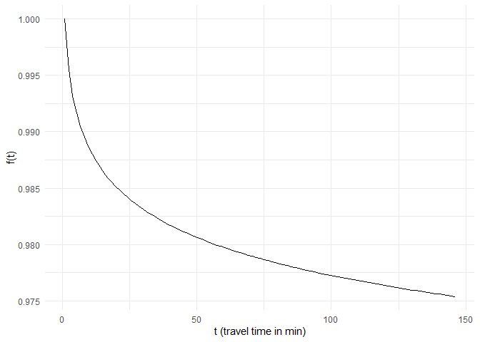
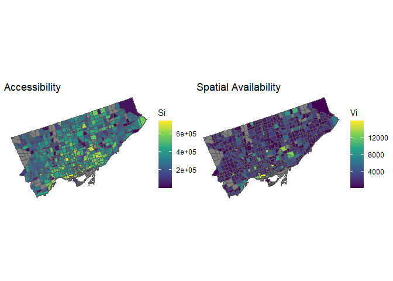
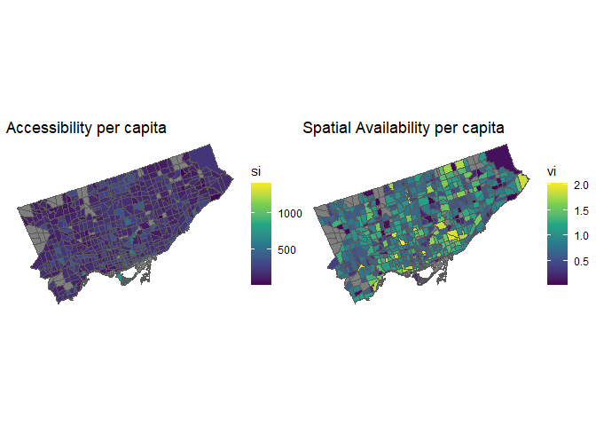
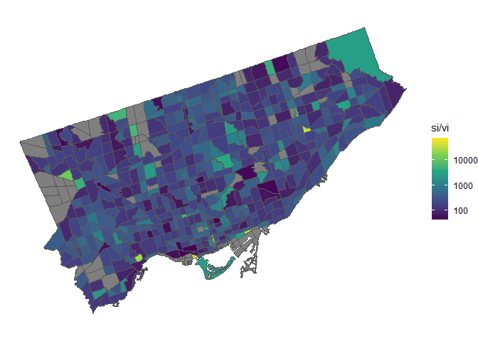
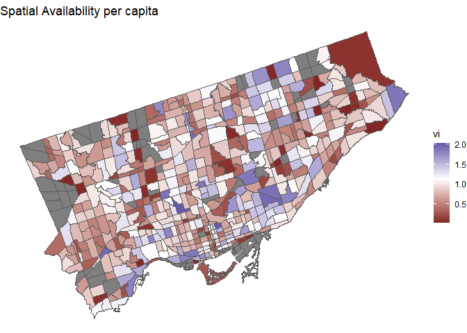
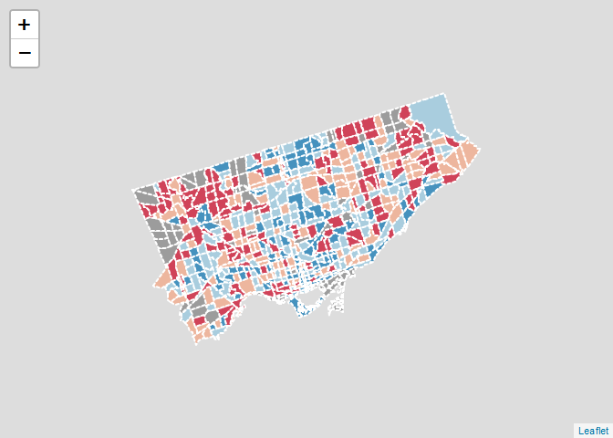
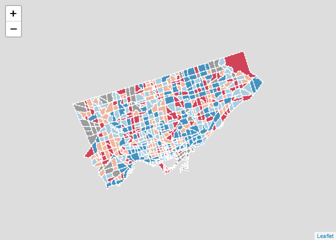

<!-- README.md is generated from README.Rmd. Please edit that file -->

# Workshop

## Introducing spatial availability, a singly-constrained competitive-access accessibility measure

Antonio Paez (School of Earth, Environment and Society, McMaster
University, Canada)

<!-- badges: start -->
<!-- badges: end -->
<!--
ALL IMAGES WERE CREATED BY ANTONIO USING TAYASUI SKETCHES ON AN IPAD
-->

# Abstract

Accessibility measures are widely used in transportation, urban and
healthcare planning, among other applications. These measures are
weighted sums of the opportunities that can be reached given the cost of
movement and are interpreted to represent the potential for spatial
interaction. Though these measures are useful in understanding spatial
structure, their methodologies count available opportunities multiple
times. This leads to interpretability issues, as noted in recent
research on balanced floating catchment areas (BFCA) and competitive
measures of accessibility. In this paper, we respond to the limitations
of the accessibility measure by proposing a new measure of *spatial
availability* which is calculated by imposing a single constraint on the
conventional gravity-based accessibility. Similar to the gravity model
from which spatial availability is derived, a single constraint ensures
that the marginals at the destination are met and thus the number of
opportunities are preserved. Through examples, we detail the formulation
of the proposed measure. Further, we use data from the 2016
Transportation Tomorrow Survey of the Greater Golden Horseshoe area in
southern Ontario, Canada, to contrast how the conventional accessibility
measure tends to overestimate and underestimate the number of jobs
*available* to workers. We conclude with some discussion of the possible
uses of spatial availability and argue that, compared to conventional
measures of accessibility, it can offer a more meaningful and
interpretable measure of opportunity access. All data and code used in
this research are openly available.

# Keywords

- Spatial availability
- Accessibility
- Gravity model
- Transportation
- TTS

## From accessibility to spatial availability


Formalizing this, we see that spatial availability $V_i$ is the
weighted, and *constrained*, sum of opportunities: $$
V_i = \sum_j^J O_j\frac{f(c_{ij})}{\sum_n^N f(c_{nj})}
$$

where:

- $N$ is the number of locations where population is
- $J$ is the number of locations where opportunities are

Compare to accessibility: $$
S_i = \sum_j^JO_jf(c_{ij})
$$

Let us change the set up to illustrate a different point.


When we formalize this we see again that *spatial availability* is a
weighted sum of the opportunities, constrained to match the total: $$
V_i = \sum_j O_j\frac{P_i}{\sum_n^N P_n}
$$

We have described two proportional allocation mechanisms:

1.  By the cost of interaction (through the impedance function)

2.  By the size of the population

These are consistent with the principles of spatial interaction (e.g.,
the gravity model):

1.  The friction of space

2.  The importance of size (mass)

We call these quantities *proportional allocation factors*:

$$
F^C_{ij} = \frac{f(c_{ij})}{\sum_n^N f(c_{nj})}
$$

and:

$$
F^P_i = \frac{P_i}{\sum_n^N P_m}
$$

The two factors are combined as follows: $$
F_{ij}^T = \frac{F^C_{ij}F^P_i}{\sum_n^NF^C_{ij}F^P_i}
$$

to give the following expression for *spatial availability*: $$
V_i = \sum_j^J O_jF^T_{ij}
$$

Compare again to accessibility: $$
S_i = \sum_j^JO_jf(c_{ij})
$$

Spatial availability is a measure of the number of opportunities that
are available from a location. It is singly constrained measure of
accessibility.

- It constrains the sum of available opportunities to match the total
  number of opportunities in the region
- It is easier to interpret than accessibility
- It provides intuitive results
- It gives a natural baseline for equity analysis

## Exercise

In reference to the figure below.


This is a tiny system with two population centers ($a$ and $b$) and two
employment centers ($A$ and $B$). For the exercise use the following
impedance function for $c_{ij}$, where $c$ is duration in minutes: $$
f(c_{ij}) = \begin{cases}
\frac{1}{c_{ij}^\alpha} &\text{for } c_{ij}\le\delta\\
0 & \text{for } c_{ij}>\delta\\
\end{cases}
$$

Assume that the number of people and jobs at each location is as shown
below: $$
\begin{array}{l}
P_{a} = 80 \\
P_{b} = 120 \\
O_{A} = 100 \\
O_{B} = 50 
\end{array}
$$

Further, the travel times in minutes between these locations are: $$
\begin{array}{l}
c_{aA} = 15 \\
c_{Ab} = 20 \\
c_{bB} = 15 
\end{array}
$$

Use $\alpha=1$ and $\delta=45$ min.

As a reminder, accessibility is: $$
S_i = \sum_j O_jf(c_{ij})
$$

### Questions: Part 1

1.  What is the *global* jobs/population ratio in this system?
2.  What does $\delta=45$ min represent?
3.  Calculate the impedance for each population center-employment center
    pair.
4.  Calculate the accessibility.
5.  Tabulate $F^c_{ij}$ for each population center-employment center
    pair. what do these values represent?
6.  Tabulate $F^P_{i}$ for each population center. What do these values
    represent?
7.  Tabulate $F^T_{ij}$ for each population center-employment center
    pair. what do these values represent?
8.  Calculate the jobs available from each employment center to each
    population center (i.e., $V_ij$).
9.  Calculate the jobs available at each population center (i.e.,
    $V_i$).
10. Verify that $\sum_iV_i = \sum_jO_j$
11. Calculate the jobs per capita at each population center (i.e.,
    $v_i = \frac{V_i}{P_i}$)
12. Compare to the global jobs/population ratio.
13. In which of the two population centers is the risk of unemployment
    higher? Discuss.
14. What do you think would happen if $\alpha$ was less than one or
    greater than one? Explain.

### Solution: Part 1

The spatial availability is as follows: $$
\begin{array}{l}
V_{a} = 47.1 \text{ jobs}\\ 
V_{b} = 102.9 \text{ jobs}
\end{array}
$$

Next, suppose that there is an upgrade in the transportation system that
shortens the duration of trips between $a-A$, so the new travel times
are: $$
\begin{array}{l}
c_{aA} = 5 \\
c_{Ab} = 20 \\
c_{bB} = 15 
\end{array}
$$

Continue to use $\alpha =1$ and $\delta=45$ min.

### Questions: Part 2

1.  Does the accessibility of $b$ change? Discuss.
2.  Explain the changes to spatial availability $V_i$ and spatial
    availability per capita $v_i$ compared to those calculated using the
    earlier travel times.

### Solution: Part 2

The spatial availability is now as follows: $$
\begin{array}{l}
V_{a} = 82.7 \text{ jobs}\\ 
V_{b} = 67.3 \text{ jobs}
\end{array}
$$

## Exercise 2

    library(accessibility)
    library(dplyr)
    library(TTS2016R)

``` r
data("ggh_taz")
data("od")
```

The identifiers of TAZs in Toronto are 1-625 according to the [Data
Guide](http://dmg.utoronto.ca/wp-content/uploads/2022/06/2016TTS_DataGuide.pdf)
of TTS (p. 29).

``` r
TO_taz <- c(1:625) |> 
  as.character()
```

``` r
lu <- ggh_taz |>
  filter(GTA06 %in% TO_taz) |>
  transmute(id = GTA06,
            P = workers,
            O = jobs)
```

Global jobs/workers ratio:

``` r
sum(lu$O)/sum(lu$P)
#> [1] 1.11989
```

Prepare the travel time matrix by filtering TAZ that are in Toronto.

``` r
od_ggh <- od
od <- od |>
  filter(Origin %in% lu$id, 
         Destination %in% lu$id) |>
  transmute(from_id = Origin,
            to_id = Destination,
            travel_time)
```

The maximum travel time in the table is:

``` r
max(od$travel_time)
#> [1] 146
```

We can use a

``` r
alpha <- 0.005
ggplot() +
  geom_function(fun = function(x) 1/(abs(x)^alpha),
                xlim = c(1, max(od$travel_time))) +
  xlab("t (travel time in min)") +
  ylab("f(t)") +
  theme_minimal()
```

<!-- -->

Calculate accessibility:

Calculate spatial availability:

Join the results to the zoning system for plotting:

``` r
results <- lu |>
  left_join(Si,
            by = "id") |>
  left_join(Vi,
            by = "id")
```

Verify the total of jobs in the region, the jobs accessible, and the
jobs available:

``` r
# Sum of jobs in land use table,
sum(lu$O)
#> [1] 1202986
# Sum of jobs accessible.
sum(results$Si, na.rm = TRUE)
#> [1] 175385249
# Sum of jobs available.
sum(results$Vi, na.rm = TRUE)
#> [1] 1202843
```

Summary of results of accessibility and availability:

``` r
results |> 
  st_drop_geometry() |>
  select(Si, Vi) |>
  summary()
#>        Si                 Vi           
#>  Min.   :   558.5   Min.   :    0.152  
#>  1st Qu.:205300.5   1st Qu.:  589.997  
#>  Median :325584.6   Median : 1374.143  
#>  Mean   :318882.3   Mean   : 2186.987  
#>  3rd Qu.:421530.9   3rd Qu.: 2755.239  
#>  Max.   :731470.7   Max.   :15966.794  
#>  NA's   :75         NA's   :75
```

Calculate values per capita:

``` r
results <- results |>
  mutate(si = Si/P,
         vi = Vi/P)
```

Summary of values per capita:

``` r
results |> 
  st_drop_geometry() |>
  select(si, vi) |>
  summary()
#>        si                 vi         
#>  Min.   :   6.041   Min.   :0.01004  
#>  1st Qu.: 134.950   1st Qu.:0.56016  
#>  Median : 179.090   Median :0.81500  
#>  Mean   : 201.788   Mean   :0.84675  
#>  3rd Qu.: 237.619   3rd Qu.:1.09891  
#>  Max.   :1410.188   Max.   :2.01775  
#>  NA's   :75         NA's   :75
```

``` r
Si_plot <- ggplot() +
  geom_sf(data = results,
          aes(fill = Si)) +
  geom_sf(data = lu,
          fill = NA) +
  scale_fill_viridis_c(direction = 1) +
  theme_void() +
  ggtitle("Accessibility")
```

``` r
Vi_plot <- ggplot() +
  geom_sf(data = results,
          aes(fill = Vi)) +
  geom_sf(data = lu,
          fill = NA) +
  scale_fill_viridis_c(direction = 1) +
  theme_void() +
  ggtitle("Spatial Availability")
```

Render:

``` r
Si_plot + Vi_plot
```

<!-- -->

``` r
si_plot <- ggplot() +
  geom_sf(data = results,
          aes(fill = si)) +
  geom_sf(data = lu,
          fill = NA) +
  scale_fill_viridis_c(direction = 1) +
  theme_void() +
  ggtitle("Accessibility per capita")
```

``` r
vi_plot <- ggplot() +
  geom_sf(data = results,
          aes(fill = vi)) +
  geom_sf(data = lu,
          fill = NA) +
  scale_fill_viridis_c(direction = 1) +
  theme_void() +
  ggtitle("Spatial Availability per capita")
```

Render:

``` r
si_plot + vi_plot
```

<!-- -->

Ratio of $S_i$ to $V_i$ indicates that $S_i$ is not simply a scaled-up
version of $V_i$ but rather something different:

``` r
ggplot() +
  geom_sf(data = results,
          aes(fill = Si/Vi)) +
  geom_sf(data = lu,
          fill = NA) +
  scale_fill_viridis_c(direction = 1, trans = "log10") +
  theme_void()
```

<!-- -->

The same is true of $s_i$: the ratio of $s_i$ to $v_i$ indicates it is
not simply a scaled-up version of $v_i$ but rather something different:

``` r
ggplot() +
  geom_sf(data = results,
          aes(fill = si/vi)) +
  geom_sf(data = lu,
          fill = NA) +
  scale_fill_viridis_c(direction = 1, trans = "log10") +
  theme_void()
```

<!-- -->

``` r
ggplot() +
  geom_sf(data = results,
          aes(fill = vi)) +
  geom_sf(data = lu,
          fill = NA) +
  scale_fill_gradient2(midpoint = sum(lu$O)/sum(lu$P)) +
  theme_void() +
  ggtitle("Spatial Availability per capita")
```

<!-- -->

``` r

bins <- quantile(results$si, na.rm = TRUE) |> as.numeric()
pal <- colorBin("RdBu", domain = results$si, bins = bins)

labels <- sprintf(
  "<strong>%s</strong><br/>%g workers<br/>%g jobs accessible<br/>%g jobs / person",
  results$id, 
  results$P,
  results$Si,
  results$si
) %>% lapply(htmltools::HTML)

leaflet(data = results |> st_transform(crs = 4326 )) |> 
  addPolygons(
    fillColor = ~pal(si),
    weight = 2,
    opacity = 1,
    color = "white",
    dashArray = "3",
    fillOpacity = 0.7,
    highlightOptions = highlightOptions(
      weight = 5,
      color = "#666",
      dashArray = "",
      fillOpacity = 0.7,
      bringToFront = TRUE),
    label = labels,
    labelOptions = labelOptions(
      style = list("font-weight" = "normal", padding = "3px 8px"),
      textsize = "15px",
      direction = "auto"))
```

<!-- -->

``` r

bins <- quantile(results$vi, na.rm = TRUE) |> as.numeric()
pal <- colorBin("RdBu", domain = results$vi, bins = bins)

labels <- sprintf(
  "<strong>%s</strong><br/>%g workers<br/>%g jobs available<br/>%g jobs / person",
  results$id, 
  results$P,
  results$Vi,
  results$vi
) %>% lapply(htmltools::HTML)

leaflet(data = results |> st_transform(crs = 4326 )) |> 
  addPolygons(
    fillColor = ~pal(vi),
    weight = 2,
    opacity = 1,
    color = "white",
    dashArray = "3",
    fillOpacity = 0.7,
    highlightOptions = highlightOptions(
      weight = 5,
      color = "#666",
      dashArray = "",
      fillOpacity = 0.7,
      bringToFront = TRUE),
    label = labels,
    labelOptions = labelOptions(
      style = list("font-weight" = "normal", padding = "3px 8px"),
      textsize = "15px",
      direction = "auto"))
```

<!-- -->
